Black Friday (Regression models and outlier analysis)
================
2023-07-25

# Load Data

First, we need to retrieve the data from MySQL and then check the types.

``` r
#Load the RMySQL package
library(RMySQL)
```

    ## Warning: package 'RMySQL' was built under R version 4.1.3

    ## Loading required package: DBI

    ## Warning: package 'DBI' was built under R version 4.1.3

``` r
library(tidyverse)
```

    ## Warning: package 'tidyverse' was built under R version 4.1.3

    ## -- Attaching packages --------------------------------------- tidyverse 1.3.2 --

    ## v ggplot2 3.3.6     v purrr   1.0.1
    ## v tibble  3.2.1     v dplyr   1.1.2
    ## v tidyr   1.3.0     v stringr 1.5.0
    ## v readr   2.1.2     v forcats 0.5.2

    ## Warning: package 'ggplot2' was built under R version 4.1.3

    ## Warning: package 'tibble' was built under R version 4.1.3

    ## Warning: package 'tidyr' was built under R version 4.1.3

    ## Warning: package 'readr' was built under R version 4.1.3

    ## Warning: package 'purrr' was built under R version 4.1.3

    ## Warning: package 'dplyr' was built under R version 4.1.3

    ## Warning: package 'stringr' was built under R version 4.1.3

    ## Warning: package 'forcats' was built under R version 4.1.3

    ## -- Conflicts ------------------------------------------ tidyverse_conflicts() --
    ## x dplyr::filter() masks stats::filter()
    ## x dplyr::lag()    masks stats::lag()

``` r
#Create a connection to the MySQL database
con <- dbConnect(MySQL(), user = "root", password = "3012001", host = "localhost",dbname = "fridayblack")
dbSendQuery(con, "SET GLOBAL local_infile = true;") 
```

    ## <MySQLResult:0,0,0>

``` r
# write a query to access the records
black_friday = dbReadTable(con, "black_friday")
head(black_friday)
```

    ##   User_ID Product_ID Gender   Age Occupation City_Category
    ## 1 1000001  P00069042      F  0-17         10             A
    ## 2 1000001  P00248942      F  0-17         10             A
    ## 3 1000001  P00087842      F  0-17         10             A
    ## 4 1000001  P00085442      F  0-17         10             A
    ## 5 1000002  P00285442      M   55+         16             C
    ## 6 1000003  P00193542      M 26-35         15             A
    ##   Stay_In_Current_City_Years Marital_Status Product_Category_1
    ## 1                          2              0                  3
    ## 2                          2              0                  1
    ## 3                          2              0                 12
    ## 4                          2              0                 12
    ## 5                         4+              0                  8
    ## 6                          3              0                  1
    ##   Product_Category_2 Product_Category_3 Purchase
    ## 1                  4                 12     8370
    ## 2                  6                 14    15200
    ## 3                 14                 17     1422
    ## 4                 14                 17     1057
    ## 5                 17                 17     7969
    ## 6                  2                  3    15227

# Type Casting

``` r
glimpse(black_friday)
```

    ## Rows: 550,068
    ## Columns: 12
    ## $ User_ID                    <chr> "1000001", "1000001", "1000001", "1000001",~
    ## $ Product_ID                 <chr> "P00069042", "P00248942", "P00087842", "P00~
    ## $ Gender                     <chr> "F", "F", "F", "F", "M", "M", "M", "M", "M"~
    ## $ Age                        <chr> "0-17", "0-17", "0-17", "0-17", "55+", "26-~
    ## $ Occupation                 <chr> "10", "10", "10", "10", "16", "15", "7", "7~
    ## $ City_Category              <chr> "A", "A", "A", "A", "C", "A", "B", "B", "B"~
    ## $ Stay_In_Current_City_Years <chr> "2", "2", "2", "2", "4+", "3", "2", "2", "2~
    ## $ Marital_Status             <chr> "0", "0", "0", "0", "0", "0", "1", "1", "1"~
    ## $ Product_Category_1         <chr> "3", "1", "12", "12", "8", "1", "1", "1", "~
    ## $ Product_Category_2         <chr> "4", "6", "14", "14", "17", "2", "8", "15",~
    ## $ Product_Category_3         <chr> "12", "14", "17", "17", "17", "3", "17", "1~
    ## $ Purchase                   <dbl> 8370, 15200, 1422, 1057, 7969, 15227, 19215~

We want to convert all the columns type to Factor type unless the
purchase column.

``` r
# Select all columns except for the "Purchase" column and convert them to factors
cols_to_convert <- colnames(black_friday)[-12]
  # Use lapply to apply the same function to all selected columns
black_friday[cols_to_convert] <- lapply(black_friday[cols_to_convert], as.factor)

#check the type now
sapply(black_friday, class)
```

    ##                    User_ID                 Product_ID 
    ##                   "factor"                   "factor" 
    ##                     Gender                        Age 
    ##                   "factor"                   "factor" 
    ##                 Occupation              City_Category 
    ##                   "factor"                   "factor" 
    ## Stay_In_Current_City_Years             Marital_Status 
    ##                   "factor"                   "factor" 
    ##         Product_Category_1         Product_Category_2 
    ##                   "factor"                   "factor" 
    ##         Product_Category_3                   Purchase 
    ##                   "factor"                  "numeric"

Now our data is ready for analysis.

# Outliers detection and analysis

Before building our regression models. We want to analyze the outliers
in the data and define what is the reason for them.

``` r
#The distribution of the target variable
ggplot(data = black_friday, aes(x = Purchase)) +
  geom_boxplot()
```

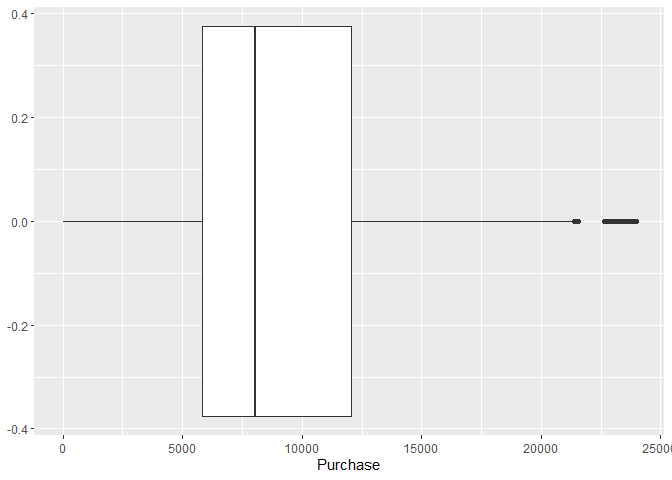<!-- -->

``` r
#Histogram of the target variable
ggplot(data = black_friday, aes(x = Purchase)) +
  geom_histogram(color = "black", fill = "white", 
                 alpha = 0.5,bins = 30) +
  labs(x = "Purchase", y = "Density", 
       title = "Distribution of Purchase Amounts")
```

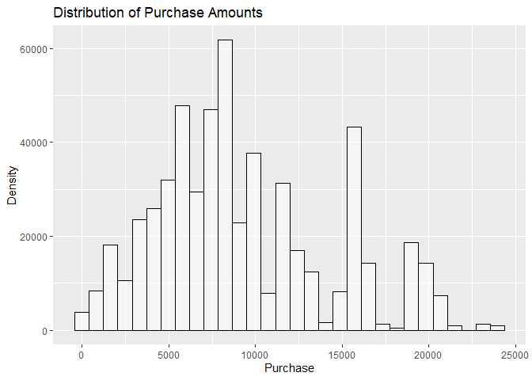<!-- -->

``` r
#Summary statistics of the Purchase
summary(black_friday$Purchase) 
```

    ##    Min. 1st Qu.  Median    Mean 3rd Qu.    Max. 
    ##      12    5823    8047    9264   12054   23961

The distribution of the purchase isn’t normal and skewed to the right
because there are many outliers in the right tail. I will detect the
outliers and analyze them to define which variables caused them and to
find the best solution to deal with them.

``` r
# Calculate quartiles for the "Purchase" column
q1 <- quantile(black_friday$Purchase, 0.25)
q3 <- quantile(black_friday$Purchase, 0.75)

#interquartile range (IQR)
iqr <- IQR(black_friday$Purchase)

# Define the range of acceptable values as 1.5 times the IQR
range_min <- q1 - (1.5 * iqr)
range_max <- q3 + (1.5 * iqr)

#The thresholds for the outliers on the two sides
print(range_min)
```

    ##     25% 
    ## -3523.5

``` r
print(range_max)
```

    ##     75% 
    ## 21400.5

We can observe that any transaction below -\$3,523.50 will be considered
an outlier. We know that the minimum value for placing an order should
be positive and greater than zero. However, this lower threshold is a
result of the distribution of purchases, which is significantly below
the mean purchase by approximately three standard deviations. The
maximum threshold is \$21400.50, any order cost above this value should
be an outlier.

``` r
# Identify the outliers
outliers <- black_friday$Purchase < range_min | black_friday$Purchase > range_max

# Select the outliers from the original data frame
outlier_data <- black_friday[outliers, ]

#Size of the outliers orders
dim(outlier_data)
```

    ## [1] 2677   12

We can see that outliers are a very small number of the data 0.4% of the
data. So we can remove them or exclude them from the parametric models
to don’t violate the model’s assumptions.

``` r
# Calculate summary statistics for the outliers
summary(outlier_data)
```

    ##     User_ID         Product_ID   Gender      Age        Occupation  
    ##  1001191:  10   P00052842: 493   F: 589   0-17 : 70   0      : 328  
    ##  1003635:  10   P00116142: 330   M:2088   18-25:326   4      : 268  
    ##  1000549:   8   P00085342: 316            26-35:926   7      : 258  
    ##  1001926:   8   P00117642: 197            36-45:604   1      : 252  
    ##  1004021:   8   P00086242: 174            46-50:259   20     : 207  
    ##  1000307:   7   P00119342: 151            51-55:310   17     : 188  
    ##  (Other):2626   (Other)  :1016            55+  :182   (Other):1176  
    ##  City_Category Stay_In_Current_City_Years Marital_Status Product_Category_1
    ##  A: 684        0 :362                     0:1489         10     :2275      
    ##  B:1059        1 :976                     1:1188         15     : 327      
    ##  C: 934        2 :454                                    9      :  75      
    ##                3 :481                                    1      :   0      
    ##                4+:404                                    11     :   0      
    ##                                                          12     :   0      
    ##                                                          (Other):   0      
    ##  Product_Category_2 Product_Category_3    Purchase    
    ##  13     :1082       16     :2350       Min.   :21401  
    ##  15     : 716       17     : 327       1st Qu.:23154  
    ##  16     : 682       10     :   0       Median :23418  
    ##  14     : 107       11     :   0       Mean   :23238  
    ##  17     :  90       12     :   0       3rd Qu.:23684  
    ##  10     :   0       13     :   0       Max.   :23961  
    ##  (Other):   0       (Other):   0

We can see that product category `10` caused these orders to be outliers
approximately 85% of the outliers are orders of products from category
10. So now we can remove all these points from the original data.

``` r
# Remove rows identified as outliers from the original data frame 
black_friday <- black_friday[!outliers, ]
```

``` r
# Create a box plot for Purchase without outliers
ggplot(data = black_friday, aes(x = Purchase)) +
  geom_boxplot()
```

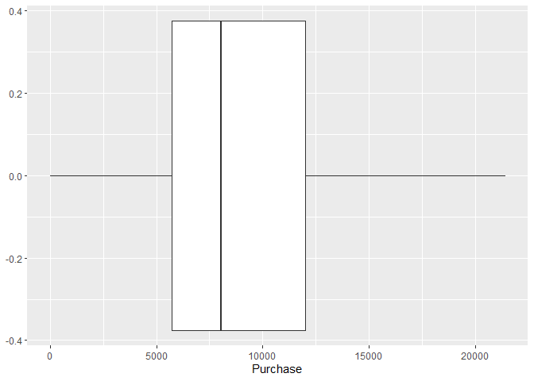<!-- -->

``` r
# Create a histogram for Purchase without outliers
ggplot(data = black_friday, aes(x = Purchase)) +
  geom_histogram(color = "black", fill = "white", 
                 alpha = 0.5,bins = 30) +
  labs(x = "Purchase", y = "Density", 
       title = "Distribution of Purchase Amounts")
```

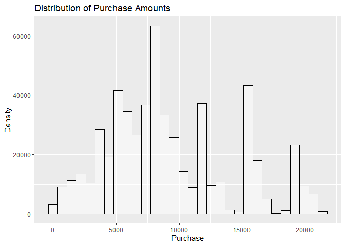<!-- -->

``` r
# Create a Q-Q plot of the Purchase
qqnorm(black_friday$Purchase)
qqline(black_friday$Purchase)
```

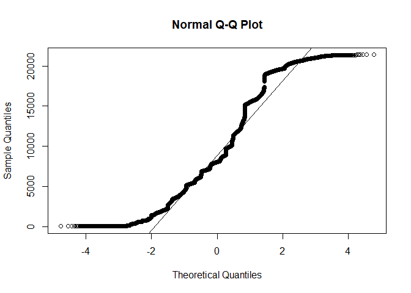<!-- -->

The distribution of the purchase is now close to normal distribution.

# Distributions analysis

We want to understand more about which variable is highly correlated with the
purchase. So, I will examine using distributions of the purchases
between each variable groups.

## Gender by Purchase

``` r
ggplot(data = black_friday, aes(x = Gender , y = Purchase)) +
  geom_boxplot()
```

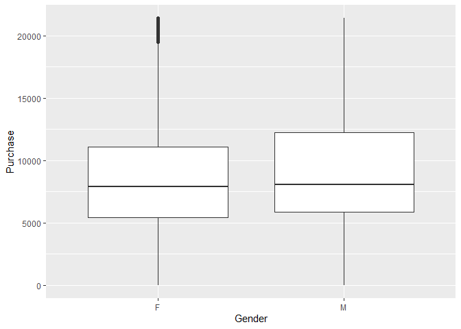<!-- -->

``` r
ggplot(data = black_friday, aes(x = Purchase, fill = Gender)) +
  geom_density(alpha = 0.5) +
  labs(x = "Purchase", y = "Density", fill = "Gender")
```

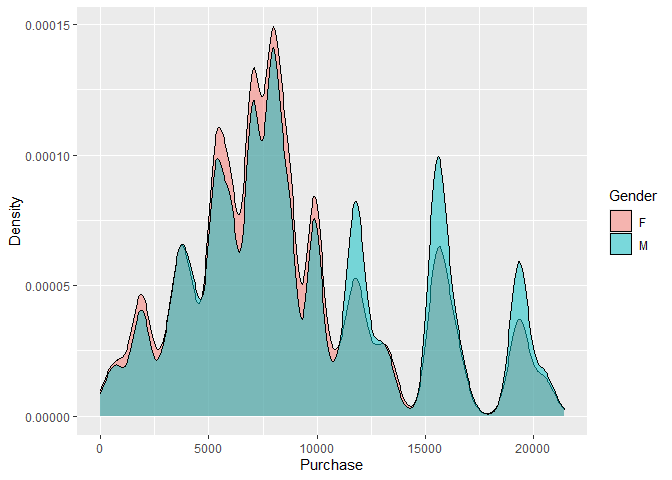<!-- -->

The purchase distribution of the male is very close to the purchase
distribution of the female except it has a higher tail, and there isn’t
any correlation between the Gender and the purchase. There are some
outliers in female purchases.

## Marital Status by Purchase

``` r
ggplot(data = black_friday, aes(x = Marital_Status , y = Purchase)) +
  geom_boxplot()
```

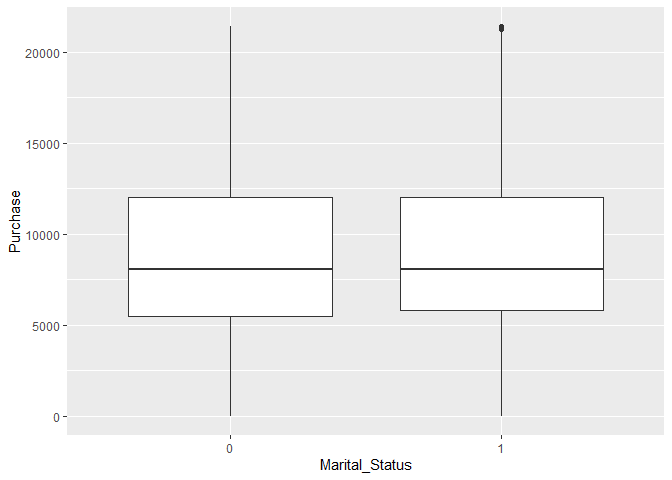<!-- -->

``` r
ggplot(data = black_friday, aes(x = Purchase, fill = Marital_Status)) +
  geom_density(alpha = 0.5) +
  labs(x = "Purchase", y = "Density", fill = "Marital_Status")
```

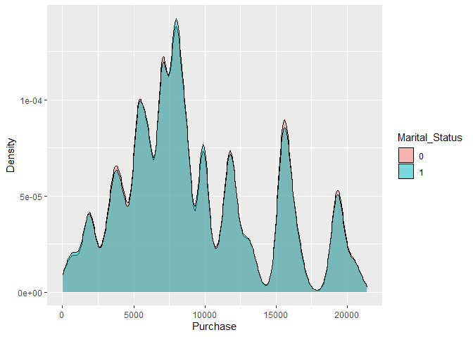<!-- -->

The purchase distribution of single customers is very close to the
purchase distribution of the married, and there isn’t a correlation
between marital status and the purchase. There are some outliers in the
single group.

## City Category by Purchase

``` r
ggplot(data = black_friday,aes(x = City_Category , y = Purchase)) +
  geom_boxplot()
```

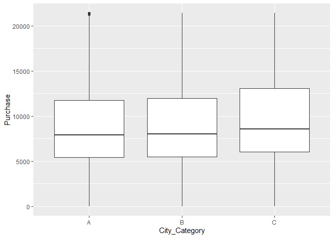<!-- -->

``` r
ggplot(data = black_friday, aes(x = Purchase, fill = City_Category)) +
  geom_density(alpha = 0.3) +
  labs(x = "Purchase", y = "Density", fill = "City_Category")
```

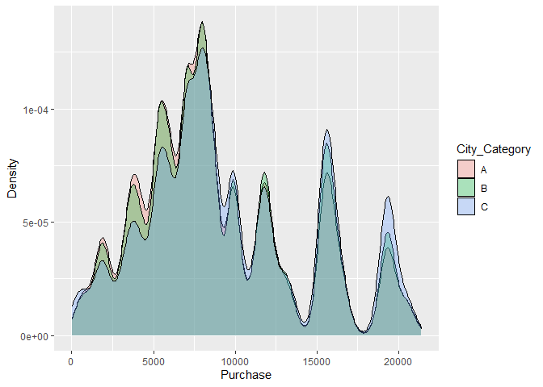<!-- -->

The purchase distribution for each city is very close to the others, and
there isn’t a correlation between the city type and the purchase. There
are some outliers in city A.

## Occupation by Purchase

``` r
ggplot(data = black_friday, aes(x = Occupation , y = Purchase)) +
  geom_boxplot()
```

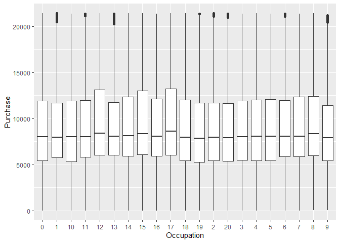<!-- -->

The occupations’ purchase distributions are very close to each other,
and there isn’t a correlation between the occupation and the purchase.
Some occupations have outliers.

## Product Category 1 by Purchase

``` r
ggplot(data = black_friday, aes(x = Product_Category_1 , y = Purchase)) +
  geom_boxplot()
```

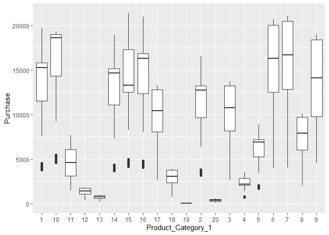<!-- -->

The product category 1 purchase distributions are very different from
each other, and there is a noticeable correlation between them and the
purchase. There are also some outliers in some categories.

## Product Category 2 by Purchase

``` r
ggplot(data = black_friday, aes(x = Product_Category_2 , y = Purchase)) +
  geom_boxplot()
```

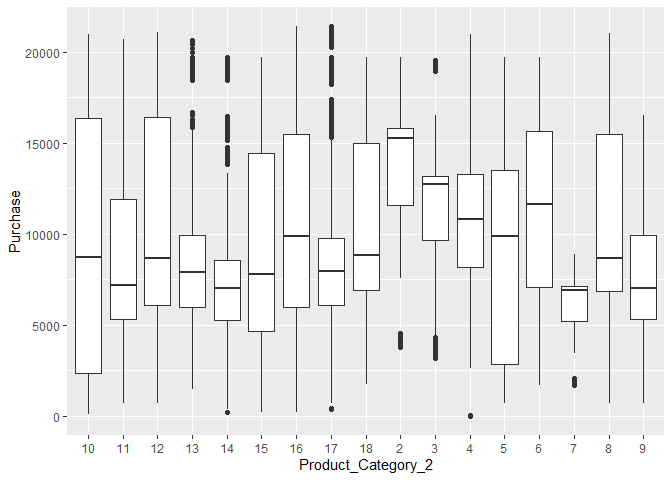<!-- -->

The product category 2 purchase distributions are different, with a noticeable correlation between them and the purchase. There are also
some outliers in some categories.

## Product Category 3 by Purchase

``` r
ggplot(data = black_friday, aes(x = Product_Category_3 , y = Purchase)) +
  geom_boxplot()
```

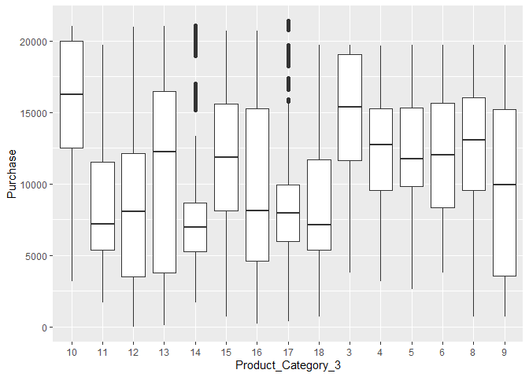<!-- -->

The product category 3 purchase distributions are different, with a noticeable correlation between them and the purchase. There are also
some outliers in some categories.

## Age by Purchase

``` r
ggplot(data = black_friday, aes(x = Age , y = Purchase)) +
  geom_boxplot()
```

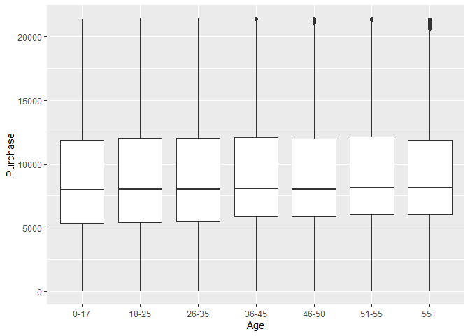<!-- -->

The Age group distributions are very close to each other, and there
There isn't a correlation between them and the purchase.

## Stay In Current City Years by Purchase

``` r
ggplot(data = black_friday, aes(x = Stay_In_Current_City_Years , y = Purchase)) +
  geom_boxplot()
```

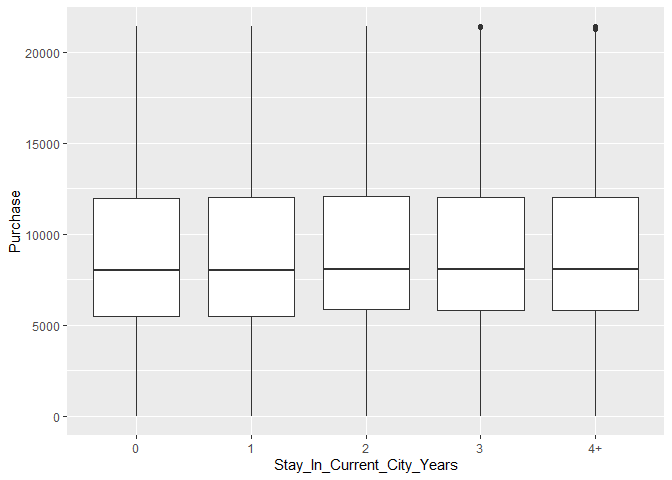<!-- -->

The stay_in_current_city_years distributions are very close to each
other, and there isn’t a correlation between them and the purchase.

**From this analysis, we can say that the most important predictors for
estimating the purchase:**

1.  **product category 1**

2.  **product category 2**

3.  **product category 3**

# Correlation

We can test the correlation between them and the target variable.

``` r
#calculate point-biserial correlation
cor.test(as.numeric(black_friday$Product_Category_1), black_friday$Purchase)
```

    ## 
    ##  Pearson's product-moment correlation
    ## 
    ## data:  as.numeric(black_friday$Product_Category_1) and black_friday$Purchase
    ## t = -347.38, df = 547389, p-value < 2.2e-16
    ## alternative hypothesis: true correlation is not equal to 0
    ## 95 percent confidence interval:
    ##  -0.4271749 -0.4228337
    ## sample estimates:
    ##        cor 
    ## -0.4250067

The results of Pearson’s product-moment correlation test between
`Product_Category_1` and `Purchase`:

-   The correlation coefficient (sample estimate) between the two
    variables is -0.4250067. This suggests a moderate negative
    correlation between `Product_Category_1` and `Purchase`.

-   The t-value of -347.38 and the corresponding p-value less than
    2.2e-16 indicate that there is strong evidence to reject the null
    hypothesis that the true correlation between the two variables is
    zero. In other words, there is a statistically significant
    correlation between `Product_Category_1` and `Purchase`.

-   The 95% confidence interval for the correlation coefficient (
    -0.4271749 to -0.4228337) suggests that we can be fairly confident
    that the true correlation falls within this interval.

``` r
#calculate point-biserial correlation
cor.test(as.numeric(black_friday$Product_Category_2), black_friday$Purchase)
```

    ## 
    ##  Pearson's product-moment correlation
    ## 
    ## data:  as.numeric(black_friday$Product_Category_2) and black_friday$Purchase
    ## t = 14.741, df = 547389, p-value < 2.2e-16
    ## alternative hypothesis: true correlation is not equal to 0
    ## 95 percent confidence interval:
    ##  0.01727215 0.02256826
    ## sample estimates:
    ##        cor 
    ## 0.01992035

The results of Pearson’s product-moment correlation test between
`Product_Category_2` and `Purchase`:

-   The correlation coefficient (sample estimate) between the two
    variables is 0.01992035. This suggests a weak positive correlation
    between `Product_Category_2` and `Purchase`.

-   The t-value of 14.741 and the corresponding p-value less than
    2.2e-16 indicate that there is strong evidence to reject the null
    hypothesis that the true correlation between the two variables is
    zero. In other words, there is a statistically significant
    correlation between `Product_Category_2` and `Purchase`.

-   The 95% confidence interval for the correlation coefficient
    (0.01727215 to 0.02256826) suggests that we can be fairly confident
    that the true correlation falls within this interval.

``` r
#calculate point-biserial correlation
cor.test(as.numeric(black_friday$Product_Category_3), black_friday$Purchase)
```

    ## 
    ##  Pearson's product-moment correlation
    ## 
    ## data:  as.numeric(black_friday$Product_Category_3) and black_friday$Purchase
    ## t = 95.878, df = 547389, p-value < 2.2e-16
    ## alternative hypothesis: true correlation is not equal to 0
    ## 95 percent confidence interval:
    ##  0.1259084 0.1311191
    ## sample estimates:
    ##       cor 
    ## 0.1285146

The results of Pearson’s product-moment correlation test between
`Product_Category_3` and `Purchase`:

-   The correlation coefficient (sample estimate) between the two
    variables is 0.1285146. This suggests a weak positive correlation
    between `Product_Category_3` and `Purchase`.

-   The t-value of 95.878 and the corresponding p-value less than
    2.2e-16 indicate that there is strong evidence to reject the null
    hypothesis that the true correlation between the two variables is
    zero. In other words, there is a statistically significant
    correlation between `Product_Category_3` and `Purchase`.

-   The 95% confidence interval for the correlation coefficient
    (0.1259084 to 0.1311191) suggests that we can be fairly confident
    that the true correlation falls within this interval.

``` r
#calculate point-biserial correlation
cor.test(as.numeric(black_friday$Product_ID), black_friday$Purchase)
```

    ## 
    ##  Pearson's product-moment correlation
    ## 
    ## data:  as.numeric(black_friday$Product_ID) and black_friday$Purchase
    ## t = -76.807, df = 547389, p-value < 2.2e-16
    ## alternative hypothesis: true correlation is not equal to 0
    ## 95 percent confidence interval:
    ##  -0.1058790 -0.1006373
    ## sample estimates:
    ##        cor 
    ## -0.1032589

The results of Pearson’s product-moment correlation test between
`Product_ID` and `Purchase`:

-   The correlation coefficient (sample estimate) between the two
    variables is -0.1032589. This suggests a weak negative correlation
    between `Product_ID` and `Purchase`.

-   The t-value of -76.807 and the corresponding p-value less than
    2.2e-16 indicate that there is strong evidence to reject the null
    hypothesis that the true correlation between the two variables is
    zero. In other words, there is a statistically significant
    correlation between `Product_ID` and `Purchase`.

-   The 95% confidence interval for the correlation coefficient
    (-0.1058790 to -0.1006373) suggests that we can be fairly confident
    that the true correlation falls within this interval.

    **So after these analyses we can select only
    `Product_Category_1,Product_Category_2,Product_Category_3,Product_ID`
    to predict the purchase value.**

# Regression Models

## Split the data

First, we need to split the data to train the model and test it.

``` r
library(tidymodels)
```

    ## Warning: package 'tidymodels' was built under R version 4.1.3

    ## -- Attaching packages -------------------------------------- tidymodels 1.0.0 --

    ## v broom        1.0.1     v rsample      1.1.1
    ## v dials        1.2.0     v tune         1.1.1
    ## v infer        1.0.4     v workflows    1.1.3
    ## v modeldata    1.1.0     v workflowsets 1.0.1
    ## v parsnip      1.1.0     v yardstick    1.1.0
    ## v recipes      1.0.6

    ## Warning: package 'broom' was built under R version 4.1.3

    ## Warning: package 'dials' was built under R version 4.1.3

    ## Warning: package 'scales' was built under R version 4.1.3

    ## Warning: package 'infer' was built under R version 4.1.3

    ## Warning: package 'modeldata' was built under R version 4.1.3

    ## Warning: package 'parsnip' was built under R version 4.1.3

    ## Warning: package 'rsample' was built under R version 4.1.3

    ## Warning: package 'tune' was built under R version 4.1.3

    ## Warning: package 'workflows' was built under R version 4.1.3

    ## Warning: package 'workflowsets' was built under R version 4.1.3

    ## Warning: package 'yardstick' was built under R version 4.1.3

    ## -- Conflicts ----------------------------------------- tidymodels_conflicts() --
    ## x scales::discard() masks purrr::discard()
    ## x dplyr::filter()   masks stats::filter()
    ## x recipes::fixed()  masks stringr::fixed()
    ## x dplyr::lag()      masks stats::lag()
    ## x yardstick::spec() masks readr::spec()
    ## x recipes::step()   masks stats::step()
    ## * Dig deeper into tidy modeling with R at https://www.tmwr.org

``` r
set.seed(1234)

data_sampling <- initial_split(black_friday,
                               prop = 0.9)
Train <- training(data_sampling)
Test <- testing(data_sampling)
```

``` r
Train <- Train %>%
  select(Purchase , Product_Category_1,Product_Category_2,Product_Category_3,Product_ID)

Test <- Test %>%
  select(Purchase , Product_Category_1,Product_Category_2,Product_Category_3,Product_ID)

head(Train)
```

    ##        Purchase Product_Category_1 Product_Category_2 Product_Category_3
    ## 305597     5157                  5                  8                 14
    ## 297299     3108                 11                 15                 16
    ## 126683    16402                  7                 12                 14
    ## 384456    21309                 15                 17                 17
    ## 346885    20574                  6                  8                 16
    ## 463657     1784                  5                  7                 14
    ##        Product_ID
    ## 305597  P00303842
    ## 297299  P00255042
    ## 126683  P00347742
    ## 384456  P00071442
    ## 346885  P00256042
    ## 463657  P00195642

## Normalization

``` r
# Normalize the Purchase variable in the train data
# by dividing each value of Purchase by the maximum value of the Purchase

# This will rescale the Purchase variable to have values between 0 and 1

#21399
Purchase_max <- max(Train$Purchase)

Train$Purchase <- (Train$Purchase) / Purchase_max
Test$Purchase <- (Test$Purchase) / Purchase_max
```

I scaled the purchase in the train and the test data using a max scaler
to be between \[0,1\] to get a lower scale of the error.

## Linear regression

I will select only Product_Category_1 to predict the Purchase using
linear regression because the other features are redundant relative to
Product_Category_1.

``` r
lm <- linear_reg() %>% 
  set_engine('lm')

fitting <- lm %>%  fit(Purchase ~ Product_Category_1, data = Train)

fitting
```

    ## parsnip model object
    ## 
    ## 
    ## Call:
    ## stats::lm(formula = Purchase ~ Product_Category_1, data = data)
    ## 
    ## Coefficients:
    ##          (Intercept)  Product_Category_110  Product_Category_111  
    ##             0.635510              0.142931             -0.416394  
    ## Product_Category_112  Product_Category_113  Product_Category_114  
    ##            -0.572451             -0.601712             -0.020000  
    ## Product_Category_115  Product_Category_116  Product_Category_117  
    ##             0.036548              0.055217             -0.159619  
    ## Product_Category_118  Product_Category_119   Product_Category_12  
    ##            -0.496786             -0.633778             -0.109529  
    ## Product_Category_120   Product_Category_13   Product_Category_14  
    ##            -0.618271             -0.163780             -0.526490  
    ##  Product_Category_15   Product_Category_16   Product_Category_17  
    ##            -0.343825              0.105033              0.126657  
    ##  Product_Category_18   Product_Category_19  
    ##            -0.285238              0.008984

We can see that the `Product_Category_10` coefficient has the highest
importance score, followed by `Product_Category_17`. This
finding is consistent with our analysis of outliers, which showed that
`Category 10` is the main contributor to outliers. Additionally, our
imputation analysis revealed that `Category 17` is highly correlated
with other categories, making it an important predictor variable.

``` r
test_results <- fitting %>% 
  predict(new_data = Test) %>% 
  mutate(truth = Test$Purchase)

train_results <- fitting %>%
  # Make the predictions and save the predicted values
  predict(new_data = Train) %>%
  # Create a new column to save the true values
  mutate(truth = Train$Purchase)

rmse(train_results, truth = truth,
     estimate = .pred)
```

    ## # A tibble: 1 x 3
    ##   .metric .estimator .estimate
    ##   <chr>   <chr>          <dbl>
    ## 1 rmse    standard       0.141

``` r
rmse(test_results, truth = truth,
     estimate = .pred)
```

    ## # A tibble: 1 x 3
    ##   .metric .estimator .estimate
    ##   <chr>   <chr>          <dbl>
    ## 1 rmse    standard       0.140

``` r
rsq(train_results, truth = truth,
    estimate = .pred)
```

    ## # A tibble: 1 x 3
    ##   .metric .estimator .estimate
    ##   <chr>   <chr>          <dbl>
    ## 1 rsq     standard       0.628

``` r
rsq(test_results, truth = truth,
    estimate = .pred)
```

    ## # A tibble: 1 x 3
    ##   .metric .estimator .estimate
    ##   <chr>   <chr>          <dbl>
    ## 1 rsq     standard       0.632

**The model performs 63.1% on the test and 62.7% on the train data. This
suggests that a baseline model doesn’t over-fit the train data but there
is a problem in sampling the test data so I will estimate the model
accuracy on 10 fold-CV.**

``` r
library(rsample)
library(yardstick)

# Create 10-fold cross-validation folds
folds <- vfold_cv(Train, v = 10)

# Define the model
lm <- linear_reg() %>% 
  set_engine('lm')

# Define the metrics to be computed
metrics <- metric_set(rmse, rsq)

# Fit the model and calculate performance metrics for each fold
fit_resamples_obj <- fit_resamples(
  lm,
  Purchase ~ Product_Category_1,
  resamples = folds,
  metrics = metrics
)

collect_metrics(fit_resamples_obj)
```

    ## # A tibble: 2 x 6
    ##   .metric .estimator  mean     n  std_err .config             
    ##   <chr>   <chr>      <dbl> <int>    <dbl> <chr>               
    ## 1 rmse    standard   0.141    10 0.000171 Preprocessor1_Model1
    ## 2 rsq     standard   0.628    10 0.00105  Preprocessor1_Model1

-   The model achieved an average RMSE of 0.1408, with a standard error
    of 0.00017, across the 10 folds of the cross-validation.

-   The model achieved an average R-squared value of 0.6278, with a
    standard error of 0.0011, across the 10 folds of the
    cross-validation. This indicates that the model explains about
    62.78% of the variance in the target variable.

-   It’s worth noting that the standard errors for both metrics are
    quite small, which suggests that the estimates are relatively
    precise and stable across the folds of the cross-validation.

## Decision Tree

The goals of using the decision tree with our data:

-   We can use the data with the outliers in the categories without
    removing them.

-   We can use all the important features and let the decision tree
    perform features selection.

-   No assumptions about the data and the model

-   We rely in our situation on categorical variables to predict
    the response which will not perform very well using the least square
    model.

``` r
tree <- decision_tree(mode = "regression")
tree_fitting <- tree %>%  fit(Purchase ~  ., data = Train)
```

``` r
test_results <- tree_fitting %>% 
  predict(new_data = Test) %>% 
  mutate(truth = Test$Purchase)

train_results <- tree_fitting %>%
  # Make the predictions and save the predicted values
  predict(new_data = Train) %>%
  # Create a new column to save the true values
  mutate(truth = Train$Purchase)

rmse(train_results, truth = truth,
     estimate = .pred)
```

    ## # A tibble: 1 x 3
    ##   .metric .estimator .estimate
    ##   <chr>   <chr>          <dbl>
    ## 1 rmse    standard       0.131

``` r
rmse(test_results, truth = truth,
     estimate = .pred)
```

    ## # A tibble: 1 x 3
    ##   .metric .estimator .estimate
    ##   <chr>   <chr>          <dbl>
    ## 1 rmse    standard       0.132

``` r
rsq(train_results, truth = truth,
    estimate = .pred)
```

    ## # A tibble: 1 x 3
    ##   .metric .estimator .estimate
    ##   <chr>   <chr>          <dbl>
    ## 1 rsq     standard       0.675

``` r
rsq(test_results, truth = truth,
    estimate = .pred)
```

    ## # A tibble: 1 x 3
    ##   .metric .estimator .estimate
    ##   <chr>   <chr>          <dbl>
    ## 1 rsq     standard       0.673

The model performs very well than the least square model. It has
`67.5%` R-square value on the train and `67.3%` on the test data.

``` r
# Fit the model and calculate performance metrics for each fold
fit_resamples_obj <- fit_resamples(
  tree,
  Purchase ~ . ,
  resamples = folds,
  metrics = metrics
)

collect_metrics(fit_resamples_obj)
```

    ## # A tibble: 2 x 6
    ##   .metric .estimator  mean     n  std_err .config             
    ##   <chr>   <chr>      <dbl> <int>    <dbl> <chr>               
    ## 1 rmse    standard   0.132    10 0.000206 Preprocessor1_Model1
    ## 2 rsq     standard   0.671    10 0.00117  Preprocessor1_Model1

-   The decision tree model achieved an average RMSE of 0.1324, with a
    standard error of 0.0002, across the 10 folds of the
    cross-validation.

-   The decision tree model achieved an average R-squared value of
    0.6707, with a standard error of 0.0012, across the 10 folds of the
    cross-validation. This indicates that the decision tree model
    explains about 67.07% of the variance in the target variable.

-   The standard errors for both metrics are quite small, which suggests
    that the estimates are relatively precise and stable across the
    folds of the cross-validation.

## Random Forest

We can improve our last model by using random forest with a lot of
different trees. This will introduce a variation in the tress which
provides a good estimate of the relationship between the predictors and
the response.

``` r
# Define the random forest regression model
rf_model <- rand_forest(
  mode = "regression",
  mtry = 4,
  trees = 100
) %>% 
set_engine("ranger", importance = "permutation") 

# Fit the model on the full training set
final_rf_model <- rf_model %>%  fit(Purchase ~  ., data = Train)

test_results <- final_rf_model %>% 
  predict(new_data = Test) %>% 
  mutate(truth = Test$Purchase)

train_results <- final_rf_model %>%
  # Make the predictions and save the predicted values
  predict(new_data = Train) %>%
  # Create a new column to save the true values
  mutate(truth = Train$Purchase)

rmse(train_results, truth = truth,
     estimate = .pred)
```

    ## # A tibble: 1 x 3
    ##   .metric .estimator .estimate
    ##   <chr>   <chr>          <dbl>
    ## 1 rmse    standard       0.123

``` r
rmse(test_results, truth = truth,
     estimate = .pred)
```

    ## # A tibble: 1 x 3
    ##   .metric .estimator .estimate
    ##   <chr>   <chr>          <dbl>
    ## 1 rmse    standard       0.124

``` r
rsq(train_results, truth = truth,
    estimate = .pred)
```

    ## # A tibble: 1 x 3
    ##   .metric .estimator .estimate
    ##   <chr>   <chr>          <dbl>
    ## 1 rsq     standard       0.716

``` r
rsq(test_results, truth = truth,
    estimate = .pred)
```

    ## # A tibble: 1 x 3
    ##   .metric .estimator .estimate
    ##   <chr>   <chr>          <dbl>
    ## 1 rsq     standard       0.714

The RMSE of `0.123` for the `train` set and `0.124` for the `test` set
suggest that the model’s predictions are, on average, about `0.12` to
`0.13` units away from the true values. The R-squared of `0.716` for the
`train` set and `0.711` for the `test` set indicate that the model
explains about `71.6% to 71.4%` of the variance in the target variable,
respectively.

``` r
# load the vip package
library(vip)
```

    ## 
    ## Attaching package: 'vip'

    ## The following object is masked from 'package:utils':
    ## 
    ##     vi

``` r
# get the feature importance
importances <- vip(final_rf_model)

# print the feature importances
print(importances)
```

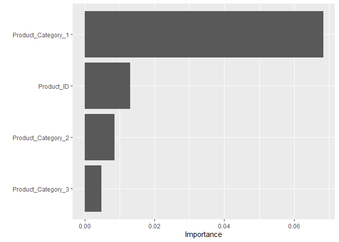<!-- -->

We can see that the `main category` of the brand is the most important
factor to define its price then the `brand` itself.

# Save the models

``` r
# Save the models object to files
saveRDS(final_rf_model, "rf_model.rds")
saveRDS(tree_fitting, "tree_model.rds")
saveRDS(fitting, "lr_model.rds")
```
