Black-friday-customer-segmentation
================

# Load Data

First we need to retrieve the data from MySQL then check the types.

``` r
#Load the RMySQL package
library(RMySQL)
```

    ## Warning: package 'RMySQL' was built under R version 4.1.3

    ## Loading required package: DBI

    ## Warning: package 'DBI' was built under R version 4.1.3

``` r
library(tidyverse)
```

    ## Warning: package 'tidyverse' was built under R version 4.1.3

    ## -- Attaching packages --------------------------------------- tidyverse 1.3.2 --

    ## v ggplot2 3.3.6     v purrr   1.0.1
    ## v tibble  3.2.1     v dplyr   1.1.2
    ## v tidyr   1.3.0     v stringr 1.5.0
    ## v readr   2.1.2     v forcats 0.5.2

    ## Warning: package 'ggplot2' was built under R version 4.1.3

    ## Warning: package 'tibble' was built under R version 4.1.3

    ## Warning: package 'tidyr' was built under R version 4.1.3

    ## Warning: package 'readr' was built under R version 4.1.3

    ## Warning: package 'purrr' was built under R version 4.1.3

    ## Warning: package 'dplyr' was built under R version 4.1.3

    ## Warning: package 'stringr' was built under R version 4.1.3

    ## Warning: package 'forcats' was built under R version 4.1.3

    ## -- Conflicts ------------------------------------------ tidyverse_conflicts() --
    ## x dplyr::filter() masks stats::filter()
    ## x dplyr::lag()    masks stats::lag()

``` r
#Create a connection to MySQL database
con <- dbConnect(MySQL(), user = "root", password = "3012001", host = "localhost",dbname = "fridayblack")
dbSendQuery(con, "SET GLOBAL local_infile = true;") 
```

    ## <MySQLResult:0,0,0>

``` r
# write query to acces the records
black_friday = dbReadTable(con, "black_friday")
head(black_friday)
```

    ##   User_ID Product_ID Gender   Age Occupation City_Category
    ## 1 1000001  P00069042      F  0-17         10             A
    ## 2 1000001  P00248942      F  0-17         10             A
    ## 3 1000001  P00087842      F  0-17         10             A
    ## 4 1000001  P00085442      F  0-17         10             A
    ## 5 1000002  P00285442      M   55+         16             C
    ## 6 1000003  P00193542      M 26-35         15             A
    ##   Stay_In_Current_City_Years Marital_Status Product_Category_1
    ## 1                          2              0                  3
    ## 2                          2              0                  1
    ## 3                          2              0                 12
    ## 4                          2              0                 12
    ## 5                         4+              0                  8
    ## 6                          3              0                  1
    ##   Product_Category_2 Product_Category_3 Purchase
    ## 1                  4                 12     8370
    ## 2                  6                 14    15200
    ## 3                 14                 17     1422
    ## 4                 14                 17     1057
    ## 5                 17                 17     7969
    ## 6                  2                  3    15227

``` r
glimpse(black_friday)
```

    ## Rows: 550,068
    ## Columns: 12
    ## $ User_ID                    <chr> "1000001", "1000001", "1000001", "1000001",~
    ## $ Product_ID                 <chr> "P00069042", "P00248942", "P00087842", "P00~
    ## $ Gender                     <chr> "F", "F", "F", "F", "M", "M", "M", "M", "M"~
    ## $ Age                        <chr> "0-17", "0-17", "0-17", "0-17", "55+", "26-~
    ## $ Occupation                 <chr> "10", "10", "10", "10", "16", "15", "7", "7~
    ## $ City_Category              <chr> "A", "A", "A", "A", "C", "A", "B", "B", "B"~
    ## $ Stay_In_Current_City_Years <chr> "2", "2", "2", "2", "4+", "3", "2", "2", "2~
    ## $ Marital_Status             <chr> "0", "0", "0", "0", "0", "0", "1", "1", "1"~
    ## $ Product_Category_1         <chr> "3", "1", "12", "12", "8", "1", "1", "1", "~
    ## $ Product_Category_2         <chr> "4", "6", "14", "14", "17", "2", "8", "15",~
    ## $ Product_Category_3         <chr> "12", "14", "17", "17", "17", "3", "17", "1~
    ## $ Purchase                   <dbl> 8370, 15200, 1422, 1057, 7969, 15227, 19215~

We want to convert all the columns type to Factor type unless the
purchase column.

``` r
# Select all columns except for the "Purchase" column and convert them to factors
cols_to_convert <- colnames(black_friday)[-12]
  # Use lapply to apply the same function to all selected columns
black_friday[cols_to_convert] <- lapply(black_friday[cols_to_convert], as.factor)

#check the type now
sapply(black_friday, class)
```

    ##                    User_ID                 Product_ID 
    ##                   "factor"                   "factor" 
    ##                     Gender                        Age 
    ##                   "factor"                   "factor" 
    ##                 Occupation              City_Category 
    ##                   "factor"                   "factor" 
    ## Stay_In_Current_City_Years             Marital_Status 
    ##                   "factor"                   "factor" 
    ##         Product_Category_1         Product_Category_2 
    ##                   "factor"                   "factor" 
    ##         Product_Category_3                   Purchase 
    ##                   "factor"                  "numeric"

Now our data is ready for analysis.

# Features Engineering

We can extract additional features from the purchase history of each
user, such as:

-   **Lifetime Value:** This measures the total revenue generated from a
    customer over their lifetime with the company. It indicates the
    overall profitability of acquiring and retaining that customer.
    Customers with high lifetime value should be targeted with retention
    and up-sell strategies.

-   **Average Order Value:** This shows how much the customer typically
    spends in a single order or transaction. Customers with high average
    order value are more profitable and should be prioritized.
    Understanding trends in average order value can also reveal changes
    in customer buying patterns.

-   **Frequency:** This calculates the number of distinct products
    purchased by the customer. Customers with high purchase frequency
    are more valuable and should be retained through loyalty programs,
    rewards, etc.

-   **Purchase Amount Variability:** This calculates the difference
    between the maximum and minimum purchase amounts for the customer.
    It reveals the variability in the customer’s order sizes. Customers
    with high and unpredictable variability may be more difficult to
    serve.

-   **Popular Category:** This represents the most frequently purchased
    product category by the customer. It indicates the preferred
    category of products for each customer based on their purchase
    history.

These KPIs provide important perspectives on:

-   **Customer profitability (Lifetime_Value, Average_Order_Value)**

-   **Customer needs and interests (Frequency,Popular_Category)**

-   **Customer buying behaviors (Purchase_Amount_Variability)**

We can use all of these features in combination with demographic data to
segment customers into different groups.

``` r
# Create a new dataframe called "cluster_data" from "black_friday" dataset
cluster_data <- black_friday %>%
  select(User_ID, Product_ID, Purchase,Product_Category_1,Product_Category_2,Product_Category_3) %>%
  # Group the data by "User_ID" and calculate several summary statistics for each user
  group_by(User_ID) %>%
  summarise(
    Lifetime_Value = sum(Purchase),
    Average_Order_Value = mean(Purchase),
    Frequency  = n_distinct(Product_ID),
    Purchase_Amount_Variability = diff(range(Purchase)),
    Popular_Category = names(sort(table(Product_Category_1), decreasing = TRUE)[1])
  )


# Merge the "cluster_data" dataframe with the original "black_friday" dataframe on the "User_ID" column
# Then, remove several columns that are not needed for cluster analysis and remove any duplicates from the resulting dataframe
merged_data <- inner_join(cluster_data, black_friday, by = "User_ID") %>%
  select(-Purchase,-Product_Category_3,-Product_Category_2,-Product_Category_1,-Product_ID) %>%
  distinct() %>% 
  mutate(Popular_Category = as.factor(Popular_Category)) %>%  mutate(Marital_Status = ifelse(Marital_Status == 1, "Married","Single")) %>% 
  mutate(Marital_Status = as.factor(Marital_Status))

head(merged_data)
```

    ## # A tibble: 6 x 12
    ##   User_ID Lifetime_Value Average_Order_Value Frequency Purchase_Amount_Variabi~1
    ##   <fct>            <dbl>               <dbl>     <int>                     <dbl>
    ## 1 1000001         334093               9546.        35                     18607
    ## 2 1000002         810472              10526.        77                     20538
    ## 3 1000003         341635              11781.        29                     15985
    ## 4 1000004         206468              14748.        14                     19212
    ## 5 1000005         821001               7745.       106                     19083
    ## 6 1000006         379930               8084.        47                     19058
    ## # i abbreviated name: 1: Purchase_Amount_Variability
    ## # i 7 more variables: Popular_Category <fct>, Gender <fct>, Age <fct>,
    ## #   Occupation <fct>, City_Category <fct>, Stay_In_Current_City_Years <fct>,
    ## #   Marital_Status <fct>

``` r
# Use the ggplot2 package to create a scatter plot of the Frequency and Lifetime_Value of the customers
ggplot(merged_data, aes(x = Frequency, y = Lifetime_Value)) +
  # Add a layer of points to the plot, with each point representing a unique customer
  geom_point(alpha = 0.5, color = "darkblue") +
  # Add a smoother to the plot to better visualize the relationship between the two variables
  geom_smooth(method = "lm", se = FALSE, color = "red", size = 1.5) +
  # Add a title to the plot
  labs(title = "Frequency and Lifetime Value of the customers",
       # Add an x-axis label
       x = "Frequency",
       # Add a y-axis label
       y = "Lifetime Value (in dollars)") +
  # Customize the plot theme
  theme_minimal() 
```

    ## `geom_smooth()` using formula 'y ~ x'

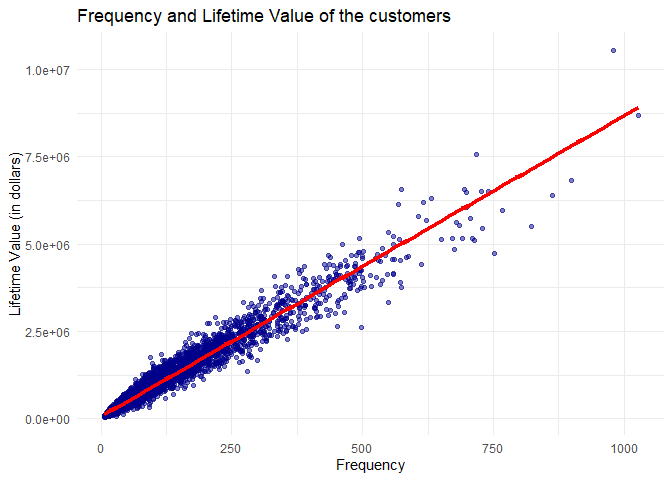<!-- -->

We observe that the more products a user purchases, the higher their
lifetime value, which is logical. We also observe that some customers
have higher lifetime values, indicating that they are loyal customers,
while the middle category contains a larger number of customers.
However, the lowest group has the highest number of customers.

``` r
# Use the ggplot2 package to create a scatter plot of the Purchase Amount Variability and Average Order Value of the customers
ggplot(merged_data, aes(x = Purchase_Amount_Variability, y = Average_Order_Value)) +
  # Add a layer of points to the plot, with each point representing a unique customer
  geom_point(alpha = 0.5, color = "darkgreen") +
  # Add a smoother to the plot to better visualize the relationship between the two variables
  geom_smooth(method = "lm", se = FALSE, color = "orange", size = 1.5) +
  # Add a title to the plot
  labs(title = "Purchase Amount Variability and Average Order Value of the customers",
       # Add an x-axis label
       x = "Purchase Amount Variability (in dollars)",
       # Add a y-axis label
       y = "Average_Order_Value (in dollars)") +
  # Customize the plot theme
  theme_minimal() 
```

    ## `geom_smooth()` using formula 'y ~ x'

<!-- -->

We can see from the plot that many customers have a wide variation in
their purchase amounts, with a large number having a range of purchases
spanning from the lowest purchase value to the highest. In the middle
range, there are most of the customers with a moderate range of
purchases. However, there is also a smaller number of customers with a
lower range of purchases, and most of them have a smaller average
purchase amount.

`We can see some clusters in the plots from the new features we have created`

# Hierarchical Clustering

In our initial hypothesis, we assumed that demographics are important
for segmenting customers although mixed types and multilevel will make
the cluster more complex. Once we discover the resulting clusters from
these features, we can try to remove any unimportant ones. I will use
the gower distance because it’s suitable for measuring the distance
between different observations that have mixed types of characteristics.

``` r
# Load the "cluster" package, which provides various functions for cluster analysis
library(cluster)

# Compute the Gower dissimilarity matrix for the merged_data, which measures the distance between each pair of customers
daisy.mat <- daisy(merged_data[, -1], metric =  "gower")

# Convert the dissimilarity matrix to a data frame, which makes it easier to work with and visualize
daisy.mat.df <- as.data.frame(as.matrix(daisy.mat))
```

``` r
# Subset the first 20 customers of the dissimilarity matrix data frame
daisy.mat.df.subset <- daisy.mat.df[1:20, 1:20]

# Create a heatmap of the dissimilarity matrix
heatmap(as.matrix(daisy.mat.df.subset), Rowv = NA, Colv = NA, col = colorRampPalette(c("white", "darkblue"))(100))
```

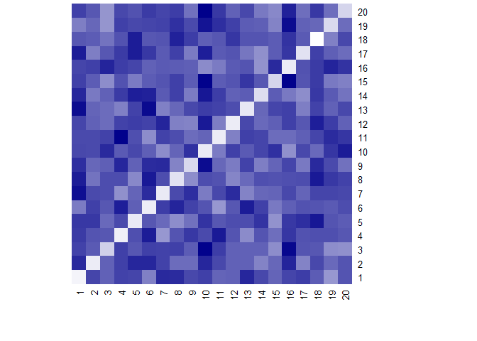<!-- -->

Based on the Gower distance and the resulting heatmap, I observe initial
customer clusters. I will use hierarchical clustering to segment the
customers because it builds exclusively on the dissimilarity matrix
between them. This method determine the appropriate number of clusters
by cutting the dendrogram at an suitable point, which can be observed
from the dendrogram structure and distances. To split the clusters, I
will use the Ward method, which minimizes the within-cluster sum of
squares by maximizing the between-cluster sum of squares.

``` r
# Set the seed for reproducibility
set.seed(123)

# Perform hierarchical clustering using the "ward.D2" method 
hc_fit <- hclust(as.dist(daisy.mat), method = "ward.D2",)

# Convert the hierarchical clustering result to a dendrogram and plot it
plot(as.dendrogram(hc_fit), main = "Dendrogram")
```

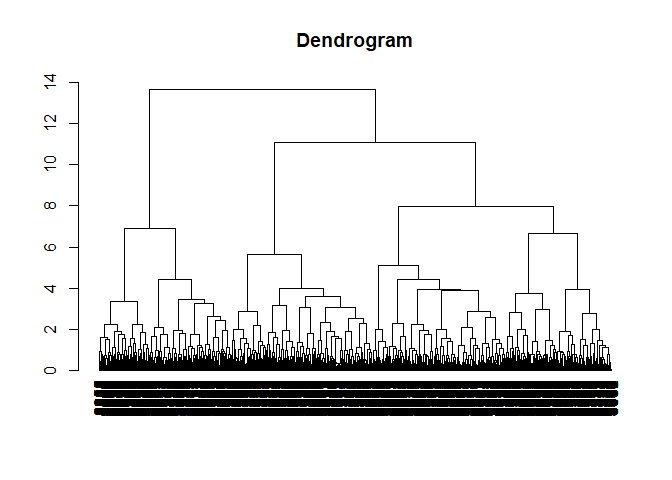<!-- -->

It appears that we can cut the dendrogram into 3 clusters.

``` r
# Plot the dendrogram with the cluster boundaries highlighted
plot(as.dendrogram(hc_fit), main = "Dendrogram")
rect.hclust(hc_fit, k = 3)
```

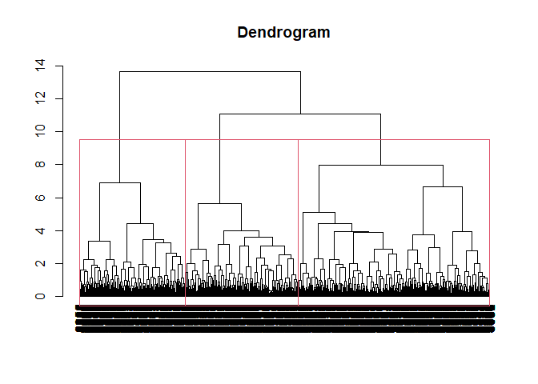<!-- -->

``` r
# Cut the dendrogram to obtain cluster assignments
cluster_assignments <- cutree(hc_fit, k = 3)

# Add the cluster assignments to the original data frame
merged_data$cluster <- cluster_assignments

merged_data$cluster <- as_factor(merged_data$cluster)
```

``` r
ggplot(merged_data, aes(x = Frequency, y = Lifetime_Value, color = cluster)) +
  # Add a layer of points to the plot, with each point representing a unique customer
  geom_point(alpha = 0.8) +
  # Add a smoother to the plot to better visualize the relationship between the two variables
  geom_smooth(method = "lm", se = FALSE, color = "red", size = 1.5) +
  # Add a title to the plot
  labs(title = "Frequency and Lifetime Value of the customers",
       # Add an x-axis label
       x = "Frequency",
       # Add a y-axis label
       y = "Lifetime Value (in dollars)") +
  # Customize the plot theme
  theme_minimal() 
```

    ## `geom_smooth()` using formula 'y ~ x'

<!-- -->

We can observe that the frequency and Lifetime values for the customers
do not effectively segment the customers. The plot reveals overlapping
clusters, suggesting that these features do not strongly contribute to
the clustering process.

``` r
ggplot(merged_data, aes(x = Purchase_Amount_Variability, y = Average_Order_Value, color = cluster)) +
  # Add a layer of points to the plot, with each point representing a unique customer
  geom_point(alpha = 0.5) +
  # Add a smoother to the plot to better visualize the relationship between the two variables
  geom_smooth(method = "lm", se = FALSE, color = "orange", size = 1.5) +
  # Add a title to the plot
  labs(title = "Purchase Amount Variability and Average Order Value of the customers",
       # Add an x-axis label
       x = "Purchase Amount Variability (in dollars)",
       # Add a y-axis label
       y = "Average_Order_Value (in dollars)") +
  # Customize the plot theme
  theme_minimal() 
```

    ## `geom_smooth()` using formula 'y ~ x'

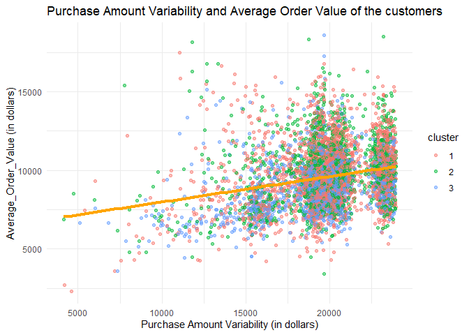<!-- -->

We can observe here also that the purchase amount variability and the
average order values for the customers do not effectively segment the
customers. The plot reveals overlapping clusters, suggesting that these
features do not strongly contribute to the clustering process

``` r
ggplot(merged_data, aes(x = Popular_Category, y = Lifetime_Value, color = cluster)) +
  # Add a layer of points to the plot, with each point representing a unique customer
  geom_boxplot(alpha = 0.5) +
  # Add a title to the plot
  labs(title = "Popular Category and Lifetime Value",
       # Add an x-axis label
       x = "Popular Category",
       # Add a y-axis label
       y = "Lifetime Value (in dollars)") +
  # Customize the plot theme
  theme_minimal() 
```

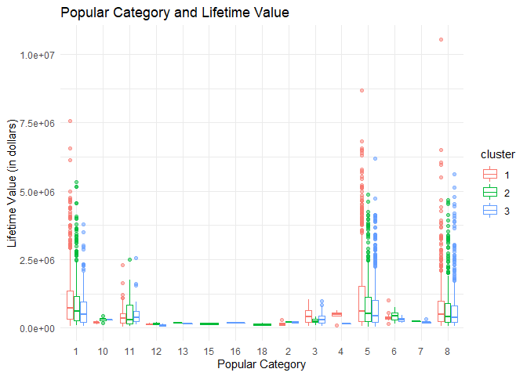<!-- -->

The cluster boxplots show that while some categories have overlapping
distributions, some categories exhibit distinct clusters, providing a
moderate indication that this feature contribute to the clusters.

Therefore, we can try to improve the segmentation by analyzing the
clusters and the features that contribute to this clustering. Then we
will identify features which are not important for distinguishing the
clusters. We will remove those less important features and rerun the
clustering algorithm. This may produce clusters with less overlap and
more distinct groups.

# Features selection

First, I will calculate summary statistics for each numeric feature
within each cluster to help identify the most important features
contributing to the clustering.

``` r
merged_data <- merged_data %>% mutate(cluster = cluster)

numeric_cols <- names(merged_data)[sapply(merged_data, is.numeric)]

by_cluster_numeric <- merged_data %>%
  mutate(cluster = as.factor(cluster)) %>%
  group_by(cluster) %>%
  summarize_at(vars(numeric_cols), list(
    mean = mean, 
    median = median,
    sd = sd))
```

    ## Warning: Using an external vector in selections was deprecated in tidyselect 1.1.0.
    ## i Please use `all_of()` or `any_of()` instead.
    ##   # Was:
    ##   data %>% select(numeric_cols)
    ## 
    ##   # Now:
    ##   data %>% select(all_of(numeric_cols))
    ## 
    ## See <https://tidyselect.r-lib.org/reference/faq-external-vector.html>.
    ## This warning is displayed once every 8 hours.
    ## Call `lifecycle::last_lifecycle_warnings()` to see where this warning was
    ## generated.

``` r
by_cluster_numeric
```

    ## # A tibble: 3 x 13
    ##   cluster Lifetime_Value_mean Average_Order_Value_mean Frequency_mean
    ##   <fct>                 <dbl>                    <dbl>          <dbl>
    ## 1 1                   974029.                    9724.          104. 
    ## 2 2                   813376.                    9887.           84.6
    ## 3 3                   723424.                    8946.           83.0
    ## # i 9 more variables: Purchase_Amount_Variability_mean <dbl>,
    ## #   Lifetime_Value_median <dbl>, Average_Order_Value_median <dbl>,
    ## #   Frequency_median <int>, Purchase_Amount_Variability_median <dbl>,
    ## #   Lifetime_Value_sd <dbl>, Average_Order_Value_sd <dbl>, Frequency_sd <dbl>,
    ## #   Purchase_Amount_Variability_sd <dbl>

**Lifetime Value:**

-   Cluster 1 has the highest mean and median Lifetime Value, indicating
    that customers in this cluster generally spend the most in total
    over their lifetime.

-   Cluster 2 has the second highest mean and median Lifetime Value,
    indicating that customers in this cluster also have relatively high
    spending overall.

-   Cluster 3 has the lowest mean and median Lifetime Value, indicating
    that customers in this cluster generally spend the least of all the
    clusters over their lifetime.

While the clusters do show differences in average Lifetime Value, the
variations in these means and medians are also high for all clusters,
indicating that there is substantial heterogeneity within each cluster
in terms of customers’ total spending.

**Average Order Value:**

The mean and median Average Order Values are relatively similar across
clusters, suggesting that customers in each cluster spend comparable
amounts per purchase on average. Despite differences in their overall
Lifetime Value, customers in all three clusters tend to spend similar
amounts in each individual transaction.

This indicates that Average Order Value may not be a distinguishing
factor between the clusters.

**Order Frequency:**

-   Cluster 1 has the highest mean and median number of products
    purchased per order, indicating that customers in this cluster tend
    to buy the most products with each purchase.

-   Cluster 3 has the lowest mean and median number of products
    purchased per order, indicating that customers in this cluster tend
    to buy the fewest products with each purchase.

-   Cluster 2 has medians and means between Clusters 1 and 3, suggesting
    that customers in Cluster 2 purchase an intermediate number of
    products per order.

-   The variances of around 100 for each cluster indicate that there is
    significant variation in Order Frequency within each cluster.

**Purchase Amount Variability:**

-   The mean and median purchase amount variability are similar across
    clusters, suggesting customers in each cluster have the same
    variability in how much they spend in their purchases.

The key differences between clusters seem to be:

-   **Customer Life Time Value**

-   **Customer Order Frequency**

Now I will calculate the number of customers in each cluster within each
demographic factor to identify which categorical factors cluster the
data.

``` r
# Identify the categorical columns in the merged_data dataframe
categorical_cols <- names(merged_data)[sapply(merged_data, is.factor)]

# Exclude specific columns from the categorical_cols list
categorical_cols <- categorical_cols[!categorical_cols %in% c('User_ID', 'cluster')]

# Group the data by cluster and each categorical column, and calculate the count
results <- map(categorical_cols, function(col) {
  merged_data %>%
    group_by(cluster, across(col)) %>%
    summarize(count = n())
})
```

    ## Warning: There was 1 warning in `group_by()`.
    ## i In argument: `across(col)`.
    ## Caused by warning:
    ## ! Using an external vector in selections was deprecated in tidyselect 1.1.0.
    ## i Please use `all_of()` or `any_of()` instead.
    ##   # Was:
    ##   data %>% select(col)
    ## 
    ##   # Now:
    ##   data %>% select(all_of(col))
    ## 
    ## See <https://tidyselect.r-lib.org/reference/faq-external-vector.html>.

    ## `summarise()` has grouped output by 'cluster'. You can override using the
    ## `.groups` argument.
    ## `summarise()` has grouped output by 'cluster'. You can override using the
    ## `.groups` argument.
    ## `summarise()` has grouped output by 'cluster'. You can override using the
    ## `.groups` argument.
    ## `summarise()` has grouped output by 'cluster'. You can override using the
    ## `.groups` argument.
    ## `summarise()` has grouped output by 'cluster'. You can override using the
    ## `.groups` argument.
    ## `summarise()` has grouped output by 'cluster'. You can override using the
    ## `.groups` argument.
    ## `summarise()` has grouped output by 'cluster'. You can override using the
    ## `.groups` argument.

``` r
# Iterate over the results list and create stacked bar charts
map(results, function(result) {
  ggplot(result, aes(x = cluster, y = count, fill = !!sym(names(result)[[2]]))) +
    geom_bar(stat = "identity", position = "dodge") +
    labs(x = "Cluster", y = "Count") +
    ggtitle(paste("Cluster Distribution by", names(result)[[2]]))
})
```

    ## [[1]]

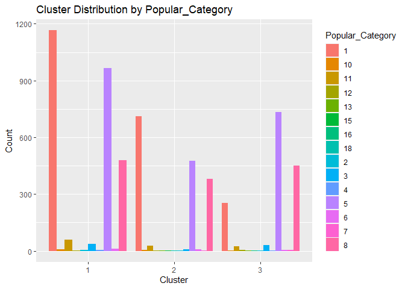<!-- -->

    ## 
    ## [[2]]

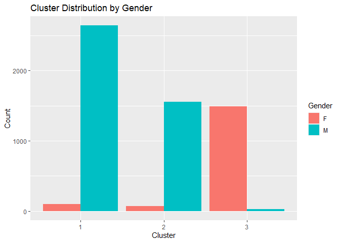<!-- -->

    ## 
    ## [[3]]

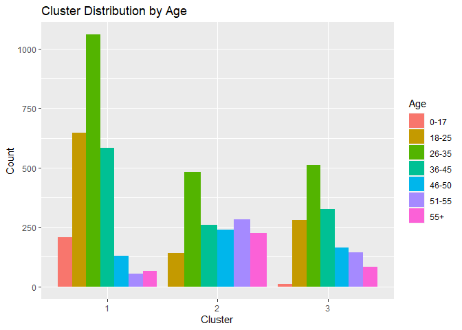<!-- -->

    ## 
    ## [[4]]

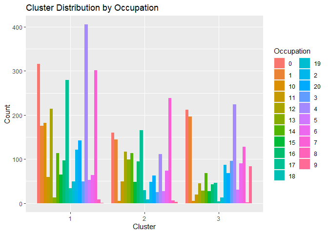<!-- -->

    ## 
    ## [[5]]

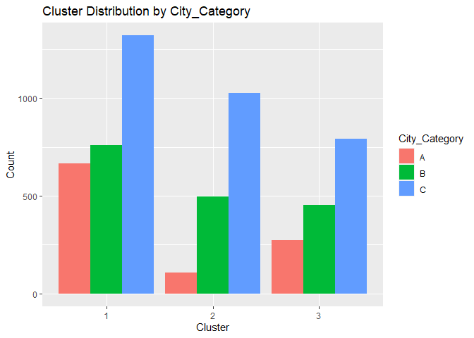<!-- -->

    ## 
    ## [[6]]

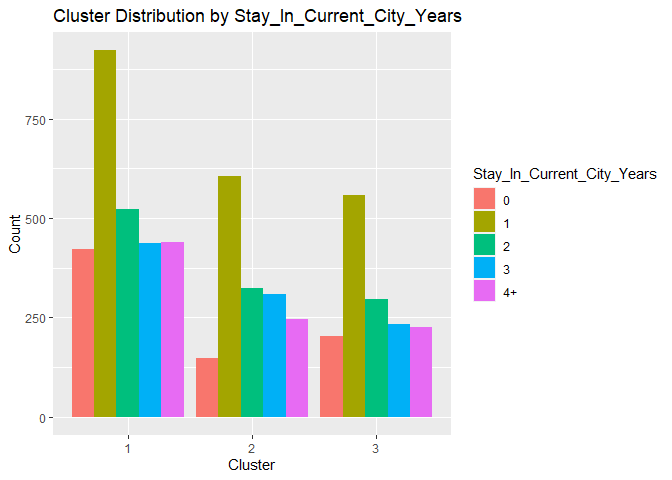<!-- -->

    ## 
    ## [[7]]

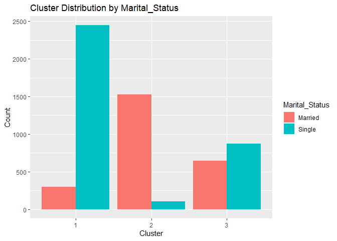<!-- -->

-   The preferred product categories do not distinctly segment customers
    between clusters. We observe category overlaps across the clusters.

-   Gender distributions differ significantly between the clusters,
    indicating gender distinguishes customers within the clusters.

-   The age distributions of customers within clusters show no
    substantial differences. Age does not distinctly segment customers
    between clusters.

-   The occupational distributions of customers within clusters are also
    similar. Occupation does not distinctly segment customers between
    clusters.

-   City of residence does not distinctly segment customers between
    clusters. We observe city overlaps across the clusters.

-   The duration of staying in the city shows no substantial differences
    between clusters. Duration of residence does not distinctly segment
    customers.

-   Marital status distributions differ significantly between the
    clusters, indicating marital status distinguishes customers within
    the clusters.

The key factors that segment customers between clusters seem to be:

-   Gender

-   Marital status

I will now perform some statistical tests on the significant features to
ensure that they effectively distinguish the clusters.

``` r
# Perform ANOVA test
test <- aov(merged_data$Lifetime_Value ~ merged_data$cluster)

summary(test)
```

    ##                       Df    Sum Sq   Mean Sq F value Pr(>F)    
    ## merged_data$cluster    2 6.736e+13 3.368e+13    38.3 <2e-16 ***
    ## Residuals           5888 5.177e+15 8.793e+11                   
    ## ---
    ## Signif. codes:  0 '***' 0.001 '**' 0.01 '*' 0.05 '.' 0.1 ' ' 1

``` r
# Perform Tukey's HSD test
tukey <- TukeyHSD(test)
tukey
```

    ##   Tukey multiple comparisons of means
    ##     95% family-wise confidence level
    ## 
    ## Fit: aov(formula = merged_data$Lifetime_Value ~ merged_data$cluster)
    ## 
    ## $`merged_data$cluster`
    ##           diff       lwr        upr     p adj
    ## 2-1 -160652.90 -229389.3  -91916.47 0.0000001
    ## 3-1 -250605.61 -320943.1 -180268.17 0.0000000
    ## 3-2  -89952.71 -168365.2  -11540.26 0.0196517

``` r
# Identify pairwise comparisons that are not significantly different
not_diff <- which(tukey$`merged_data$cluster`[,4] > 0.05)

not_diff
```

    ## named integer(0)

These results show:

-   There are statistically significant differences in average Lifetime
    Value between the customer clusters

-   All cluster pairs (1 vs 2, 1 vs 3, and 2 vs 3) exhibit differences
    in mean Lifetime Value large enough to be considered statistically
    significant given the variability in the data

-   No cluster pairs have equivalent average Lifetime Values based on
    the Tukey test comparisons

``` r
# Perform ANOVA test
test <- aov(merged_data$Frequency ~ merged_data$cluster)

summary(test)
```

    ##                       Df   Sum Sq Mean Sq F value   Pr(>F)    
    ## merged_data$cluster    2   614384  307192   26.97 2.19e-12 ***
    ## Residuals           5888 67059988   11389                     
    ## ---
    ## Signif. codes:  0 '***' 0.001 '**' 0.01 '*' 0.05 '.' 0.1 ' ' 1

``` r
# Perform Tukey's HSD test
tukey <- TukeyHSD(test)
tukey
```

    ##   Tukey multiple comparisons of means
    ##     95% family-wise confidence level
    ## 
    ## Fit: aov(formula = merged_data$Frequency ~ merged_data$cluster)
    ## 
    ## $`merged_data$cluster`
    ##           diff       lwr        upr    p adj
    ## 2-1 -19.687429 -27.51018 -11.864678 0.000000
    ## 3-1 -21.251341 -29.25630 -13.246381 0.000000
    ## 3-2  -1.563911 -10.48787   7.360049 0.911174

``` r
# Identify pairwise comparisons that are not significantly different
not_diff <- which(tukey$`merged_data$cluster`[,4] > 0.05)

not_diff
```

    ## 3-2 
    ##   3

-   There are statistically significant differences in average Order
    Frequency between at least some of the customer clusters

-   Specifically, clusters 1 and 2 differ significantly in average Order
    Frequency, as do clusters 1 and 3

-   However, clusters 2 and 3 do not show a significant difference in
    their average Order Frequencies based on the Tukey test results

-   This suggests that while clusters 1 appears distinct from clusters 2
    and 3 in terms of how many products customers typically purchase,
    clusters 2 and 3 may not be fully distinguished from each other
    based on Order Frequency alone

``` r
# Perform ANOVA test
test <- aov(merged_data$Average_Order_Value ~ merged_data$cluster)

summary(test)
```

    ##                       Df    Sum Sq   Mean Sq F value Pr(>F)    
    ## merged_data$cluster    2 8.192e+08 409593070   119.3 <2e-16 ***
    ## Residuals           5888 2.022e+10   3434515                   
    ## ---
    ## Signif. codes:  0 '***' 0.001 '**' 0.01 '*' 0.05 '.' 0.1 ' ' 1

``` r
# Perform Tukey's HSD test
tukey <- TukeyHSD(test)
tukey
```

    ##   Tukey multiple comparisons of means
    ##     95% family-wise confidence level
    ## 
    ## Fit: aov(formula = merged_data$Average_Order_Value ~ merged_data$cluster)
    ## 
    ## $`merged_data$cluster`
    ##          diff         lwr       upr     p adj
    ## 2-1  162.4887    26.64344  298.3339 0.0140199
    ## 3-1 -778.0484  -917.05770 -639.0390 0.0000000
    ## 3-2 -940.5370 -1095.50519 -785.5689 0.0000000

``` r
# Identify pairwise comparisons that are not significantly different
not_diff <- which(tukey$`merged_data$cluster`[,4] > 0.05)

not_diff
```

    ## named integer(0)

-   There are statistically significant differences in average Average
    Order Value (purchase amount) between the customer clusters

-   All cluster pairs (1 vs 2, 1 vs 3, and 2 vs 3) exhibit differences
    in mean Average Order Value large enough to be considered
    statistically significant given the variability in the data

-   No cluster pairs have equivalent average Average Order Values based
    on the Tukey test comparisons

-   The results are completely different from our initial hypothesis
    about this feature. However, after conducting statistical tests, we
    can now confirm that AOV differentiates customers.

``` r
# Perform ANOVA test
test <- aov(merged_data$Purchase_Amount_Variability ~ merged_data$cluster)

summary(test)
```

    ##                       Df    Sum Sq   Mean Sq F value   Pr(>F)    
    ## merged_data$cluster    2 4.305e+08 215250816   27.43 1.39e-12 ***
    ## Residuals           5888 4.620e+10   7846717                     
    ## ---
    ## Signif. codes:  0 '***' 0.001 '**' 0.01 '*' 0.05 '.' 0.1 ' ' 1

``` r
# Perform Tukey's HSD test
tukey <- TukeyHSD(test)
tukey
```

    ##   Tukey multiple comparisons of means
    ##     95% family-wise confidence level
    ## 
    ## Fit: aov(formula = merged_data$Purchase_Amount_Variability ~ merged_data$cluster)
    ## 
    ## $`merged_data$cluster`
    ##           diff       lwr       upr     p adj
    ## 2-1  -54.44182 -259.7734  150.8897 0.8082986
    ## 3-1 -636.34945 -846.4636 -426.2353 0.0000000
    ## 3-2 -581.90763 -816.1437 -347.6716 0.0000000

``` r
# Identify pairwise comparisons that are not significantly different
not_diff <- which(tukey$`merged_data$cluster`[,4] > 0.05)

not_diff
```

    ## 2-1 
    ##   1

-   There are statistically significant differences in purchase amount
    variability between at least some of the customer clusters

-   Specifically, cluster 3 shows significantly lower purchase amount
    variability compared to clusters 1 and 2 based on the Tukey test
    results

-   However, clusters 1 and 2 do not differ significantly in their
    purchase amount variability

-   This suggests that while cluster 3 appears distinct in terms of how
    much customers’ order amounts vary, clusters 1 and 2 may not be
    fully distinguished from each other based on purchase amount
    variability

``` r
# Generate correlation matrix
merged_data %>% select(Lifetime_Value,Frequency,Average_Order_Value,Purchase_Amount_Variability) %>% 
  cor()
```

    ##                             Lifetime_Value  Frequency Average_Order_Value
    ## Lifetime_Value                  1.00000000  0.9789623         -0.01055121
    ## Frequency                       0.97896233  1.0000000         -0.14053393
    ## Average_Order_Value            -0.01055121 -0.1405339          1.00000000
    ## Purchase_Amount_Variability     0.42424951  0.3895790          0.24213320
    ##                             Purchase_Amount_Variability
    ## Lifetime_Value                                0.4242495
    ## Frequency                                     0.3895790
    ## Average_Order_Value                           0.2421332
    ## Purchase_Amount_Variability                   1.0000000

We can see that the features are correlated, so we can use PCA to
project the data into a lower-dimensional space or remove the redundant
features which do not contribute to the clusters.

``` r
# Create a contingency table with rows as clusters and columns as Gender groups
age_table <- table(merged_data$cluster, merged_data$Gender)
age_table
```

    ##    
    ##        F    M
    ##   1  101 2642
    ##   2   73 1558
    ##   3 1492   25

``` r
# Perform chi-square test of independence
chisq.test(merged_data$cluster, merged_data$Gender)
```

    ## 
    ##  Pearson's Chi-squared test
    ## 
    ## data:  merged_data$cluster and merged_data$Gender
    ## X-squared = 4946.3, df = 2, p-value < 2.2e-16

The result of the performed chi-square test indicates a highly
significant association between the “cluster” and “Gender” variables.
The p-value is less than 2.2e-16, which is smaller than the significance
level of 0.05. This suggests strong evidence to reject the null
hypothesis of independence, indicating that the “cluster” and “Gender”
variables are associated. The male population dominates clusters 1 and
2, while females occupy cluster 3 predominantly.

``` r
Marital_Status_table <- table(merged_data$cluster, merged_data$Marital_Status)
Marital_Status_table
```

    ##    
    ##     Married Single
    ##   1     298   2445
    ##   2    1528    103
    ##   3     648    869

``` r
chisq.test(merged_data$cluster , merged_data$Marital_Status)
```

    ## 
    ##  Pearson's Chi-squared test
    ## 
    ## data:  merged_data$cluster and merged_data$Marital_Status
    ## X-squared = 2880.6, df = 2, p-value < 2.2e-16

The result of the Pearson’s chi-squared test indicates a highly
significant association between the “cluster” and “Marital_Status”
variables. The p-value is less than 2.2e-16, which is smaller than the
conventional significance level of 0.05. This suggests strong evidence
to reject the null hypothesis of independence, indicating that the
“cluster” and “Marital_Status” variables are associated. We can also
observe that cluster 1 is for single people while cluster 2 is for
married people.

``` r
Age_table <- table(merged_data$cluster, merged_data$Age)
Age_table
```

    ##    
    ##     0-17 18-25 26-35 36-45 46-50 51-55  55+
    ##   1  206   648  1059   582   128    55   65
    ##   2    0   142   483   260   239   282  225
    ##   3   12   279   511   325   164   144   82

``` r
chisq.test(merged_data$cluster , merged_data$Age)
```

    ## 
    ##  Pearson's Chi-squared test
    ## 
    ## data:  merged_data$cluster and merged_data$Age
    ## X-squared = 1001.4, df = 12, p-value < 2.2e-16

-   Cluster 1 has a large number of people aged 26-35, while clusters 2
    and 3 have more evenly distributed ages.

-   Cluster 2 has relatively high counts in the older age buckets (46-55
    and 55+), while cluster 1 has very low counts in those older groups.

-   Cluster 3 appears more evenly distributed across age groups compared
    to 1 and 2.

-   So we can see that the Age doesn’t segment the clusters well, I will
    utilize this variable, but before doing so, I need to modify it to
    fit into two categories: those that are less than 51 and those that
    are greater than or equal to 51.

``` r
# Create a new variable "Age" based on age ranges
merged_data <- merged_data %>% 
  mutate(Age = ifelse(Age %in% c("51-55", "55"), ">51", "<=50"))
```

I will examine the relationships between the variables and the cluster
variable in the multivariate visualizations.

``` r
#scatter plot
ggplot(merged_data, aes(x = Frequency, y = Lifetime_Value , color = cluster)) +
  # Add a layer of points to the plot, with each point representing a unique customer
  geom_point(alpha = 0.8) +
  # Add a smoother to the plot to better visualize the relationship between the two variables
  geom_smooth(method = "lm", se = FALSE, color = "red", size = 1.5) +
  # Add a title to the plot
  labs(title = "Customer Segmentation Based on Purchase Behavior",
       # Add an x-axis label
       x = "Frequency",
       # Add a y-axis label
       y = "Lifetime Value (in dollars)") +
  # Customize the plot theme
  theme_minimal() +
  facet_wrap(.~ Gender + Marital_Status)
```

    ## `geom_smooth()` using formula 'y ~ x'

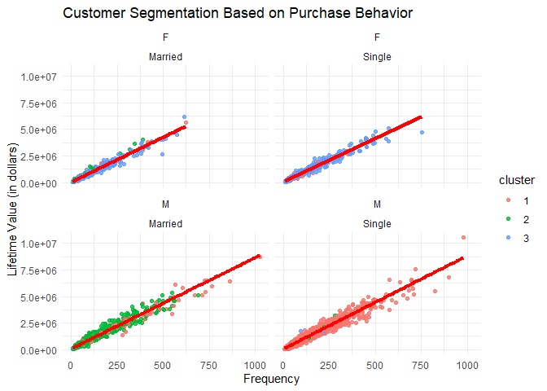<!-- -->

``` r
#  scatter plot
ggplot(merged_data, aes(y = Average_Order_Value, x = Purchase_Amount_Variability , color = cluster)) +
  # Add a layer of points to the plot, with each point representing a unique customer
  geom_point(alpha = 0.8) +
  # Add a smoother to the plot to better visualize the relationship between the two variables
  geom_smooth(method = "lm", se = FALSE, color = "red", size = 1.5) +
  # Add a title to the plot
  labs(title = "Customer Segmentation Based on Purchase Behavior",
       # Add an x-axis label
       x = "Purchase Amount Variability",
       # Add a y-axis label
       y = "Average Order Value") +
  # Customize the plot theme
  theme_minimal() +
  facet_wrap(.~ Age + Gender + Marital_Status)
```

    ## `geom_smooth()` using formula 'y ~ x'

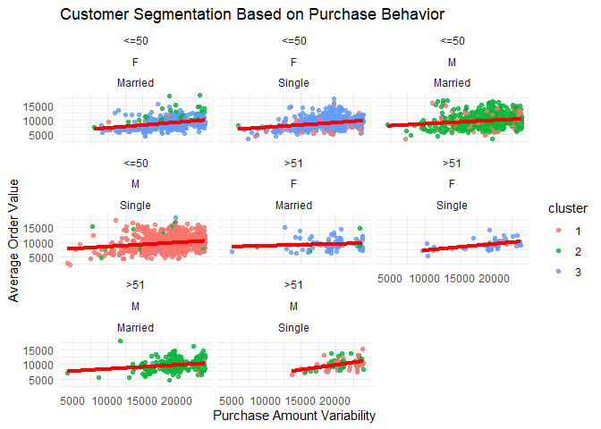<!-- -->

Gender and marital status have the most impact on customer segmentation.

Now we can rerun the clustering algorithm with these important features
that we explored.

``` r
cluster_data <- merged_data %>%
  select(User_ID, Lifetime_Value,
         Frequency,Average_Order_Value,Purchase_Amount_Variability,Gender,Marital_Status,Age) %>% 
  mutate(Age = as.factor(Age))

# Compute the Gower dissimilarity matrix for the "merged_data" dataframe, which measures the distance between each pair of customers
daisy.mat <- daisy(cluster_data[, -1], metric = "gower")

# Convert the dissimilarity matrix to a data frame, which makes it easier to work with and visualize
daisy.mat.df <- as.data.frame(as.matrix(daisy.mat))
```

``` r
# Set the seed for reproducibility
set.seed(123)

# Perform hierarchical clustering using the "complete" method 
hc_fit <- hclust(as.dist(daisy.mat), method = "complete")

# Convert the hierarchical clustering result to a dendrogram and plot it
plot(as.dendrogram(hc_fit), main = "Dendrogram")
```

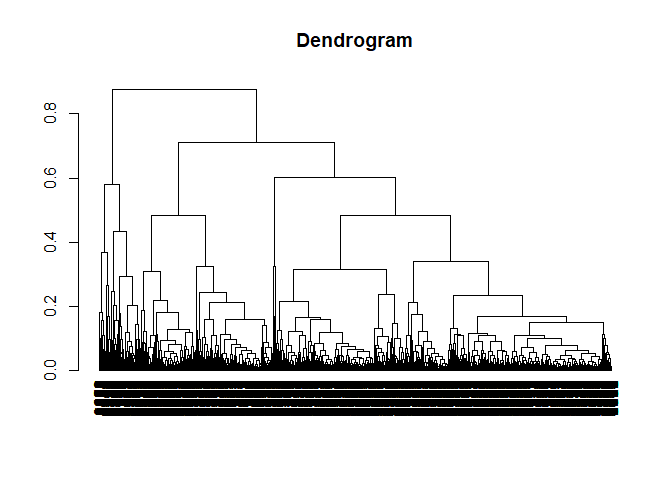<!-- -->

``` r
# Plot the dendrogram with the cluster boundaries highlighted
plot(as.dendrogram(hc_fit), main = "Dendrogram")
rect.hclust(hc_fit, k = 7)
```

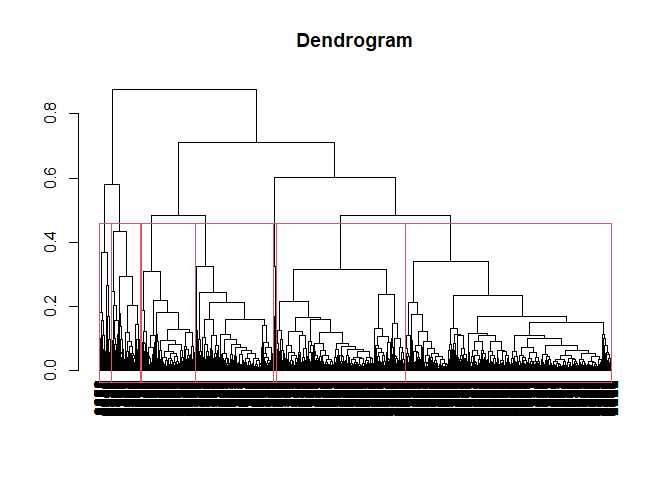<!-- -->

``` r
# Cut the dendrogram to obtain cluster assignments
cluster_assignments <- cutree(hc_fit, k =7)

# Add the cluster assignments to the original data frame
cluster_data$cluster <- cluster_assignments
cluster_data <- cluster_data %>%  mutate(cluster = as.factor(cluster))
```

After conducting some experiments, I utilized the complete linkage
method to split the clusters. I tried various values of k and ultimately
decided on 7 because it effectively separated the clusters in a clear
and distinct manner.

``` r
#scatter plot
ggplot(cluster_data, aes(x = Frequency, y = Lifetime_Value , color = cluster)) +
  # Add a layer of points to the plot, with each point representing a unique customer
  geom_point(alpha = 0.8) +
  # Add a smoother to the plot to better visualize the relationship between the two variables
  geom_smooth(method = "lm", se = FALSE, color = "red", size = 1.5) +
  # Add a title to the plot
  labs(title = "Customer Segmentation Based on Purchase Behavior",
       # Add an x-axis label
       x = "Frequency",
       y = "Lifetime Value (in dollars)") +
  # Customize the plot theme
  theme_minimal() +
  facet_wrap(.~ Age + Gender + Marital_Status)
```

    ## `geom_smooth()` using formula 'y ~ x'

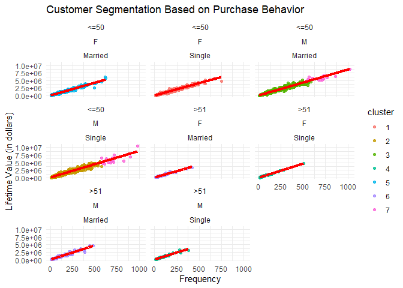<!-- -->

Currently, numerous clusters are apparent, and the important features
have effectively distinguished them from one another.

``` r
#  scatter plot
ggplot(cluster_data, aes(y = Average_Order_Value, x = Purchase_Amount_Variability , color = cluster)) +
  # Add a layer of points to the plot, with each point representing a unique customer
  geom_point(alpha = 0.8) +
  # Add a smoother to the plot to better visualize the relationship between the two variables
  geom_smooth(method = "lm", se = FALSE, color = "red", size = 1.5) +
  # Add a title to the plot
  labs(title = "Customer Segmentation Based on Purchase Behavior",
       # Add an x-axis label
       x = "Purchase Amount Variability",
       # Add a y-axis label
       y = "Average Order Valuev") +
  # Customize the plot theme
  theme_minimal() +
  facet_wrap(.~ Age + Gender + Marital_Status)
```

    ## `geom_smooth()` using formula 'y ~ x'

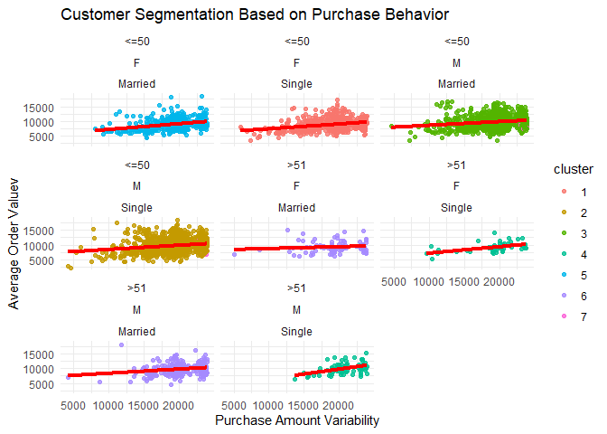<!-- -->

Here we can see that the purchase amount variability and average order
value don’t separate any of the seven clusters. So, I will remove them
and run the clusters again.

``` r
cluster_data2 <- merged_data %>%
  select(User_ID, Lifetime_Value,
         Frequency,Gender,Marital_Status,Age) %>% 
  mutate(Age = as.factor(Age))

# Compute the Gower dissimilarity matrix for the "merged_data" dataframe, which measures the distance between each pair of customers
daisy.mat <- daisy(cluster_data2[, -1], metric = "gower")

# Convert the dissimilarity matrix to a data frame, which makes it easier to work with and visualize
daisy.mat.df <- as.data.frame(as.matrix(daisy.mat))

# Set the seed for reproducibility
set.seed(123)

# Perform hierarchical clustering using the "complete" method 
hc_fit <- hclust(as.dist(daisy.mat), method = "complete")

# Convert the hierarchical clustering result to a dendrogram and plot it
plot(as.dendrogram(hc_fit), main = "Dendrogram")
```

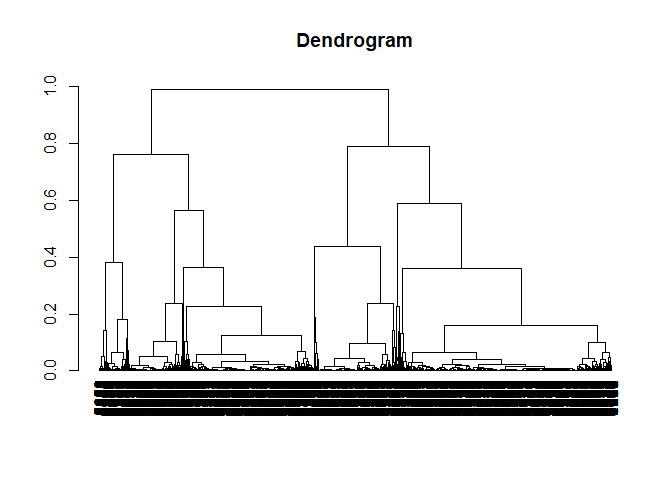<!-- -->

``` r
# Plot the dendrogram with the cluster boundaries highlighted
plot(as.dendrogram(hc_fit), main = "Dendrogram")
rect.hclust(hc_fit, k = 10)
```

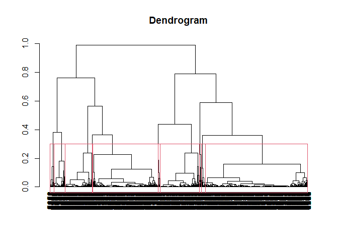<!-- -->

``` r
# Cut the dendrogram to obtain cluster assignments
cluster_assignments <- cutree(hc_fit, k =10)
```

``` r
# Add the cluster assignments to the original data frame
cluster_data2$cluster <- cluster_assignments
cluster_data2 <- cluster_data2 %>%  mutate(cluster = as.factor(cluster))

#scatter plot
ggplot(cluster_data2, aes(x = Frequency, y = Lifetime_Value , color = cluster)) +
  # Add a layer of points to the plot, with each point representing a unique customer
  geom_point(alpha = 0.8) +
  # Add a smoother to the plot to better visualize the relationship between the two variables
  geom_smooth(method = "lm", se = FALSE, color = "red", size = 1.5) +
  # Add a title to the plot
  labs(title = "Customer Segmentation Based on Purchase Behavior",
       # Add an x-axis label
       x = "Frequency",
       y = "Lifetime Value (in dollars)") +
  # Customize the plot theme
  theme_minimal() +
  facet_wrap(.~ Age + Gender + Marital_Status)
```

    ## `geom_smooth()` using formula 'y ~ x'

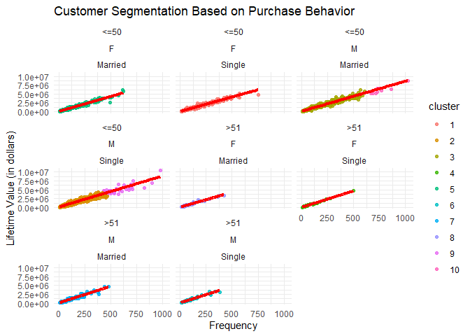<!-- -->

We observe that all the features contribute to the clusters now, and we
have identified 10 distinct clusters, each characterized by unique
characteristics. These clusters will provide valuable insights that can
assist the marketing team.

# Clusters Analysis and Insights

Finally, I will analyze the characteristics of each cluster to gain more
understanding of them and to help the marketing team build effective
campaigns and target their correct audience.

``` r
numeric_cols <- names(cluster_data2)[sapply(cluster_data2, is.numeric)]

by_cluster_numeric <- cluster_data2 %>%
  mutate(cluster = as.factor(cluster)) %>%
  group_by(cluster) %>%
  summarize_at(vars(numeric_cols), list(
    mean = mean)) %>% 
  arrange(by = Lifetime_Value_mean)

by_cluster_numeric
```

    ## # A tibble: 10 x 3
    ##    cluster Lifetime_Value_mean Frequency_mean
    ##    <fct>                 <dbl>          <dbl>
    ##  1 8                   610292.           67.9
    ##  2 4                   667528.           73.1
    ##  3 5                   711376.           80.9
    ##  4 1                   725440.           83.8
    ##  5 6                   817052.           83.4
    ##  6 7                   819643.           84.7
    ##  7 2                   863571.           90.7
    ##  8 3                   885751.           93.8
    ##  9 9                  4942747.          561. 
    ## 10 10                 6105026           770.

``` r
ggplot(cluster_data2, aes(y = cluster, x = Frequency)) +
  geom_boxplot(alpha = 0.5) +
  labs(title = "Frequency and clusters",
       x = "Frequency",
       y = "clusters") +
  theme_minimal() 
```

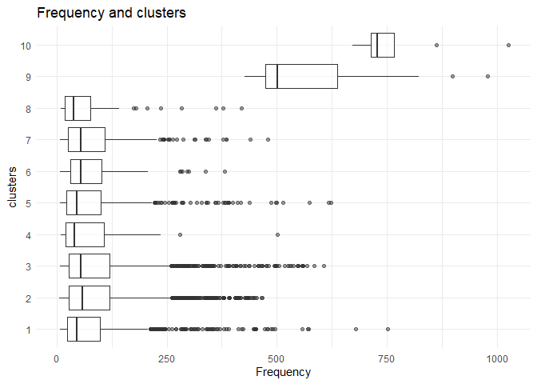<!-- -->

``` r
ggplot(cluster_data2, aes(y = cluster, x = Lifetime_Value)) +
  geom_boxplot(alpha = 0.5) +
  labs(title = "Lifetime Value and clusters",
       x = "Lifetime Value",
       y = "clusters") +
  theme_minimal() 
```

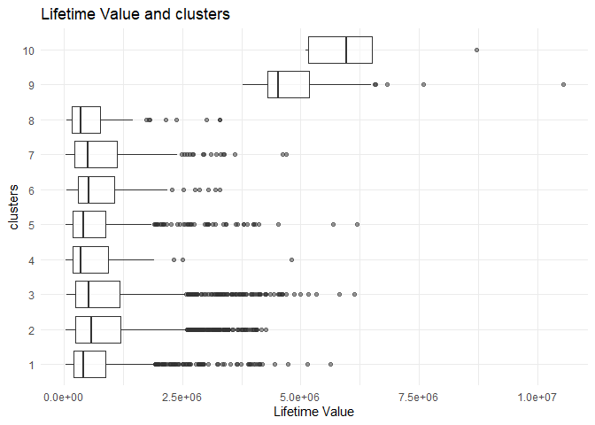<!-- -->

-   Clusters 8 and 4 have the lowest Lifetime Values, from
    \$600k-\$700k. Their Frequencies are also relatively low. These seem
    to be the least valuable segments.

-   The average lifetime value is much higher in clusters 9 and 10
    compared to the other clusters. Cluster 9 has an average of
    \$4,942,746 and cluster 10 has \$6,105,026.

-   The average purchase frequency is also dramatically higher in
    clusters 9 and 10. Cluster 9 has an average of 561 purchases per
    customer. Cluster 10 has 770.

-   So clusters 9 and 10 represent the very best customers who have
    extremely high lifetime values and purchase frequencies compared to
    the other segments. These are the ultra high-value customers that
    brands aspire to have.

-   The differences between cluster 9 and 10 are quite stark. Cluster 10
    has the highest lifetime value and purchase frequency by a
    significant margin over all other clusters, including cluster 9.

-   Cluster 10 represents the absolute best customers. Cluster 9 is
    still very valuable but not to the same level as cluster 10.
    Segmenting these into two groups allows differentiating marketing
    and engagement strategies between the best and ultra best customers.

``` r
# Identify the categorical columns in the merged_data dataframe
categorical_cols <- names(cluster_data2)[sapply(cluster_data2, is.factor)]

# Exclude specific columns from the categorical_cols list
categorical_cols <- categorical_cols[!categorical_cols %in% c('User_ID', 'cluster')]

# Group the data by cluster and each categorical column, and calculate the count
results <- map(categorical_cols, function(col) {
  cluster_data2 %>%
    group_by(cluster, across(col)) %>%
    summarize(count = n()) %>% 
    arrange(by = across(col),count)
})
```

    ## `summarise()` has grouped output by 'cluster'. You can override using the
    ## `.groups` argument.
    ## `summarise()` has grouped output by 'cluster'. You can override using the
    ## `.groups` argument.
    ## `summarise()` has grouped output by 'cluster'. You can override using the
    ## `.groups` argument.

``` r
results
```

    ## [[1]]
    ## # A tibble: 10 x 3
    ## # Groups:   cluster [10]
    ##    cluster Gender count
    ##    <fct>   <fct>  <int>
    ##  1 4       F         49
    ##  2 8       F         93
    ##  3 5       F        626
    ##  4 1       F        898
    ##  5 10      M          9
    ##  6 9       M         48
    ##  7 6       M         87
    ##  8 7       M        252
    ##  9 3       M       1494
    ## 10 2       M       2335
    ## 
    ## [[2]]
    ## # A tibble: 10 x 3
    ## # Groups:   cluster [10]
    ##    cluster Marital_Status count
    ##    <fct>   <fct>          <int>
    ##  1 10      Married            9
    ##  2 8       Married           93
    ##  3 7       Married          252
    ##  4 5       Married          626
    ##  5 3       Married         1494
    ##  6 9       Single            48
    ##  7 4       Single            49
    ##  8 6       Single            87
    ##  9 1       Single           898
    ## 10 2       Single          2335
    ## 
    ## [[3]]
    ## # A tibble: 10 x 3
    ## # Groups:   cluster [10]
    ##    cluster Age   count
    ##    <fct>   <fct> <int>
    ##  1 10      <=50      9
    ##  2 9       <=50     48
    ##  3 5       <=50    626
    ##  4 1       <=50    898
    ##  5 3       <=50   1494
    ##  6 2       <=50   2335
    ##  7 4       >51      49
    ##  8 6       >51      87
    ##  9 8       >51      93
    ## 10 7       >51     252

``` r
# Iterate over the results list and create stacked bar charts
map(results, function(result) {
  ggplot(result, aes(x = cluster, y = count, fill = !!sym(names(result)[[2]]))) +
    geom_bar(stat = "identity", position = "dodge") +
    labs(x = "Cluster", y = "Count") +
    ggtitle(paste("Cluster Distribution"))
})
```

    ## [[1]]

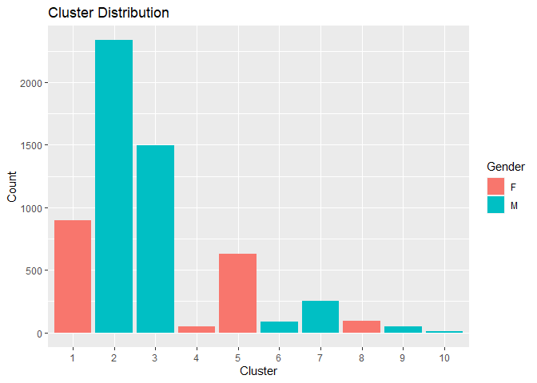<!-- -->

    ## 
    ## [[2]]

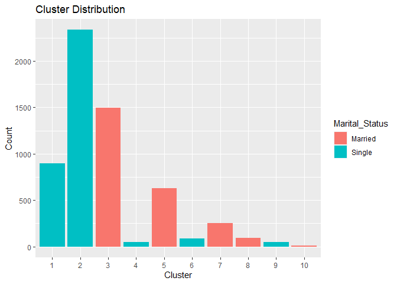<!-- -->

    ## 
    ## [[3]]

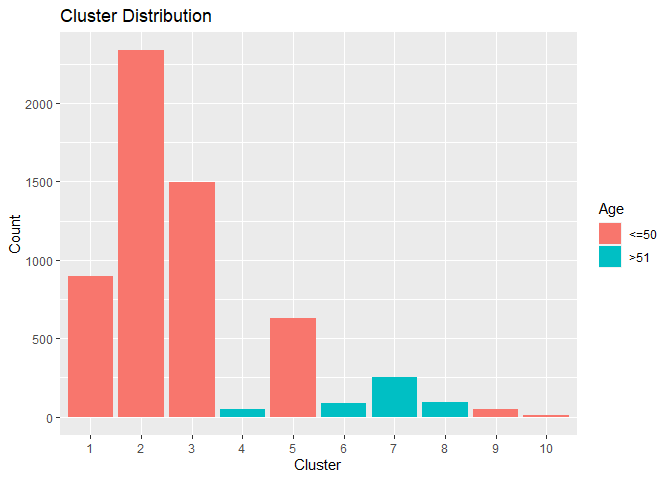<!-- -->

**Gender:**

-   Clusters 3 and 2 have the most male-dominated customer bases, with
    over 90% male customers. These segments will likely be easier to
    target with masculine messaging.

-   Clusters 1 and 5 are the most heavily female segments, with over 90%
    female customers. Feminine and women-focused messaging will resonate
    most with these groups.

-   The remaining clusters have lower number of customers, but each
    cluster still has unique gender characteristics that differentiate
    them from the male and female base clusters. These customer clusters
    may have special characteristics like marital status, age, and
    lifetime value that distinguish them beyond just gender.

-   It is evident that the loyal clusters (9,10) solely consist of male
    customers, suggesting that male clusters are the most significant
    customer groups.

**Marital Status:**

-   We can observe that cluster 2 has the majority of single customers,
    while cluster 3 has the majority of married customers.

-   Furthermore, we can also see the interaction between marital status
    and gender within the clusters. This suggests that these two
    features combined contribute to the customer segmentation.

**Age:**

-   When considering age, we can observe that the ten clusters are
    distributed among two age groups. Six of the clusters are
    predominantly composed of younger customers, those below 50 years of
    age, while the remaining four clusters consist mainly of older
    customers.

It is important to note that each cluster exhibits distinct
characteristics and personas. This plot enables us to define and easily
observe the unique traits associated with each cluster.

``` r
#scatter plot for clusters
ggplot(cluster_data2, aes(x = Frequency, y = Lifetime_Value , color = cluster)) +
  
  geom_point() +

  geom_smooth(method = "lm", se = FALSE, color = "red", size = 1.5) +
  # Add a title to the plot
  labs(title = "Customer Segmentation Based on Purchase Behavior and Demographics",
       # Add an x-axis label
       x = "Frequency",
       y = "Lifetime Value (in dollars)") +
  # Customize the plot theme
  theme_minimal() +
  facet_wrap(.~ Gender + Marital_Status + Age )
```

    ## `geom_smooth()` using formula 'y ~ x'

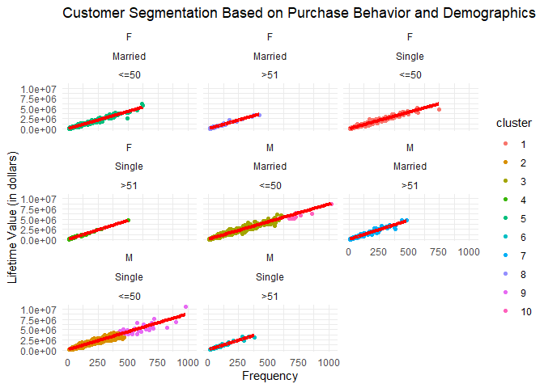<!-- -->

**From this chart we can define the clusters as :**

| Cluster ID | Characteristics                                                                                    |
|------------|----------------------------------------------------------------------------------------------------|
| 1          | Single females who are under 50 years of age.                                                      |
| 4          | Single females who are above 50 years of age.                                                      |
| 5          | Married females who are under 50 years of age.                                                     |
| 8          | Married females who are above 50 years of age.                                                     |
| 2          | Single males who are under 50 years of age and have low to moderate lifetime value and frequency.  |
| 9          | Single males who are under 50 years of age and have high lifetime value and frequency.             |
| 3          | Married males who are under 50 years of age and have low to moderate lifetime value and frequency. |
| 10         | Married males who are under 50 years of age and have high lifetime value and frequency.            |
| 6          | Single males who are above 50 years of age.                                                        |
| 7          | Married males who are above 50 years of age.                                                       |

# Conclusions and Actions

We can build personalized campaigns ideas based on the customer
clusters:

-   **Cluster 5,8 (married females):** Target family-oriented ads. Focus
    on products/services helpful for home, kids, etc.

-   **Cluster 1,4 (single females):** Target lifestyle-oriented ads.
    Focus on products/services helpful for health, and sports.

-   **Cluster 2,3 (single/married males under 50 with low spending):**
    Offer introductory discounts, and coupon codes to get them to spend
    more. Send notifications of new/popular items especially family
    products for married males.

-   **Cluster 9,10 (high spending males under 50):** Offer loyalty
    programs, exclusive perks. Focus on upgrades/premium products. Send
    personalized recommendations.

-   **Cluster 7 (married males over 50):** Market home improvement,
    retirement planning products. Partner with related brands. Highlight
    convenience features.

-   **Cluster 6 (single older males):** Focus on hobby items,
    sports/travel deals. Target through relevant platforms/publications.
