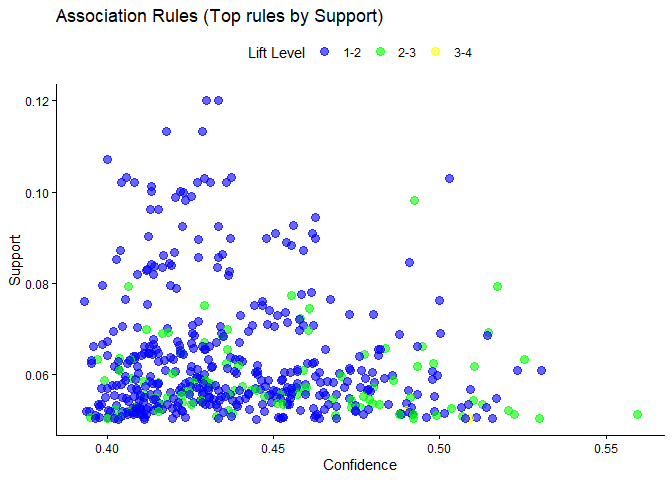

# Load Data

First we need to retrieve the data from MySQL then check the types.


``` r
#Load the RMySQL package
library(RMySQL)
library(tidyverse)

#Create a connection to MySQL database
con <- dbConnect(MySQL(), user = "root", password = "3012001", host = "localhost",dbname = "fridayblack")

# write query to acces the records
black_friday = dbReadTable(con, "black_friday_cleaned_table")
head(black_friday)
```

```
##   User_ID Product_ID Gender   Age Occupation City_Category
## 1 1000001  P00069042      F  0-17         10             A
## 2 1000001  P00248942      F  0-17         10             A
## 3 1000001  P00087842      F  0-17         10             A
## 4 1000001  P00085442      F  0-17         10             A
## 5 1000002  P00285442      M   55+         16             C
## 6 1000003  P00193542      M 26-35         15             A
##   Stay_In_Current_City_Years Marital_Status Product_Category_1
## 1                          2              0                  3
## 2                          2              0                  1
## 3                          2              0                 12
## 4                          2              0                 12
## 5                         4+              0                  8
## 6                          3              0                  1
##   Product_Category_2 Product_Category_3 Purchase
## 1                  4                 12     8370
## 2                  6                 14    15200
## 3                 14                 17     1422
## 4                 14                 17     1057
## 5                 17                 16     7969
## 6                  2                  3    15227
```

We want to convert all the columns type to Factor type unless the purchase column.


``` r
# Select all columns except for the "Purchase" column and convert them to factors
cols_to_convert <- colnames(black_friday)[-12]
  # Use lapply to apply the same function to all selected columns
black_friday[cols_to_convert] <- lapply(black_friday[cols_to_convert], as.factor)

#check the type now
sapply(black_friday, class)
```

```
##                    User_ID                 Product_ID 
##                   "factor"                   "factor" 
##                     Gender                        Age 
##                   "factor"                   "factor" 
##                 Occupation              City_Category 
##                   "factor"                   "factor" 
## Stay_In_Current_City_Years             Marital_Status 
##                   "factor"                   "factor" 
##         Product_Category_1         Product_Category_2 
##                   "factor"                   "factor" 
##         Product_Category_3                   Purchase 
##                   "factor"                  "numeric"
```

Now our data is ready for analysis.

# Data preprocessing

First, we need to convert the data into a transaction format in order to extract rules and identify the most frequently occurring items that are placed by the same user more frequently than other items.


``` r
# Load the 'arules' library
library(arules)

# Splitting transactions
trans_data <- split(black_friday$Product_ID,
                    black_friday$User_ID)

# Transform data into a transactional dataset
trans_data <- as(trans_data, "transactions")

# Summarize the transactional dataset
summary(trans_data)
```

```
## transactions as itemMatrix in sparse format with
##  5891 rows (elements/itemsets/transactions) and
##  3631 columns (items) and a density of 0.02571586 
## 
## most frequent items:
## P00265242 P00025442 P00110742 P00112142 P00057642   (Other) 
##      1880      1615      1612      1562      1470    541929 
## 
## element (itemset/transaction) length distribution:
## sizes
##    6    7    8    9   10   11   12   13   14   15   16   17   18   19   20   21 
##    1    7   10   22   33   58   77   94   98  125  107  116  125  100   99   85 
##   22   23   24   25   26   27   28   29   30   31   32   33   34   35   36   37 
##   83   80   76   72   74   77   77   67   76   77   58   48   59   46   60   51 
##   38   39   40   41   42   43   44   45   46   47   48   49   50   51   52   53 
##   51   41   48   64   43   49   40   37   40   48   33   42   37   36   30   45 
##   54   55   56   57   58   59   60   61   62   63   64   65   66   67   68   69 
##   41   48   38   31   42   40   26   31   31   30   27   44   25   31   31   25 
##   70   71   72   73   74   75   76   77   78   79   80   81   82   83   84   85 
##   40   25   34   23   27   25   27   26   29   18   26   22   24   22   26   30 
##   86   87   88   89   90   91   92   93   94   95   96   97   98   99  100  101 
##   20   18   24   14   23   17   20   21   18   27   21   16   13   14   19   24 
##  102  103  104  105  106  107  108  109  110  111  112  113  114  115  116  117 
##   15   15   17   12   10   11   15   15   13   13   17   15   11   25   13   11 
##  118  119  120  121  122  123  124  125  126  127  128  129  130  131  132  133 
##   18   18   25    9   14   12    8   13   10   10   11    6   12   11    8   12 
##  134  135  136  137  138  139  140  141  142  143  144  145  146  147  148  149 
##   10   12   11   19   17    5    8   10    7   12   13    5    7    7    8    9 
##  150  151  152  153  154  155  156  157  158  159  160  161  162  163  164  165 
##    8    6    7   11   11    8    4    9    5   10   10   14    8    7    9   10 
##  166  167  168  169  170  171  172  173  174  175  176  177  178  179  180  181 
##    8    6   13    9    8   13    9    9    7    9    8    8   10   13    8    7 
##  182  183  184  185  186  187  188  189  190  191  192  193  194  195  196  197 
##    5    6    9    8    3    7    7    5    8    6    4    3    3    5    3    5 
##  198  199  200  201  202  203  204  205  206  207  208  209  210  211  212  213 
##    7    6    5    7    5    7    3    5    8    6    7    6    6    2    5    1 
##  214  215  216  217  218  219  220  221  222  223  224  225  226  227  228  229 
##    4    5    7    7    8    2    6    4    5   10    5    5    1   12    6    3 
##  230  231  232  233  234  235  236  237  238  239  240  241  242  243  244  245 
##    7    7    3    4    4    4    6    5    4    4    4    2    7    6    3    3 
##  246  247  248  249  250  251  252  253  254  255  257  258  259  260  261  262 
##    4    1    3    2    2    4    2    1    6    2    5    4    2    1    5    2 
##  263  264  266  267  268  269  270  271  272  273  274  275  276  277  278  279 
##    1    5    3    6    4    5    3    6    1    3    3    5    1    1    1    2 
##  280  281  282  283  284  285  286  287  288  289  290  291  292  293  294  295 
##    5    6    5    8    1    2    6    5    2    3    3    6    2    1    1    5 
##  296  297  298  299  300  302  303  304  305  306  307  308  309  310  312  313 
##    3    1    2    6    2    1    2    3    3    4    5    2    1    3    7    2 
##  315  316  317  318  320  321  322  325  329  330  331  334  335  336  337  338 
##    4    3    1    1    1    2    4    2    2    1    2    2    1    1    2    5 
##  339  340  341  342  343  344  345  346  347  348  349  350  351  352  354  355 
##    3    3    2    3    4    2    1    4    2    2    1    1    2    3    1    5 
##  356  357  358  359  360  362  363  364  365  366  367  370  371  372  377  378 
##    1    3    1    1    1    3    2    1    1    1    2    1    2    1    2    4 
##  379  382  383  385  386  387  388  389  390  391  392  393  400  402  405  406 
##    4    2    2    2    1    1    1    2    1    4    2    3    2    1    3    1 
##  407  409  411  412  413  414  416  417  418  419  420  423  425  426  427  428 
##    3    3    2    2    1    1    1    3    1    1    1    1    1    1    1    2 
##  430  431  433  435  436  437  438  439  444  446  447  448  449  450  451  453 
##    2    1    1    3    3    1    1    2    2    1    2    1    1    1    3    2 
##  454  457  458  460  461  465  467  469  471  472  475  476  477  479  482  485 
##    1    1    2    1    1    2    3    1    2    2    2    2    1    2    1    2 
##  486  487  488  490  492  493  494  495  496  497  498  499  500  501  502  504 
##    3    1    1    1    1    2    2    1    1    2    1    2    1    1    1    1 
##  514  517  524  527  529  530  533  537  538  544  547  549  557  558  559  560 
##    1    1    1    1    1    1    2    1    1    1    1    2    1    3    1    1 
##  568  570  572  573  575  584  588  606  612  617  622  632  651  671  676  680 
##    1    1    1    1    2    1    1    1    1    1    1    1    1    1    1    1 
##  685  691  694  698  705  709  714  718  727  729  740  752  767  823  862  898 
##    1    1    1    2    1    1    1    1    1    1    1    1    1    1    1    1 
##  979 1026 
##    1    1 
## 
##    Min. 1st Qu.  Median    Mean 3rd Qu.    Max. 
##    6.00   26.00   54.00   93.37  117.00 1026.00 
## 
## includes extended item information - examples:
##      labels
## 1 P00000142
## 2 P00000242
## 3 P00000342
## 
## includes extended transaction information - examples:
##   transactionID
## 1       1000001
## 2       1000002
## 3       1000003
```

The summary of the transaction data:

-   The dataset has 5891 rows, representing each user's transactions.

-   It consists of 3631 columns, representing unique items.

-   The density of the dataset is 0.02571586, indicating the proportion of non-zero elements in the sparse matrix representation of the dataset.

The section "most frequent items" shows the five most frequently occurring items in the dataset, followed by "(Other)" which represents all other items not listed individually. The counts for the most frequent items are as follows:

-   P00265242: 1880 occurrences

-   P00025442: 1615 occurrences

-   P00110742: 1612 occurrences

-   P00112142: 1562 occurrences

-   P00057642: 1470 occurrences

The count 541929 represents the occurrences of all other items collectively.

A density of 0.02571586 means that approximately 2.57% of the elements in the dataset are non-zero. This indicates that the dataset is relatively sparse, with a majority of the elements being zeros. This is a strong indicator to use reasonably lower values for the parameters of the Apriori algorithm in order to capture the most important rules. Lowering the support threshold and adjusting other parameters accordingly can help discover infrequent but meaningful itemsets and association rules in sparse datasets.


``` r
# Inspect the first user's transaction in the transactional dataset
inspect(head(trans_data, 1))
```

```
##     items        transactionID
## [1] {P00000142,               
##      P00004842,               
##      P00025442,               
##      P00051442,               
##      P00051842,               
##      P00058142,               
##      P00059442,               
##      P00064042,               
##      P00069042,               
##      P00074142,               
##      P00085442,               
##      P00085942,               
##      P00087842,               
##      P00102642,               
##      P00110842,               
##      P00111842,               
##      P00117942,               
##      P00142242,               
##      P00165942,               
##      P00178242,               
##      P00178342,               
##      P00183942,               
##      P00184942,               
##      P00210342,               
##      P00214842,               
##      P00220642,               
##      P00248442,               
##      P00248942,               
##      P00255842,               
##      P00258742,               
##      P00289942,               
##      P00297042,               
##      P00375436,               
##      P0096542,                
##      P0097142}         1000001
```

We can observe that these are all the unique products purchased by customer 1000001.


``` r
# Inspect the last user's transaction in the transactional dataset
inspect(tail(trans_data,1))
```

```
##     items        transactionID
## [1] {P00000142,               
##      P00001742,               
##      P00002542,               
##      P00003242,               
##      P00003642,               
##      P00005042,               
##      P00010842,               
##      P00020842,               
##      P00022642,               
##      P00024042,               
##      P00024142,               
##      P00025942,               
##      P00028242,               
##      P00029842,               
##      P00031742,               
##      P00032542,               
##      P00036442,               
##      P00043342,               
##      P00043542,               
##      P00044442,               
##      P00048242,               
##      P00051442,               
##      P00052242,               
##      P00054942,               
##      P00058042,               
##      P00059442,               
##      P00062942,               
##      P00071442,               
##      P00072242,               
##      P00081142,               
##      P00085042,               
##      P00085642,               
##      P00085942,               
##      P00086342,               
##      P00086442,               
##      P00087042,               
##      P00089342,               
##      P00093242,               
##      P00100842,               
##      P00101942,               
##      P00102042,               
##      P00102342,               
##      P00103242,               
##      P00103342,               
##      P00105142,               
##      P00106042,               
##      P00108642,               
##      P00109242,               
##      P00110042,               
##      P00110142,               
##      P00110542,               
##      P00110742,               
##      P00111042,               
##      P00111142,               
##      P00111742,               
##      P00112142,               
##      P00112342,               
##      P00112442,               
##      P00112842,               
##      P00113342,               
##      P00113642,               
##      P00114142,               
##      P00114742,               
##      P00114942,               
##      P00115742,               
##      P00115842,               
##      P00116142,               
##      P00116342,               
##      P00117342,               
##      P00117442,               
##      P00118242,               
##      P00118742,               
##      P00119442,               
##      P00120042,               
##      P00120242,               
##      P00120442,               
##      P00120542,               
##      P00120842,               
##      P00120942,               
##      P00121642,               
##      P00126142,               
##      P00127642,               
##      P00129442,               
##      P00134342,               
##      P00143142,               
##      P00145742,               
##      P00146442,               
##      P00148642,               
##      P00150142,               
##      P00151342,               
##      P00152742,               
##      P00155742,               
##      P00156042,               
##      P00157342,               
##      P00158742,               
##      P00161942,               
##      P00173342,               
##      P00177542,               
##      P00178242,               
##      P00178742,               
##      P00181242,               
##      P00182442,               
##      P00183142,               
##      P00184042,               
##      P00184242,               
##      P00184342,               
##      P00184942,               
##      P00188842,               
##      P00189042,               
##      P00189642,               
##      P00192042,               
##      P00193142,               
##      P00195442,               
##      P00205242,               
##      P00209542,               
##      P00210942,               
##      P00211042,               
##      P00211242,               
##      P00213242,               
##      P00216542,               
##      P00217442,               
##      P00217742,               
##      P00218642,               
##      P00219242,               
##      P00220342,               
##      P00220442,               
##      P00221542,               
##      P00222942,               
##      P00224742,               
##      P00226342,               
##      P00226442,               
##      P00227142,               
##      P00237542,               
##      P00237942,               
##      P00238442,               
##      P00240142,               
##      P00244042,               
##      P00244742,               
##      P00246342,               
##      P00248942,               
##      P00251242,               
##      P00251342,               
##      P00252442,               
##      P00253542,               
##      P00254242,               
##      P00254642,               
##      P00255842,               
##      P00258742,               
##      P00259042,               
##      P00259842,               
##      P00265242,               
##      P00266642,               
##      P00271042,               
##      P00271242,               
##      P00276342,               
##      P00277442,               
##      P00277642,               
##      P00277842,               
##      P00280442,               
##      P00280542,               
##      P00285342,               
##      P00286842,               
##      P00287942,               
##      P00288042,               
##      P00288242,               
##      P00288642,               
##      P00289642,               
##      P00291942,               
##      P00295342,               
##      P00296642,               
##      P00300542,               
##      P00310842,               
##      P00311642,               
##      P00323942,               
##      P00329242,               
##      P00331042,               
##      P00331942,               
##      P00343042,               
##      P00346242,               
##      P00349442}        1006040
```

We can observe that these are all the unique products purchased by customer 1006040, which is a greater number of products compared to customer 1000001.

Furthermore, we observe that there are subsets of products that are common to both customers. This suggests the presence of a pattern in the ordered products, indicating potential similarities or preferences in their purchasing behavior.

# Frequent Itemsets

First, I will find the support of the two products (P00115742, P00115842) to determine how frequently they are ordered together by the same users. This will help me understand the data better and determine the appropriate parameter space for the analysis.


``` r
# Determine the support of both items with support 0.01
support_P00115742_P00115842 = 
    apriori(trans_data,
            parameter = list(target = "frequent itemsets",
                             supp = 0.01),
            appearance = list(items = 
                              c("P00115742",
                                "P00115842")))
```

```
## Apriori
## 
## Parameter specification:
##  confidence minval smax arem  aval originalSupport maxtime support minlen
##          NA    0.1    1 none FALSE            TRUE       5    0.01      1
##  maxlen            target  ext
##      10 frequent itemsets TRUE
## 
## Algorithmic control:
##  filter tree heap memopt load sort verbose
##     0.1 TRUE TRUE  FALSE TRUE    2    TRUE
## 
## Absolute minimum support count: 58 
## 
## set item appearances ...[2 item(s)] done [0.00s].
## set transactions ...[2 item(s), 5891 transaction(s)] done [0.20s].
## sorting and recoding items ... [2 item(s)] done [0.00s].
## creating transaction tree ... done [0.00s].
## checking subsets of size 1 2 done [0.00s].
## sorting transactions ... done [0.00s].
## writing ... [3 set(s)] done [0.00s].
## creating S4 object  ... done [0.00s].
```

``` r
# Inspect the itemsets 
inspect(support_P00115742_P00115842)
```

```
##     items                  support    count
## [1] {P00115742}            0.04888813 288  
## [2] {P00115842}            0.06874894 405  
## [3] {P00115742, P00115842} 0.01035478  61
```

The insights from the output are as follows:

1.  The item "P00115742" has a support of approximately 0.0489, indicating that it appears in about 4.89% of the transactions. It has been ordered 288 times.

2.  The item "P00115842" has a support of approximately 0.0687, indicating that it appears in about 6.87% of the transactions. It has been ordered 405 times.

3.  Itemset {P00115742, P00115842}: The combination of items "P00115742" and "P00115842" together has a support of approximately 0.0104, indicating that they are ordered together in about 1.04% of the transactions. This itemset has occurred 61 times.

    Based on the information provided, it seems that an absolute minimum support count is 58. This count indicates a reasonable number of occurrences for the itemset of interest. Therefore, I will use a support parameter of 0.01, as it aligns with the observed count and can be considered an appropriate threshold for capturing meaningful frequent itemsets.


``` r
# Frequent itemsets for all items
support_all = 
    apriori(trans_data,
            parameter = list(target="frequent itemsets",
                             supp = 0.01))
```

```
## Apriori
## 
## Parameter specification:
##  confidence minval smax arem  aval originalSupport maxtime support minlen
##          NA    0.1    1 none FALSE            TRUE       5    0.01      1
##  maxlen            target  ext
##      10 frequent itemsets TRUE
## 
## Algorithmic control:
##  filter tree heap memopt load sort verbose
##     0.1 TRUE TRUE  FALSE TRUE    2    TRUE
## 
## Absolute minimum support count: 58 
## 
## set item appearances ...[0 item(s)] done [0.00s].
## set transactions ...[3631 item(s), 5891 transaction(s)] done [0.27s].
## sorting and recoding items ... [1971 item(s)] done [0.02s].
## creating transaction tree ... done [0.00s].
## checking subsets of size 1 2 3
```

```
##  done [6.85s].
## sorting transactions ... done [0.00s].
## writing ... [1157250 set(s)] done [0.41s].
## creating S4 object  ... done [0.21s].
```

``` r
# Inspect the 5 most frequent items
inspect(head(sort(support_all, by="support"), 5))
```

```
##     items       support   count
## [1] {P00265242} 0.3191309 1880 
## [2] {P00025442} 0.2741470 1615 
## [3] {P00110742} 0.2736378 1612 
## [4] {P00112142} 0.2651502 1562 
## [5] {P00057642} 0.2495332 1470
```

We can observe that the largest support value corresponds to approximately 32% of appearances in the dataset. However, the itemset does not exhibit a high proportion of occurrence. Therefore, to extract strong rules with the highest conditional probability, I will utilize the confidence metric in conjunction with the support value.

# Apriori

I will start with 40% confidence to filter the strong rules.


``` r
# apriori algorithm
support_all = apriori(trans_data,
                      parameter = list(supp=0.01, conf = 0.4))
```

```
## Apriori
## 
## Parameter specification:
##  confidence minval smax arem  aval originalSupport maxtime support minlen
##         0.4    0.1    1 none FALSE            TRUE       5    0.01      1
##  maxlen target  ext
##      10  rules TRUE
## 
## Algorithmic control:
##  filter tree heap memopt load sort verbose
##     0.1 TRUE TRUE  FALSE TRUE    2    TRUE
## 
## Absolute minimum support count: 58 
## 
## set item appearances ...[0 item(s)] done [0.00s].
## set transactions ...[3631 item(s), 5891 transaction(s)] done [0.31s].
## sorting and recoding items ... [1971 item(s)] done [0.04s].
## creating transaction tree ... done [0.01s].
## checking subsets of size 1 2 3
```

```
##  done [7.72s].
## writing ... [1036352 rule(s)] done [0.37s].
## creating S4 object  ... done [0.35s].
```

We can observe that we obtained a total of 1,635,435 rules by applying a support threshold of 1% and a confidence threshold of 40%. This number is quite large, indicating a significant number of associations between items in the dataset.

To extract only the most important rules, it is necessary to analyze the values of support and confidence. By evaluating these values, we can determine the optimal parameters that strike a balance between the number of rules and their significance.

By adjusting the support and confidence thresholds, we can refine the rule extraction process and focus on rules that are both frequent and highly reliable. This iterative analysis will help us identify the optimal parameters that yield a more manageable set of rules while still capturing meaningful associations between items.


``` r
# Load arulesViz package
library(arulesViz) 
library(dplyr)
library(ggplot2)

# Take top 10K rows ordered by support 
top_rules <- head(sort(support_all, by = "support"), 10000) 

# Convert to data frame
market_data <- as(top_rules, "data.frame") 


# Create lift level column  
market_data <- market_data %>%
  mutate(lift_level = case_when(
    lift < 2 ~ "1-2",
    lift >= 2 & lift < 3 ~ "2-3",
    lift >= 3 & lift < 4 ~ "3-4", 
    lift >= 4 & lift < 5 ~ "4-5",
    lift >= 5 & lift < 6 ~ "5-6",
    lift >= 6 ~ "6+"
  ))

# Plot with lift levels mapped to color
ggplot(market_data, aes(x=confidence, y=support, color=as.factor(lift_level))) +
  geom_point(size=3, alpha=0.8, position=position_jitter(w=0.01, h=0)) + 
  scale_color_manual(values=c("blue","green","yellow","orange","red","purple")) +
  labs(title = "Association Rules (Top 10000 rules by Support)",
       x = "Confidence",
       y = "Support",
       color="Lift Level") +
  theme_classic() +
  theme(legend.position="top") 
```

<!-- -->

We observe a strong association (lift \> 1) in all 10,000 top rules.

The rules with higher support tend to have lower confidence. However, the rules with higher confidence still demonstrate stronger association on average compared to other rules. Therefore, I will increase the minimum support threshold to 5% in order to filter some lower-quality rules and to include the frequentist rules.


``` r
# apriori algorithm
support_all = apriori(trans_data,
                    parameter = list(supp=0.05, conf = 0.4, minlen=2))
```

```
## Apriori
## 
## Parameter specification:
##  confidence minval smax arem  aval originalSupport maxtime support minlen
##         0.4    0.1    1 none FALSE            TRUE       5    0.05      2
##  maxlen target  ext
##      10  rules TRUE
## 
## Algorithmic control:
##  filter tree heap memopt load sort verbose
##     0.1 TRUE TRUE  FALSE TRUE    2    TRUE
## 
## Absolute minimum support count: 294 
## 
## set item appearances ...[0 item(s)] done [0.00s].
## set transactions ...[3631 item(s), 5891 transaction(s)] done [0.37s].
## sorting and recoding items ... [575 item(s)] done [0.02s].
## creating transaction tree ... done [0.01s].
## checking subsets of size 1 2 3 done [0.08s].
## writing ... [508 rule(s)] done [0.00s].
## creating S4 object  ... done [0.00s].
```

``` r
# Take top 10K rows ordered by support 
top_rules <- head(sort(support_all, by = "support"), 1000) 

# Convert to data frame
market_data <- as(top_rules, "data.frame") 


# Create lift level column  
market_data <- market_data %>%
  mutate(lift_level = case_when(
    lift < 2 ~ "1-2",
    lift >= 2 & lift < 3 ~ "2-3",
    lift >= 3 & lift < 4 ~ "3-4", 
    lift >= 4 & lift < 5 ~ "4-5",
    lift >= 5 & lift < 6 ~ "5-6",
    lift >= 6 ~ "6+"
  ))

# Plot with lift levels mapped to color
ggplot(market_data, aes(x=confidence, y=support, color=as.factor(lift_level))) +
  geom_point(size=3, alpha=0.6, position=position_jitter(w=0.01, h=0)) + 
  scale_color_manual(values=c("blue","green","yellow","orange","red","purple")) +
  labs(title = "Association Rules (Top rules by Support)",
       x = "Confidence",
       y = "Support",
       color="Lift Level") +
  theme_classic() +
  theme(legend.position="top") 
```

<!-- -->

We can explore these rules now.


``` r
# Inspect the 10 most frequent rules
inspect(head(sort(support_all, by="support"), 10))
```

```
##      lhs            rhs         support   confidence coverage  lift     count
## [1]  {P00025442} => {P00110742} 0.1200136 0.4377709  0.2741470 1.599819 707  
## [2]  {P00110742} => {P00025442} 0.1200136 0.4385856  0.2736378 1.599819 707  
## [3]  {P00112142} => {P00110742} 0.1132236 0.4270166  0.2651502 1.560518 667  
## [4]  {P00110742} => {P00112142} 0.1132236 0.4137717  0.2736378 1.560518 667  
## [5]  {P00112142} => {P00025442} 0.1071125 0.4039693  0.2651502 1.473550 631  
## [6]  {P00237542} => {P00057642} 0.1032083 0.4361549  0.2366322 1.747884 608  
## [7]  {P00057642} => {P00237542} 0.1032083 0.4136054  0.2495332 1.747884 608  
## [8]  {P00278642} => {P00265242} 0.1028688 0.4942904  0.2081141 1.548864 606  
## [9]  {P00059442} => {P00265242} 0.1028688 0.4310100  0.2386692 1.350574 606  
## [10] {P00046742} => {P00057642} 0.1021898 0.4186370  0.2441012 1.677681 602
```

From looking at the top 10 association rules sorted by support:

-   The rules {P00025442} =\> {P00110742} and {P00110742} =\> {P00025442} have the highest support at 0.12, indicating these items are commonly purchased together. The high lift (\>1.5) also shows this is a strong association.

-   P00110742,P00025442,,P00057642,P00112142 appear in multiple rules. These products seem to have strong associations with multiple other products.

-   The rule {P00278642} =\> {P00265242} has high confidence (0.49) suggesting customers who buy P00278642 have a good chance of also buying P00265242.

# Network analysis

Now we need to utilize network analysis algorithms like PageRank and HITS to identify more patterns between the products. This analysis will help us determine which products are more likely to be purchased given that a customer has already purchased certain products. It will also help us identify products that act as good hubs, indicating that if a customer purchases them, they are likely to purchase popular products as well.

The marketing team could utilize network analysis algorithms like PageRank and HITS:

-   Identify product associations and affinity - The algorithms can identify patterns of products that are frequently purchased together or are related in some way. The marketing team can use these associations to make recommendations like "Customers who bought X also bought Y".

-   Develop targeted cross-sell/up-sell campaigns - By understanding product associations, the team can specifically target customers who purchased one product with offers for the other associated products. This allows for more customized and potentially effective cross-selling.

-   Identify authority and hub products - Authority products are purchased frequently with other items, while hub products link out to many authorities. Identifying these products allows marketing to focus promotion on authority items or bundle them with hubs.

-   Inform product placement and promotions - The network patterns can inform which products are grouped together in promotions, recommended sections, store placement, and more. Related or complementary products can be bundled or placed nearby.

-   Adjust inventory and purchasing - The product networks can help forecast demand and plan inventory by understanding which items are commonly purchased together. This ensures adequate stock of affiliated products.

-   Identify opportunities for new products - Gaps in the product networks could indicate opportunities to introduce new products that complement existing items. The algorithms aid discovery of these network opportunities.


``` r
# Create a HTML widget of the graph of rules
plot(support_all,
method = "graph",
engine = "htmlwidget", asEdges = FALSE, itemCol = '#CBD2FC',
max = 550,nodeCo = "#EE0F0F")
```

```
## Available control parameters (with default values):
## itemCol	 =  #CBD2FC
## nodeCol	 =  c("#EE0000", "#EE0303", "#EE0606", "#EE0909", "#EE0C0C", "#EE0F0F", "#EE1212", "#EE1515", "#EE1818", "#EE1B1B", "#EE1E1E", "#EE2222", "#EE2525", "#EE2828", "#EE2B2B", "#EE2E2E", "#EE3131", "#EE3434", "#EE3737", "#EE3A3A", "#EE3D3D", "#EE4040", "#EE4444", "#EE4747", "#EE4A4A", "#EE4D4D", "#EE5050", "#EE5353", "#EE5656", "#EE5959", "#EE5C5C", "#EE5F5F", "#EE6262", "#EE6666", "#EE6969", "#EE6C6C", "#EE6F6F", "#EE7272", "#EE7575", "#EE7878", "#EE7B7B", "#EE7E7E", "#EE8181", "#EE8484", "#EE8888", "#EE8B8B",  "#EE8E8E", "#EE9191", "#EE9494", "#EE9797", "#EE9999", "#EE9B9B", "#EE9D9D", "#EE9F9F", "#EEA0A0", "#EEA2A2", "#EEA4A4", "#EEA5A5", "#EEA7A7", "#EEA9A9", "#EEABAB", "#EEACAC", "#EEAEAE", "#EEB0B0", "#EEB1B1", "#EEB3B3", "#EEB5B5", "#EEB7B7", "#EEB8B8", "#EEBABA", "#EEBCBC", "#EEBDBD", "#EEBFBF", "#EEC1C1", "#EEC3C3", "#EEC4C4", "#EEC6C6", "#EEC8C8", "#EEC9C9", "#EECBCB", "#EECDCD", "#EECFCF", "#EED0D0", "#EED2D2", "#EED4D4", "#EED5D5", "#EED7D7", "#EED9D9", "#EEDBDB", "#EEDCDC", "#EEDEDE", "#EEE0E0",  "#EEE1E1", "#EEE3E3", "#EEE5E5", "#EEE7E7", "#EEE8E8", "#EEEAEA", "#EEECEC", "#EEEEEE")
## precision	 =  3
## igraphLayout	 =  layout_nicely
## interactive	 =  TRUE
## engine	 =  visNetwork
## max	 =  100
## selection_menu	 =  TRUE
## degree_highlight	 =  1
## verbose	 =  FALSE
```

```{=html}
<div class="visNetwork html-widget html-fill-item" id="htmlwidget-bb0d3d98a1a7934cfd5b" style="width:672px;height:480px;"></div>
<script type="application/json" data-for="htmlwidget-bb0d3d98a1a7934cfd5b">{"x":{"nodes":{"id":[1,2,3,4,5,6,7,8,9,10,11,12,13,14,15,16,17,18,19,20,21,22,23,24,25,26,27,28,29,30,31,32,33,34,35,36,37,38,39,40,41,42,43,44,45,46,47,48,49,50,51,52,53,54,55,56,57,58,59,60,61,62,63,64,65,66,67,68,69,70,71,72,73,74,75,76,77,78,79,80,81,82,83,84,85,86,87,88,89,90,91,92,93,94,95,96,97,98,99,100,101,102,103,104,105,106,107,108,109,110,111,112,113,114,115,116,117,118,119,120,121,122,123,124,125,126,127,128,129,130,131,132,133,134,135,136,137,138,139,140,141,142,143,144,145,146,147,148,149,150,151,152,153,154,155,156,157,158,159,160,161,162,163,164,165,166,167,168,169,170,171,172,173,174,175,176,177,178,179,180,181,182,183,184,185,186,187,188,189,190,191,192,193,194,195,196,197,198,199,200,201,202,203,204,205,206,207,208,209,210,211,212,213,214,215,216,217,218,219,220,221,222,223,224,225,226,227,228,229,230,231,232,233,234,235,236,237,238,239,240,241,242,243,244,245,246,247,248,249,250,251,252,253,254,255,256,257,258,259,260,261,262,263,264,265,266,267,268,269,270,271,272,273,274,275,276,277,278,279,280,281,282,283,284,285,286,287,288,289,290,291,292,293,294,295,296,297,298,299,300,301,302,303,304,305,306,307,308,309,310,311,312,313,314,315,316,317,318,319,320,321,322,323,324,325,326,327,328,329,330,331,332,333,334,335,336,337,338,339,340,341,342,343,344,345,346,347,348,349,350,351,352,353,354,355,356,357,358,359,360,361,362,363,364,365,366,367,368,369,370,371,372,373,374,375,376,377,378,379,380,381,382,383,384,385,386,387,388,389,390,391,392,393,394,395,396,397,398,399,400,401,402,403,404,405,406,407,408,409,410,411,412,413,414,415,416,417,418,419,420,421,422,423,424,425,426,427,428,429,430,431,432,433,434,435,436,437,438,439,440,441,442,443,444,445,446,447,448,449,450,451,452,453,454,455,456,457,458,459,460,461,462,463,464,465,466,467,468,469,470,471,472,473,474,475,476,477,478,479,480,481,482,483,484,485,486,487,488,489,490,491,492,493,494,495,496,497,498,499,500,501,502,503,504,505,506,507,508,509,510,511,512,513,514,515,516,517,518,519,520,521,522,523,524,525,526,527,528,529,530,531,532,533,534,535,536,537,538,539,540,541,542,543,544,545,546,547,548,549,550,551,552,553,554,555,556,557,558,559,560,561,562,563,564,565,566,567,568,569,570,571,572,573,574,575,576,577,578,579,580,581,582,583,584,585,586,587,588,589,590,591,592,593,594,595,596,597,598,599,600,601,602,603,604,605,606,607,608,609,610,611,612,613,614,615,616,617,618,619,620,621,622,623,624,625,626,627,628,629,630,631,632,633,634,635,636,637,638,639,640,641],"label":["P00000142","P00002142","P00003242","P00003942","P00005042","P00010742","P00021742","P00025442","P00028842","P00030842","P00031042","P00034742","P00034842","P00036842","P00037142","P00044442","P00046742","P00051442","P00052842","P00057542","P00057642","P00057742","P00057942","P00058042","P00059442","P00062842","P00070042","P00071442","P00073842","P00080342","P00085942","P00086442","P00100442","P00100842","P00101842","P00102342","P00102642","P00105142","P00106042","P00110742","P00110842","P00110942","P00111142","P00111742","P00112142","P00112442","P00112542","P00113142","P00113242","P00113342","P00113642","P00114942","P00115642","P00116842","P00117442","P00117942","P00120042","P00121342","P00121642","P00125942","P00126142","P00127242","P00127642","P00127842","P00128942","P00129342","P00129542","P00129642","P00139942","P00140742","P00142142","P00144642","P00145042","P00145442","P00147942","P00148642","P00153742","P00154042","P00156442","P00161942","P00174442","P00178242","P00178942","P00182142","P00182242","P00183242","P00183342","P00184942","P00193542","P00199442","P00210042","P00212942","P00213242","P00216342","P00220342","P00220442","P00221442","P00233542","P00237542","P00240142","P00242742","P00243942","P00245642","P00248142","P00249642","P00250242","P00251242","P00255842","P00258742","P00259342","P00260042","P00265242","P00270942","P00271142","P00274942","P00277442","P00277642","P00278642","P00289942","P00293242","P00294542","P00296042","P00317842","P00318742","P00323942","P00324942","P00329542","P00334242","P00338442","P00346142","P00350942","P00355142","P0097242","rule 1","rule 2","rule 3","rule 4","rule 5","rule 6","rule 7","rule 8","rule 9","rule 10","rule 11","rule 12","rule 13","rule 14","rule 15","rule 16","rule 17","rule 18","rule 19","rule 20","rule 21","rule 22","rule 23","rule 24","rule 25","rule 26","rule 27","rule 28","rule 29","rule 30","rule 31","rule 32","rule 33","rule 34","rule 35","rule 36","rule 37","rule 38","rule 39","rule 40","rule 41","rule 42","rule 43","rule 44","rule 45","rule 46","rule 47","rule 48","rule 49","rule 50","rule 51","rule 52","rule 53","rule 54","rule 55","rule 56","rule 57","rule 58","rule 59","rule 60","rule 61","rule 62","rule 63","rule 64","rule 65","rule 66","rule 67","rule 68","rule 69","rule 70","rule 71","rule 72","rule 73","rule 74","rule 75","rule 76","rule 77","rule 78","rule 79","rule 80","rule 81","rule 82","rule 83","rule 84","rule 85","rule 86","rule 87","rule 88","rule 89","rule 90","rule 91","rule 92","rule 93","rule 94","rule 95","rule 96","rule 97","rule 98","rule 99","rule 100","rule 101","rule 102","rule 103","rule 104","rule 105","rule 106","rule 107","rule 108","rule 109","rule 110","rule 111","rule 112","rule 113","rule 114","rule 115","rule 116","rule 117","rule 118","rule 119","rule 120","rule 121","rule 122","rule 123","rule 124","rule 125","rule 126","rule 127","rule 128","rule 129","rule 130","rule 131","rule 132","rule 133","rule 134","rule 135","rule 136","rule 137","rule 138","rule 139","rule 140","rule 141","rule 142","rule 143","rule 144","rule 145","rule 146","rule 147","rule 148","rule 149","rule 150","rule 151","rule 152","rule 153","rule 154","rule 155","rule 156","rule 157","rule 158","rule 159","rule 160","rule 161","rule 162","rule 163","rule 164","rule 165","rule 166","rule 167","rule 168","rule 169","rule 170","rule 171","rule 172","rule 173","rule 174","rule 175","rule 176","rule 177","rule 178","rule 179","rule 180","rule 181","rule 182","rule 183","rule 184","rule 185","rule 186","rule 187","rule 188","rule 189","rule 190","rule 191","rule 192","rule 193","rule 194","rule 195","rule 196","rule 197","rule 198","rule 199","rule 200","rule 201","rule 202","rule 203","rule 204","rule 205","rule 206","rule 207","rule 208","rule 209","rule 210","rule 211","rule 212","rule 213","rule 214","rule 215","rule 216","rule 217","rule 218","rule 219","rule 220","rule 221","rule 222","rule 223","rule 224","rule 225","rule 226","rule 227","rule 228","rule 229","rule 230","rule 231","rule 232","rule 233","rule 234","rule 235","rule 236","rule 237","rule 238","rule 239","rule 240","rule 241","rule 242","rule 243","rule 244","rule 245","rule 246","rule 247","rule 248","rule 249","rule 250","rule 251","rule 252","rule 253","rule 254","rule 255","rule 256","rule 257","rule 258","rule 259","rule 260","rule 261","rule 262","rule 263","rule 264","rule 265","rule 266","rule 267","rule 268","rule 269","rule 270","rule 271","rule 272","rule 273","rule 274","rule 275","rule 276","rule 277","rule 278","rule 279","rule 280","rule 281","rule 282","rule 283","rule 284","rule 285","rule 286","rule 287","rule 288","rule 289","rule 290","rule 291","rule 292","rule 293","rule 294","rule 295","rule 296","rule 297","rule 298","rule 299","rule 300","rule 301","rule 302","rule 303","rule 304","rule 305","rule 306","rule 307","rule 308","rule 309","rule 310","rule 311","rule 312","rule 313","rule 314","rule 315","rule 316","rule 317","rule 318","rule 319","rule 320","rule 321","rule 322","rule 323","rule 324","rule 325","rule 326","rule 327","rule 328","rule 329","rule 330","rule 331","rule 332","rule 333","rule 334","rule 335","rule 336","rule 337","rule 338","rule 339","rule 340","rule 341","rule 342","rule 343","rule 344","rule 345","rule 346","rule 347","rule 348","rule 349","rule 350","rule 351","rule 352","rule 353","rule 354","rule 355","rule 356","rule 357","rule 358","rule 359","rule 360","rule 361","rule 362","rule 363","rule 364","rule 365","rule 366","rule 367","rule 368","rule 369","rule 370","rule 371","rule 372","rule 373","rule 374","rule 375","rule 376","rule 377","rule 378","rule 379","rule 380","rule 381","rule 382","rule 383","rule 384","rule 385","rule 386","rule 387","rule 388","rule 389","rule 390","rule 391","rule 392","rule 393","rule 394","rule 395","rule 396","rule 397","rule 398","rule 399","rule 400","rule 401","rule 402","rule 403","rule 404","rule 405","rule 406","rule 407","rule 408","rule 409","rule 410","rule 411","rule 412","rule 413","rule 414","rule 415","rule 416","rule 417","rule 418","rule 419","rule 420","rule 421","rule 422","rule 423","rule 424","rule 425","rule 426","rule 427","rule 428","rule 429","rule 430","rule 431","rule 432","rule 433","rule 434","rule 435","rule 436","rule 437","rule 438","rule 439","rule 440","rule 441","rule 442","rule 443","rule 444","rule 445","rule 446","rule 447","rule 448","rule 449","rule 450","rule 451","rule 452","rule 453","rule 454","rule 455","rule 456","rule 457","rule 458","rule 459","rule 460","rule 461","rule 462","rule 463","rule 464","rule 465","rule 466","rule 467","rule 468","rule 469","rule 470","rule 471","rule 472","rule 473","rule 474","rule 475","rule 476","rule 477","rule 478","rule 479","rule 480","rule 481","rule 482","rule 483","rule 484","rule 485","rule 486","rule 487","rule 488","rule 489","rule 490","rule 491","rule 492","rule 493","rule 494","rule 495","rule 496","rule 497","rule 498","rule 499","rule 500","rule 501","rule 502","rule 503","rule 504","rule 505","rule 506","rule 507","rule 508"],"group":[1,1,1,1,1,1,1,1,1,1,1,1,1,1,1,1,1,1,1,1,1,1,1,1,1,1,1,1,1,1,1,1,1,1,1,1,1,1,1,1,1,1,1,1,1,1,1,1,1,1,1,1,1,1,1,1,1,1,1,1,1,1,1,1,1,1,1,1,1,1,1,1,1,1,1,1,1,1,1,1,1,1,1,1,1,1,1,1,1,1,1,1,1,1,1,1,1,1,1,1,1,1,1,1,1,1,1,1,1,1,1,1,1,1,1,1,1,1,1,1,1,1,1,1,1,1,1,1,1,1,1,1,1,2,2,2,2,2,2,2,2,2,2,2,2,2,2,2,2,2,2,2,2,2,2,2,2,2,2,2,2,2,2,2,2,2,2,2,2,2,2,2,2,2,2,2,2,2,2,2,2,2,2,2,2,2,2,2,2,2,2,2,2,2,2,2,2,2,2,2,2,2,2,2,2,2,2,2,2,2,2,2,2,2,2,2,2,2,2,2,2,2,2,2,2,2,2,2,2,2,2,2,2,2,2,2,2,2,2,2,2,2,2,2,2,2,2,2,2,2,2,2,2,2,2,2,2,2,2,2,2,2,2,2,2,2,2,2,2,2,2,2,2,2,2,2,2,2,2,2,2,2,2,2,2,2,2,2,2,2,2,2,2,2,2,2,2,2,2,2,2,2,2,2,2,2,2,2,2,2,2,2,2,2,2,2,2,2,2,2,2,2,2,2,2,2,2,2,2,2,2,2,2,2,2,2,2,2,2,2,2,2,2,2,2,2,2,2,2,2,2,2,2,2,2,2,2,2,2,2,2,2,2,2,2,2,2,2,2,2,2,2,2,2,2,2,2,2,2,2,2,2,2,2,2,2,2,2,2,2,2,2,2,2,2,2,2,2,2,2,2,2,2,2,2,2,2,2,2,2,2,2,2,2,2,2,2,2,2,2,2,2,2,2,2,2,2,2,2,2,2,2,2,2,2,2,2,2,2,2,2,2,2,2,2,2,2,2,2,2,2,2,2,2,2,2,2,2,2,2,2,2,2,2,2,2,2,2,2,2,2,2,2,2,2,2,2,2,2,2,2,2,2,2,2,2,2,2,2,2,2,2,2,2,2,2,2,2,2,2,2,2,2,2,2,2,2,2,2,2,2,2,2,2,2,2,2,2,2,2,2,2,2,2,2,2,2,2,2,2,2,2,2,2,2,2,2,2,2,2,2,2,2,2,2,2,2,2,2,2,2,2,2,2,2,2,2,2,2,2,2,2,2,2,2,2,2,2,2,2,2,2,2,2,2,2,2,2,2,2,2,2,2,2,2,2,2,2,2,2,2,2,2,2,2,2,2,2,2,2,2,2,2,2,2,2,2,2,2,2,2,2,2,2,2,2,2,2,2,2,2,2,2,2,2,2,2,2,2,2,2,2,2,2,2,2,2,2,2,2,2],"value":[1,1,1,1,1,1,1,1,1,1,1,1,1,1,1,1,1,1,1,1,1,1,1,1,1,1,1,1,1,1,1,1,1,1,1,1,1,1,1,1,1,1,1,1,1,1,1,1,1,1,1,1,1,1,1,1,1,1,1,1,1,1,1,1,1,1,1,1,1,1,1,1,1,1,1,1,1,1,1,1,1,1,1,1,1,1,1,1,1,1,1,1,1,1,1,1,1,1,1,1,1,1,1,1,1,1,1,1,1,1,1,1,1,1,1,1,1,1,1,1,1,1,1,1,1,1,1,1,1,1,1,1,1,3.402912621359226,10.61165048543689,4.604368932038838,1.720873786407774,4.364077669902914,6.046116504854376,5.565533980582527,2.441747572815538,1.240291262135925,4.123786407766989,13.73543689320388,8.929611650485441,2.922330097087387,2.441747572815538,2.922330097087387,5.805825242718451,3.883495145631075,1.240291262135925,2.441747572815538,1.240291262135925,1.480582524271849,4.604368932038838,13.25485436893204,7.007281553398064,2.441747572815538,5.805825242718451,1.240291262135925,10.13106796116505,11.09223300970874,2.201456310679613,1.961165048543688,1.961165048543688,10.37135922330098,1.240291262135925,1.240291262135925,1,1.961165048543688,8.689320388349516,15.17718446601942,14.45631067961166,4.844660194174763,3.883495145631075,4.123786407766989,10.85194174757282,8.449029126213592,15.65776699029127,2.201456310679613,1.480582524271849,3.64320388349515,4.364077669902914,1.240291262135925,8.208737864077676,11.09223300970874,8.689320388349516,12.77427184466019,8.689320388349516,12.53398058252428,9.410194174757279,17.58009708737864,7.487864077669903,2.201456310679613,3.883495145631075,15.89805825242718,5.565533980582527,1.480582524271849,12.53398058252428,8.689320388349516,16.37864077669903,5.565533980582527,3.64320388349515,7.728155339805828,20.94417475728155,1.240291262135925,2.441747572815538,4.844660194174763,7.247572815533979,5.805825242718451,5.325242718446602,5.084951456310687,3.64320388349515,10.37135922330098,3.883495145631075,4.364077669902914,2.922330097087387,3.162621359223301,4.844660194174763,3.162621359223301,14.93689320388349,7.247572815533979,5.805825242718451,2.922330097087387,3.883495145631075,1.480582524271849,10.85194174757282,8.449029126213592,13.01456310679612,4.123786407766989,8.929611650485441,1,5.565533980582527,4.604368932038838,7.968446601941753,6.28640776699029,9.650485436893204,4.844660194174763,9.410194174757279,5.084951456310687,2.682038834951462,4.364077669902914,13.01456310679612,27.67233009708738,6.046116504854376,5.565533980582527,11.09223300970874,19.74271844660194,5.565533980582527,6.28640776699029,8.689320388349516,14.69660194174757,13.49514563106797,8.449029126213592,15.89805825242718,2.682038834951462,6.28640776699029,8.929611650485441,12.77427184466019,5.084951456310687,9.169902912621366,7.728155339805828,14.21601941747573,7.247572815533979,2.682038834951462,3.883495145631075,5.805825242718451,2.922330097087387,3.402912621359226,7.728155339805828,11.33252427184467,10.13106796116505,3.402912621359226,8.208737864077676,7.487864077669903,7.247572815533979,15.65776699029127,13.49514563106797,15.41747572815534,9.890776699029129,16.85922330097087,6.046116504854376,2.201456310679613,4.123786407766989,1.480582524271849,1.480582524271849,8.208737864077676,10.13106796116505,3.402912621359226,10.37135922330098,20.94417475728155,7.007281553398064,5.565533980582527,10.13106796116505,3.64320388349515,3.402912621359226,3.162621359223301,7.968446601941753,3.883495145631075,6.28640776699029,4.364077669902914,3.64320388349515,4.123786407766989,3.883495145631075,7.007281553398064,8.208737864077676,14.21601941747573,10.13106796116505,3.162621359223301,7.487864077669903,4.364077669902914,5.805825242718451,16.13834951456311,4.604368932038838,11.09223300970874,5.084951456310687,17.33980582524272,10.13106796116505,9.410194174757279,5.084951456310687,7.968446601941753,1.961165048543688,2.441747572815538,4.364077669902914,6.76699029126214,2.682038834951462,13.73543689320388,1,8.449029126213592,2.441747572815538,10.85194174757282,1.720873786407774,18.30097087378641,1.240291262135925,6.28640776699029,12.53398058252428,6.28640776699029,14.69660194174757,9.650485436893204,6.76699029126214,8.208737864077676,5.565533980582527,9.650485436893204,9.890776699029129,10.13106796116505,16.13834951456311,5.805825242718451,8.929611650485441,5.805825242718451,5.325242718446602,13.01456310679612,5.565533980582527,6.28640776699029,5.084951456310687,9.410194174757279,18.78155339805826,12.53398058252428,9.650485436893204,8.689320388349516,7.968446601941753,13.97572815533981,7.728155339805828,7.487864077669903,11.09223300970874,11.57281553398058,22.86650485436893,20.70388349514563,6.76699029126214,6.046116504854376,8.929611650485441,9.890776699029129,15.65776699029127,4.123786407766989,13.73543689320388,12.77427184466019,10.61165048543689,17.82038834951457,22.62621359223301,10.61165048543689,13.01456310679612,4.123786407766989,4.364077669902914,8.689320388349516,11.33252427184467,9.410194174757279,5.565533980582527,16.37864077669903,7.247572815533979,13.25485436893204,8.689320388349516,9.410194174757279,6.526699029126215,12.29368932038835,16.61893203883496,13.25485436893204,19.02184466019417,26.7111650485437,30.55582524271845,19.74271844660194,21.4247572815534,31.27669902912622,10.61165048543689,11.33252427184467,10.61165048543689,12.77427184466019,15.41747572815534,13.73543689320388,12.29368932038835,11.81310679611651,23.10679611650486,23.82766990291262,8.208737864077676,22.86650485436893,15.89805825242718,23.58737864077671,12.29368932038835,28.15291262135923,18.30097087378641,1.240291262135925,3.64320388349515,8.689320388349516,1.240291262135925,11.09223300970874,6.76699029126214,9.650485436893204,6.76699029126214,10.61165048543689,11.81310679611651,12.29368932038835,35.3616504854369,24.30825242718447,20.94417475728155,13.01456310679612,17.33980582524272,18.30097087378641,15.41747572815534,16.61893203883496,16.37864077669903,10.13106796116505,21.18446601941748,9.410194174757279,7.728155339805828,15.65776699029127,8.449029126213592,24.7888349514563,21.4247572815534,22.3859223300971,23.10679611650486,21.66504854368931,28.39320388349514,21.4247572815534,19.26213592233011,23.82766990291262,17.82038834951457,19.02184466019417,14.45631067961166,15.89805825242718,19.74271844660194,17.58009708737864,20.22330097087379,15.89805825242718,12.05339805825243,12.77427184466019,11.57281553398058,11.81310679611651,11.57281553398058,27.43203883495146,13.49514563106797,17.09951456310679,16.13834951456311,19.74271844660194,20.70388349514563,19.26213592233011,22.86650485436893,27.67233009708738,27.67233009708738,24.30825242718447,23.58737864077671,25.02912621359224,20.70388349514563,21.18446601941748,33.43932038834951,24.06796116504854,25.99029126213592,38.24514563106796,30.31553398058252,34.40048543689321,25.26941747572815,8.449029126213592,22.62621359223301,19.74271844660194,21.18446601941748,42.33009708737865,21.66504854368931,30.31553398058252,21.66504854368931,30.31553398058252,20.22330097087379,33.67961165048544,36.80339805825243,19.02184466019417,18.30097087378641,19.26213592233011,29.83495145631069,12.53398058252428,10.61165048543689,10.61165048543689,15.65776699029127,9.169902912621366,15.89805825242718,10.85194174757282,18.54126213592233,11.33252427184467,27.19174757281553,29.1140776699029,36.56310679611649,40.40776699029126,14.93689320388349,12.53398058252428,13.97572815533981,12.29368932038835,16.85922330097087,19.50242718446602,11.81310679611651,28.63349514563107,16.13834951456311,19.74271844660194,17.33980582524272,22.86650485436893,22.62621359223301,16.61893203883496,17.58009708737864,29.1140776699029,26.7111650485437,30.0752427184466,23.82766990291262,26.95145631067961,23.82766990291262,31.99757281553398,29.83495145631069,27.67233009708738,28.15291262135923,25.26941747572815,33.43932038834951,23.58737864077671,34.88106796116506,31.51699029126213,75.73058252427184,19.74271844660194,19.98300970873787,32.47815533980582,18.54126213592233,28.63349514563107,24.54854368932039,25.02912621359224,33.67961165048544,38.00485436893204,29.59466019417476,29.35436893203884,36.32281553398058,39.44660194174757,29.83495145631069,28.39320388349514,36.32281553398058,39.92718446601942,37.7645631067961,49.77912621359224,50.74029126213591,46.1747572815534,51.22087378640776,49.5388349514563,47.61650485436893,49.05825242718447,48.57766990291262,60.83252427184467,42.57038834951456,56.02669902912621,53.62378640776699,47.37621359223301,51.94174757281552,52.90291262135922,46.89563106796116,41.60922330097088,37.52427184466019,45.69417475728155,38.24514563106796,53.38349514563108,61.07281553398058,57.22815533980582,48.81796116504854,58.91019417475727,48.33737864077669,42.33009708737865,57.22815533980582,55.06553398058252,42.57038834951456,69.00242718446603,48.09708737864077,58.66990291262135,51.22087378640776,45.93446601941748,52.18203883495147,61.3131067961165,57.22815533980582,63.71601941747572,69.96359223300971,57.70873786407768,66.35922330097087,75.73058252427184,76.21116504854368,76.21116504854368,69.00242718446603,66.35922330097087,71.40533980582525,70.20388349514563,56.98786407766989,74.76941747572816,74.76941747572816,71.88592233009707,71.88592233009707,74.52912621359224,81.73786407766988,90.3883495145631,90.3883495145631,74.52912621359224,74.52912621359224,73.32766990291262,100,100,2.441747572815538,2.441747572815538,2.441747572815538,1.240291262135925,1.240291262135925,1.240291262135925,7.487864077669903,7.487864077669903,7.487864077669903,1.480582524271849,1.480582524271849,1.480582524271849],"color":["#CBD2FC","#CBD2FC","#CBD2FC","#CBD2FC","#CBD2FC","#CBD2FC","#CBD2FC","#CBD2FC","#CBD2FC","#CBD2FC","#CBD2FC","#CBD2FC","#CBD2FC","#CBD2FC","#CBD2FC","#CBD2FC","#CBD2FC","#CBD2FC","#CBD2FC","#CBD2FC","#CBD2FC","#CBD2FC","#CBD2FC","#CBD2FC","#CBD2FC","#CBD2FC","#CBD2FC","#CBD2FC","#CBD2FC","#CBD2FC","#CBD2FC","#CBD2FC","#CBD2FC","#CBD2FC","#CBD2FC","#CBD2FC","#CBD2FC","#CBD2FC","#CBD2FC","#CBD2FC","#CBD2FC","#CBD2FC","#CBD2FC","#CBD2FC","#CBD2FC","#CBD2FC","#CBD2FC","#CBD2FC","#CBD2FC","#CBD2FC","#CBD2FC","#CBD2FC","#CBD2FC","#CBD2FC","#CBD2FC","#CBD2FC","#CBD2FC","#CBD2FC","#CBD2FC","#CBD2FC","#CBD2FC","#CBD2FC","#CBD2FC","#CBD2FC","#CBD2FC","#CBD2FC","#CBD2FC","#CBD2FC","#CBD2FC","#CBD2FC","#CBD2FC","#CBD2FC","#CBD2FC","#CBD2FC","#CBD2FC","#CBD2FC","#CBD2FC","#CBD2FC","#CBD2FC","#CBD2FC","#CBD2FC","#CBD2FC","#CBD2FC","#CBD2FC","#CBD2FC","#CBD2FC","#CBD2FC","#CBD2FC","#CBD2FC","#CBD2FC","#CBD2FC","#CBD2FC","#CBD2FC","#CBD2FC","#CBD2FC","#CBD2FC","#CBD2FC","#CBD2FC","#CBD2FC","#CBD2FC","#CBD2FC","#CBD2FC","#CBD2FC","#CBD2FC","#CBD2FC","#CBD2FC","#CBD2FC","#CBD2FC","#CBD2FC","#CBD2FC","#CBD2FC","#CBD2FC","#CBD2FC","#CBD2FC","#CBD2FC","#CBD2FC","#CBD2FC","#CBD2FC","#CBD2FC","#CBD2FC","#CBD2FC","#CBD2FC","#CBD2FC","#CBD2FC","#CBD2FC","#CBD2FC","#CBD2FC","#CBD2FC","#CBD2FC","#CBD2FC","#CBD2FC","#CBD2FC","#CBD2FC","#EE0F0F","#EE0F0F","#EE0F0F","#EE0F0F","#EE0F0F","#EE0F0F","#EE0F0F","#EE0F0F","#EE0F0F","#EE0F0F","#EE0F0F","#EE0F0F","#EE0F0F","#EE0F0F","#EE0F0F","#EE0F0F","#EE0F0F","#EE0F0F","#EE0F0F","#EE0F0F","#EE0F0F","#EE0F0F","#EE0F0F","#EE0F0F","#EE0F0F","#EE0F0F","#EE0F0F","#EE0F0F","#EE0F0F","#EE0F0F","#EE0F0F","#EE0F0F","#EE0F0F","#EE0F0F","#EE0F0F","#EE0F0F","#EE0F0F","#EE0F0F","#EE0F0F","#EE0F0F","#EE0F0F","#EE0F0F","#EE0F0F","#EE0F0F","#EE0F0F","#EE0F0F","#EE0F0F","#EE0F0F","#EE0F0F","#EE0F0F","#EE0F0F","#EE0F0F","#EE0F0F","#EE0F0F","#EE0F0F","#EE0F0F","#EE0F0F","#EE0F0F","#EE0F0F","#EE0F0F","#EE0F0F","#EE0F0F","#EE0F0F","#EE0F0F","#EE0F0F","#EE0F0F","#EE0F0F","#EE0F0F","#EE0F0F","#EE0F0F","#EE0F0F","#EE0F0F","#EE0F0F","#EE0F0F","#EE0F0F","#EE0F0F","#EE0F0F","#EE0F0F","#EE0F0F","#EE0F0F","#EE0F0F","#EE0F0F","#EE0F0F","#EE0F0F","#EE0F0F","#EE0F0F","#EE0F0F","#EE0F0F","#EE0F0F","#EE0F0F","#EE0F0F","#EE0F0F","#EE0F0F","#EE0F0F","#EE0F0F","#EE0F0F","#EE0F0F","#EE0F0F","#EE0F0F","#EE0F0F","#EE0F0F","#EE0F0F","#EE0F0F","#EE0F0F","#EE0F0F","#EE0F0F","#EE0F0F","#EE0F0F","#EE0F0F","#EE0F0F","#EE0F0F","#EE0F0F","#EE0F0F","#EE0F0F","#EE0F0F","#EE0F0F","#EE0F0F","#EE0F0F","#EE0F0F","#EE0F0F","#EE0F0F","#EE0F0F","#EE0F0F","#EE0F0F","#EE0F0F","#EE0F0F","#EE0F0F","#EE0F0F","#EE0F0F","#EE0F0F","#EE0F0F","#EE0F0F","#EE0F0F","#EE0F0F","#EE0F0F","#EE0F0F","#EE0F0F","#EE0F0F","#EE0F0F","#EE0F0F","#EE0F0F","#EE0F0F","#EE0F0F","#EE0F0F","#EE0F0F","#EE0F0F","#EE0F0F","#EE0F0F","#EE0F0F","#EE0F0F","#EE0F0F","#EE0F0F","#EE0F0F","#EE0F0F","#EE0F0F","#EE0F0F","#EE0F0F","#EE0F0F","#EE0F0F","#EE0F0F","#EE0F0F","#EE0F0F","#EE0F0F","#EE0F0F","#EE0F0F","#EE0F0F","#EE0F0F","#EE0F0F","#EE0F0F","#EE0F0F","#EE0F0F","#EE0F0F","#EE0F0F","#EE0F0F","#EE0F0F","#EE0F0F","#EE0F0F","#EE0F0F","#EE0F0F","#EE0F0F","#EE0F0F","#EE0F0F","#EE0F0F","#EE0F0F","#EE0F0F","#EE0F0F","#EE0F0F","#EE0F0F","#EE0F0F","#EE0F0F","#EE0F0F","#EE0F0F","#EE0F0F","#EE0F0F","#EE0F0F","#EE0F0F","#EE0F0F","#EE0F0F","#EE0F0F","#EE0F0F","#EE0F0F","#EE0F0F","#EE0F0F","#EE0F0F","#EE0F0F","#EE0F0F","#EE0F0F","#EE0F0F","#EE0F0F","#EE0F0F","#EE0F0F","#EE0F0F","#EE0F0F","#EE0F0F","#EE0F0F","#EE0F0F","#EE0F0F","#EE0F0F","#EE0F0F","#EE0F0F","#EE0F0F","#EE0F0F","#EE0F0F","#EE0F0F","#EE0F0F","#EE0F0F","#EE0F0F","#EE0F0F","#EE0F0F","#EE0F0F","#EE0F0F","#EE0F0F","#EE0F0F","#EE0F0F","#EE0F0F","#EE0F0F","#EE0F0F","#EE0F0F","#EE0F0F","#EE0F0F","#EE0F0F","#EE0F0F","#EE0F0F","#EE0F0F","#EE0F0F","#EE0F0F","#EE0F0F","#EE0F0F","#EE0F0F","#EE0F0F","#EE0F0F","#EE0F0F","#EE0F0F","#EE0F0F","#EE0F0F","#EE0F0F","#EE0F0F","#EE0F0F","#EE0F0F","#EE0F0F","#EE0F0F","#EE0F0F","#EE0F0F","#EE0F0F","#EE0F0F","#EE0F0F","#EE0F0F","#EE0F0F","#EE0F0F","#EE0F0F","#EE0F0F","#EE0F0F","#EE0F0F","#EE0F0F","#EE0F0F","#EE0F0F","#EE0F0F","#EE0F0F","#EE0F0F","#EE0F0F","#EE0F0F","#EE0F0F","#EE0F0F","#EE0F0F","#EE0F0F","#EE0F0F","#EE0F0F","#EE0F0F","#EE0F0F","#EE0F0F","#EE0F0F","#EE0F0F","#EE0F0F","#EE0F0F","#EE0F0F","#EE0F0F","#EE0F0F","#EE0F0F","#EE0F0F","#EE0F0F","#EE0F0F","#EE0F0F","#EE0F0F","#EE0F0F","#EE0F0F","#EE0F0F","#EE0F0F","#EE0F0F","#EE0F0F","#EE0F0F","#EE0F0F","#EE0F0F","#EE0F0F","#EE0F0F","#EE0F0F","#EE0F0F","#EE0F0F","#EE0F0F","#EE0F0F","#EE0F0F","#EE0F0F","#EE0F0F","#EE0F0F","#EE0F0F","#EE0F0F","#EE0F0F","#EE0F0F","#EE0F0F","#EE0F0F","#EE0F0F","#EE0F0F","#EE0F0F","#EE0F0F","#EE0F0F","#EE0F0F","#EE0F0F","#EE0F0F","#EE0F0F","#EE0F0F","#EE0F0F","#EE0F0F","#EE0F0F","#EE0F0F","#EE0F0F","#EE0F0F","#EE0F0F","#EE0F0F","#EE0F0F","#EE0F0F","#EE0F0F","#EE0F0F","#EE0F0F","#EE0F0F","#EE0F0F","#EE0F0F","#EE0F0F","#EE0F0F","#EE0F0F","#EE0F0F","#EE0F0F","#EE0F0F","#EE0F0F","#EE0F0F","#EE0F0F","#EE0F0F","#EE0F0F","#EE0F0F","#EE0F0F","#EE0F0F","#EE0F0F","#EE0F0F","#EE0F0F","#EE0F0F","#EE0F0F","#EE0F0F","#EE0F0F","#EE0F0F","#EE0F0F","#EE0F0F","#EE0F0F","#EE0F0F","#EE0F0F","#EE0F0F","#EE0F0F","#EE0F0F","#EE0F0F","#EE0F0F","#EE0F0F","#EE0F0F","#EE0F0F","#EE0F0F","#EE0F0F","#EE0F0F","#EE0F0F","#EE0F0F","#EE0F0F","#EE0F0F","#EE0F0F","#EE0F0F","#EE0F0F","#EE0F0F","#EE0F0F","#EE0F0F","#EE0F0F","#EE0F0F","#EE0F0F","#EE0F0F","#EE0F0F","#EE0F0F","#EE0F0F","#EE0F0F","#EE0F0F","#EE0F0F","#EE0F0F","#EE0F0F","#EE0F0F","#EE0F0F","#EE0F0F","#EE0F0F","#EE0F0F","#EE0F0F","#EE0F0F","#EE0F0F","#EE0F0F","#EE0F0F","#EE0F0F","#EE0F0F","#EE0F0F","#EE0F0F","#EE0F0F","#EE0F0F","#EE0F0F","#EE0F0F","#EE0F0F","#EE0F0F","#EE0F0F","#EE0F0F","#EE0F0F","#EE0F0F","#EE0F0F","#EE0F0F","#EE0F0F","#EE0F0F","#EE0F0F","#EE0F0F","#EE0F0F","#EE0F0F","#EE0F0F","#EE0F0F","#EE0F0F","#EE0F0F","#EE0F0F","#EE0F0F","#EE0F0F","#EE0F0F","#EE0F0F","#EE0F0F","#EE0F0F","#EE0F0F","#EE0F0F","#EE0F0F","#EE0F0F","#EE0F0F","#EE0F0F","#EE0F0F","#EE0F0F","#EE0F0F","#EE0F0F","#EE0F0F","#EE0F0F","#EE0F0F","#EE0F0F","#EE0F0F","#EE0F0F","#EE0F0F","#EE0F0F","#EE0F0F","#EE0F0F","#EE0F0F","#EE0F0F","#EE0F0F","#EE0F0F","#EE0F0F","#EE0F0F","#EE0F0F","#EE0F0F","#EE0F0F","#EE0F0F","#EE0F0F","#EE0F0F","#EE0F0F","#EE0F0F","#EE0F0F","#EE0F0F","#EE0F0F","#EE0F0F","#EE0F0F","#EE0F0F","#EE0F0F","#EE0F0F","#EE0F0F","#EE0F0F","#EE0F0F","#EE0F0F","#EE0F0F","#EE0F0F","#EE0F0F","#EE0F0F"],"title":["P00000142","P00002142","P00003242","P00003942","P00005042","P00010742","P00021742","P00025442","P00028842","P00030842","P00031042","P00034742","P00034842","P00036842","P00037142","P00044442","P00046742","P00051442","P00052842","P00057542","P00057642","P00057742","P00057942","P00058042","P00059442","P00062842","P00070042","P00071442","P00073842","P00080342","P00085942","P00086442","P00100442","P00100842","P00101842","P00102342","P00102642","P00105142","P00106042","P00110742","P00110842","P00110942","P00111142","P00111742","P00112142","P00112442","P00112542","P00113142","P00113242","P00113342","P00113642","P00114942","P00115642","P00116842","P00117442","P00117942","P00120042","P00121342","P00121642","P00125942","P00126142","P00127242","P00127642","P00127842","P00128942","P00129342","P00129542","P00129642","P00139942","P00140742","P00142142","P00144642","P00145042","P00145442","P00147942","P00148642","P00153742","P00154042","P00156442","P00161942","P00174442","P00178242","P00178942","P00182142","P00182242","P00183242","P00183342","P00184942","P00193542","P00199442","P00210042","P00212942","P00213242","P00216342","P00220342","P00220442","P00221442","P00233542","P00237542","P00240142","P00242742","P00243942","P00245642","P00248142","P00249642","P00250242","P00251242","P00255842","P00258742","P00259342","P00260042","P00265242","P00270942","P00271142","P00274942","P00277442","P00277642","P00278642","P00289942","P00293242","P00294542","P00296042","P00317842","P00318742","P00323942","P00324942","P00329542","P00334242","P00338442","P00346142","P00350942","P00355142","P0097242","<B>[1]<\/B><BR><B>{P00294542}<\/B><BR>&nbsp;&nbsp; => <B>{P00265242}<\/B><BR><BR>support = 0.0518<BR>confidence = 0.5<BR>coverage = 0.104<BR>lift = 1.57<BR>count = 305<BR>order = 2<BR>id = 1","<B>[2]<\/B><BR><B>{P00317842}<\/B><BR>&nbsp;&nbsp; => <B>{P00265242}<\/B><BR><BR>support = 0.0569<BR>confidence = 0.443<BR>coverage = 0.128<BR>lift = 1.39<BR>count = 335<BR>order = 2<BR>id = 2","<B>[3]<\/B><BR><B>{P00346142}<\/B><BR>&nbsp;&nbsp; => <B>{P00025442}<\/B><BR><BR>support = 0.0526<BR>confidence = 0.523<BR>coverage = 0.101<BR>lift = 1.91<BR>count = 310<BR>order = 2<BR>id = 3","<B>[4]<\/B><BR><B>{P00350942}<\/B><BR>&nbsp;&nbsp; => <B>{P00265242}<\/B><BR><BR>support = 0.0506<BR>confidence = 0.405<BR>coverage = 0.125<BR>lift = 1.27<BR>count = 298<BR>order = 2<BR>id = 4","<B>[5]<\/B><BR><B>{P00293242}<\/B><BR>&nbsp;&nbsp; => <B>{P00265242}<\/B><BR><BR>support = 0.0525<BR>confidence = 0.464<BR>coverage = 0.113<BR>lift = 1.45<BR>count = 309<BR>order = 2<BR>id = 5","<B>[6]<\/B><BR><B>{P00213242}<\/B><BR>&nbsp;&nbsp; => <B>{P00265242}<\/B><BR><BR>support = 0.0536<BR>confidence = 0.497<BR>coverage = 0.108<BR>lift = 1.56<BR>count = 316<BR>order = 2<BR>id = 6","<B>[7]<\/B><BR><B>{P00101842}<\/B><BR>&nbsp;&nbsp; => <B>{P00028842}<\/B><BR><BR>support = 0.0533<BR>confidence = 0.488<BR>coverage = 0.109<BR>lift = 2.4<BR>count = 314<BR>order = 2<BR>id = 7","<B>[8]<\/B><BR><B>{P00101842}<\/B><BR>&nbsp;&nbsp; => <B>{P00059442}<\/B><BR><BR>support = 0.0511<BR>confidence = 0.467<BR>coverage = 0.109<BR>lift = 1.96<BR>count = 301<BR>order = 2<BR>id = 8","<B>[9]<\/B><BR><B>{P00101842}<\/B><BR>&nbsp;&nbsp; => <B>{P00265242}<\/B><BR><BR>support = 0.0502<BR>confidence = 0.46<BR>coverage = 0.109<BR>lift = 1.44<BR>count = 296<BR>order = 2<BR>id = 9","<B>[10]<\/B><BR><B>{P00296042}<\/B><BR>&nbsp;&nbsp; => <B>{P00255842}<\/B><BR><BR>support = 0.0523<BR>confidence = 0.421<BR>coverage = 0.124<BR>lift = 1.79<BR>count = 308<BR>order = 2<BR>id = 10","<B>[11]<\/B><BR><B>{P00296042}<\/B><BR>&nbsp;&nbsp; => <B>{P00265242}<\/B><BR><BR>support = 0.0591<BR>confidence = 0.476<BR>coverage = 0.124<BR>lift = 1.49<BR>count = 348<BR>order = 2<BR>id = 11","<B>[12]<\/B><BR><B>{P00338442}<\/B><BR>&nbsp;&nbsp; => <B>{P00334242}<\/B><BR><BR>support = 0.0557<BR>confidence = 0.449<BR>coverage = 0.124<BR>lift = 2.42<BR>count = 328<BR>order = 2<BR>id = 12","<B>[13]<\/B><BR><B>{P00338442}<\/B><BR>&nbsp;&nbsp; => <B>{P00265242}<\/B><BR><BR>support = 0.0514<BR>confidence = 0.415<BR>coverage = 0.124<BR>lift = 1.3<BR>count = 303<BR>order = 2<BR>id = 13","<B>[14]<\/B><BR><B>{P00127842}<\/B><BR>&nbsp;&nbsp; => <B>{P00112142}<\/B><BR><BR>support = 0.0511<BR>confidence = 0.494<BR>coverage = 0.103<BR>lift = 1.86<BR>count = 301<BR>order = 2<BR>id = 14","<B>[15]<\/B><BR><B>{P00127842}<\/B><BR>&nbsp;&nbsp; => <B>{P00025442}<\/B><BR><BR>support = 0.0514<BR>confidence = 0.498<BR>coverage = 0.103<BR>lift = 1.81<BR>count = 303<BR>order = 2<BR>id = 15","<B>[16]<\/B><BR><B>{P00127842}<\/B><BR>&nbsp;&nbsp; => <B>{P00110742}<\/B><BR><BR>support = 0.0535<BR>confidence = 0.517<BR>coverage = 0.103<BR>lift = 1.89<BR>count = 315<BR>order = 2<BR>id = 16","<B>[17]<\/B><BR><B>{P00030842}<\/B><BR>&nbsp;&nbsp; => <B>{P00237542}<\/B><BR><BR>support = 0.0521<BR>confidence = 0.519<BR>coverage = 0.1<BR>lift = 2.19<BR>count = 307<BR>order = 2<BR>id = 17","<B>[18]<\/B><BR><B>{P00030842}<\/B><BR>&nbsp;&nbsp; => <B>{P00046742}<\/B><BR><BR>support = 0.0502<BR>confidence = 0.5<BR>coverage = 0.1<BR>lift = 2.05<BR>count = 296<BR>order = 2<BR>id = 18","<B>[19]<\/B><BR><B>{P00153742}<\/B><BR>&nbsp;&nbsp; => <B>{P00265242}<\/B><BR><BR>support = 0.0511<BR>confidence = 0.485<BR>coverage = 0.105<BR>lift = 1.52<BR>count = 301<BR>order = 2<BR>id = 19","<B>[20]<\/B><BR><B>{P00126142}<\/B><BR>&nbsp;&nbsp; => <B>{P00059442}<\/B><BR><BR>support = 0.0502<BR>confidence = 0.46<BR>coverage = 0.109<BR>lift = 1.93<BR>count = 296<BR>order = 2<BR>id = 20","<B>[21]<\/B><BR><B>{P00126142}<\/B><BR>&nbsp;&nbsp; => <B>{P00265242}<\/B><BR><BR>support = 0.0504<BR>confidence = 0.462<BR>coverage = 0.109<BR>lift = 1.45<BR>count = 297<BR>order = 2<BR>id = 21","<B>[22]<\/B><BR><B>{P00250242}<\/B><BR>&nbsp;&nbsp; => <B>{P00248142}<\/B><BR><BR>support = 0.0526<BR>confidence = 0.404<BR>coverage = 0.13<BR>lift = 2.92<BR>count = 310<BR>order = 2<BR>id = 22","<B>[23]<\/B><BR><B>{P00250242}<\/B><BR>&nbsp;&nbsp; => <B>{P00265242}<\/B><BR><BR>support = 0.0587<BR>confidence = 0.451<BR>coverage = 0.13<BR>lift = 1.41<BR>count = 346<BR>order = 2<BR>id = 23","<B>[24]<\/B><BR><B>{P00154042}<\/B><BR>&nbsp;&nbsp; => <B>{P00270942}<\/B><BR><BR>support = 0.0543<BR>confidence = 0.514<BR>coverage = 0.106<BR>lift = 2.63<BR>count = 320<BR>order = 2<BR>id = 24","<B>[25]<\/B><BR><B>{P00154042}<\/B><BR>&nbsp;&nbsp; => <B>{P00046742}<\/B><BR><BR>support = 0.0511<BR>confidence = 0.484<BR>coverage = 0.106<BR>lift = 1.98<BR>count = 301<BR>order = 2<BR>id = 25","<B>[26]<\/B><BR><B>{P00154042}<\/B><BR>&nbsp;&nbsp; => <B>{P00145042}<\/B><BR><BR>support = 0.0535<BR>confidence = 0.506<BR>coverage = 0.106<BR>lift = 2.12<BR>count = 315<BR>order = 2<BR>id = 26","<B>[27]<\/B><BR><B>{P00129342}<\/B><BR>&nbsp;&nbsp; => <B>{P00145042}<\/B><BR><BR>support = 0.0502<BR>confidence = 0.523<BR>coverage = 0.0961<BR>lift = 2.19<BR>count = 296<BR>order = 2<BR>id = 27","<B>[28]<\/B><BR><B>{P00355142}<\/B><BR>&nbsp;&nbsp; => <B>{P00237542}<\/B><BR><BR>support = 0.0565<BR>confidence = 0.411<BR>coverage = 0.138<BR>lift = 1.74<BR>count = 333<BR>order = 2<BR>id = 28","<B>[29]<\/B><BR><B>{P00355142}<\/B><BR>&nbsp;&nbsp; => <B>{P00265242}<\/B><BR><BR>support = 0.0572<BR>confidence = 0.416<BR>coverage = 0.138<BR>lift = 1.3<BR>count = 337<BR>order = 2<BR>id = 29","<B>[30]<\/B><BR><B>{P00127242}<\/B><BR>&nbsp;&nbsp; => <B>{P00044442}<\/B><BR><BR>support = 0.0509<BR>confidence = 0.499<BR>coverage = 0.102<BR>lift = 2.65<BR>count = 300<BR>order = 2<BR>id = 30","<B>[31]<\/B><BR><B>{P00127242}<\/B><BR>&nbsp;&nbsp; => <B>{P00270942}<\/B><BR><BR>support = 0.0508<BR>confidence = 0.498<BR>coverage = 0.102<BR>lift = 2.54<BR>count = 299<BR>order = 2<BR>id = 31","<B>[32]<\/B><BR><B>{P00220342}<\/B><BR>&nbsp;&nbsp; => <B>{P00278642}<\/B><BR><BR>support = 0.0508<BR>confidence = 0.428<BR>coverage = 0.118<BR>lift = 2.06<BR>count = 299<BR>order = 2<BR>id = 32","<B>[33]<\/B><BR><B>{P00220342}<\/B><BR>&nbsp;&nbsp; => <B>{P00265242}<\/B><BR><BR>support = 0.0567<BR>confidence = 0.479<BR>coverage = 0.118<BR>lift = 1.5<BR>count = 334<BR>order = 2<BR>id = 33","<B>[34]<\/B><BR><B>{P00182242}<\/B><BR>&nbsp;&nbsp; => <B>{P00182142}<\/B><BR><BR>support = 0.0502<BR>confidence = 0.511<BR>coverage = 0.0983<BR>lift = 3.31<BR>count = 296<BR>order = 2<BR>id = 34","<B>[35]<\/B><BR><B>{P00113342}<\/B><BR>&nbsp;&nbsp; => <B>{P00110942}<\/B><BR><BR>support = 0.0502<BR>confidence = 0.439<BR>coverage = 0.115<BR>lift = 1.9<BR>count = 296<BR>order = 2<BR>id = 35","<B>[36]<\/B><BR><B>{P00113342}<\/B><BR>&nbsp;&nbsp; => <B>{P00184942}<\/B><BR><BR>support = 0.0501<BR>confidence = 0.437<BR>coverage = 0.115<BR>lift = 1.79<BR>count = 295<BR>order = 2<BR>id = 36","<B>[37]<\/B><BR><B>{P00113342}<\/B><BR>&nbsp;&nbsp; => <B>{P00025442}<\/B><BR><BR>support = 0.0508<BR>confidence = 0.443<BR>coverage = 0.115<BR>lift = 1.62<BR>count = 299<BR>order = 2<BR>id = 37","<B>[38]<\/B><BR><B>{P00113342}<\/B><BR>&nbsp;&nbsp; => <B>{P00110742}<\/B><BR><BR>support = 0.0555<BR>confidence = 0.484<BR>coverage = 0.115<BR>lift = 1.77<BR>count = 327<BR>order = 2<BR>id = 38","<B>[39]<\/B><BR><B>{P00289942}<\/B><BR>&nbsp;&nbsp; => <B>{P00000142}<\/B><BR><BR>support = 0.0601<BR>confidence = 0.416<BR>coverage = 0.144<BR>lift = 2.13<BR>count = 354<BR>order = 2<BR>id = 39","<B>[40]<\/B><BR><B>{P00289942}<\/B><BR>&nbsp;&nbsp; => <B>{P00265242}<\/B><BR><BR>support = 0.0596<BR>confidence = 0.413<BR>coverage = 0.144<BR>lift = 1.29<BR>count = 351<BR>order = 2<BR>id = 40","<B>[41]<\/B><BR><B>{P00233542}<\/B><BR>&nbsp;&nbsp; => <B>{P00057642}<\/B><BR><BR>support = 0.0528<BR>confidence = 0.489<BR>coverage = 0.108<BR>lift = 1.96<BR>count = 311<BR>order = 2<BR>id = 41","<B>[42]<\/B><BR><B>{P00233542}<\/B><BR>&nbsp;&nbsp; => <B>{P00025442}<\/B><BR><BR>support = 0.0521<BR>confidence = 0.483<BR>coverage = 0.108<BR>lift = 1.76<BR>count = 307<BR>order = 2<BR>id = 42","<B>[43]<\/B><BR><B>{P00233542}<\/B><BR>&nbsp;&nbsp; => <B>{P00110742}<\/B><BR><BR>support = 0.0523<BR>confidence = 0.484<BR>coverage = 0.108<BR>lift = 1.77<BR>count = 308<BR>order = 2<BR>id = 43","<B>[44]<\/B><BR><B>{P00249642}<\/B><BR>&nbsp;&nbsp; => <B>{P00265242}<\/B><BR><BR>support = 0.057<BR>confidence = 0.466<BR>coverage = 0.122<BR>lift = 1.46<BR>count = 336<BR>order = 2<BR>id = 44","<B>[45]<\/B><BR><B>{P00274942}<\/B><BR>&nbsp;&nbsp; => <B>{P00255842}<\/B><BR><BR>support = 0.0553<BR>confidence = 0.411<BR>coverage = 0.135<BR>lift = 1.75<BR>count = 326<BR>order = 2<BR>id = 45","<B>[46]<\/B><BR><B>{P00274942}<\/B><BR>&nbsp;&nbsp; => <B>{P00265242}<\/B><BR><BR>support = 0.0604<BR>confidence = 0.449<BR>coverage = 0.135<BR>lift = 1.41<BR>count = 356<BR>order = 2<BR>id = 46","<B>[47]<\/B><BR><B>{P00212942}<\/B><BR>&nbsp;&nbsp; => <B>{P00117442}<\/B><BR><BR>support = 0.0509<BR>confidence = 0.477<BR>coverage = 0.107<BR>lift = 2.23<BR>count = 300<BR>order = 2<BR>id = 47","<B>[48]<\/B><BR><B>{P00212942}<\/B><BR>&nbsp;&nbsp; => <B>{P00265242}<\/B><BR><BR>support = 0.0504<BR>confidence = 0.472<BR>coverage = 0.107<BR>lift = 1.48<BR>count = 297<BR>order = 2<BR>id = 48","<B>[49]<\/B><BR><B>{P00115642}<\/B><BR>&nbsp;&nbsp; => <B>{P00265242}<\/B><BR><BR>support = 0.0519<BR>confidence = 0.427<BR>coverage = 0.122<BR>lift = 1.34<BR>count = 306<BR>order = 2<BR>id = 49","<B>[50]<\/B><BR><B>{P00121342}<\/B><BR>&nbsp;&nbsp; => <B>{P00025442}<\/B><BR><BR>support = 0.0525<BR>confidence = 0.408<BR>coverage = 0.129<BR>lift = 1.49<BR>count = 309<BR>order = 2<BR>id = 50","<B>[51]<\/B><BR><B>{P00125942}<\/B><BR>&nbsp;&nbsp; => <B>{P00073842}<\/B><BR><BR>support = 0.0502<BR>confidence = 0.408<BR>coverage = 0.123<BR>lift = 2.57<BR>count = 296<BR>order = 2<BR>id = 51","<B>[52]<\/B><BR><B>{P00125942}<\/B><BR>&nbsp;&nbsp; => <B>{P00242742}<\/B><BR><BR>support = 0.0552<BR>confidence = 0.448<BR>coverage = 0.123<BR>lift = 2.17<BR>count = 325<BR>order = 2<BR>id = 52","<B>[53]<\/B><BR><B>{P00125942}<\/B><BR>&nbsp;&nbsp; => <B>{P00270942}<\/B><BR><BR>support = 0.0572<BR>confidence = 0.465<BR>coverage = 0.123<BR>lift = 2.38<BR>count = 337<BR>order = 2<BR>id = 53","<B>[54]<\/B><BR><B>{P00125942}<\/B><BR>&nbsp;&nbsp; => <B>{P00237542}<\/B><BR><BR>support = 0.0555<BR>confidence = 0.451<BR>coverage = 0.123<BR>lift = 1.91<BR>count = 327<BR>order = 2<BR>id = 54","<B>[55]<\/B><BR><B>{P00125942}<\/B><BR>&nbsp;&nbsp; => <B>{P00046742}<\/B><BR><BR>support = 0.0584<BR>confidence = 0.474<BR>coverage = 0.123<BR>lift = 1.94<BR>count = 344<BR>order = 2<BR>id = 55","<B>[56]<\/B><BR><B>{P00125942}<\/B><BR>&nbsp;&nbsp; => <B>{P00112142}<\/B><BR><BR>support = 0.0555<BR>confidence = 0.451<BR>coverage = 0.123<BR>lift = 1.7<BR>count = 327<BR>order = 2<BR>id = 56","<B>[57]<\/B><BR><B>{P00125942}<\/B><BR>&nbsp;&nbsp; => <B>{P00057642}<\/B><BR><BR>support = 0.0582<BR>confidence = 0.473<BR>coverage = 0.123<BR>lift = 1.9<BR>count = 343<BR>order = 2<BR>id = 57","<B>[58]<\/B><BR><B>{P00125942}<\/B><BR>&nbsp;&nbsp; => <B>{P00025442}<\/B><BR><BR>support = 0.056<BR>confidence = 0.455<BR>coverage = 0.123<BR>lift = 1.66<BR>count = 330<BR>order = 2<BR>id = 58","<B>[59]<\/B><BR><B>{P00125942}<\/B><BR>&nbsp;&nbsp; => <B>{P00145042}<\/B><BR><BR>support = 0.0618<BR>confidence = 0.502<BR>coverage = 0.123<BR>lift = 2.1<BR>count = 364<BR>order = 2<BR>id = 59","<B>[60]<\/B><BR><B>{P00125942}<\/B><BR>&nbsp;&nbsp; => <B>{P00110742}<\/B><BR><BR>support = 0.0547<BR>confidence = 0.444<BR>coverage = 0.123<BR>lift = 1.62<BR>count = 322<BR>order = 2<BR>id = 60","<B>[61]<\/B><BR><B>{P00113642}<\/B><BR>&nbsp;&nbsp; => <B>{P00265242}<\/B><BR><BR>support = 0.0509<BR>confidence = 0.402<BR>coverage = 0.127<BR>lift = 1.26<BR>count = 300<BR>order = 2<BR>id = 61","<B>[62]<\/B><BR><B>{P00102342}<\/B><BR>&nbsp;&nbsp; => <B>{P00265242}<\/B><BR><BR>support = 0.0521<BR>confidence = 0.449<BR>coverage = 0.116<BR>lift = 1.41<BR>count = 307<BR>order = 2<BR>id = 62","<B>[63]<\/B><BR><B>{P00248142}<\/B><BR>&nbsp;&nbsp; => <B>{P00265242}<\/B><BR><BR>support = 0.0606<BR>confidence = 0.438<BR>coverage = 0.138<BR>lift = 1.37<BR>count = 357<BR>order = 2<BR>id = 63","<B>[64]<\/B><BR><B>{P00071442}<\/B><BR>&nbsp;&nbsp; => <B>{P00086442}<\/B><BR><BR>support = 0.0533<BR>confidence = 0.426<BR>coverage = 0.125<BR>lift = 2.6<BR>count = 314<BR>order = 2<BR>id = 64","<B>[65]<\/B><BR><B>{P00071442}<\/B><BR>&nbsp;&nbsp; => <B>{P00112142}<\/B><BR><BR>support = 0.0504<BR>confidence = 0.403<BR>coverage = 0.125<BR>lift = 1.52<BR>count = 297<BR>order = 2<BR>id = 65","<B>[66]<\/B><BR><B>{P00071442}<\/B><BR>&nbsp;&nbsp; => <B>{P00025442}<\/B><BR><BR>support = 0.0582<BR>confidence = 0.465<BR>coverage = 0.125<BR>lift = 1.7<BR>count = 343<BR>order = 2<BR>id = 66","<B>[67]<\/B><BR><B>{P00071442}<\/B><BR>&nbsp;&nbsp; => <B>{P00110742}<\/B><BR><BR>support = 0.0555<BR>confidence = 0.444<BR>coverage = 0.125<BR>lift = 1.62<BR>count = 327<BR>order = 2<BR>id = 67","<B>[68]<\/B><BR><B>{P00111742}<\/B><BR>&nbsp;&nbsp; => <B>{P00025442}<\/B><BR><BR>support = 0.0609<BR>confidence = 0.521<BR>coverage = 0.117<BR>lift = 1.9<BR>count = 359<BR>order = 2<BR>id = 68","<B>[69]<\/B><BR><B>{P00111742}<\/B><BR>&nbsp;&nbsp; => <B>{P00110742}<\/B><BR><BR>support = 0.0533<BR>confidence = 0.456<BR>coverage = 0.117<BR>lift = 1.67<BR>count = 314<BR>order = 2<BR>id = 69","<B>[70]<\/B><BR><B>{P00111742}<\/B><BR>&nbsp;&nbsp; => <B>{P00265242}<\/B><BR><BR>support = 0.0519<BR>confidence = 0.444<BR>coverage = 0.117<BR>lift = 1.39<BR>count = 306<BR>order = 2<BR>id = 70","<B>[71]<\/B><BR><B>{P00021742}<\/B><BR>&nbsp;&nbsp; => <B>{P00278642}<\/B><BR><BR>support = 0.0548<BR>confidence = 0.416<BR>coverage = 0.132<BR>lift = 2<BR>count = 323<BR>order = 2<BR>id = 71","<B>[72]<\/B><BR><B>{P00021742}<\/B><BR>&nbsp;&nbsp; => <B>{P00265242}<\/B><BR><BR>support = 0.0642<BR>confidence = 0.487<BR>coverage = 0.132<BR>lift = 1.53<BR>count = 378<BR>order = 2<BR>id = 72","<B>[73]<\/B><BR><B>{P00183342}<\/B><BR>&nbsp;&nbsp; => <B>{P00046742}<\/B><BR><BR>support = 0.0502<BR>confidence = 0.471<BR>coverage = 0.107<BR>lift = 1.93<BR>count = 296<BR>order = 2<BR>id = 73","<B>[74]<\/B><BR><B>{P00183342}<\/B><BR>&nbsp;&nbsp; => <B>{P00145042}<\/B><BR><BR>support = 0.0511<BR>confidence = 0.479<BR>coverage = 0.107<BR>lift = 2.01<BR>count = 301<BR>order = 2<BR>id = 74","<B>[75]<\/B><BR><B>{P00277442}<\/B><BR>&nbsp;&nbsp; => <B>{P00270942}<\/B><BR><BR>support = 0.0528<BR>confidence = 0.473<BR>coverage = 0.112<BR>lift = 2.42<BR>count = 311<BR>order = 2<BR>id = 75","<B>[76]<\/B><BR><B>{P00277442}<\/B><BR>&nbsp;&nbsp; => <B>{P00114942}<\/B><BR><BR>support = 0.0545<BR>confidence = 0.489<BR>coverage = 0.112<BR>lift = 2.44<BR>count = 321<BR>order = 2<BR>id = 76","<B>[77]<\/B><BR><B>{P00277442}<\/B><BR>&nbsp;&nbsp; => <B>{P00112142}<\/B><BR><BR>support = 0.0535<BR>confidence = 0.479<BR>coverage = 0.112<BR>lift = 1.81<BR>count = 315<BR>order = 2<BR>id = 77","<B>[78]<\/B><BR><B>{P00277442}<\/B><BR>&nbsp;&nbsp; => <B>{P00057642}<\/B><BR><BR>support = 0.0531<BR>confidence = 0.476<BR>coverage = 0.112<BR>lift = 1.91<BR>count = 313<BR>order = 2<BR>id = 78","<B>[79]<\/B><BR><B>{P00277442}<\/B><BR>&nbsp;&nbsp; => <B>{P00025442}<\/B><BR><BR>support = 0.053<BR>confidence = 0.475<BR>coverage = 0.112<BR>lift = 1.73<BR>count = 312<BR>order = 2<BR>id = 79","<B>[80]<\/B><BR><B>{P00277442}<\/B><BR>&nbsp;&nbsp; => <B>{P00145042}<\/B><BR><BR>support = 0.0519<BR>confidence = 0.466<BR>coverage = 0.112<BR>lift = 1.95<BR>count = 306<BR>order = 2<BR>id = 80","<B>[81]<\/B><BR><B>{P00277442}<\/B><BR>&nbsp;&nbsp; => <B>{P00110742}<\/B><BR><BR>support = 0.0567<BR>confidence = 0.508<BR>coverage = 0.112<BR>lift = 1.86<BR>count = 334<BR>order = 2<BR>id = 81","<B>[82]<\/B><BR><B>{P00193542}<\/B><BR>&nbsp;&nbsp; => <B>{P00120042}<\/B><BR><BR>support = 0.0521<BR>confidence = 0.499<BR>coverage = 0.104<BR>lift = 3.26<BR>count = 307<BR>order = 2<BR>id = 82","<B>[83]<\/B><BR><B>{P00193542}<\/B><BR>&nbsp;&nbsp; => <B>{P00110942}<\/B><BR><BR>support = 0.0525<BR>confidence = 0.502<BR>coverage = 0.104<BR>lift = 2.18<BR>count = 309<BR>order = 2<BR>id = 83","<B>[84]<\/B><BR><B>{P00193542}<\/B><BR>&nbsp;&nbsp; => <B>{P00112142}<\/B><BR><BR>support = 0.0514<BR>confidence = 0.493<BR>coverage = 0.104<BR>lift = 1.86<BR>count = 303<BR>order = 2<BR>id = 84","<B>[85]<\/B><BR><B>{P00193542}<\/B><BR>&nbsp;&nbsp; => <B>{P00025442}<\/B><BR><BR>support = 0.0516<BR>confidence = 0.494<BR>coverage = 0.104<BR>lift = 1.8<BR>count = 304<BR>order = 2<BR>id = 85","<B>[86]<\/B><BR><B>{P00193542}<\/B><BR>&nbsp;&nbsp; => <B>{P00110742}<\/B><BR><BR>support = 0.0528<BR>confidence = 0.506<BR>coverage = 0.104<BR>lift = 1.85<BR>count = 311<BR>order = 2<BR>id = 86","<B>[87]<\/B><BR><B>{P00178242}<\/B><BR>&nbsp;&nbsp; => <B>{P00110742}<\/B><BR><BR>support = 0.0516<BR>confidence = 0.426<BR>coverage = 0.121<BR>lift = 1.56<BR>count = 304<BR>order = 2<BR>id = 87","<B>[88]<\/B><BR><B>{P00324942}<\/B><BR>&nbsp;&nbsp; => <B>{P00265242}<\/B><BR><BR>support = 0.0599<BR>confidence = 0.45<BR>coverage = 0.133<BR>lift = 1.41<BR>count = 353<BR>order = 2<BR>id = 88","<B>[89]<\/B><BR><B>{P00034842}<\/B><BR>&nbsp;&nbsp; => <B>{P00117442}<\/B><BR><BR>support = 0.0545<BR>confidence = 0.471<BR>coverage = 0.116<BR>lift = 2.2<BR>count = 321<BR>order = 2<BR>id = 89","<B>[90]<\/B><BR><B>{P00034842}<\/B><BR>&nbsp;&nbsp; => <B>{P00265242}<\/B><BR><BR>support = 0.0535<BR>confidence = 0.462<BR>coverage = 0.116<BR>lift = 1.45<BR>count = 315<BR>order = 2<BR>id = 90","<B>[91]<\/B><BR><B>{P00142142}<\/B><BR>&nbsp;&nbsp; => <B>{P00242742}<\/B><BR><BR>support = 0.0514<BR>confidence = 0.428<BR>coverage = 0.12<BR>lift = 2.08<BR>count = 303<BR>order = 2<BR>id = 91","<B>[92]<\/B><BR><B>{P00142142}<\/B><BR>&nbsp;&nbsp; => <B>{P00270942}<\/B><BR><BR>support = 0.0521<BR>confidence = 0.434<BR>coverage = 0.12<BR>lift = 2.22<BR>count = 307<BR>order = 2<BR>id = 92","<B>[93]<\/B><BR><B>{P00142142}<\/B><BR>&nbsp;&nbsp; => <B>{P00237542}<\/B><BR><BR>support = 0.0504<BR>confidence = 0.419<BR>coverage = 0.12<BR>lift = 1.77<BR>count = 297<BR>order = 2<BR>id = 93","<B>[94]<\/B><BR><B>{P00142142}<\/B><BR>&nbsp;&nbsp; => <B>{P00046742}<\/B><BR><BR>support = 0.057<BR>confidence = 0.475<BR>coverage = 0.12<BR>lift = 1.94<BR>count = 336<BR>order = 2<BR>id = 94","<B>[95]<\/B><BR><B>{P00142142}<\/B><BR>&nbsp;&nbsp; => <B>{P00057642}<\/B><BR><BR>support = 0.0553<BR>confidence = 0.46<BR>coverage = 0.12<BR>lift = 1.85<BR>count = 326<BR>order = 2<BR>id = 95","<B>[96]<\/B><BR><B>{P00142142}<\/B><BR>&nbsp;&nbsp; => <B>{P00145042}<\/B><BR><BR>support = 0.0586<BR>confidence = 0.487<BR>coverage = 0.12<BR>lift = 2.04<BR>count = 345<BR>order = 2<BR>id = 96","<B>[97]<\/B><BR><B>{P00142142}<\/B><BR>&nbsp;&nbsp; => <B>{P00110742}<\/B><BR><BR>support = 0.0523<BR>confidence = 0.435<BR>coverage = 0.12<BR>lift = 1.59<BR>count = 308<BR>order = 2<BR>id = 97","<B>[98]<\/B><BR><B>{P00057542}<\/B><BR>&nbsp;&nbsp; => <B>{P00000142}<\/B><BR><BR>support = 0.0557<BR>confidence = 0.449<BR>coverage = 0.124<BR>lift = 2.3<BR>count = 328<BR>order = 2<BR>id = 98","<B>[99]<\/B><BR><B>{P00057542}<\/B><BR>&nbsp;&nbsp; => <B>{P00117442}<\/B><BR><BR>support = 0.0501<BR>confidence = 0.404<BR>coverage = 0.124<BR>lift = 1.89<BR>count = 295<BR>order = 2<BR>id = 99","<B>[100]<\/B><BR><B>{P00057542}<\/B><BR>&nbsp;&nbsp; => <B>{P00145042}<\/B><BR><BR>support = 0.0533<BR>confidence = 0.43<BR>coverage = 0.124<BR>lift = 1.8<BR>count = 314<BR>order = 2<BR>id = 100","<B>[101]<\/B><BR><B>{P00139942}<\/B><BR>&nbsp;&nbsp; => <B>{P00117442}<\/B><BR><BR>support = 0.0526<BR>confidence = 0.47<BR>coverage = 0.112<BR>lift = 2.2<BR>count = 310<BR>order = 2<BR>id = 101","<B>[102]<\/B><BR><B>{P00139942}<\/B><BR>&nbsp;&nbsp; => <B>{P00145042}<\/B><BR><BR>support = 0.055<BR>confidence = 0.491<BR>coverage = 0.112<BR>lift = 2.06<BR>count = 324<BR>order = 2<BR>id = 102","<B>[103]<\/B><BR><B>{P00245642}<\/B><BR>&nbsp;&nbsp; => <B>{P00025442}<\/B><BR><BR>support = 0.0538<BR>confidence = 0.459<BR>coverage = 0.117<BR>lift = 1.67<BR>count = 317<BR>order = 2<BR>id = 103","<B>[104]<\/B><BR><B>{P00174442}<\/B><BR>&nbsp;&nbsp; => <B>{P00117442}<\/B><BR><BR>support = 0.0562<BR>confidence = 0.455<BR>coverage = 0.124<BR>lift = 2.13<BR>count = 331<BR>order = 2<BR>id = 104","<B>[105]<\/B><BR><B>{P00174442}<\/B><BR>&nbsp;&nbsp; => <B>{P00145042}<\/B><BR><BR>support = 0.0528<BR>confidence = 0.427<BR>coverage = 0.124<BR>lift = 1.79<BR>count = 311<BR>order = 2<BR>id = 105","<B>[106]<\/B><BR><B>{P00174442}<\/B><BR>&nbsp;&nbsp; => <B>{P00265242}<\/B><BR><BR>support = 0.056<BR>confidence = 0.453<BR>coverage = 0.124<BR>lift = 1.42<BR>count = 330<BR>order = 2<BR>id = 106","<B>[107]<\/B><BR><B>{P00260042}<\/B><BR>&nbsp;&nbsp; => <B>{P00110842}<\/B><BR><BR>support = 0.053<BR>confidence = 0.414<BR>coverage = 0.128<BR>lift = 1.9<BR>count = 312<BR>order = 2<BR>id = 107","<B>[108]<\/B><BR><B>{P00260042}<\/B><BR>&nbsp;&nbsp; => <B>{P00110742}<\/B><BR><BR>support = 0.0513<BR>confidence = 0.401<BR>coverage = 0.128<BR>lift = 1.46<BR>count = 302<BR>order = 2<BR>id = 108","<B>[109]<\/B><BR><B>{P00260042}<\/B><BR>&nbsp;&nbsp; => <B>{P00265242}<\/B><BR><BR>support = 0.0525<BR>confidence = 0.41<BR>coverage = 0.128<BR>lift = 1.28<BR>count = 309<BR>order = 2<BR>id = 109","<B>[110]<\/B><BR><B>{P00240142}<\/B><BR>&nbsp;&nbsp; => <B>{P00278642}<\/B><BR><BR>support = 0.0586<BR>confidence = 0.423<BR>coverage = 0.139<BR>lift = 2.03<BR>count = 345<BR>order = 2<BR>id = 110","<B>[111]<\/B><BR><B>{P00240142}<\/B><BR>&nbsp;&nbsp; => <B>{P00265242}<\/B><BR><BR>support = 0.0689<BR>confidence = 0.498<BR>coverage = 0.139<BR>lift = 1.56<BR>count = 406<BR>order = 2<BR>id = 111","<B>[112]<\/B><BR><B>{P00329542}<\/B><BR>&nbsp;&nbsp; => <B>{P00111142}<\/B><BR><BR>support = 0.0536<BR>confidence = 0.446<BR>coverage = 0.12<BR>lift = 2.59<BR>count = 316<BR>order = 2<BR>id = 112","<B>[113]<\/B><BR><B>{P00329542}<\/B><BR>&nbsp;&nbsp; => <B>{P00112542}<\/B><BR><BR>support = 0.0533<BR>confidence = 0.444<BR>coverage = 0.12<BR>lift = 2.31<BR>count = 314<BR>order = 2<BR>id = 113","<B>[114]<\/B><BR><B>{P00329542}<\/B><BR>&nbsp;&nbsp; => <B>{P00270942}<\/B><BR><BR>support = 0.0572<BR>confidence = 0.476<BR>coverage = 0.12<BR>lift = 2.43<BR>count = 337<BR>order = 2<BR>id = 114","<B>[115]<\/B><BR><B>{P00329542}<\/B><BR>&nbsp;&nbsp; => <B>{P00114942}<\/B><BR><BR>support = 0.0633<BR>confidence = 0.527<BR>coverage = 0.12<BR>lift = 2.63<BR>count = 373<BR>order = 2<BR>id = 115","<B>[116]<\/B><BR><B>{P00329542}<\/B><BR>&nbsp;&nbsp; => <B>{P00237542}<\/B><BR><BR>support = 0.0533<BR>confidence = 0.444<BR>coverage = 0.12<BR>lift = 1.87<BR>count = 314<BR>order = 2<BR>id = 116","<B>[117]<\/B><BR><B>{P00329542}<\/B><BR>&nbsp;&nbsp; => <B>{P00046742}<\/B><BR><BR>support = 0.0538<BR>confidence = 0.448<BR>coverage = 0.12<BR>lift = 1.83<BR>count = 317<BR>order = 2<BR>id = 117","<B>[118]<\/B><BR><B>{P00329542}<\/B><BR>&nbsp;&nbsp; => <B>{P00112142}<\/B><BR><BR>support = 0.0555<BR>confidence = 0.462<BR>coverage = 0.12<BR>lift = 1.74<BR>count = 327<BR>order = 2<BR>id = 118","<B>[119]<\/B><BR><B>{P00329542}<\/B><BR>&nbsp;&nbsp; => <B>{P00057642}<\/B><BR><BR>support = 0.0598<BR>confidence = 0.497<BR>coverage = 0.12<BR>lift = 1.99<BR>count = 352<BR>order = 2<BR>id = 119","<B>[120]<\/B><BR><B>{P00329542}<\/B><BR>&nbsp;&nbsp; => <B>{P00025442}<\/B><BR><BR>support = 0.0589<BR>confidence = 0.49<BR>coverage = 0.12<BR>lift = 1.79<BR>count = 347<BR>order = 2<BR>id = 120","<B>[121]<\/B><BR><B>{P00329542}<\/B><BR>&nbsp;&nbsp; => <B>{P00145042}<\/B><BR><BR>support = 0.0553<BR>confidence = 0.46<BR>coverage = 0.12<BR>lift = 1.93<BR>count = 326<BR>order = 2<BR>id = 121","<B>[122]<\/B><BR><B>{P00329542}<\/B><BR>&nbsp;&nbsp; => <B>{P00110742}<\/B><BR><BR>support = 0.0606<BR>confidence = 0.504<BR>coverage = 0.12<BR>lift = 1.84<BR>count = 357<BR>order = 2<BR>id = 122","<B>[123]<\/B><BR><B>{P00145442}<\/B><BR>&nbsp;&nbsp; => <B>{P00102642}<\/B><BR><BR>support = 0.0513<BR>confidence = 0.403<BR>coverage = 0.127<BR>lift = 1.9<BR>count = 302<BR>order = 2<BR>id = 123","<B>[124]<\/B><BR><B>{P00145442}<\/B><BR>&nbsp;&nbsp; => <B>{P00270942}<\/B><BR><BR>support = 0.0538<BR>confidence = 0.423<BR>coverage = 0.127<BR>lift = 2.16<BR>count = 317<BR>order = 2<BR>id = 124","<B>[125]<\/B><BR><B>{P00145442}<\/B><BR>&nbsp;&nbsp; => <B>{P00237542}<\/B><BR><BR>support = 0.0557<BR>confidence = 0.437<BR>coverage = 0.127<BR>lift = 1.85<BR>count = 328<BR>order = 2<BR>id = 125","<B>[126]<\/B><BR><B>{P00145442}<\/B><BR>&nbsp;&nbsp; => <B>{P00046742}<\/B><BR><BR>support = 0.0584<BR>confidence = 0.459<BR>coverage = 0.127<BR>lift = 1.88<BR>count = 344<BR>order = 2<BR>id = 126","<B>[127]<\/B><BR><B>{P00145442}<\/B><BR>&nbsp;&nbsp; => <B>{P00112142}<\/B><BR><BR>support = 0.053<BR>confidence = 0.416<BR>coverage = 0.127<BR>lift = 1.57<BR>count = 312<BR>order = 2<BR>id = 127","<B>[128]<\/B><BR><B>{P00145442}<\/B><BR>&nbsp;&nbsp; => <B>{P00057642}<\/B><BR><BR>support = 0.0558<BR>confidence = 0.439<BR>coverage = 0.127<BR>lift = 1.76<BR>count = 329<BR>order = 2<BR>id = 128","<B>[129]<\/B><BR><B>{P00145442}<\/B><BR>&nbsp;&nbsp; => <B>{P00025442}<\/B><BR><BR>support = 0.0548<BR>confidence = 0.431<BR>coverage = 0.127<BR>lift = 1.57<BR>count = 323<BR>order = 2<BR>id = 129","<B>[130]<\/B><BR><B>{P00145442}<\/B><BR>&nbsp;&nbsp; => <B>{P00145042}<\/B><BR><BR>support = 0.0594<BR>confidence = 0.467<BR>coverage = 0.127<BR>lift = 1.96<BR>count = 350<BR>order = 2<BR>id = 130","<B>[131]<\/B><BR><B>{P00145442}<\/B><BR>&nbsp;&nbsp; => <B>{P00110742}<\/B><BR><BR>support = 0.0545<BR>confidence = 0.428<BR>coverage = 0.127<BR>lift = 1.56<BR>count = 321<BR>order = 2<BR>id = 131","<B>[132]<\/B><BR><B>{P00145442}<\/B><BR>&nbsp;&nbsp; => <B>{P00265242}<\/B><BR><BR>support = 0.0513<BR>confidence = 0.403<BR>coverage = 0.127<BR>lift = 1.26<BR>count = 302<BR>order = 2<BR>id = 132","<B>[133]<\/B><BR><B>{P00002142}<\/B><BR>&nbsp;&nbsp; => <B>{P00184942}<\/B><BR><BR>support = 0.0521<BR>confidence = 0.418<BR>coverage = 0.125<BR>lift = 1.71<BR>count = 307<BR>order = 2<BR>id = 133","<B>[134]<\/B><BR><B>{P00002142}<\/B><BR>&nbsp;&nbsp; => <B>{P00145042}<\/B><BR><BR>support = 0.0535<BR>confidence = 0.429<BR>coverage = 0.125<BR>lift = 1.8<BR>count = 315<BR>order = 2<BR>id = 134","<B>[135]<\/B><BR><B>{P00002142}<\/B><BR>&nbsp;&nbsp; => <B>{P00265242}<\/B><BR><BR>support = 0.0514<BR>confidence = 0.412<BR>coverage = 0.125<BR>lift = 1.29<BR>count = 303<BR>order = 2<BR>id = 135","<B>[136]<\/B><BR><B>{P00127642}<\/B><BR>&nbsp;&nbsp; => <B>{P00111142}<\/B><BR><BR>support = 0.0518<BR>confidence = 0.4<BR>coverage = 0.129<BR>lift = 2.32<BR>count = 305<BR>order = 2<BR>id = 136","<B>[137]<\/B><BR><B>{P00127642}<\/B><BR>&nbsp;&nbsp; => <B>{P00112542}<\/B><BR><BR>support = 0.0548<BR>confidence = 0.424<BR>coverage = 0.129<BR>lift = 2.21<BR>count = 323<BR>order = 2<BR>id = 137","<B>[138]<\/B><BR><B>{P00127642}<\/B><BR>&nbsp;&nbsp; => <B>{P00270942}<\/B><BR><BR>support = 0.0574<BR>confidence = 0.444<BR>coverage = 0.129<BR>lift = 2.27<BR>count = 338<BR>order = 2<BR>id = 138","<B>[139]<\/B><BR><B>{P00127642}<\/B><BR>&nbsp;&nbsp; => <B>{P00114942}<\/B><BR><BR>support = 0.0565<BR>confidence = 0.437<BR>coverage = 0.129<BR>lift = 2.19<BR>count = 333<BR>order = 2<BR>id = 139","<B>[140]<\/B><BR><B>{P00127642}<\/B><BR>&nbsp;&nbsp; => <B>{P00117942}<\/B><BR><BR>support = 0.0518<BR>confidence = 0.4<BR>coverage = 0.129<BR>lift = 1.73<BR>count = 305<BR>order = 2<BR>id = 140","<B>[141]<\/B><BR><B>{P00127642}<\/B><BR>&nbsp;&nbsp; => <B>{P00237542}<\/B><BR><BR>support = 0.0552<BR>confidence = 0.427<BR>coverage = 0.129<BR>lift = 1.8<BR>count = 325<BR>order = 2<BR>id = 141","<B>[142]<\/B><BR><B>{P00127642}<\/B><BR>&nbsp;&nbsp; => <B>{P00110942}<\/B><BR><BR>support = 0.0547<BR>confidence = 0.423<BR>coverage = 0.129<BR>lift = 1.83<BR>count = 322<BR>order = 2<BR>id = 142","<B>[143]<\/B><BR><B>{P00127642}<\/B><BR>&nbsp;&nbsp; => <B>{P00046742}<\/B><BR><BR>support = 0.0545<BR>confidence = 0.421<BR>coverage = 0.129<BR>lift = 1.73<BR>count = 321<BR>order = 2<BR>id = 143","<B>[144]<\/B><BR><B>{P00127642}<\/B><BR>&nbsp;&nbsp; => <B>{P00112142}<\/B><BR><BR>support = 0.0604<BR>confidence = 0.467<BR>coverage = 0.129<BR>lift = 1.76<BR>count = 356<BR>order = 2<BR>id = 144","<B>[145]<\/B><BR><B>{P00127642}<\/B><BR>&nbsp;&nbsp; => <B>{P00057642}<\/B><BR><BR>support = 0.0589<BR>confidence = 0.455<BR>coverage = 0.129<BR>lift = 1.82<BR>count = 347<BR>order = 2<BR>id = 145","<B>[146]<\/B><BR><B>{P00127642}<\/B><BR>&nbsp;&nbsp; => <B>{P00025442}<\/B><BR><BR>support = 0.0603<BR>confidence = 0.466<BR>coverage = 0.129<BR>lift = 1.7<BR>count = 355<BR>order = 2<BR>id = 146","<B>[147]<\/B><BR><B>{P00127642}<\/B><BR>&nbsp;&nbsp; => <B>{P00145042}<\/B><BR><BR>support = 0.0564<BR>confidence = 0.436<BR>coverage = 0.129<BR>lift = 1.83<BR>count = 332<BR>order = 2<BR>id = 147","<B>[148]<\/B><BR><B>{P00127642}<\/B><BR>&nbsp;&nbsp; => <B>{P00110742}<\/B><BR><BR>support = 0.0613<BR>confidence = 0.474<BR>coverage = 0.129<BR>lift = 1.73<BR>count = 361<BR>order = 2<BR>id = 148","<B>[149]<\/B><BR><B>{P00183242}<\/B><BR>&nbsp;&nbsp; => <B>{P00117942}<\/B><BR><BR>support = 0.0536<BR>confidence = 0.487<BR>coverage = 0.11<BR>lift = 2.1<BR>count = 316<BR>order = 2<BR>id = 149","<B>[150]<\/B><BR><B>{P00183242}<\/B><BR>&nbsp;&nbsp; => <B>{P00046742}<\/B><BR><BR>support = 0.0509<BR>confidence = 0.462<BR>coverage = 0.11<BR>lift = 1.89<BR>count = 300<BR>order = 2<BR>id = 150","<B>[151]<\/B><BR><B>{P00183242}<\/B><BR>&nbsp;&nbsp; => <B>{P00112142}<\/B><BR><BR>support = 0.0523<BR>confidence = 0.475<BR>coverage = 0.11<BR>lift = 1.79<BR>count = 308<BR>order = 2<BR>id = 151","<B>[152]<\/B><BR><B>{P00183242}<\/B><BR>&nbsp;&nbsp; => <B>{P00025442}<\/B><BR><BR>support = 0.0504<BR>confidence = 0.458<BR>coverage = 0.11<BR>lift = 1.67<BR>count = 297<BR>order = 2<BR>id = 152","<B>[153]<\/B><BR><B>{P00183242}<\/B><BR>&nbsp;&nbsp; => <B>{P00145042}<\/B><BR><BR>support = 0.0504<BR>confidence = 0.458<BR>coverage = 0.11<BR>lift = 1.92<BR>count = 297<BR>order = 2<BR>id = 153","<B>[154]<\/B><BR><B>{P00183242}<\/B><BR>&nbsp;&nbsp; => <B>{P00110742}<\/B><BR><BR>support = 0.0552<BR>confidence = 0.501<BR>coverage = 0.11<BR>lift = 1.83<BR>count = 325<BR>order = 2<BR>id = 154","<B>[155]<\/B><BR><B>{P00003942}<\/B><BR>&nbsp;&nbsp; => <B>{P00117442}<\/B><BR><BR>support = 0.0565<BR>confidence = 0.445<BR>coverage = 0.127<BR>lift = 2.08<BR>count = 333<BR>order = 2<BR>id = 155","<B>[156]<\/B><BR><B>{P00003942}<\/B><BR>&nbsp;&nbsp; => <B>{P00145042}<\/B><BR><BR>support = 0.0518<BR>confidence = 0.407<BR>coverage = 0.127<BR>lift = 1.71<BR>count = 305<BR>order = 2<BR>id = 156","<B>[157]<\/B><BR><B>{P00003942}<\/B><BR>&nbsp;&nbsp; => <B>{P00265242}<\/B><BR><BR>support = 0.0567<BR>confidence = 0.446<BR>coverage = 0.127<BR>lift = 1.4<BR>count = 334<BR>order = 2<BR>id = 157","<B>[158]<\/B><BR><B>{P00216342}<\/B><BR>&nbsp;&nbsp; => <B>{P00265242}<\/B><BR><BR>support = 0.0642<BR>confidence = 0.401<BR>coverage = 0.16<BR>lift = 1.26<BR>count = 378<BR>order = 2<BR>id = 158","<B>[159]<\/B><BR><B>{P00210042}<\/B><BR>&nbsp;&nbsp; => <B>{P00058042}<\/B><BR><BR>support = 0.0543<BR>confidence = 0.408<BR>coverage = 0.133<BR>lift = 1.69<BR>count = 320<BR>order = 2<BR>id = 159","<B>[160]<\/B><BR><B>{P00210042}<\/B><BR>&nbsp;&nbsp; => <B>{P00057642}<\/B><BR><BR>support = 0.0533<BR>confidence = 0.401<BR>coverage = 0.133<BR>lift = 1.61<BR>count = 314<BR>order = 2<BR>id = 160","<B>[161]<\/B><BR><B>{P00210042}<\/B><BR>&nbsp;&nbsp; => <B>{P00265242}<\/B><BR><BR>support = 0.0565<BR>confidence = 0.425<BR>coverage = 0.133<BR>lift = 1.33<BR>count = 333<BR>order = 2<BR>id = 161","<B>[162]<\/B><BR><B>{P00318742}<\/B><BR>&nbsp;&nbsp; => <B>{P00010742}<\/B><BR><BR>support = 0.0519<BR>confidence = 0.403<BR>coverage = 0.129<BR>lift = 1.76<BR>count = 306<BR>order = 2<BR>id = 162","<B>[163]<\/B><BR><B>{P00318742}<\/B><BR>&nbsp;&nbsp; => <B>{P00059442}<\/B><BR><BR>support = 0.0518<BR>confidence = 0.402<BR>coverage = 0.129<BR>lift = 1.68<BR>count = 305<BR>order = 2<BR>id = 163","<B>[164]<\/B><BR><B>{P00318742}<\/B><BR>&nbsp;&nbsp; => <B>{P00237542}<\/B><BR><BR>support = 0.0516<BR>confidence = 0.401<BR>coverage = 0.129<BR>lift = 1.69<BR>count = 304<BR>order = 2<BR>id = 164","<B>[165]<\/B><BR><B>{P00318742}<\/B><BR>&nbsp;&nbsp; => <B>{P00184942}<\/B><BR><BR>support = 0.055<BR>confidence = 0.427<BR>coverage = 0.129<BR>lift = 1.75<BR>count = 324<BR>order = 2<BR>id = 165","<B>[166]<\/B><BR><B>{P00318742}<\/B><BR>&nbsp;&nbsp; => <B>{P00058042}<\/B><BR><BR>support = 0.0521<BR>confidence = 0.404<BR>coverage = 0.129<BR>lift = 1.68<BR>count = 307<BR>order = 2<BR>id = 166","<B>[167]<\/B><BR><B>{P00318742}<\/B><BR>&nbsp;&nbsp; => <B>{P00110742}<\/B><BR><BR>support = 0.0538<BR>confidence = 0.418<BR>coverage = 0.129<BR>lift = 1.53<BR>count = 317<BR>order = 2<BR>id = 167","<B>[168]<\/B><BR><B>{P00318742}<\/B><BR>&nbsp;&nbsp; => <B>{P00265242}<\/B><BR><BR>support = 0.0525<BR>confidence = 0.407<BR>coverage = 0.129<BR>lift = 1.28<BR>count = 309<BR>order = 2<BR>id = 168","<B>[169]<\/B><BR><B>{P00129542}<\/B><BR>&nbsp;&nbsp; => <B>{P00034742}<\/B><BR><BR>support = 0.0519<BR>confidence = 0.407<BR>coverage = 0.128<BR>lift = 1.98<BR>count = 306<BR>order = 2<BR>id = 169","<B>[170]<\/B><BR><B>{P00129542}<\/B><BR>&nbsp;&nbsp; => <B>{P00255842}<\/B><BR><BR>support = 0.0523<BR>confidence = 0.41<BR>coverage = 0.128<BR>lift = 1.74<BR>count = 308<BR>order = 2<BR>id = 170","<B>[171]<\/B><BR><B>{P00129542}<\/B><BR>&nbsp;&nbsp; => <B>{P00117442}<\/B><BR><BR>support = 0.0521<BR>confidence = 0.408<BR>coverage = 0.128<BR>lift = 1.91<BR>count = 307<BR>order = 2<BR>id = 171","<B>[172]<\/B><BR><B>{P00129542}<\/B><BR>&nbsp;&nbsp; => <B>{P00058042}<\/B><BR><BR>support = 0.0543<BR>confidence = 0.426<BR>coverage = 0.128<BR>lift = 1.76<BR>count = 320<BR>order = 2<BR>id = 172","<B>[173]<\/B><BR><B>{P00129542}<\/B><BR>&nbsp;&nbsp; => <B>{P00265242}<\/B><BR><BR>support = 0.0552<BR>confidence = 0.432<BR>coverage = 0.128<BR>lift = 1.35<BR>count = 325<BR>order = 2<BR>id = 173","<B>[174]<\/B><BR><B>{P00070042}<\/B><BR>&nbsp;&nbsp; => <B>{P00044442}<\/B><BR><BR>support = 0.0594<BR>confidence = 0.471<BR>coverage = 0.126<BR>lift = 2.5<BR>count = 350<BR>order = 2<BR>id = 174","<B>[175]<\/B><BR><B>{P00070042}<\/B><BR>&nbsp;&nbsp; => <B>{P00270942}<\/B><BR><BR>support = 0.0565<BR>confidence = 0.448<BR>coverage = 0.126<BR>lift = 2.29<BR>count = 333<BR>order = 2<BR>id = 175","<B>[176]<\/B><BR><B>{P00070042}<\/B><BR>&nbsp;&nbsp; => <B>{P00010742}<\/B><BR><BR>support = 0.0516<BR>confidence = 0.409<BR>coverage = 0.126<BR>lift = 1.79<BR>count = 304<BR>order = 2<BR>id = 176","<B>[177]<\/B><BR><B>{P00070042}<\/B><BR>&nbsp;&nbsp; => <B>{P00237542}<\/B><BR><BR>support = 0.0547<BR>confidence = 0.433<BR>coverage = 0.126<BR>lift = 1.83<BR>count = 322<BR>order = 2<BR>id = 177","<B>[178]<\/B><BR><B>{P00070042}<\/B><BR>&nbsp;&nbsp; => <B>{P00110942}<\/B><BR><BR>support = 0.0525<BR>confidence = 0.416<BR>coverage = 0.126<BR>lift = 1.8<BR>count = 309<BR>order = 2<BR>id = 178","<B>[179]<\/B><BR><B>{P00070042}<\/B><BR>&nbsp;&nbsp; => <B>{P00184942}<\/B><BR><BR>support = 0.0535<BR>confidence = 0.424<BR>coverage = 0.126<BR>lift = 1.73<BR>count = 315<BR>order = 2<BR>id = 179","<B>[180]<\/B><BR><B>{P00070042}<\/B><BR>&nbsp;&nbsp; => <B>{P00046742}<\/B><BR><BR>support = 0.0608<BR>confidence = 0.482<BR>coverage = 0.126<BR>lift = 1.97<BR>count = 358<BR>order = 2<BR>id = 180","<B>[181]<\/B><BR><B>{P00070042}<\/B><BR>&nbsp;&nbsp; => <B>{P00112142}<\/B><BR><BR>support = 0.0526<BR>confidence = 0.417<BR>coverage = 0.126<BR>lift = 1.57<BR>count = 310<BR>order = 2<BR>id = 181","<B>[182]<\/B><BR><B>{P00070042}<\/B><BR>&nbsp;&nbsp; => <B>{P00057642}<\/B><BR><BR>support = 0.0572<BR>confidence = 0.454<BR>coverage = 0.126<BR>lift = 1.82<BR>count = 337<BR>order = 2<BR>id = 182","<B>[183]<\/B><BR><B>{P00070042}<\/B><BR>&nbsp;&nbsp; => <B>{P00025442}<\/B><BR><BR>support = 0.053<BR>confidence = 0.42<BR>coverage = 0.126<BR>lift = 1.53<BR>count = 312<BR>order = 2<BR>id = 183","<B>[184]<\/B><BR><B>{P00070042}<\/B><BR>&nbsp;&nbsp; => <B>{P00145042}<\/B><BR><BR>support = 0.0616<BR>confidence = 0.489<BR>coverage = 0.126<BR>lift = 2.05<BR>count = 363<BR>order = 2<BR>id = 184","<B>[185]<\/B><BR><B>{P00070042}<\/B><BR>&nbsp;&nbsp; => <B>{P00110742}<\/B><BR><BR>support = 0.0565<BR>confidence = 0.448<BR>coverage = 0.126<BR>lift = 1.64<BR>count = 333<BR>order = 2<BR>id = 185","<B>[186]<\/B><BR><B>{P00100842}<\/B><BR>&nbsp;&nbsp; => <B>{P00117942}<\/B><BR><BR>support = 0.056<BR>confidence = 0.457<BR>coverage = 0.123<BR>lift = 1.97<BR>count = 330<BR>order = 2<BR>id = 186","<B>[187]<\/B><BR><B>{P00100842}<\/B><BR>&nbsp;&nbsp; => <B>{P00110742}<\/B><BR><BR>support = 0.053<BR>confidence = 0.432<BR>coverage = 0.123<BR>lift = 1.58<BR>count = 312<BR>order = 2<BR>id = 187","<B>[188]<\/B><BR><B>{P00100842}<\/B><BR>&nbsp;&nbsp; => <B>{P00265242}<\/B><BR><BR>support = 0.055<BR>confidence = 0.449<BR>coverage = 0.123<BR>lift = 1.41<BR>count = 324<BR>order = 2<BR>id = 188","<B>[189]<\/B><BR><B>{P00100442}<\/B><BR>&nbsp;&nbsp; => <B>{P00102642}<\/B><BR><BR>support = 0.0508<BR>confidence = 0.41<BR>coverage = 0.124<BR>lift = 1.94<BR>count = 299<BR>order = 2<BR>id = 189","<B>[190]<\/B><BR><B>{P00100442}<\/B><BR>&nbsp;&nbsp; => <B>{P00110842}<\/B><BR><BR>support = 0.0511<BR>confidence = 0.413<BR>coverage = 0.124<BR>lift = 1.9<BR>count = 301<BR>order = 2<BR>id = 190","<B>[191]<\/B><BR><B>{P00100442}<\/B><BR>&nbsp;&nbsp; => <B>{P00117942}<\/B><BR><BR>support = 0.0525<BR>confidence = 0.424<BR>coverage = 0.124<BR>lift = 1.83<BR>count = 309<BR>order = 2<BR>id = 191","<B>[192]<\/B><BR><B>{P00100442}<\/B><BR>&nbsp;&nbsp; => <B>{P00112142}<\/B><BR><BR>support = 0.0542<BR>confidence = 0.438<BR>coverage = 0.124<BR>lift = 1.65<BR>count = 319<BR>order = 2<BR>id = 192","<B>[193]<\/B><BR><B>{P00100442}<\/B><BR>&nbsp;&nbsp; => <B>{P00057642}<\/B><BR><BR>support = 0.0513<BR>confidence = 0.414<BR>coverage = 0.124<BR>lift = 1.66<BR>count = 302<BR>order = 2<BR>id = 193","<B>[194]<\/B><BR><B>{P00100442}<\/B><BR>&nbsp;&nbsp; => <B>{P00025442}<\/B><BR><BR>support = 0.0591<BR>confidence = 0.477<BR>coverage = 0.124<BR>lift = 1.74<BR>count = 348<BR>order = 2<BR>id = 194","<B>[195]<\/B><BR><B>{P00100442}<\/B><BR>&nbsp;&nbsp; => <B>{P00145042}<\/B><BR><BR>support = 0.0501<BR>confidence = 0.405<BR>coverage = 0.124<BR>lift = 1.7<BR>count = 295<BR>order = 2<BR>id = 195","<B>[196]<\/B><BR><B>{P00100442}<\/B><BR>&nbsp;&nbsp; => <B>{P00110742}<\/B><BR><BR>support = 0.0553<BR>confidence = 0.447<BR>coverage = 0.124<BR>lift = 1.63<BR>count = 326<BR>order = 2<BR>id = 196","<B>[197]<\/B><BR><B>{P00144642}<\/B><BR>&nbsp;&nbsp; => <B>{P00044442}<\/B><BR><BR>support = 0.0511<BR>confidence = 0.408<BR>coverage = 0.125<BR>lift = 2.16<BR>count = 301<BR>order = 2<BR>id = 197","<B>[198]<\/B><BR><B>{P00144642}<\/B><BR>&nbsp;&nbsp; => <B>{P00270942}<\/B><BR><BR>support = 0.057<BR>confidence = 0.455<BR>coverage = 0.125<BR>lift = 2.33<BR>count = 336<BR>order = 2<BR>id = 198","<B>[199]<\/B><BR><B>{P00144642}<\/B><BR>&nbsp;&nbsp; => <B>{P00114942}<\/B><BR><BR>support = 0.0506<BR>confidence = 0.404<BR>coverage = 0.125<BR>lift = 2.02<BR>count = 298<BR>order = 2<BR>id = 199","<B>[200]<\/B><BR><B>{P00144642}<\/B><BR>&nbsp;&nbsp; => <B>{P00237542}<\/B><BR><BR>support = 0.0623<BR>confidence = 0.497<BR>coverage = 0.125<BR>lift = 2.1<BR>count = 367<BR>order = 2<BR>id = 200","<B>[201]<\/B><BR><B>{P00144642}<\/B><BR>&nbsp;&nbsp; => <B>{P00184942}<\/B><BR><BR>support = 0.0502<BR>confidence = 0.401<BR>coverage = 0.125<BR>lift = 1.64<BR>count = 296<BR>order = 2<BR>id = 201","<B>[202]<\/B><BR><B>{P00144642}<\/B><BR>&nbsp;&nbsp; => <B>{P00046742}<\/B><BR><BR>support = 0.0538<BR>confidence = 0.43<BR>coverage = 0.125<BR>lift = 1.76<BR>count = 317<BR>order = 2<BR>id = 202","<B>[203]<\/B><BR><B>{P00144642}<\/B><BR>&nbsp;&nbsp; => <B>{P00057642}<\/B><BR><BR>support = 0.0582<BR>confidence = 0.465<BR>coverage = 0.125<BR>lift = 1.86<BR>count = 343<BR>order = 2<BR>id = 203","<B>[204]<\/B><BR><B>{P00144642}<\/B><BR>&nbsp;&nbsp; => <B>{P00025442}<\/B><BR><BR>support = 0.0538<BR>confidence = 0.43<BR>coverage = 0.125<BR>lift = 1.57<BR>count = 317<BR>order = 2<BR>id = 204","<B>[205]<\/B><BR><B>{P00144642}<\/B><BR>&nbsp;&nbsp; => <B>{P00145042}<\/B><BR><BR>support = 0.0598<BR>confidence = 0.477<BR>coverage = 0.125<BR>lift = 2<BR>count = 352<BR>order = 2<BR>id = 205","<B>[206]<\/B><BR><B>{P00144642}<\/B><BR>&nbsp;&nbsp; => <B>{P00110742}<\/B><BR><BR>support = 0.0562<BR>confidence = 0.449<BR>coverage = 0.125<BR>lift = 1.64<BR>count = 331<BR>order = 2<BR>id = 206","<B>[207]<\/B><BR><B>{P00243942}<\/B><BR>&nbsp;&nbsp; => <B>{P00270942}<\/B><BR><BR>support = 0.0542<BR>confidence = 0.464<BR>coverage = 0.117<BR>lift = 2.37<BR>count = 319<BR>order = 2<BR>id = 207","<B>[208]<\/B><BR><B>{P00243942}<\/B><BR>&nbsp;&nbsp; => <B>{P00114942}<\/B><BR><BR>support = 0.0552<BR>confidence = 0.472<BR>coverage = 0.117<BR>lift = 2.36<BR>count = 325<BR>order = 2<BR>id = 208","<B>[209]<\/B><BR><B>{P00243942}<\/B><BR>&nbsp;&nbsp; => <B>{P00110942}<\/B><BR><BR>support = 0.0533<BR>confidence = 0.456<BR>coverage = 0.117<BR>lift = 1.98<BR>count = 314<BR>order = 2<BR>id = 209","<B>[210]<\/B><BR><B>{P00243942}<\/B><BR>&nbsp;&nbsp; => <B>{P00046742}<\/B><BR><BR>support = 0.0562<BR>confidence = 0.481<BR>coverage = 0.117<BR>lift = 1.97<BR>count = 331<BR>order = 2<BR>id = 210","<B>[211]<\/B><BR><B>{P00243942}<\/B><BR>&nbsp;&nbsp; => <B>{P00112142}<\/B><BR><BR>support = 0.0564<BR>confidence = 0.483<BR>coverage = 0.117<BR>lift = 1.82<BR>count = 332<BR>order = 2<BR>id = 211","<B>[212]<\/B><BR><B>{P00243942}<\/B><BR>&nbsp;&nbsp; => <B>{P00057642}<\/B><BR><BR>support = 0.0565<BR>confidence = 0.484<BR>coverage = 0.117<BR>lift = 1.94<BR>count = 333<BR>order = 2<BR>id = 212","<B>[213]<\/B><BR><B>{P00243942}<\/B><BR>&nbsp;&nbsp; => <B>{P00025442}<\/B><BR><BR>support = 0.0608<BR>confidence = 0.52<BR>coverage = 0.117<BR>lift = 1.9<BR>count = 358<BR>order = 2<BR>id = 213","<B>[214]<\/B><BR><B>{P00243942}<\/B><BR>&nbsp;&nbsp; => <B>{P00145042}<\/B><BR><BR>support = 0.0535<BR>confidence = 0.458<BR>coverage = 0.117<BR>lift = 1.92<BR>count = 315<BR>order = 2<BR>id = 214","<B>[215]<\/B><BR><B>{P00243942}<\/B><BR>&nbsp;&nbsp; => <B>{P00110742}<\/B><BR><BR>support = 0.0557<BR>confidence = 0.477<BR>coverage = 0.117<BR>lift = 1.74<BR>count = 328<BR>order = 2<BR>id = 215","<B>[216]<\/B><BR><B>{P00129642}<\/B><BR>&nbsp;&nbsp; => <B>{P00251242}<\/B><BR><BR>support = 0.0535<BR>confidence = 0.408<BR>coverage = 0.131<BR>lift = 2.02<BR>count = 315<BR>order = 2<BR>id = 216","<B>[217]<\/B><BR><B>{P00129642}<\/B><BR>&nbsp;&nbsp; => <B>{P00110842}<\/B><BR><BR>support = 0.0531<BR>confidence = 0.405<BR>coverage = 0.131<BR>lift = 1.86<BR>count = 313<BR>order = 2<BR>id = 217","<B>[218]<\/B><BR><B>{P00129642}<\/B><BR>&nbsp;&nbsp; => <B>{P00117942}<\/B><BR><BR>support = 0.0586<BR>confidence = 0.446<BR>coverage = 0.131<BR>lift = 1.93<BR>count = 345<BR>order = 2<BR>id = 218","<B>[219]<\/B><BR><B>{P00129642}<\/B><BR>&nbsp;&nbsp; => <B>{P00110942}<\/B><BR><BR>support = 0.0533<BR>confidence = 0.406<BR>coverage = 0.131<BR>lift = 1.76<BR>count = 314<BR>order = 2<BR>id = 219","<B>[220]<\/B><BR><B>{P00129642}<\/B><BR>&nbsp;&nbsp; => <B>{P00117442}<\/B><BR><BR>support = 0.0538<BR>confidence = 0.41<BR>coverage = 0.131<BR>lift = 1.92<BR>count = 317<BR>order = 2<BR>id = 220","<B>[221]<\/B><BR><B>{P00129642}<\/B><BR>&nbsp;&nbsp; => <B>{P00110742}<\/B><BR><BR>support = 0.053<BR>confidence = 0.404<BR>coverage = 0.131<BR>lift = 1.48<BR>count = 312<BR>order = 2<BR>id = 221","<B>[222]<\/B><BR><B>{P00129642}<\/B><BR>&nbsp;&nbsp; => <B>{P00265242}<\/B><BR><BR>support = 0.056<BR>confidence = 0.427<BR>coverage = 0.131<BR>lift = 1.34<BR>count = 330<BR>order = 2<BR>id = 222","<B>[223]<\/B><BR><B>{P00161942}<\/B><BR>&nbsp;&nbsp; => <B>{P00265242}<\/B><BR><BR>support = 0.0626<BR>confidence = 0.462<BR>coverage = 0.136<BR>lift = 1.45<BR>count = 369<BR>order = 2<BR>id = 223","<B>[224]<\/B><BR><B>{P00323942}<\/B><BR>&nbsp;&nbsp; => <B>{P00086442}<\/B><BR><BR>support = 0.0582<BR>confidence = 0.429<BR>coverage = 0.136<BR>lift = 2.61<BR>count = 343<BR>order = 2<BR>id = 224","<B>[225]<\/B><BR><B>{P00323942}<\/B><BR>&nbsp;&nbsp; => <B>{P00052842}<\/B><BR><BR>support = 0.0562<BR>confidence = 0.414<BR>coverage = 0.136<BR>lift = 2.48<BR>count = 331<BR>order = 2<BR>id = 225","<B>[226]<\/B><BR><B>{P00323942}<\/B><BR>&nbsp;&nbsp; => <B>{P00112542}<\/B><BR><BR>support = 0.0555<BR>confidence = 0.409<BR>coverage = 0.136<BR>lift = 2.13<BR>count = 327<BR>order = 2<BR>id = 226","<B>[227]<\/B><BR><B>{P00323942}<\/B><BR>&nbsp;&nbsp; => <B>{P00102642}<\/B><BR><BR>support = 0.055<BR>confidence = 0.405<BR>coverage = 0.136<BR>lift = 1.91<BR>count = 324<BR>order = 2<BR>id = 227","<B>[228]<\/B><BR><B>{P00323942}<\/B><BR>&nbsp;&nbsp; => <B>{P00117942}<\/B><BR><BR>support = 0.0592<BR>confidence = 0.436<BR>coverage = 0.136<BR>lift = 1.88<BR>count = 349<BR>order = 2<BR>id = 228","<B>[229]<\/B><BR><B>{P00323942}<\/B><BR>&nbsp;&nbsp; => <B>{P00237542}<\/B><BR><BR>support = 0.0548<BR>confidence = 0.404<BR>coverage = 0.136<BR>lift = 1.71<BR>count = 323<BR>order = 2<BR>id = 229","<B>[230]<\/B><BR><B>{P00323942}<\/B><BR>&nbsp;&nbsp; => <B>{P00046742}<\/B><BR><BR>support = 0.0547<BR>confidence = 0.402<BR>coverage = 0.136<BR>lift = 1.65<BR>count = 322<BR>order = 2<BR>id = 230","<B>[231]<\/B><BR><B>{P00323942}<\/B><BR>&nbsp;&nbsp; => <B>{P00112142}<\/B><BR><BR>support = 0.0572<BR>confidence = 0.421<BR>coverage = 0.136<BR>lift = 1.59<BR>count = 337<BR>order = 2<BR>id = 231","<B>[232]<\/B><BR><B>{P00323942}<\/B><BR>&nbsp;&nbsp; => <B>{P00057642}<\/B><BR><BR>support = 0.0575<BR>confidence = 0.424<BR>coverage = 0.136<BR>lift = 1.7<BR>count = 339<BR>order = 2<BR>id = 232","<B>[233]<\/B><BR><B>{P00323942}<\/B><BR>&nbsp;&nbsp; => <B>{P00025442}<\/B><BR><BR>support = 0.0655<BR>confidence = 0.482<BR>coverage = 0.136<BR>lift = 1.76<BR>count = 386<BR>order = 2<BR>id = 233","<B>[234]<\/B><BR><B>{P00323942}<\/B><BR>&nbsp;&nbsp; => <B>{P00110742}<\/B><BR><BR>support = 0.064<BR>confidence = 0.471<BR>coverage = 0.136<BR>lift = 1.72<BR>count = 377<BR>order = 2<BR>id = 234","<B>[235]<\/B><BR><B>{P00037142}<\/B><BR>&nbsp;&nbsp; => <B>{P00270942}<\/B><BR><BR>support = 0.0542<BR>confidence = 0.424<BR>coverage = 0.128<BR>lift = 2.17<BR>count = 319<BR>order = 2<BR>id = 235","<B>[236]<\/B><BR><B>{P00037142}<\/B><BR>&nbsp;&nbsp; => <B>{P00117442}<\/B><BR><BR>support = 0.0536<BR>confidence = 0.42<BR>coverage = 0.128<BR>lift = 1.96<BR>count = 316<BR>order = 2<BR>id = 236","<B>[237]<\/B><BR><B>{P00037142}<\/B><BR>&nbsp;&nbsp; => <B>{P00046742}<\/B><BR><BR>support = 0.0557<BR>confidence = 0.436<BR>coverage = 0.128<BR>lift = 1.78<BR>count = 328<BR>order = 2<BR>id = 237","<B>[238]<\/B><BR><B>{P00037142}<\/B><BR>&nbsp;&nbsp; => <B>{P00057642}<\/B><BR><BR>support = 0.0564<BR>confidence = 0.441<BR>coverage = 0.128<BR>lift = 1.77<BR>count = 332<BR>order = 2<BR>id = 238","<B>[239]<\/B><BR><B>{P00037142}<\/B><BR>&nbsp;&nbsp; => <B>{P00145042}<\/B><BR><BR>support = 0.0604<BR>confidence = 0.473<BR>coverage = 0.128<BR>lift = 1.98<BR>count = 356<BR>order = 2<BR>id = 239","<B>[240]<\/B><BR><B>{P00037142}<\/B><BR>&nbsp;&nbsp; => <B>{P00110742}<\/B><BR><BR>support = 0.0523<BR>confidence = 0.409<BR>coverage = 0.128<BR>lift = 1.49<BR>count = 308<BR>order = 2<BR>id = 240","<B>[241]<\/B><BR><B>{P00156442}<\/B><BR>&nbsp;&nbsp; => <B>{P00031042}<\/B><BR><BR>support = 0.0591<BR>confidence = 0.417<BR>coverage = 0.142<BR>lift = 2.05<BR>count = 348<BR>order = 2<BR>id = 241","<B>[242]<\/B><BR><B>{P00156442}<\/B><BR>&nbsp;&nbsp; => <B>{P00059442}<\/B><BR><BR>support = 0.0584<BR>confidence = 0.412<BR>coverage = 0.142<BR>lift = 1.73<BR>count = 344<BR>order = 2<BR>id = 242","<B>[243]<\/B><BR><B>{P00156442}<\/B><BR>&nbsp;&nbsp; => <B>{P00184942}<\/B><BR><BR>support = 0.0569<BR>confidence = 0.401<BR>coverage = 0.142<BR>lift = 1.64<BR>count = 335<BR>order = 2<BR>id = 243","<B>[244]<\/B><BR><B>{P00156442}<\/B><BR>&nbsp;&nbsp; => <B>{P00058042}<\/B><BR><BR>support = 0.062<BR>confidence = 0.437<BR>coverage = 0.142<BR>lift = 1.81<BR>count = 365<BR>order = 2<BR>id = 244","<B>[245]<\/B><BR><B>{P00156442}<\/B><BR>&nbsp;&nbsp; => <B>{P00265242}<\/B><BR><BR>support = 0.0654<BR>confidence = 0.461<BR>coverage = 0.142<BR>lift = 1.44<BR>count = 385<BR>order = 2<BR>id = 245","<B>[246]<\/B><BR><B>{P00178942}<\/B><BR>&nbsp;&nbsp; => <B>{P00117942}<\/B><BR><BR>support = 0.0569<BR>confidence = 0.401<BR>coverage = 0.142<BR>lift = 1.73<BR>count = 335<BR>order = 2<BR>id = 246","<B>[247]<\/B><BR><B>{P00178942}<\/B><BR>&nbsp;&nbsp; => <B>{P00265242}<\/B><BR><BR>support = 0.0586<BR>confidence = 0.413<BR>coverage = 0.142<BR>lift = 1.29<BR>count = 345<BR>order = 2<BR>id = 247","<B>[248]<\/B><BR><B>{P00113142}<\/B><BR>&nbsp;&nbsp; => <B>{P00114942}<\/B><BR><BR>support = 0.0523<BR>confidence = 0.406<BR>coverage = 0.129<BR>lift = 2.03<BR>count = 308<BR>order = 2<BR>id = 248","<B>[249]<\/B><BR><B>{P00113142}<\/B><BR>&nbsp;&nbsp; => <B>{P00110842}<\/B><BR><BR>support = 0.0525<BR>confidence = 0.407<BR>coverage = 0.129<BR>lift = 1.87<BR>count = 309<BR>order = 2<BR>id = 249","<B>[250]<\/B><BR><B>{P00113142}<\/B><BR>&nbsp;&nbsp; => <B>{P00117942}<\/B><BR><BR>support = 0.0555<BR>confidence = 0.431<BR>coverage = 0.129<BR>lift = 1.86<BR>count = 327<BR>order = 2<BR>id = 250","<B>[251]<\/B><BR><B>{P00113142}<\/B><BR>&nbsp;&nbsp; => <B>{P00110942}<\/B><BR><BR>support = 0.0574<BR>confidence = 0.445<BR>coverage = 0.129<BR>lift = 1.93<BR>count = 338<BR>order = 2<BR>id = 251","<B>[252]<\/B><BR><B>{P00113142}<\/B><BR>&nbsp;&nbsp; => <B>{P00112142}<\/B><BR><BR>support = 0.056<BR>confidence = 0.435<BR>coverage = 0.129<BR>lift = 1.64<BR>count = 330<BR>order = 2<BR>id = 252","<B>[253]<\/B><BR><B>{P00113142}<\/B><BR>&nbsp;&nbsp; => <B>{P00057642}<\/B><BR><BR>support = 0.0533<BR>confidence = 0.414<BR>coverage = 0.129<BR>lift = 1.66<BR>count = 314<BR>order = 2<BR>id = 253","<B>[254]<\/B><BR><B>{P00113142}<\/B><BR>&nbsp;&nbsp; => <B>{P00025442}<\/B><BR><BR>support = 0.0609<BR>confidence = 0.473<BR>coverage = 0.129<BR>lift = 1.73<BR>count = 359<BR>order = 2<BR>id = 254","<B>[255]<\/B><BR><B>{P00113142}<\/B><BR>&nbsp;&nbsp; => <B>{P00145042}<\/B><BR><BR>support = 0.0545<BR>confidence = 0.423<BR>coverage = 0.129<BR>lift = 1.77<BR>count = 321<BR>order = 2<BR>id = 255","<B>[256]<\/B><BR><B>{P00113142}<\/B><BR>&nbsp;&nbsp; => <B>{P00110742}<\/B><BR><BR>support = 0.0587<BR>confidence = 0.456<BR>coverage = 0.129<BR>lift = 1.67<BR>count = 346<BR>order = 2<BR>id = 256","<B>[257]<\/B><BR><B>{P00199442}<\/B><BR>&nbsp;&nbsp; => <B>{P00102642}<\/B><BR><BR>support = 0.0555<BR>confidence = 0.412<BR>coverage = 0.135<BR>lift = 1.95<BR>count = 327<BR>order = 2<BR>id = 257","<B>[258]<\/B><BR><B>{P00199442}<\/B><BR>&nbsp;&nbsp; => <B>{P00251242}<\/B><BR><BR>support = 0.056<BR>confidence = 0.416<BR>coverage = 0.135<BR>lift = 2.06<BR>count = 330<BR>order = 2<BR>id = 258","<B>[259]<\/B><BR><B>{P00199442}<\/B><BR>&nbsp;&nbsp; => <B>{P00110842}<\/B><BR><BR>support = 0.054<BR>confidence = 0.401<BR>coverage = 0.135<BR>lift = 1.84<BR>count = 318<BR>order = 2<BR>id = 259","<B>[260]<\/B><BR><B>{P00199442}<\/B><BR>&nbsp;&nbsp; => <B>{P00117942}<\/B><BR><BR>support = 0.0581<BR>confidence = 0.431<BR>coverage = 0.135<BR>lift = 1.86<BR>count = 342<BR>order = 2<BR>id = 260","<B>[261]<\/B><BR><B>{P00199442}<\/B><BR>&nbsp;&nbsp; => <B>{P00025442}<\/B><BR><BR>support = 0.0611<BR>confidence = 0.453<BR>coverage = 0.135<BR>lift = 1.65<BR>count = 360<BR>order = 2<BR>id = 261","<B>[262]<\/B><BR><B>{P00199442}<\/B><BR>&nbsp;&nbsp; => <B>{P00110742}<\/B><BR><BR>support = 0.0587<BR>confidence = 0.436<BR>coverage = 0.135<BR>lift = 1.59<BR>count = 346<BR>order = 2<BR>id = 262","<B>[263]<\/B><BR><B>{P00112442}<\/B><BR>&nbsp;&nbsp; => <B>{P00031042}<\/B><BR><BR>support = 0.0628<BR>confidence = 0.401<BR>coverage = 0.157<BR>lift = 1.97<BR>count = 370<BR>order = 2<BR>id = 263","<B>[264]<\/B><BR><B>{P00112442}<\/B><BR>&nbsp;&nbsp; => <B>{P00028842}<\/B><BR><BR>support = 0.0682<BR>confidence = 0.436<BR>coverage = 0.157<BR>lift = 2.14<BR>count = 402<BR>order = 2<BR>id = 264","<B>[265]<\/B><BR><B>{P00112442}<\/B><BR>&nbsp;&nbsp; => <B>{P00059442}<\/B><BR><BR>support = 0.071<BR>confidence = 0.453<BR>coverage = 0.157<BR>lift = 1.9<BR>count = 418<BR>order = 2<BR>id = 265","<B>[266]<\/B><BR><B>{P00112442}<\/B><BR>&nbsp;&nbsp; => <B>{P00184942}<\/B><BR><BR>support = 0.0633<BR>confidence = 0.404<BR>coverage = 0.157<BR>lift = 1.65<BR>count = 373<BR>order = 2<BR>id = 266","<B>[267]<\/B><BR><B>{P00112442}<\/B><BR>&nbsp;&nbsp; => <B>{P00058042}<\/B><BR><BR>support = 0.0645<BR>confidence = 0.412<BR>coverage = 0.157<BR>lift = 1.71<BR>count = 380<BR>order = 2<BR>id = 267","<B>[268]<\/B><BR><B>{P00112442}<\/B><BR>&nbsp;&nbsp; => <B>{P00265242}<\/B><BR><BR>support = 0.0715<BR>confidence = 0.456<BR>coverage = 0.157<BR>lift = 1.43<BR>count = 421<BR>order = 2<BR>id = 268","<B>[269]<\/B><BR><B>{P00057742}<\/B><BR>&nbsp;&nbsp; => <B>{P00010742}<\/B><BR><BR>support = 0.0569<BR>confidence = 0.407<BR>coverage = 0.14<BR>lift = 1.78<BR>count = 335<BR>order = 2<BR>id = 269","<B>[270]<\/B><BR><B>{P00057742}<\/B><BR>&nbsp;&nbsp; => <B>{P00046742}<\/B><BR><BR>support = 0.0574<BR>confidence = 0.411<BR>coverage = 0.14<BR>lift = 1.68<BR>count = 338<BR>order = 2<BR>id = 270","<B>[271]<\/B><BR><B>{P00057742}<\/B><BR>&nbsp;&nbsp; => <B>{P00058042}<\/B><BR><BR>support = 0.0569<BR>confidence = 0.407<BR>coverage = 0.14<BR>lift = 1.69<BR>count = 335<BR>order = 2<BR>id = 271","<B>[272]<\/B><BR><B>{P00057742}<\/B><BR>&nbsp;&nbsp; => <B>{P00112142}<\/B><BR><BR>support = 0.0584<BR>confidence = 0.418<BR>coverage = 0.14<BR>lift = 1.58<BR>count = 344<BR>order = 2<BR>id = 272","<B>[273]<\/B><BR><B>{P00057742}<\/B><BR>&nbsp;&nbsp; => <B>{P00145042}<\/B><BR><BR>support = 0.0603<BR>confidence = 0.431<BR>coverage = 0.14<BR>lift = 1.81<BR>count = 355<BR>order = 2<BR>id = 273","<B>[274]<\/B><BR><B>{P00057742}<\/B><BR>&nbsp;&nbsp; => <B>{P00110742}<\/B><BR><BR>support = 0.0591<BR>confidence = 0.423<BR>coverage = 0.14<BR>lift = 1.55<BR>count = 348<BR>order = 2<BR>id = 274","<B>[275]<\/B><BR><B>{P00140742}<\/B><BR>&nbsp;&nbsp; => <B>{P00073842}<\/B><BR><BR>support = 0.0581<BR>confidence = 0.43<BR>coverage = 0.135<BR>lift = 2.7<BR>count = 342<BR>order = 2<BR>id = 275","<B>[276]<\/B><BR><B>{P00140742}<\/B><BR>&nbsp;&nbsp; => <B>{P00242742}<\/B><BR><BR>support = 0.0577<BR>confidence = 0.427<BR>coverage = 0.135<BR>lift = 2.07<BR>count = 340<BR>order = 2<BR>id = 276","<B>[277]<\/B><BR><B>{P00140742}<\/B><BR>&nbsp;&nbsp; => <B>{P00270942}<\/B><BR><BR>support = 0.0657<BR>confidence = 0.486<BR>coverage = 0.135<BR>lift = 2.49<BR>count = 387<BR>order = 2<BR>id = 277","<B>[278]<\/B><BR><B>{P00140742}<\/B><BR>&nbsp;&nbsp; => <B>{P00237542}<\/B><BR><BR>support = 0.0662<BR>confidence = 0.49<BR>coverage = 0.135<BR>lift = 2.07<BR>count = 390<BR>order = 2<BR>id = 278","<B>[279]<\/B><BR><B>{P00140742}<\/B><BR>&nbsp;&nbsp; => <B>{P00184942}<\/B><BR><BR>support = 0.0552<BR>confidence = 0.408<BR>coverage = 0.135<BR>lift = 1.67<BR>count = 325<BR>order = 2<BR>id = 279","<B>[280]<\/B><BR><B>{P00140742}<\/B><BR>&nbsp;&nbsp; => <B>{P00046742}<\/B><BR><BR>support = 0.0655<BR>confidence = 0.485<BR>coverage = 0.135<BR>lift = 1.99<BR>count = 386<BR>order = 2<BR>id = 280","<B>[281]<\/B><BR><B>{P00140742}<\/B><BR>&nbsp;&nbsp; => <B>{P00112142}<\/B><BR><BR>support = 0.0606<BR>confidence = 0.448<BR>coverage = 0.135<BR>lift = 1.69<BR>count = 357<BR>order = 2<BR>id = 281","<B>[282]<\/B><BR><B>{P00140742}<\/B><BR>&nbsp;&nbsp; => <B>{P00057642}<\/B><BR><BR>support = 0.066<BR>confidence = 0.489<BR>coverage = 0.135<BR>lift = 1.96<BR>count = 389<BR>order = 2<BR>id = 282","<B>[283]<\/B><BR><B>{P00140742}<\/B><BR>&nbsp;&nbsp; => <B>{P00025442}<\/B><BR><BR>support = 0.0581<BR>confidence = 0.43<BR>coverage = 0.135<BR>lift = 1.57<BR>count = 342<BR>order = 2<BR>id = 283","<B>[284]<\/B><BR><B>{P00140742}<\/B><BR>&nbsp;&nbsp; => <B>{P00145042}<\/B><BR><BR>support = 0.0693<BR>confidence = 0.513<BR>coverage = 0.135<BR>lift = 2.15<BR>count = 408<BR>order = 2<BR>id = 284","<B>[285]<\/B><BR><B>{P00140742}<\/B><BR>&nbsp;&nbsp; => <B>{P00110742}<\/B><BR><BR>support = 0.0623<BR>confidence = 0.461<BR>coverage = 0.135<BR>lift = 1.68<BR>count = 367<BR>order = 2<BR>id = 285","<B>[286]<\/B><BR><B>{P00221442}<\/B><BR>&nbsp;&nbsp; => <B>{P00270942}<\/B><BR><BR>support = 0.0502<BR>confidence = 0.402<BR>coverage = 0.125<BR>lift = 2.05<BR>count = 296<BR>order = 2<BR>id = 286","<B>[287]<\/B><BR><B>{P00221442}<\/B><BR>&nbsp;&nbsp; => <B>{P00114942}<\/B><BR><BR>support = 0.0519<BR>confidence = 0.415<BR>coverage = 0.125<BR>lift = 2.08<BR>count = 306<BR>order = 2<BR>id = 287","<B>[288]<\/B><BR><B>{P00221442}<\/B><BR>&nbsp;&nbsp; => <B>{P00110842}<\/B><BR><BR>support = 0.0555<BR>confidence = 0.444<BR>coverage = 0.125<BR>lift = 2.04<BR>count = 327<BR>order = 2<BR>id = 288","<B>[289]<\/B><BR><B>{P00221442}<\/B><BR>&nbsp;&nbsp; => <B>{P00117942}<\/B><BR><BR>support = 0.0502<BR>confidence = 0.402<BR>coverage = 0.125<BR>lift = 1.73<BR>count = 296<BR>order = 2<BR>id = 289","<B>[290]<\/B><BR><B>{P00221442}<\/B><BR>&nbsp;&nbsp; => <B>{P00110942}<\/B><BR><BR>support = 0.0572<BR>confidence = 0.457<BR>coverage = 0.125<BR>lift = 1.98<BR>count = 337<BR>order = 2<BR>id = 290","<B>[291]<\/B><BR><B>{P00221442}<\/B><BR>&nbsp;&nbsp; => <B>{P00046742}<\/B><BR><BR>support = 0.0542<BR>confidence = 0.433<BR>coverage = 0.125<BR>lift = 1.77<BR>count = 319<BR>order = 2<BR>id = 291","<B>[292]<\/B><BR><B>{P00221442}<\/B><BR>&nbsp;&nbsp; => <B>{P00112142}<\/B><BR><BR>support = 0.0562<BR>confidence = 0.449<BR>coverage = 0.125<BR>lift = 1.69<BR>count = 331<BR>order = 2<BR>id = 292","<B>[293]<\/B><BR><B>{P00221442}<\/B><BR>&nbsp;&nbsp; => <B>{P00057642}<\/B><BR><BR>support = 0.0542<BR>confidence = 0.433<BR>coverage = 0.125<BR>lift = 1.73<BR>count = 319<BR>order = 2<BR>id = 293","<B>[294]<\/B><BR><B>{P00221442}<\/B><BR>&nbsp;&nbsp; => <B>{P00025442}<\/B><BR><BR>support = 0.0569<BR>confidence = 0.455<BR>coverage = 0.125<BR>lift = 1.66<BR>count = 335<BR>order = 2<BR>id = 294","<B>[295]<\/B><BR><B>{P00221442}<\/B><BR>&nbsp;&nbsp; => <B>{P00145042}<\/B><BR><BR>support = 0.0577<BR>confidence = 0.461<BR>coverage = 0.125<BR>lift = 1.93<BR>count = 340<BR>order = 2<BR>id = 295","<B>[296]<\/B><BR><B>{P00221442}<\/B><BR>&nbsp;&nbsp; => <B>{P00110742}<\/B><BR><BR>support = 0.0581<BR>confidence = 0.464<BR>coverage = 0.125<BR>lift = 1.7<BR>count = 342<BR>order = 2<BR>id = 296","<B>[297]<\/B><BR><B>{P00113242}<\/B><BR>&nbsp;&nbsp; => <B>{P00080342}<\/B><BR><BR>support = 0.0744<BR>confidence = 0.469<BR>coverage = 0.158<BR>lift = 2.3<BR>count = 438<BR>order = 2<BR>id = 297","<B>[298]<\/B><BR><B>{P00113242}<\/B><BR>&nbsp;&nbsp; => <B>{P00025442}<\/B><BR><BR>support = 0.0665<BR>confidence = 0.42<BR>coverage = 0.158<BR>lift = 1.53<BR>count = 392<BR>order = 2<BR>id = 298","<B>[299]<\/B><BR><B>{P00113242}<\/B><BR>&nbsp;&nbsp; => <B>{P00110742}<\/B><BR><BR>support = 0.0642<BR>confidence = 0.405<BR>coverage = 0.158<BR>lift = 1.48<BR>count = 378<BR>order = 2<BR>id = 299","<B>[300]<\/B><BR><B>{P00121642}<\/B><BR>&nbsp;&nbsp; => <B>{P00251242}<\/B><BR><BR>support = 0.0586<BR>confidence = 0.404<BR>coverage = 0.145<BR>lift = 2.01<BR>count = 345<BR>order = 2<BR>id = 300","<B>[301]<\/B><BR><B>{P00121642}<\/B><BR>&nbsp;&nbsp; => <B>{P00110842}<\/B><BR><BR>support = 0.0616<BR>confidence = 0.426<BR>coverage = 0.145<BR>lift = 1.96<BR>count = 363<BR>order = 2<BR>id = 301","<B>[302]<\/B><BR><B>{P00121642}<\/B><BR>&nbsp;&nbsp; => <B>{P00117442}<\/B><BR><BR>support = 0.0623<BR>confidence = 0.43<BR>coverage = 0.145<BR>lift = 2.01<BR>count = 367<BR>order = 2<BR>id = 302","<B>[303]<\/B><BR><B>{P00121642}<\/B><BR>&nbsp;&nbsp; => <B>{P00110742}<\/B><BR><BR>support = 0.0603<BR>confidence = 0.416<BR>coverage = 0.145<BR>lift = 1.52<BR>count = 355<BR>order = 2<BR>id = 303","<B>[304]<\/B><BR><B>{P00121642}<\/B><BR>&nbsp;&nbsp; => <B>{P00265242}<\/B><BR><BR>support = 0.0611<BR>confidence = 0.422<BR>coverage = 0.145<BR>lift = 1.32<BR>count = 360<BR>order = 2<BR>id = 304","<B>[305]<\/B><BR><B>{P00271142}<\/B><BR>&nbsp;&nbsp; => <B>{P00251242}<\/B><BR><BR>support = 0.0609<BR>confidence = 0.454<BR>coverage = 0.134<BR>lift = 2.25<BR>count = 359<BR>order = 2<BR>id = 305","<B>[306]<\/B><BR><B>{P00271142}<\/B><BR>&nbsp;&nbsp; => <B>{P00110842}<\/B><BR><BR>support = 0.0565<BR>confidence = 0.421<BR>coverage = 0.134<BR>lift = 1.94<BR>count = 333<BR>order = 2<BR>id = 306","<B>[307]<\/B><BR><B>{P00271142}<\/B><BR>&nbsp;&nbsp; => <B>{P00117942}<\/B><BR><BR>support = 0.0643<BR>confidence = 0.479<BR>coverage = 0.134<BR>lift = 2.07<BR>count = 379<BR>order = 2<BR>id = 307","<B>[308]<\/B><BR><B>{P00271142}<\/B><BR>&nbsp;&nbsp; => <B>{P00117442}<\/B><BR><BR>support = 0.056<BR>confidence = 0.417<BR>coverage = 0.134<BR>lift = 1.95<BR>count = 330<BR>order = 2<BR>id = 308","<B>[309]<\/B><BR><B>{P00271142}<\/B><BR>&nbsp;&nbsp; => <B>{P00025442}<\/B><BR><BR>support = 0.0548<BR>confidence = 0.408<BR>coverage = 0.134<BR>lift = 1.49<BR>count = 323<BR>order = 2<BR>id = 309","<B>[310]<\/B><BR><B>{P00271142}<\/B><BR>&nbsp;&nbsp; => <B>{P00110742}<\/B><BR><BR>support = 0.0604<BR>confidence = 0.45<BR>coverage = 0.134<BR>lift = 1.64<BR>count = 356<BR>order = 2<BR>id = 310","<B>[311]<\/B><BR><B>{P00271142}<\/B><BR>&nbsp;&nbsp; => <B>{P00265242}<\/B><BR><BR>support = 0.0553<BR>confidence = 0.412<BR>coverage = 0.134<BR>lift = 1.29<BR>count = 326<BR>order = 2<BR>id = 311","<B>[312]<\/B><BR><B>{P00147942}<\/B><BR>&nbsp;&nbsp; => <B>{P00044442}<\/B><BR><BR>support = 0.0669<BR>confidence = 0.432<BR>coverage = 0.155<BR>lift = 2.29<BR>count = 394<BR>order = 2<BR>id = 312","<B>[313]<\/B><BR><B>{P00147942}<\/B><BR>&nbsp;&nbsp; => <B>{P00270942}<\/B><BR><BR>support = 0.0645<BR>confidence = 0.417<BR>coverage = 0.155<BR>lift = 2.13<BR>count = 380<BR>order = 2<BR>id = 313","<B>[314]<\/B><BR><B>{P00147942}<\/B><BR>&nbsp;&nbsp; => <B>{P00010742}<\/B><BR><BR>support = 0.0652<BR>confidence = 0.422<BR>coverage = 0.155<BR>lift = 1.84<BR>count = 384<BR>order = 2<BR>id = 314","<B>[315]<\/B><BR><B>{P00147942}<\/B><BR>&nbsp;&nbsp; => <B>{P00184942}<\/B><BR><BR>support = 0.0657<BR>confidence = 0.425<BR>coverage = 0.155<BR>lift = 1.74<BR>count = 387<BR>order = 2<BR>id = 315","<B>[316]<\/B><BR><B>{P00147942}<\/B><BR>&nbsp;&nbsp; => <B>{P00046742}<\/B><BR><BR>support = 0.0647<BR>confidence = 0.418<BR>coverage = 0.155<BR>lift = 1.71<BR>count = 381<BR>order = 2<BR>id = 316","<B>[317]<\/B><BR><B>{P00147942}<\/B><BR>&nbsp;&nbsp; => <B>{P00057642}<\/B><BR><BR>support = 0.0694<BR>confidence = 0.449<BR>coverage = 0.155<BR>lift = 1.8<BR>count = 409<BR>order = 2<BR>id = 317","<B>[318]<\/B><BR><B>{P00147942}<\/B><BR>&nbsp;&nbsp; => <B>{P00025442}<\/B><BR><BR>support = 0.0645<BR>confidence = 0.417<BR>coverage = 0.155<BR>lift = 1.52<BR>count = 380<BR>order = 2<BR>id = 318","<B>[319]<\/B><BR><B>{P00147942}<\/B><BR>&nbsp;&nbsp; => <B>{P00145042}<\/B><BR><BR>support = 0.063<BR>confidence = 0.407<BR>coverage = 0.155<BR>lift = 1.71<BR>count = 371<BR>order = 2<BR>id = 319","<B>[320]<\/B><BR><B>{P00147942}<\/B><BR>&nbsp;&nbsp; => <B>{P00110742}<\/B><BR><BR>support = 0.0662<BR>confidence = 0.428<BR>coverage = 0.155<BR>lift = 1.56<BR>count = 390<BR>order = 2<BR>id = 320","<B>[321]<\/B><BR><B>{P00003242}<\/B><BR>&nbsp;&nbsp; => <B>{P00270942}<\/B><BR><BR>support = 0.062<BR>confidence = 0.432<BR>coverage = 0.143<BR>lift = 2.21<BR>count = 365<BR>order = 2<BR>id = 321","<B>[322]<\/B><BR><B>{P00003242}<\/B><BR>&nbsp;&nbsp; => <B>{P00237542}<\/B><BR><BR>support = 0.0628<BR>confidence = 0.438<BR>coverage = 0.143<BR>lift = 1.85<BR>count = 370<BR>order = 2<BR>id = 322","<B>[323]<\/B><BR><B>{P00003242}<\/B><BR>&nbsp;&nbsp; => <B>{P00046742}<\/B><BR><BR>support = 0.0596<BR>confidence = 0.416<BR>coverage = 0.143<BR>lift = 1.7<BR>count = 351<BR>order = 2<BR>id = 323","<B>[324]<\/B><BR><B>{P00003242}<\/B><BR>&nbsp;&nbsp; => <B>{P00112142}<\/B><BR><BR>support = 0.0606<BR>confidence = 0.423<BR>coverage = 0.143<BR>lift = 1.6<BR>count = 357<BR>order = 2<BR>id = 324","<B>[325]<\/B><BR><B>{P00003242}<\/B><BR>&nbsp;&nbsp; => <B>{P00057642}<\/B><BR><BR>support = 0.0633<BR>confidence = 0.442<BR>coverage = 0.143<BR>lift = 1.77<BR>count = 373<BR>order = 2<BR>id = 325","<B>[326]<\/B><BR><B>{P00003242}<\/B><BR>&nbsp;&nbsp; => <B>{P00025442}<\/B><BR><BR>support = 0.0618<BR>confidence = 0.431<BR>coverage = 0.143<BR>lift = 1.57<BR>count = 364<BR>order = 2<BR>id = 326","<B>[327]<\/B><BR><B>{P00003242}<\/B><BR>&nbsp;&nbsp; => <B>{P00145042}<\/B><BR><BR>support = 0.0637<BR>confidence = 0.444<BR>coverage = 0.143<BR>lift = 1.86<BR>count = 375<BR>order = 2<BR>id = 327","<B>[328]<\/B><BR><B>{P00003242}<\/B><BR>&nbsp;&nbsp; => <B>{P00110742}<\/B><BR><BR>support = 0.0606<BR>confidence = 0.423<BR>coverage = 0.143<BR>lift = 1.55<BR>count = 357<BR>order = 2<BR>id = 328","<B>[329]<\/B><BR><B>{P00003242}<\/B><BR>&nbsp;&nbsp; => <B>{P00265242}<\/B><BR><BR>support = 0.0579<BR>confidence = 0.404<BR>coverage = 0.143<BR>lift = 1.27<BR>count = 341<BR>order = 2<BR>id = 329","<B>[330]<\/B><BR><B>{P00062842}<\/B><BR>&nbsp;&nbsp; => <B>{P00044442}<\/B><BR><BR>support = 0.0584<BR>confidence = 0.406<BR>coverage = 0.144<BR>lift = 2.15<BR>count = 344<BR>order = 2<BR>id = 330","<B>[331]<\/B><BR><B>{P00062842}<\/B><BR>&nbsp;&nbsp; => <B>{P00237542}<\/B><BR><BR>support = 0.0575<BR>confidence = 0.4<BR>coverage = 0.144<BR>lift = 1.69<BR>count = 339<BR>order = 2<BR>id = 331","<B>[332]<\/B><BR><B>{P00062842}<\/B><BR>&nbsp;&nbsp; => <B>{P00110942}<\/B><BR><BR>support = 0.0577<BR>confidence = 0.401<BR>coverage = 0.144<BR>lift = 1.74<BR>count = 340<BR>order = 2<BR>id = 332","<B>[333]<\/B><BR><B>{P00062842}<\/B><BR>&nbsp;&nbsp; => <B>{P00184942}<\/B><BR><BR>support = 0.0575<BR>confidence = 0.4<BR>coverage = 0.144<BR>lift = 1.64<BR>count = 339<BR>order = 2<BR>id = 333","<B>[334]<\/B><BR><B>{P00062842}<\/B><BR>&nbsp;&nbsp; => <B>{P00046742}<\/B><BR><BR>support = 0.0687<BR>confidence = 0.478<BR>coverage = 0.144<BR>lift = 1.96<BR>count = 405<BR>order = 2<BR>id = 334","<B>[335]<\/B><BR><B>{P00062842}<\/B><BR>&nbsp;&nbsp; => <B>{P00057642}<\/B><BR><BR>support = 0.0589<BR>confidence = 0.41<BR>coverage = 0.144<BR>lift = 1.64<BR>count = 347<BR>order = 2<BR>id = 335","<B>[336]<\/B><BR><B>{P00062842}<\/B><BR>&nbsp;&nbsp; => <B>{P00145042}<\/B><BR><BR>support = 0.0614<BR>confidence = 0.427<BR>coverage = 0.144<BR>lift = 1.79<BR>count = 362<BR>order = 2<BR>id = 336","<B>[337]<\/B><BR><B>{P00062842}<\/B><BR>&nbsp;&nbsp; => <B>{P00110742}<\/B><BR><BR>support = 0.0608<BR>confidence = 0.423<BR>coverage = 0.144<BR>lift = 1.54<BR>count = 358<BR>order = 2<BR>id = 337","<B>[338]<\/B><BR><B>{P00105142}<\/B><BR>&nbsp;&nbsp; => <B>{P00114942}<\/B><BR><BR>support = 0.0633<BR>confidence = 0.407<BR>coverage = 0.156<BR>lift = 2.03<BR>count = 373<BR>order = 2<BR>id = 338","<B>[339]<\/B><BR><B>{P00105142}<\/B><BR>&nbsp;&nbsp; => <B>{P00112142}<\/B><BR><BR>support = 0.064<BR>confidence = 0.411<BR>coverage = 0.156<BR>lift = 1.55<BR>count = 377<BR>order = 2<BR>id = 339","<B>[340]<\/B><BR><B>{P00105142}<\/B><BR>&nbsp;&nbsp; => <B>{P00057642}<\/B><BR><BR>support = 0.063<BR>confidence = 0.405<BR>coverage = 0.156<BR>lift = 1.62<BR>count = 371<BR>order = 2<BR>id = 340","<B>[341]<\/B><BR><B>{P00105142}<\/B><BR>&nbsp;&nbsp; => <B>{P00025442}<\/B><BR><BR>support = 0.0655<BR>confidence = 0.421<BR>coverage = 0.156<BR>lift = 1.54<BR>count = 386<BR>order = 2<BR>id = 341","<B>[342]<\/B><BR><B>{P00105142}<\/B><BR>&nbsp;&nbsp; => <B>{P00110742}<\/B><BR><BR>support = 0.0689<BR>confidence = 0.443<BR>coverage = 0.156<BR>lift = 1.62<BR>count = 406<BR>order = 2<BR>id = 342","<B>[343]<\/B><BR><B>{P00258742}<\/B><BR>&nbsp;&nbsp; => <B>{P00117942}<\/B><BR><BR>support = 0.0689<BR>confidence = 0.421<BR>coverage = 0.164<BR>lift = 1.82<BR>count = 406<BR>order = 2<BR>id = 343","<B>[344]<\/B><BR><B>{P00258742}<\/B><BR>&nbsp;&nbsp; => <B>{P00265242}<\/B><BR><BR>support = 0.0665<BR>confidence = 0.407<BR>coverage = 0.164<BR>lift = 1.27<BR>count = 392<BR>order = 2<BR>id = 344","<B>[345]<\/B><BR><B>{P00106042}<\/B><BR>&nbsp;&nbsp; => <B>{P00025442}<\/B><BR><BR>support = 0.066<BR>confidence = 0.43<BR>coverage = 0.154<BR>lift = 1.57<BR>count = 389<BR>order = 2<BR>id = 345","<B>[346]<\/B><BR><B>{P00106042}<\/B><BR>&nbsp;&nbsp; => <B>{P00110742}<\/B><BR><BR>support = 0.0671<BR>confidence = 0.436<BR>coverage = 0.154<BR>lift = 1.6<BR>count = 395<BR>order = 2<BR>id = 346","<B>[347]<\/B><BR><B>{P00106042}<\/B><BR>&nbsp;&nbsp; => <B>{P00265242}<\/B><BR><BR>support = 0.064<BR>confidence = 0.417<BR>coverage = 0.154<BR>lift = 1.31<BR>count = 377<BR>order = 2<BR>id = 347","<B>[348]<\/B><BR><B>{P00128942}<\/B><BR>&nbsp;&nbsp; => <B>{P00110942}<\/B><BR><BR>support = 0.0643<BR>confidence = 0.405<BR>coverage = 0.159<BR>lift = 1.75<BR>count = 379<BR>order = 2<BR>id = 348","<B>[349]<\/B><BR><B>{P00128942}<\/B><BR>&nbsp;&nbsp; => <B>{P00025442}<\/B><BR><BR>support = 0.073<BR>confidence = 0.459<BR>coverage = 0.159<BR>lift = 1.68<BR>count = 430<BR>order = 2<BR>id = 349","<B>[350]<\/B><BR><B>{P00128942}<\/B><BR>&nbsp;&nbsp; => <B>{P00110742}<\/B><BR><BR>support = 0.0664<BR>confidence = 0.418<BR>coverage = 0.159<BR>lift = 1.53<BR>count = 391<BR>order = 2<BR>id = 350","<B>[351]<\/B><BR><B>{P00086442}<\/B><BR>&nbsp;&nbsp; => <B>{P00112142}<\/B><BR><BR>support = 0.0677<BR>confidence = 0.413<BR>coverage = 0.164<BR>lift = 1.56<BR>count = 399<BR>order = 2<BR>id = 351","<B>[352]<\/B><BR><B>{P00086442}<\/B><BR>&nbsp;&nbsp; => <B>{P00025442}<\/B><BR><BR>support = 0.0764<BR>confidence = 0.466<BR>coverage = 0.164<BR>lift = 1.7<BR>count = 450<BR>order = 2<BR>id = 352","<B>[353]<\/B><BR><B>{P00086442}<\/B><BR>&nbsp;&nbsp; => <B>{P00110742}<\/B><BR><BR>support = 0.0708<BR>confidence = 0.432<BR>coverage = 0.164<BR>lift = 1.58<BR>count = 417<BR>order = 2<BR>id = 353","<B>[354]<\/B><BR><B>{P00085942}<\/B><BR>&nbsp;&nbsp; => <B>{P00025442}<\/B><BR><BR>support = 0.0737<BR>confidence = 0.451<BR>coverage = 0.163<BR>lift = 1.64<BR>count = 434<BR>order = 2<BR>id = 354","<B>[355]<\/B><BR><B>{P00085942}<\/B><BR>&nbsp;&nbsp; => <B>{P00110742}<\/B><BR><BR>support = 0.0672<BR>confidence = 0.411<BR>coverage = 0.163<BR>lift = 1.5<BR>count = 396<BR>order = 2<BR>id = 355","<B>[356]<\/B><BR><B>{P00057942}<\/B><BR>&nbsp;&nbsp; => <B>{P00120042}<\/B><BR><BR>support = 0.0553<BR>confidence = 0.415<BR>coverage = 0.133<BR>lift = 2.71<BR>count = 326<BR>order = 2<BR>id = 356","<B>[357]<\/B><BR><B>{P00120042}<\/B><BR>&nbsp;&nbsp; => <B>{P00114942}<\/B><BR><BR>support = 0.0654<BR>confidence = 0.427<BR>coverage = 0.153<BR>lift = 2.13<BR>count = 385<BR>order = 2<BR>id = 357","<B>[358]<\/B><BR><B>{P00120042}<\/B><BR>&nbsp;&nbsp; => <B>{P00110842}<\/B><BR><BR>support = 0.0633<BR>confidence = 0.414<BR>coverage = 0.153<BR>lift = 1.9<BR>count = 373<BR>order = 2<BR>id = 358","<B>[359]<\/B><BR><B>{P00120042}<\/B><BR>&nbsp;&nbsp; => <B>{P00237542}<\/B><BR><BR>support = 0.0643<BR>confidence = 0.42<BR>coverage = 0.153<BR>lift = 1.78<BR>count = 379<BR>order = 2<BR>id = 359","<B>[360]<\/B><BR><B>{P00120042}<\/B><BR>&nbsp;&nbsp; => <B>{P00110942}<\/B><BR><BR>support = 0.0793<BR>confidence = 0.518<BR>coverage = 0.153<BR>lift = 2.24<BR>count = 467<BR>order = 2<BR>id = 360","<B>[361]<\/B><BR><B>{P00120042}<\/B><BR>&nbsp;&nbsp; => <B>{P00046742}<\/B><BR><BR>support = 0.0647<BR>confidence = 0.422<BR>coverage = 0.153<BR>lift = 1.73<BR>count = 381<BR>order = 2<BR>id = 361","<B>[362]<\/B><BR><B>{P00120042}<\/B><BR>&nbsp;&nbsp; => <B>{P00112142}<\/B><BR><BR>support = 0.0708<BR>confidence = 0.462<BR>coverage = 0.153<BR>lift = 1.74<BR>count = 417<BR>order = 2<BR>id = 362","<B>[363]<\/B><BR><B>{P00120042}<\/B><BR>&nbsp;&nbsp; => <B>{P00057642}<\/B><BR><BR>support = 0.0647<BR>confidence = 0.422<BR>coverage = 0.153<BR>lift = 1.69<BR>count = 381<BR>order = 2<BR>id = 363","<B>[364]<\/B><BR><B>{P00120042}<\/B><BR>&nbsp;&nbsp; => <B>{P00025442}<\/B><BR><BR>support = 0.0708<BR>confidence = 0.462<BR>coverage = 0.153<BR>lift = 1.69<BR>count = 417<BR>order = 2<BR>id = 364","<B>[365]<\/B><BR><B>{P00120042}<\/B><BR>&nbsp;&nbsp; => <B>{P00145042}<\/B><BR><BR>support = 0.0637<BR>confidence = 0.416<BR>coverage = 0.153<BR>lift = 1.74<BR>count = 375<BR>order = 2<BR>id = 365","<B>[366]<\/B><BR><B>{P00120042}<\/B><BR>&nbsp;&nbsp; => <B>{P00110742}<\/B><BR><BR>support = 0.0732<BR>confidence = 0.478<BR>coverage = 0.153<BR>lift = 1.75<BR>count = 431<BR>order = 2<BR>id = 366","<B>[367]<\/B><BR><B>{P00334242}<\/B><BR>&nbsp;&nbsp; => <B>{P00265242}<\/B><BR><BR>support = 0.0754<BR>confidence = 0.406<BR>coverage = 0.186<BR>lift = 1.27<BR>count = 444<BR>order = 2<BR>id = 367","<B>[368]<\/B><BR><B>{P00182142}<\/B><BR>&nbsp;&nbsp; => <B>{P00110942}<\/B><BR><BR>support = 0.0628<BR>confidence = 0.407<BR>coverage = 0.154<BR>lift = 1.76<BR>count = 370<BR>order = 2<BR>id = 368","<B>[369]<\/B><BR><B>{P00182142}<\/B><BR>&nbsp;&nbsp; => <B>{P00057642}<\/B><BR><BR>support = 0.0623<BR>confidence = 0.404<BR>coverage = 0.154<BR>lift = 1.62<BR>count = 367<BR>order = 2<BR>id = 369","<B>[370]<\/B><BR><B>{P00182142}<\/B><BR>&nbsp;&nbsp; => <B>{P00025442}<\/B><BR><BR>support = 0.063<BR>confidence = 0.408<BR>coverage = 0.154<BR>lift = 1.49<BR>count = 371<BR>order = 2<BR>id = 370","<B>[371]<\/B><BR><B>{P00182142}<\/B><BR>&nbsp;&nbsp; => <B>{P00110742}<\/B><BR><BR>support = 0.0704<BR>confidence = 0.457<BR>coverage = 0.154<BR>lift = 1.67<BR>count = 415<BR>order = 2<BR>id = 371","<B>[372]<\/B><BR><B>{P00057942}<\/B><BR>&nbsp;&nbsp; => <B>{P00114942}<\/B><BR><BR>support = 0.0582<BR>confidence = 0.437<BR>coverage = 0.133<BR>lift = 2.19<BR>count = 343<BR>order = 2<BR>id = 372","<B>[373]<\/B><BR><B>{P00057942}<\/B><BR>&nbsp;&nbsp; => <B>{P00110842}<\/B><BR><BR>support = 0.0569<BR>confidence = 0.427<BR>coverage = 0.133<BR>lift = 1.96<BR>count = 335<BR>order = 2<BR>id = 373","<B>[374]<\/B><BR><B>{P00057942}<\/B><BR>&nbsp;&nbsp; => <B>{P00117942}<\/B><BR><BR>support = 0.0569<BR>confidence = 0.427<BR>coverage = 0.133<BR>lift = 1.84<BR>count = 335<BR>order = 2<BR>id = 374","<B>[375]<\/B><BR><B>{P00057942}<\/B><BR>&nbsp;&nbsp; => <B>{P00110942}<\/B><BR><BR>support = 0.0604<BR>confidence = 0.454<BR>coverage = 0.133<BR>lift = 1.96<BR>count = 356<BR>order = 2<BR>id = 375","<B>[376]<\/B><BR><B>{P00057942}<\/B><BR>&nbsp;&nbsp; => <B>{P00046742}<\/B><BR><BR>support = 0.0558<BR>confidence = 0.419<BR>coverage = 0.133<BR>lift = 1.72<BR>count = 329<BR>order = 2<BR>id = 376","<B>[377]<\/B><BR><B>{P00057942}<\/B><BR>&nbsp;&nbsp; => <B>{P00112142}<\/B><BR><BR>support = 0.0606<BR>confidence = 0.455<BR>coverage = 0.133<BR>lift = 1.72<BR>count = 357<BR>order = 2<BR>id = 377","<B>[378]<\/B><BR><B>{P00057942}<\/B><BR>&nbsp;&nbsp; => <B>{P00057642}<\/B><BR><BR>support = 0.057<BR>confidence = 0.428<BR>coverage = 0.133<BR>lift = 1.72<BR>count = 336<BR>order = 2<BR>id = 378","<B>[379]<\/B><BR><B>{P00057942}<\/B><BR>&nbsp;&nbsp; => <B>{P00025442}<\/B><BR><BR>support = 0.0625<BR>confidence = 0.469<BR>coverage = 0.133<BR>lift = 1.71<BR>count = 368<BR>order = 2<BR>id = 379","<B>[380]<\/B><BR><B>{P00057942}<\/B><BR>&nbsp;&nbsp; => <B>{P00145042}<\/B><BR><BR>support = 0.0574<BR>confidence = 0.431<BR>coverage = 0.133<BR>lift = 1.8<BR>count = 338<BR>order = 2<BR>id = 380","<B>[381]<\/B><BR><B>{P00057942}<\/B><BR>&nbsp;&nbsp; => <B>{P00110742}<\/B><BR><BR>support = 0.0686<BR>confidence = 0.515<BR>coverage = 0.133<BR>lift = 1.88<BR>count = 404<BR>order = 2<BR>id = 381","<B>[382]<\/B><BR><B>{P00052842}<\/B><BR>&nbsp;&nbsp; => <B>{P00114942}<\/B><BR><BR>support = 0.0699<BR>confidence = 0.42<BR>coverage = 0.167<BR>lift = 2.1<BR>count = 412<BR>order = 2<BR>id = 382","<B>[383]<\/B><BR><B>{P00052842}<\/B><BR>&nbsp;&nbsp; => <B>{P00025442}<\/B><BR><BR>support = 0.0752<BR>confidence = 0.451<BR>coverage = 0.167<BR>lift = 1.65<BR>count = 443<BR>order = 2<BR>id = 383","<B>[384]<\/B><BR><B>{P00052842}<\/B><BR>&nbsp;&nbsp; => <B>{P00110742}<\/B><BR><BR>support = 0.0779<BR>confidence = 0.467<BR>coverage = 0.167<BR>lift = 1.71<BR>count = 459<BR>order = 2<BR>id = 384","<B>[385]<\/B><BR><B>{P00259342}<\/B><BR>&nbsp;&nbsp; => <B>{P00102642}<\/B><BR><BR>support = 0.0599<BR>confidence = 0.422<BR>coverage = 0.142<BR>lift = 2<BR>count = 353<BR>order = 2<BR>id = 385","<B>[386]<\/B><BR><B>{P00259342}<\/B><BR>&nbsp;&nbsp; => <B>{P00251242}<\/B><BR><BR>support = 0.0582<BR>confidence = 0.41<BR>coverage = 0.142<BR>lift = 2.04<BR>count = 343<BR>order = 2<BR>id = 386","<B>[387]<\/B><BR><B>{P00259342}<\/B><BR>&nbsp;&nbsp; => <B>{P00117942}<\/B><BR><BR>support = 0.0592<BR>confidence = 0.417<BR>coverage = 0.142<BR>lift = 1.8<BR>count = 349<BR>order = 2<BR>id = 387","<B>[388]<\/B><BR><B>{P00259342}<\/B><BR>&nbsp;&nbsp; => <B>{P00112142}<\/B><BR><BR>support = 0.0581<BR>confidence = 0.409<BR>coverage = 0.142<BR>lift = 1.54<BR>count = 342<BR>order = 2<BR>id = 388","<B>[389]<\/B><BR><B>{P00259342}<\/B><BR>&nbsp;&nbsp; => <B>{P00025442}<\/B><BR><BR>support = 0.0613<BR>confidence = 0.432<BR>coverage = 0.142<BR>lift = 1.58<BR>count = 361<BR>order = 2<BR>id = 389","<B>[390]<\/B><BR><B>{P00259342}<\/B><BR>&nbsp;&nbsp; => <B>{P00110742}<\/B><BR><BR>support = 0.0631<BR>confidence = 0.445<BR>coverage = 0.142<BR>lift = 1.63<BR>count = 372<BR>order = 2<BR>id = 390","<B>[391]<\/B><BR><B>{P00259342}<\/B><BR>&nbsp;&nbsp; => <B>{P00265242}<\/B><BR><BR>support = 0.0577<BR>confidence = 0.407<BR>coverage = 0.142<BR>lift = 1.27<BR>count = 340<BR>order = 2<BR>id = 391","<B>[392]<\/B><BR><B>{P00036842}<\/B><BR>&nbsp;&nbsp; => <B>{P00044442}<\/B><BR><BR>support = 0.0696<BR>confidence = 0.464<BR>coverage = 0.15<BR>lift = 2.46<BR>count = 410<BR>order = 2<BR>id = 392","<B>[393]<\/B><BR><B>{P00036842}<\/B><BR>&nbsp;&nbsp; => <B>{P00270942}<\/B><BR><BR>support = 0.0608<BR>confidence = 0.405<BR>coverage = 0.15<BR>lift = 2.07<BR>count = 358<BR>order = 2<BR>id = 393","<B>[394]<\/B><BR><B>{P00036842}<\/B><BR>&nbsp;&nbsp; => <B>{P00237542}<\/B><BR><BR>support = 0.0633<BR>confidence = 0.422<BR>coverage = 0.15<BR>lift = 1.78<BR>count = 373<BR>order = 2<BR>id = 394","<B>[395]<\/B><BR><B>{P00036842}<\/B><BR>&nbsp;&nbsp; => <B>{P00184942}<\/B><BR><BR>support = 0.0616<BR>confidence = 0.411<BR>coverage = 0.15<BR>lift = 1.68<BR>count = 363<BR>order = 2<BR>id = 395","<B>[396]<\/B><BR><B>{P00036842}<\/B><BR>&nbsp;&nbsp; => <B>{P00046742}<\/B><BR><BR>support = 0.0655<BR>confidence = 0.437<BR>coverage = 0.15<BR>lift = 1.79<BR>count = 386<BR>order = 2<BR>id = 396","<B>[397]<\/B><BR><B>{P00036842}<\/B><BR>&nbsp;&nbsp; => <B>{P00057642}<\/B><BR><BR>support = 0.0654<BR>confidence = 0.436<BR>coverage = 0.15<BR>lift = 1.75<BR>count = 385<BR>order = 2<BR>id = 397","<B>[398]<\/B><BR><B>{P00036842}<\/B><BR>&nbsp;&nbsp; => <B>{P00145042}<\/B><BR><BR>support = 0.0611<BR>confidence = 0.407<BR>coverage = 0.15<BR>lift = 1.71<BR>count = 360<BR>order = 2<BR>id = 398","<B>[399]<\/B><BR><B>{P00036842}<\/B><BR>&nbsp;&nbsp; => <B>{P00110742}<\/B><BR><BR>support = 0.0618<BR>confidence = 0.412<BR>coverage = 0.15<BR>lift = 1.5<BR>count = 364<BR>order = 2<BR>id = 399","<B>[400]<\/B><BR><B>{P00073842}<\/B><BR>&nbsp;&nbsp; => <B>{P00270942}<\/B><BR><BR>support = 0.0699<BR>confidence = 0.44<BR>coverage = 0.159<BR>lift = 2.25<BR>count = 412<BR>order = 2<BR>id = 400","<B>[401]<\/B><BR><B>{P00073842}<\/B><BR>&nbsp;&nbsp; => <B>{P00237542}<\/B><BR><BR>support = 0.0682<BR>confidence = 0.429<BR>coverage = 0.159<BR>lift = 1.81<BR>count = 402<BR>order = 2<BR>id = 401","<B>[402]<\/B><BR><B>{P00073842}<\/B><BR>&nbsp;&nbsp; => <B>{P00046742}<\/B><BR><BR>support = 0.0706<BR>confidence = 0.444<BR>coverage = 0.159<BR>lift = 1.82<BR>count = 416<BR>order = 2<BR>id = 402","<B>[403]<\/B><BR><B>{P00073842}<\/B><BR>&nbsp;&nbsp; => <B>{P00112142}<\/B><BR><BR>support = 0.0662<BR>confidence = 0.417<BR>coverage = 0.159<BR>lift = 1.57<BR>count = 390<BR>order = 2<BR>id = 403","<B>[404]<\/B><BR><B>{P00073842}<\/B><BR>&nbsp;&nbsp; => <B>{P00057642}<\/B><BR><BR>support = 0.0684<BR>confidence = 0.431<BR>coverage = 0.159<BR>lift = 1.73<BR>count = 403<BR>order = 2<BR>id = 404","<B>[405]<\/B><BR><B>{P00073842}<\/B><BR>&nbsp;&nbsp; => <B>{P00025442}<\/B><BR><BR>support = 0.0662<BR>confidence = 0.417<BR>coverage = 0.159<BR>lift = 1.52<BR>count = 390<BR>order = 2<BR>id = 405","<B>[406]<\/B><BR><B>{P00073842}<\/B><BR>&nbsp;&nbsp; => <B>{P00145042}<\/B><BR><BR>support = 0.072<BR>confidence = 0.453<BR>coverage = 0.159<BR>lift = 1.9<BR>count = 424<BR>order = 2<BR>id = 406","<B>[407]<\/B><BR><B>{P00073842}<\/B><BR>&nbsp;&nbsp; => <B>{P00110742}<\/B><BR><BR>support = 0.0704<BR>confidence = 0.443<BR>coverage = 0.159<BR>lift = 1.62<BR>count = 415<BR>order = 2<BR>id = 407","<B>[408]<\/B><BR><B>{P00005042}<\/B><BR>&nbsp;&nbsp; => <B>{P00148642}<\/B><BR><BR>support = 0.0689<BR>confidence = 0.419<BR>coverage = 0.164<BR>lift = 2.05<BR>count = 406<BR>order = 2<BR>id = 408","<B>[409]<\/B><BR><B>{P00005042}<\/B><BR>&nbsp;&nbsp; => <B>{P00028842}<\/B><BR><BR>support = 0.0693<BR>confidence = 0.421<BR>coverage = 0.164<BR>lift = 2.07<BR>count = 408<BR>order = 2<BR>id = 409","<B>[410]<\/B><BR><B>{P00005042}<\/B><BR>&nbsp;&nbsp; => <B>{P00255842}<\/B><BR><BR>support = 0.0672<BR>confidence = 0.409<BR>coverage = 0.164<BR>lift = 1.74<BR>count = 396<BR>order = 2<BR>id = 410","<B>[411]<\/B><BR><B>{P00005042}<\/B><BR>&nbsp;&nbsp; => <B>{P00059442}<\/B><BR><BR>support = 0.073<BR>confidence = 0.444<BR>coverage = 0.164<BR>lift = 1.86<BR>count = 430<BR>order = 2<BR>id = 411","<B>[412]<\/B><BR><B>{P00005042}<\/B><BR>&nbsp;&nbsp; => <B>{P00058042}<\/B><BR><BR>support = 0.066<BR>confidence = 0.401<BR>coverage = 0.164<BR>lift = 1.66<BR>count = 389<BR>order = 2<BR>id = 412","<B>[413]<\/B><BR><B>{P00005042}<\/B><BR>&nbsp;&nbsp; => <B>{P00265242}<\/B><BR><BR>support = 0.074<BR>confidence = 0.45<BR>coverage = 0.164<BR>lift = 1.41<BR>count = 436<BR>order = 2<BR>id = 413","<B>[414]<\/B><BR><B>{P00116842}<\/B><BR>&nbsp;&nbsp; => <B>{P00265242}<\/B><BR><BR>support = 0.0716<BR>confidence = 0.431<BR>coverage = 0.166<BR>lift = 1.35<BR>count = 422<BR>order = 2<BR>id = 414","<B>[415]<\/B><BR><B>{P00278642}<\/B><BR>&nbsp;&nbsp; => <B>{P00265242}<\/B><BR><BR>support = 0.103<BR>confidence = 0.494<BR>coverage = 0.208<BR>lift = 1.55<BR>count = 606<BR>order = 2<BR>id = 415","<B>[416]<\/B><BR><B>{P0097242}<\/B><BR>&nbsp;&nbsp; => <B>{P00044442}<\/B><BR><BR>support = 0.0633<BR>confidence = 0.409<BR>coverage = 0.155<BR>lift = 2.17<BR>count = 373<BR>order = 2<BR>id = 416","<B>[417]<\/B><BR><B>{P0097242}<\/B><BR>&nbsp;&nbsp; => <B>{P00270942}<\/B><BR><BR>support = 0.0635<BR>confidence = 0.41<BR>coverage = 0.155<BR>lift = 2.1<BR>count = 374<BR>order = 2<BR>id = 417","<B>[418]<\/B><BR><B>{P0097242}<\/B><BR>&nbsp;&nbsp; => <B>{P00114942}<\/B><BR><BR>support = 0.0723<BR>confidence = 0.467<BR>coverage = 0.155<BR>lift = 2.34<BR>count = 426<BR>order = 2<BR>id = 418","<B>[419]<\/B><BR><B>{P0097242}<\/B><BR>&nbsp;&nbsp; => <B>{P00237542}<\/B><BR><BR>support = 0.0625<BR>confidence = 0.404<BR>coverage = 0.155<BR>lift = 1.71<BR>count = 368<BR>order = 2<BR>id = 419","<B>[420]<\/B><BR><B>{P0097242}<\/B><BR>&nbsp;&nbsp; => <B>{P00110942}<\/B><BR><BR>support = 0.0696<BR>confidence = 0.45<BR>coverage = 0.155<BR>lift = 1.95<BR>count = 410<BR>order = 2<BR>id = 420","<B>[421]<\/B><BR><B>{P0097242}<\/B><BR>&nbsp;&nbsp; => <B>{P00112142}<\/B><BR><BR>support = 0.0667<BR>confidence = 0.431<BR>coverage = 0.155<BR>lift = 1.63<BR>count = 393<BR>order = 2<BR>id = 421","<B>[422]<\/B><BR><B>{P0097242}<\/B><BR>&nbsp;&nbsp; => <B>{P00057642}<\/B><BR><BR>support = 0.0671<BR>confidence = 0.433<BR>coverage = 0.155<BR>lift = 1.74<BR>count = 395<BR>order = 2<BR>id = 422","<B>[423]<\/B><BR><B>{P0097242}<\/B><BR>&nbsp;&nbsp; => <B>{P00025442}<\/B><BR><BR>support = 0.0732<BR>confidence = 0.473<BR>coverage = 0.155<BR>lift = 1.72<BR>count = 431<BR>order = 2<BR>id = 423","<B>[424]<\/B><BR><B>{P0097242}<\/B><BR>&nbsp;&nbsp; => <B>{P00110742}<\/B><BR><BR>support = 0.0762<BR>confidence = 0.492<BR>coverage = 0.155<BR>lift = 1.8<BR>count = 449<BR>order = 2<BR>id = 424","<B>[425]<\/B><BR><B>{P00277642}<\/B><BR>&nbsp;&nbsp; => <B>{P00110742}<\/B><BR><BR>support = 0.0703<BR>confidence = 0.419<BR>coverage = 0.168<BR>lift = 1.53<BR>count = 414<BR>order = 2<BR>id = 425","<B>[426]<\/B><BR><B>{P00277642}<\/B><BR>&nbsp;&nbsp; => <B>{P00265242}<\/B><BR><BR>support = 0.0701<BR>confidence = 0.418<BR>coverage = 0.168<BR>lift = 1.31<BR>count = 413<BR>order = 2<BR>id = 426","<B>[427]<\/B><BR><B>{P00111142}<\/B><BR>&nbsp;&nbsp; => <B>{P00112542}<\/B><BR><BR>support = 0.075<BR>confidence = 0.435<BR>coverage = 0.172<BR>lift = 2.27<BR>count = 442<BR>order = 2<BR>id = 427","<B>[428]<\/B><BR><B>{P00111142}<\/B><BR>&nbsp;&nbsp; => <B>{P00114942}<\/B><BR><BR>support = 0.0772<BR>confidence = 0.448<BR>coverage = 0.172<BR>lift = 2.24<BR>count = 455<BR>order = 2<BR>id = 428","<B>[429]<\/B><BR><B>{P00111142}<\/B><BR>&nbsp;&nbsp; => <B>{P00237542}<\/B><BR><BR>support = 0.0704<BR>confidence = 0.409<BR>coverage = 0.172<BR>lift = 1.73<BR>count = 415<BR>order = 2<BR>id = 429","<B>[430]<\/B><BR><B>{P00111142}<\/B><BR>&nbsp;&nbsp; => <B>{P00046742}<\/B><BR><BR>support = 0.0694<BR>confidence = 0.403<BR>coverage = 0.172<BR>lift = 1.65<BR>count = 409<BR>order = 2<BR>id = 430","<B>[431]<\/B><BR><B>{P00111142}<\/B><BR>&nbsp;&nbsp; => <B>{P00112142}<\/B><BR><BR>support = 0.075<BR>confidence = 0.435<BR>coverage = 0.172<BR>lift = 1.64<BR>count = 442<BR>order = 2<BR>id = 431","<B>[432]<\/B><BR><B>{P00111142}<\/B><BR>&nbsp;&nbsp; => <B>{P00057642}<\/B><BR><BR>support = 0.0776<BR>confidence = 0.45<BR>coverage = 0.172<BR>lift = 1.8<BR>count = 457<BR>order = 2<BR>id = 432","<B>[433]<\/B><BR><B>{P00111142}<\/B><BR>&nbsp;&nbsp; => <B>{P00025442}<\/B><BR><BR>support = 0.076<BR>confidence = 0.441<BR>coverage = 0.172<BR>lift = 1.61<BR>count = 448<BR>order = 2<BR>id = 433","<B>[434]<\/B><BR><B>{P00111142}<\/B><BR>&nbsp;&nbsp; => <B>{P00110742}<\/B><BR><BR>support = 0.0845<BR>confidence = 0.491<BR>coverage = 0.172<BR>lift = 1.79<BR>count = 498<BR>order = 2<BR>id = 434","<B>[435]<\/B><BR><B>{P00051442}<\/B><BR>&nbsp;&nbsp; => <B>{P00265242}<\/B><BR><BR>support = 0.0852<BR>confidence = 0.402<BR>coverage = 0.212<BR>lift = 1.26<BR>count = 502<BR>order = 2<BR>id = 435","<B>[436]<\/B><BR><B>{P00148642}<\/B><BR>&nbsp;&nbsp; => <B>{P00058042}<\/B><BR><BR>support = 0.082<BR>confidence = 0.401<BR>coverage = 0.204<BR>lift = 1.66<BR>count = 483<BR>order = 2<BR>id = 436","<B>[437]<\/B><BR><B>{P00148642}<\/B><BR>&nbsp;&nbsp; => <B>{P00265242}<\/B><BR><BR>support = 0.0856<BR>confidence = 0.419<BR>coverage = 0.204<BR>lift = 1.31<BR>count = 504<BR>order = 2<BR>id = 437","<B>[438]<\/B><BR><B>{P00242742}<\/B><BR>&nbsp;&nbsp; => <B>{P00237542}<\/B><BR><BR>support = 0.0844<BR>confidence = 0.409<BR>coverage = 0.206<BR>lift = 1.73<BR>count = 497<BR>order = 2<BR>id = 438","<B>[439]<\/B><BR><B>{P00242742}<\/B><BR>&nbsp;&nbsp; => <B>{P00046742}<\/B><BR><BR>support = 0.083<BR>confidence = 0.402<BR>coverage = 0.206<BR>lift = 1.65<BR>count = 489<BR>order = 2<BR>id = 439","<B>[440]<\/B><BR><B>{P00242742}<\/B><BR>&nbsp;&nbsp; => <B>{P00025442}<\/B><BR><BR>support = 0.084<BR>confidence = 0.407<BR>coverage = 0.206<BR>lift = 1.49<BR>count = 495<BR>order = 2<BR>id = 440","<B>[441]<\/B><BR><B>{P00242742}<\/B><BR>&nbsp;&nbsp; => <B>{P00110742}<\/B><BR><BR>support = 0.0837<BR>confidence = 0.406<BR>coverage = 0.206<BR>lift = 1.48<BR>count = 493<BR>order = 2<BR>id = 441","<B>[442]<\/B><BR><B>{P00220442}<\/B><BR>&nbsp;&nbsp; => <B>{P00265242}<\/B><BR><BR>support = 0.0923<BR>confidence = 0.424<BR>coverage = 0.218<BR>lift = 1.33<BR>count = 544<BR>order = 2<BR>id = 442","<B>[443]<\/B><BR><B>{P00112542}<\/B><BR>&nbsp;&nbsp; => <B>{P00057642}<\/B><BR><BR>support = 0.0794<BR>confidence = 0.414<BR>coverage = 0.192<BR>lift = 1.66<BR>count = 468<BR>order = 2<BR>id = 443","<B>[444]<\/B><BR><B>{P00112542}<\/B><BR>&nbsp;&nbsp; => <B>{P00025442}<\/B><BR><BR>support = 0.0889<BR>confidence = 0.463<BR>coverage = 0.192<BR>lift = 1.69<BR>count = 524<BR>order = 2<BR>id = 444","<B>[445]<\/B><BR><B>{P00112542}<\/B><BR>&nbsp;&nbsp; => <B>{P00110742}<\/B><BR><BR>support = 0.0873<BR>confidence = 0.454<BR>coverage = 0.192<BR>lift = 1.66<BR>count = 514<BR>order = 2<BR>id = 445","<B>[446]<\/B><BR><B>{P00031042}<\/B><BR>&nbsp;&nbsp; => <B>{P00059442}<\/B><BR><BR>support = 0.0828<BR>confidence = 0.407<BR>coverage = 0.204<BR>lift = 1.7<BR>count = 488<BR>order = 2<BR>id = 446","<B>[447]<\/B><BR><B>{P00031042}<\/B><BR>&nbsp;&nbsp; => <B>{P00058042}<\/B><BR><BR>support = 0.0861<BR>confidence = 0.422<BR>coverage = 0.204<BR>lift = 1.75<BR>count = 507<BR>order = 2<BR>id = 447","<B>[448]<\/B><BR><B>{P00031042}<\/B><BR>&nbsp;&nbsp; => <B>{P00265242}<\/B><BR><BR>support = 0.0867<BR>confidence = 0.426<BR>coverage = 0.204<BR>lift = 1.33<BR>count = 511<BR>order = 2<BR>id = 448","<B>[449]<\/B><BR><B>{P00044442}<\/B><BR>&nbsp;&nbsp; => <B>{P00237542}<\/B><BR><BR>support = 0.0825<BR>confidence = 0.437<BR>coverage = 0.189<BR>lift = 1.85<BR>count = 486<BR>order = 2<BR>id = 449","<B>[450]<\/B><BR><B>{P00044442}<\/B><BR>&nbsp;&nbsp; => <B>{P00184942}<\/B><BR><BR>support = 0.0788<BR>confidence = 0.418<BR>coverage = 0.189<BR>lift = 1.71<BR>count = 464<BR>order = 2<BR>id = 450","<B>[451]<\/B><BR><B>{P00044442}<\/B><BR>&nbsp;&nbsp; => <B>{P00046742}<\/B><BR><BR>support = 0.0759<BR>confidence = 0.402<BR>coverage = 0.189<BR>lift = 1.65<BR>count = 447<BR>order = 2<BR>id = 451","<B>[452]<\/B><BR><B>{P00044442}<\/B><BR>&nbsp;&nbsp; => <B>{P00057642}<\/B><BR><BR>support = 0.0816<BR>confidence = 0.433<BR>coverage = 0.189<BR>lift = 1.74<BR>count = 481<BR>order = 2<BR>id = 452","<B>[453]<\/B><BR><B>{P00044442}<\/B><BR>&nbsp;&nbsp; => <B>{P00110742}<\/B><BR><BR>support = 0.0764<BR>confidence = 0.405<BR>coverage = 0.189<BR>lift = 1.48<BR>count = 450<BR>order = 2<BR>id = 453","<B>[454]<\/B><BR><B>{P00102642}<\/B><BR>&nbsp;&nbsp; => <B>{P00025442}<\/B><BR><BR>support = 0.0871<BR>confidence = 0.412<BR>coverage = 0.212<BR>lift = 1.5<BR>count = 513<BR>order = 2<BR>id = 454","<B>[455]<\/B><BR><B>{P00102642}<\/B><BR>&nbsp;&nbsp; => <B>{P00110742}<\/B><BR><BR>support = 0.0925<BR>confidence = 0.437<BR>coverage = 0.212<BR>lift = 1.6<BR>count = 545<BR>order = 2<BR>id = 455","<B>[456]<\/B><BR><B>{P00028842}<\/B><BR>&nbsp;&nbsp; => <B>{P00059442}<\/B><BR><BR>support = 0.0898<BR>confidence = 0.442<BR>coverage = 0.203<BR>lift = 1.85<BR>count = 529<BR>order = 2<BR>id = 456","<B>[457]<\/B><BR><B>{P00028842}<\/B><BR>&nbsp;&nbsp; => <B>{P00058042}<\/B><BR><BR>support = 0.0839<BR>confidence = 0.413<BR>coverage = 0.203<BR>lift = 1.71<BR>count = 494<BR>order = 2<BR>id = 457","<B>[458]<\/B><BR><B>{P00028842}<\/B><BR>&nbsp;&nbsp; => <B>{P00265242}<\/B><BR><BR>support = 0.091<BR>confidence = 0.448<BR>coverage = 0.203<BR>lift = 1.4<BR>count = 536<BR>order = 2<BR>id = 458","<B>[459]<\/B><BR><B>{P00251242}<\/B><BR>&nbsp;&nbsp; => <B>{P00265242}<\/B><BR><BR>support = 0.0835<BR>confidence = 0.414<BR>coverage = 0.201<BR>lift = 1.3<BR>count = 492<BR>order = 2<BR>id = 459","<B>[460]<\/B><BR><B>{P00270942}<\/B><BR>&nbsp;&nbsp; => <B>{P00114942}<\/B><BR><BR>support = 0.0793<BR>confidence = 0.405<BR>coverage = 0.196<BR>lift = 2.03<BR>count = 467<BR>order = 2<BR>id = 460","<B>[461]<\/B><BR><B>{P00270942}<\/B><BR>&nbsp;&nbsp; => <B>{P00237542}<\/B><BR><BR>support = 0.0898<BR>confidence = 0.459<BR>coverage = 0.196<BR>lift = 1.94<BR>count = 529<BR>order = 2<BR>id = 461","<B>[462]<\/B><BR><B>{P00270942}<\/B><BR>&nbsp;&nbsp; => <B>{P00046742}<\/B><BR><BR>support = 0.0883<BR>confidence = 0.451<BR>coverage = 0.196<BR>lift = 1.85<BR>count = 520<BR>order = 2<BR>id = 462","<B>[463]<\/B><BR><B>{P00270942}<\/B><BR>&nbsp;&nbsp; => <B>{P00112142}<\/B><BR><BR>support = 0.0794<BR>confidence = 0.406<BR>coverage = 0.196<BR>lift = 1.53<BR>count = 468<BR>order = 2<BR>id = 463","<B>[464]<\/B><BR><B>{P00270942}<\/B><BR>&nbsp;&nbsp; => <B>{P00057642}<\/B><BR><BR>support = 0.0981<BR>confidence = 0.502<BR>coverage = 0.196<BR>lift = 2.01<BR>count = 578<BR>order = 2<BR>id = 464","<B>[465]<\/B><BR><B>{P00270942}<\/B><BR>&nbsp;&nbsp; => <B>{P00025442}<\/B><BR><BR>support = 0.0833<BR>confidence = 0.426<BR>coverage = 0.196<BR>lift = 1.55<BR>count = 491<BR>order = 2<BR>id = 465","<B>[466]<\/B><BR><B>{P00270942}<\/B><BR>&nbsp;&nbsp; => <B>{P00145042}<\/B><BR><BR>support = 0.0908<BR>confidence = 0.464<BR>coverage = 0.196<BR>lift = 1.95<BR>count = 535<BR>order = 2<BR>id = 466","<B>[467]<\/B><BR><B>{P00270942}<\/B><BR>&nbsp;&nbsp; => <B>{P00110742}<\/B><BR><BR>support = 0.0856<BR>confidence = 0.438<BR>coverage = 0.196<BR>lift = 1.6<BR>count = 504<BR>order = 2<BR>id = 467","<B>[468]<\/B><BR><B>{P00114942}<\/B><BR>&nbsp;&nbsp; => <B>{P00237542}<\/B><BR><BR>support = 0.0818<BR>confidence = 0.409<BR>coverage = 0.2<BR>lift = 1.73<BR>count = 482<BR>order = 2<BR>id = 468","<B>[469]<\/B><BR><B>{P00114942}<\/B><BR>&nbsp;&nbsp; => <B>{P00112142}<\/B><BR><BR>support = 0.0862<BR>confidence = 0.431<BR>coverage = 0.2<BR>lift = 1.63<BR>count = 508<BR>order = 2<BR>id = 469","<B>[470]<\/B><BR><B>{P00114942}<\/B><BR>&nbsp;&nbsp; => <B>{P00057642}<\/B><BR><BR>support = 0.0927<BR>confidence = 0.463<BR>coverage = 0.2<BR>lift = 1.86<BR>count = 546<BR>order = 2<BR>id = 470","<B>[471]<\/B><BR><B>{P00114942}<\/B><BR>&nbsp;&nbsp; => <B>{P00025442}<\/B><BR><BR>support = 0.0898<BR>confidence = 0.449<BR>coverage = 0.2<BR>lift = 1.64<BR>count = 529<BR>order = 2<BR>id = 471","<B>[472]<\/B><BR><B>{P00114942}<\/B><BR>&nbsp;&nbsp; => <B>{P00110742}<\/B><BR><BR>support = 0.0944<BR>confidence = 0.472<BR>coverage = 0.2<BR>lift = 1.72<BR>count = 556<BR>order = 2<BR>id = 472","<B>[473]<\/B><BR><B>{P00255842}<\/B><BR>&nbsp;&nbsp; => <B>{P00265242}<\/B><BR><BR>support = 0.0988<BR>confidence = 0.421<BR>coverage = 0.235<BR>lift = 1.32<BR>count = 582<BR>order = 2<BR>id = 473","<B>[474]<\/B><BR><B>{P00110842}<\/B><BR>&nbsp;&nbsp; => <B>{P00110742}<\/B><BR><BR>support = 0.0901<BR>confidence = 0.415<BR>coverage = 0.217<BR>lift = 1.51<BR>count = 531<BR>order = 2<BR>id = 474","<B>[475]<\/B><BR><B>{P00059442}<\/B><BR>&nbsp;&nbsp; => <B>{P00058042}<\/B><BR><BR>support = 0.0962<BR>confidence = 0.403<BR>coverage = 0.239<BR>lift = 1.67<BR>count = 567<BR>order = 2<BR>id = 475","<B>[476]<\/B><BR><B>{P00059442}<\/B><BR>&nbsp;&nbsp; => <B>{P00265242}<\/B><BR><BR>support = 0.103<BR>confidence = 0.431<BR>coverage = 0.239<BR>lift = 1.35<BR>count = 606<BR>order = 2<BR>id = 476","<B>[477]<\/B><BR><B>{P00237542}<\/B><BR>&nbsp;&nbsp; => <B>{P00057642}<\/B><BR><BR>support = 0.103<BR>confidence = 0.436<BR>coverage = 0.237<BR>lift = 1.75<BR>count = 608<BR>order = 2<BR>id = 477","<B>[478]<\/B><BR><B>{P00057642}<\/B><BR>&nbsp;&nbsp; => <B>{P00237542}<\/B><BR><BR>support = 0.103<BR>confidence = 0.414<BR>coverage = 0.25<BR>lift = 1.75<BR>count = 608<BR>order = 2<BR>id = 478","<B>[479]<\/B><BR><B>{P00237542}<\/B><BR>&nbsp;&nbsp; => <B>{P00025442}<\/B><BR><BR>support = 0.0981<BR>confidence = 0.415<BR>coverage = 0.237<BR>lift = 1.51<BR>count = 578<BR>order = 2<BR>id = 479","<B>[480]<\/B><BR><B>{P00237542}<\/B><BR>&nbsp;&nbsp; => <B>{P00110742}<\/B><BR><BR>support = 0.0962<BR>confidence = 0.407<BR>coverage = 0.237<BR>lift = 1.49<BR>count = 567<BR>order = 2<BR>id = 480","<B>[481]<\/B><BR><B>{P00110942}<\/B><BR>&nbsp;&nbsp; => <B>{P00025442}<\/B><BR><BR>support = 0.0998<BR>confidence = 0.432<BR>coverage = 0.231<BR>lift = 1.58<BR>count = 588<BR>order = 2<BR>id = 481","<B>[482]<\/B><BR><B>{P00110942}<\/B><BR>&nbsp;&nbsp; => <B>{P00110742}<\/B><BR><BR>support = 0.099<BR>confidence = 0.429<BR>coverage = 0.231<BR>lift = 1.57<BR>count = 583<BR>order = 2<BR>id = 482","<B>[483]<\/B><BR><B>{P00117442}<\/B><BR>&nbsp;&nbsp; => <B>{P00265242}<\/B><BR><BR>support = 0.0896<BR>confidence = 0.419<BR>coverage = 0.214<BR>lift = 1.31<BR>count = 528<BR>order = 2<BR>id = 483","<B>[484]<\/B><BR><B>{P00046742}<\/B><BR>&nbsp;&nbsp; => <B>{P00057642}<\/B><BR><BR>support = 0.102<BR>confidence = 0.419<BR>coverage = 0.244<BR>lift = 1.68<BR>count = 602<BR>order = 2<BR>id = 484","<B>[485]<\/B><BR><B>{P00057642}<\/B><BR>&nbsp;&nbsp; => <B>{P00046742}<\/B><BR><BR>support = 0.102<BR>confidence = 0.41<BR>coverage = 0.25<BR>lift = 1.68<BR>count = 602<BR>order = 2<BR>id = 485","<B>[486]<\/B><BR><B>{P00046742}<\/B><BR>&nbsp;&nbsp; => <B>{P00145042}<\/B><BR><BR>support = 0.1<BR>confidence = 0.41<BR>coverage = 0.244<BR>lift = 1.72<BR>count = 590<BR>order = 2<BR>id = 486","<B>[487]<\/B><BR><B>{P00145042}<\/B><BR>&nbsp;&nbsp; => <B>{P00046742}<\/B><BR><BR>support = 0.1<BR>confidence = 0.42<BR>coverage = 0.239<BR>lift = 1.72<BR>count = 590<BR>order = 2<BR>id = 487","<B>[488]<\/B><BR><B>{P00058042}<\/B><BR>&nbsp;&nbsp; => <B>{P00265242}<\/B><BR><BR>support = 0.102<BR>confidence = 0.423<BR>coverage = 0.241<BR>lift = 1.32<BR>count = 601<BR>order = 2<BR>id = 488","<B>[489]<\/B><BR><B>{P00112142}<\/B><BR>&nbsp;&nbsp; => <B>{P00025442}<\/B><BR><BR>support = 0.107<BR>confidence = 0.404<BR>coverage = 0.265<BR>lift = 1.47<BR>count = 631<BR>order = 2<BR>id = 489","<B>[490]<\/B><BR><B>{P00112142}<\/B><BR>&nbsp;&nbsp; => <B>{P00110742}<\/B><BR><BR>support = 0.113<BR>confidence = 0.427<BR>coverage = 0.265<BR>lift = 1.56<BR>count = 667<BR>order = 2<BR>id = 490","<B>[491]<\/B><BR><B>{P00110742}<\/B><BR>&nbsp;&nbsp; => <B>{P00112142}<\/B><BR><BR>support = 0.113<BR>confidence = 0.414<BR>coverage = 0.274<BR>lift = 1.56<BR>count = 667<BR>order = 2<BR>id = 491","<B>[492]<\/B><BR><B>{P00057642}<\/B><BR>&nbsp;&nbsp; => <B>{P00145042}<\/B><BR><BR>support = 0.102<BR>confidence = 0.409<BR>coverage = 0.25<BR>lift = 1.71<BR>count = 601<BR>order = 2<BR>id = 492","<B>[493]<\/B><BR><B>{P00145042}<\/B><BR>&nbsp;&nbsp; => <B>{P00057642}<\/B><BR><BR>support = 0.102<BR>confidence = 0.427<BR>coverage = 0.239<BR>lift = 1.71<BR>count = 601<BR>order = 2<BR>id = 493","<B>[494]<\/B><BR><B>{P00057642}<\/B><BR>&nbsp;&nbsp; => <B>{P00110742}<\/B><BR><BR>support = 0.101<BR>confidence = 0.405<BR>coverage = 0.25<BR>lift = 1.48<BR>count = 596<BR>order = 2<BR>id = 494","<B>[495]<\/B><BR><B>{P00025442}<\/B><BR>&nbsp;&nbsp; => <B>{P00110742}<\/B><BR><BR>support = 0.12<BR>confidence = 0.438<BR>coverage = 0.274<BR>lift = 1.6<BR>count = 707<BR>order = 2<BR>id = 495","<B>[496]<\/B><BR><B>{P00110742}<\/B><BR>&nbsp;&nbsp; => <B>{P00025442}<\/B><BR><BR>support = 0.12<BR>confidence = 0.439<BR>coverage = 0.274<BR>lift = 1.6<BR>count = 707<BR>order = 2<BR>id = 496","<B>[497]<\/B><BR><B>{P00057642,<BR>&nbsp;&nbsp;P00270942}<\/B><BR>&nbsp;&nbsp; => <B>{P00145042}<\/B><BR><BR>support = 0.0511<BR>confidence = 0.521<BR>coverage = 0.0981<BR>lift = 2.18<BR>count = 301<BR>order = 3<BR>id = 497","<B>[498]<\/B><BR><B>{P00145042,<BR>&nbsp;&nbsp;P00270942}<\/B><BR>&nbsp;&nbsp; => <B>{P00057642}<\/B><BR><BR>support = 0.0511<BR>confidence = 0.563<BR>coverage = 0.0908<BR>lift = 2.25<BR>count = 301<BR>order = 3<BR>id = 498","<B>[499]<\/B><BR><B>{P00057642,<BR>&nbsp;&nbsp;P00145042}<\/B><BR>&nbsp;&nbsp; => <B>{P00270942}<\/B><BR><BR>support = 0.0511<BR>confidence = 0.501<BR>coverage = 0.102<BR>lift = 2.56<BR>count = 301<BR>order = 3<BR>id = 499","<B>[500]<\/B><BR><B>{P00025442,<BR>&nbsp;&nbsp;P00237542}<\/B><BR>&nbsp;&nbsp; => <B>{P00110742}<\/B><BR><BR>support = 0.0502<BR>confidence = 0.512<BR>coverage = 0.0981<BR>lift = 1.87<BR>count = 296<BR>order = 3<BR>id = 500","<B>[501]<\/B><BR><B>{P00110742,<BR>&nbsp;&nbsp;P00237542}<\/B><BR>&nbsp;&nbsp; => <B>{P00025442}<\/B><BR><BR>support = 0.0502<BR>confidence = 0.522<BR>coverage = 0.0962<BR>lift = 1.9<BR>count = 296<BR>order = 3<BR>id = 501","<B>[502]<\/B><BR><B>{P00025442,<BR>&nbsp;&nbsp;P00110742}<\/B><BR>&nbsp;&nbsp; => <B>{P00237542}<\/B><BR><BR>support = 0.0502<BR>confidence = 0.419<BR>coverage = 0.12<BR>lift = 1.77<BR>count = 296<BR>order = 3<BR>id = 502","<B>[503]<\/B><BR><B>{P00025442,<BR>&nbsp;&nbsp;P00112142}<\/B><BR>&nbsp;&nbsp; => <B>{P00110742}<\/B><BR><BR>support = 0.0547<BR>confidence = 0.51<BR>coverage = 0.107<BR>lift = 1.86<BR>count = 322<BR>order = 3<BR>id = 503","<B>[504]<\/B><BR><B>{P00110742,<BR>&nbsp;&nbsp;P00112142}<\/B><BR>&nbsp;&nbsp; => <B>{P00025442}<\/B><BR><BR>support = 0.0547<BR>confidence = 0.483<BR>coverage = 0.113<BR>lift = 1.76<BR>count = 322<BR>order = 3<BR>id = 504","<B>[505]<\/B><BR><B>{P00025442,<BR>&nbsp;&nbsp;P00110742}<\/B><BR>&nbsp;&nbsp; => <B>{P00112142}<\/B><BR><BR>support = 0.0547<BR>confidence = 0.455<BR>coverage = 0.12<BR>lift = 1.72<BR>count = 322<BR>order = 3<BR>id = 505","<B>[506]<\/B><BR><B>{P00025442,<BR>&nbsp;&nbsp;P00057642}<\/B><BR>&nbsp;&nbsp; => <B>{P00110742}<\/B><BR><BR>support = 0.0504<BR>confidence = 0.509<BR>coverage = 0.0991<BR>lift = 1.86<BR>count = 297<BR>order = 3<BR>id = 506","<B>[507]<\/B><BR><B>{P00057642,<BR>&nbsp;&nbsp;P00110742}<\/B><BR>&nbsp;&nbsp; => <B>{P00025442}<\/B><BR><BR>support = 0.0504<BR>confidence = 0.498<BR>coverage = 0.101<BR>lift = 1.82<BR>count = 297<BR>order = 3<BR>id = 507","<B>[508]<\/B><BR><B>{P00025442,<BR>&nbsp;&nbsp;P00110742}<\/B><BR>&nbsp;&nbsp; => <B>{P00057642}<\/B><BR><BR>support = 0.0504<BR>confidence = 0.42<BR>coverage = 0.12<BR>lift = 1.68<BR>count = 297<BR>order = 3<BR>id = 508"],"shape":["box","box","box","box","box","box","box","box","box","box","box","box","box","box","box","box","box","box","box","box","box","box","box","box","box","box","box","box","box","box","box","box","box","box","box","box","box","box","box","box","box","box","box","box","box","box","box","box","box","box","box","box","box","box","box","box","box","box","box","box","box","box","box","box","box","box","box","box","box","box","box","box","box","box","box","box","box","box","box","box","box","box","box","box","box","box","box","box","box","box","box","box","box","box","box","box","box","box","box","box","box","box","box","box","box","box","box","box","box","box","box","box","box","box","box","box","box","box","box","box","box","box","box","box","box","box","box","box","box","box","box","box","box","circle","circle","circle","circle","circle","circle","circle","circle","circle","circle","circle","circle","circle","circle","circle","circle","circle","circle","circle","circle","circle","circle","circle","circle","circle","circle","circle","circle","circle","circle","circle","circle","circle","circle","circle","circle","circle","circle","circle","circle","circle","circle","circle","circle","circle","circle","circle","circle","circle","circle","circle","circle","circle","circle","circle","circle","circle","circle","circle","circle","circle","circle","circle","circle","circle","circle","circle","circle","circle","circle","circle","circle","circle","circle","circle","circle","circle","circle","circle","circle","circle","circle","circle","circle","circle","circle","circle","circle","circle","circle","circle","circle","circle","circle","circle","circle","circle","circle","circle","circle","circle","circle","circle","circle","circle","circle","circle","circle","circle","circle","circle","circle","circle","circle","circle","circle","circle","circle","circle","circle","circle","circle","circle","circle","circle","circle","circle","circle","circle","circle","circle","circle","circle","circle","circle","circle","circle","circle","circle","circle","circle","circle","circle","circle","circle","circle","circle","circle","circle","circle","circle","circle","circle","circle","circle","circle","circle","circle","circle","circle","circle","circle","circle","circle","circle","circle","circle","circle","circle","circle","circle","circle","circle","circle","circle","circle","circle","circle","circle","circle","circle","circle","circle","circle","circle","circle","circle","circle","circle","circle","circle","circle","circle","circle","circle","circle","circle","circle","circle","circle","circle","circle","circle","circle","circle","circle","circle","circle","circle","circle","circle","circle","circle","circle","circle","circle","circle","circle","circle","circle","circle","circle","circle","circle","circle","circle","circle","circle","circle","circle","circle","circle","circle","circle","circle","circle","circle","circle","circle","circle","circle","circle","circle","circle","circle","circle","circle","circle","circle","circle","circle","circle","circle","circle","circle","circle","circle","circle","circle","circle","circle","circle","circle","circle","circle","circle","circle","circle","circle","circle","circle","circle","circle","circle","circle","circle","circle","circle","circle","circle","circle","circle","circle","circle","circle","circle","circle","circle","circle","circle","circle","circle","circle","circle","circle","circle","circle","circle","circle","circle","circle","circle","circle","circle","circle","circle","circle","circle","circle","circle","circle","circle","circle","circle","circle","circle","circle","circle","circle","circle","circle","circle","circle","circle","circle","circle","circle","circle","circle","circle","circle","circle","circle","circle","circle","circle","circle","circle","circle","circle","circle","circle","circle","circle","circle","circle","circle","circle","circle","circle","circle","circle","circle","circle","circle","circle","circle","circle","circle","circle","circle","circle","circle","circle","circle","circle","circle","circle","circle","circle","circle","circle","circle","circle","circle","circle","circle","circle","circle","circle","circle","circle","circle","circle","circle","circle","circle","circle","circle","circle","circle","circle","circle","circle","circle","circle","circle","circle","circle","circle","circle","circle","circle","circle","circle","circle","circle","circle","circle","circle","circle","circle","circle","circle","circle","circle","circle","circle","circle","circle","circle","circle","circle","circle","circle","circle","circle","circle","circle","circle","circle","circle","circle","circle","circle","circle","circle","circle","circle","circle","circle","circle","circle","circle","circle","circle","circle","circle","circle","circle","circle","circle","circle","circle","circle","circle","circle","circle","circle","circle","circle","circle","circle","circle","circle","circle","circle","circle","circle","circle","circle","circle","circle","circle","circle","circle","circle","circle","circle","circle","circle","circle","circle","circle","circle","circle","circle","circle","circle","circle","circle","circle","circle","circle","circle","circle","circle","circle","circle","circle","circle","circle","circle","circle","circle","circle","circle","circle"],"x":[-0.5443726223878949,-0.1361771815371668,0.2676313117712779,-0.1709792347752341,-0.7818497890157513,0.1120806476670144,-0.7975096448283853,0.5885357461941871,-0.7283436143641319,0.7717563413449009,-0.6322689548782883,-1,-0.5008524891889532,0.4167321949332827,0.2406272255592021,0.4746025361875181,0.566664683203099,-0.6300366895772125,0.8009556156295063,-0.1814703941549164,0.5758403144734066,0.1650378003575679,0.489044539498682,-0.4753458875238326,-0.6200334316061727,0.3592687714518961,0.4262674415331644,0.7967420823244988,0.6862653773259699,0.7504412550267034,0.5431265795348159,0.8202604819546619,0.3815060554850245,-0.04815905013245536,-0.7875800489783573,-0.7188653700917125,0.3897350515218994,0.8198351083657933,0.05576874540900145,0.4565399370509999,0.2414642830791309,0.4977877553593011,0.8413659019980715,0.06609276813587983,0.6795492387492628,-0.4906510913532688,0.8711748649997615,0.4813901968619909,0.6351586592890737,0.2501820851679115,-0.7987930710727398,0.7970463188279135,-0.7618816090663754,-0.8072863381044245,-0.2526661149495927,0.2071652117215526,0.618850008411689,0.7414630581722021,-0.08307235871934981,0.7290654517941111,-0.7494432905865761,0.6501352004128529,0.6705475680605064,0.774795069935089,0.5358218922615401,0.2241808696773615,-0.6908798688497706,0.006234803843774506,-0.05481104122051772,0.5593602766910406,0.6414897416177341,0.5114854002865834,0.3503342993884411,0.2722305178636766,0.36069941220832,-0.7379798544436655,-0.7536654426005038,0.5358978785241393,-0.4367114240344681,-0.8115148433365256,-0.1507219258094638,0.4346602745309276,-0.2103827675970584,0.7459736826640904,1,0.384145801361119,0.4378658238790236,0.07763376438999314,0.7081283389936832,0.2658044681959877,-0.1047399532856371,-0.5140991579786338,-0.7872248768678652,-0.6830511746024324,-0.8190203697401571,-0.6516202039878445,0.4595241886623362,0.6969757141898212,0.5745600178605097,-0.8313366942408937,0.7660162527459844,0.7066716166443705,0.7806388621010654,-0.8474673956311836,-0.6571062720571063,-0.8654429778971831,-0.1222012352441849,-0.8729074982377769,-0.2236159071355516,0.1547023243980146,-0.0328849183574057,-0.4874605080173743,0.6048916929262524,0.02404711435207085,-0.8554500328873534,0.7234254092612253,-0.06829592711517929,-0.8528381604652908,-0.6839435905241544,-0.6913589512917482,-0.8308386003345637,-0.863991430199593,-0.7284972452635253,-0.07737055342638643,0.7017833377870855,-0.7463273163125909,0.7920113074418762,-0.8548956464110689,-0.8714927696650654,0.7958344871740197,-0.8419121867000141,-0.0115666062625972,0.7414535838643961,-0.6861931198252811,-0.6239063066301778,0.7018558617964501,-0.6948465781401929,-0.6006572344301221,-0.6560175552827858,-0.8431096127682624,-0.7609873754475698,-0.6678730746881366,-0.9617427009009887,-0.697178762412176,-0.9569889880302436,-0.7046653734364013,0.8197688541403689,0.7039589642730741,0.6236305272570011,0.7055126756561165,0.6881883322600508,-0.6324025379521427,-0.736656392948792,-0.6430915280543573,-0.9520519999503632,-0.7006839789725126,0.614935891044218,0.5919124926793684,0.4173927117446525,0.2732777238126713,0.2639219205797034,-0.2595680238162479,0.5549520260802556,0.6577325735617012,-0.9181314212743852,-0.6691346293261331,0.8969991268138378,0.3426706259224488,0.1325507173390439,0.3957225316989301,0.3091349674371879,-0.6656251220331014,-0.6127672327450792,0.6848908844878299,0.6891203694250561,0.5754724105791102,-0.5810178755487433,-0.9577358386132325,-0.6909754502689329,-0.4037402374507686,-0.5649277171428231,-0.6381450950265866,0.6761266997880317,0.8183832694292066,0.8642998316641246,0.7573868275407187,0.7126960923877039,0.7213079549546013,0.8006632754319998,0.7062809025138221,0.7112833384461426,0.551268298243434,0.6019653861470999,-0.660770830185484,-0.6156637504253415,-0.6816826077327085,0.8988805937060909,0.8086972674710149,0.7208938563446496,0.6315837113119136,0.3172239685848735,0.2446553624055869,-0.2195717235813534,-0.8969355709499204,-0.6533742252181558,0.5303760879426407,0.3627673090374057,0.7403969569248212,0.8781421804371021,0.8088689976967383,0.714582486330152,0.7260858673177215,0.5429476386170895,0.6062555841129267,0.7306487312952397,0.606814159109478,0.7839923790559735,0.6676684422334325,0.5778735651883202,0.4385850660517649,-0.6328387730680212,-0.3964371501038293,-0.5551305120646997,0.7958130628521931,0.689251241425245,0.672017117811746,0.6575025803917438,0.6702720480081121,0.4893934230840289,0.5540148184775342,-0.3734314674129138,-0.2500192505523458,0.07064172443389416,-0.1894596761633088,0.1302235160624263,0.7093421371880084,-0.2491313340903828,0.08442287971128692,-0.3377445853407335,0.08196037609809048,0.1988572108837803,-0.2752065249165013,-0.9289510796572953,-0.672696240491572,0.936162248735829,0.9423422113099094,0.7835691678678547,0.9135612768476302,0.7607427593302687,0.7515743923325502,0.8369882223141913,0.7460775248216875,0.7498709180790295,0.5832042872801237,0.6441179451896084,0.2979089807813819,0.4186761409333719,0.3973396696450093,0.3874034791054717,0.468231804153709,0.4016690071769353,0.4095180640714291,0.2535135277812617,0.3184529377324417,-0.1138874482688566,-0.07242223937820336,0.09088530031222319,-0.3332346070790098,0.8459095567441401,0.8446074190495434,0.6801550817269311,0.8302366974721735,0.4354503396319667,0.6756852963335547,0.6304800380274651,0.652080066426435,0.7911961632898852,0.6928587905162646,0.7096908044614014,0.5084892286571299,0.5725275167890276,0.266610990805084,0.4616201983943646,0.5272735394098642,0.4655350042642603,0.3141469217127344,0.3554414583312786,-0.2725394723052033,0.0709722838816933,-0.3524336445864701,-0.5965458296999181,-0.3046227384189931,0.2189147431733443,-0.3112477486394278,-0.02340224030597571,-0.3567990494875501,0.2349529376289248,-0.04835016170259543,-0.2879155376144434,0.173429482470721,-0.2958440327161936,-0.872565705516407,-0.8289155387973619,-0.4787288077391763,-0.6153349379754625,-0.613716018607483,0.4133981171896219,0.5236668900239023,0.2604112873115991,0.5199264303345228,0.4427072327655233,0.2372692745567837,0.4967120610343347,0.5784815311436031,0.5266133066850782,0.5076542108486504,0.3490173102534644,0.4157674392460113,0.04314792955179514,0.1876236802938107,-0.2838492854250941,0.3501527666989854,0.3031085623797858,0.279063718097996,0.5388588961291902,0.4557200149276299,0.4855581143901377,0.3352715335538616,0.3937945653976334,0.5129831113759757,0.5900160759971231,0.6879805041207867,0.5890514276855041,0.2811932083486199,0.5654276545710615,0.5850599014961058,0.5549860778798728,0.4004916650773853,0.4643173950151425,0.7495411361907465,0.8637570787933624,0.6356340001013177,0.7047110237211489,0.798501376672728,0.7036367674079422,0.7141304036569407,0.5389963849155059,0.59354237643987,-0.08523908070936626,0.1002232310663083,0.06799642548400686,0.2409442850348797,-0.1419815694234813,0.2168432153732029,-0.2508923785618838,-0.6697075670252743,0.8544450909573678,0.8410766756099082,0.8796225789295475,0.5723958186564877,0.4563381944606302,0.6880812721677285,0.6628659190555219,0.8046869384330695,0.693063786194013,0.7127984200646882,0.5875573093973596,0.4032910738632576,-0.01979818250170173,0.381099040774014,0.387114534321422,0.2363698225356079,0.3109065851354971,-0.5705368671179043,-0.560356544246785,-0.1935482259085403,-0.5062624476351996,-0.4858825175840776,-0.01122906328714457,-0.373262970200698,0.67776123598809,0.3695625975951891,0.3386970462853656,0.4940375143605069,0.6257140218110409,0.5139731365586242,0.5439963166246864,0.38901549122789,0.4288888874303383,0.3323659780139094,0.0628876347702485,0.21778505405718,0.1902934931563298,0.4414034630226504,0.3581879680473408,-0.6120878113765281,-0.6488088464746407,-0.6098427516871093,-0.2208696538607106,-0.5365669644565549,-0.5182153934499156,0.09630394162520273,0.3423078001363462,-0.1649785493976934,0.4156928911173863,0.2107455035215462,0.2799657241979379,0.6767583585809398,0.7232458688043788,0.6320691558953995,0.6140537218900739,0.3077460028890295,0.6059751833293137,0.6534647115027956,0.6208549086061117,0.583967085922271,0.4387951082762342,0.4981017898057938,0.5337893340234061,0.6481098633455102,0.3382321686706939,0.314195736778665,0.4354028334790512,0.5066718687151497,0.5966839494105267,0.5149733737709417,0.5061180705263313,0.3600820336454582,0.3905153408695436,0.702895386443471,0.6313794285933843,0.5429687344406053,-0.153466345058485,0.06065081354963486,-0.1956487488659545,0.1728801162185094,-0.3066943206730657,-0.07106553699461671,0.1088165615533887,0.07717028658235758,-0.1360101886254872,0.2976101802216142,0.227590169789482,-0.2449644320524963,0.3839639471310496,0.4845969682093476,0.2223168595256593,0.1976955885926508,0.4565719567159614,0.4632956074088737,0.4623023299189775,0.3055374529295787,0.3716742092830043,0.4146738802734617,0.3953091198549734,0.3860673070990042,0.466657038751719,0.3991751387343254,0.4090096489322226,0.2499053493200509,0.3194101079729423,-0.1157710903871912,0.3729573768275294,0.4647494408930235,0.4046658293461423,0.1985007978585458,0.447152469757742,0.4652516069711092,0.3018572417722447,0.3664806984232361,0.9327026473383155,0.8568538137478252,0.7520174337881593,0.7604613683131749,0.6590328527418012,-0.01914918103525087,-0.3862110171301412,0.3094211874229209,0.2366326775643992,-0.2259327272907402,0.5070727763686038,0.5987784678098229,0.4833088765711333,0.8278054426838715,0.7398085627013211,0.6520705424691475,0.5918212533148006,0.4877080496865536,0.5646418472781602,0.7892966177984895,0.4353510528937266,0.6412348158705801,0.6020544784912225,0.6171555535689437,0.7500994444165392,0.6491112743985308,0.6751378464913187,0.4810952736142595,0.54086222983118,-0.6899798967178878,0.6260067990454217,0.6948491400679264,0.679536491625971,0.5993585799087215,0.6747085609911738,0.3639610274961442,0.3397433277762989,0.4798915916200044,0.528442841640236,0.623758814152138,0.5349496274030228,0.5384506581930562,0.3865028811712856,0.447308841944122,0.8940859342784662,0.7084026738454778,0.6306108783003279,0.2474751606924477,0.007276447115775353,0.1429387197794441,0.4140783063875093,0.3704124609772008,0.2913903090690679,-0.1773889087426382,0.4366631236034617,0.5402963830510117,0.5214016142361979,0.2272523066557246,0.5104161899667063,0.5045203366588247,0.3345144918084073,0.4228751571083988,0.7220354807165605,0.6903657518279844,0.689594923817566,0.7721783774994229,0.6824401436100991,0.6746184701510485,0.5239928707906003,0.5798438283042247,-0.8514175851880745,-0.8399066275178432,-0.9043922778006487,-0.7568984874765754,-0.6565382748441744,-0.6577592671085042,-0.6693704006339702,-0.6900843299108942,0.6455150968510053,0.7510297188143635,0.8940790913781385,0.7279563225903125,0.6588512834824036,0.8235072662873502,0.7338366028868786,0.7388375708335877,0.6233170904648444,0.1786165635070489,-0.2909908965564564,0.980343945741323,0.9428391071172786,0.7781988970949563,0.7743564179530571,0.8613285153560939,0.7670153018648722,0.7740262291212443,0.6716421326238493,-0.5624772281817048,-0.6390746074322112,-0.6389007820617369,0.7310766689286887,0.7374221694749326,0.7327479169452171,0.6304411755897064,-0.5766029448470088,0.7772423705723188,0.7849836596654527,0.6911742155508549,-0.7053456409731425,-0.5905534941205628,-0.5829601089111032,0.562090233212944,0.2596062391468932,0.556542021047832,0.5502701844265778,0.4543384265613803,0.5198443514086601,0.4145298039419889,-0.7409859038491172,-0.6285447880919086,-0.6330680390546488,-0.3268496456273995,0.7691838091963612,0.6544350978990798,0.6411717325258699,0.6972111226076585,0.6551847015056942,0.6148246208514354,0.4689438557312087,0.5307920192796718,0.7458336130120498,0.8531509237291781,0.7500951145567105,0.7585056271358082,0.6501859451914047,-0.6984100044830681,0.341301901649641,-0.5829415977578001,-0.5773089686113744,0.6275874173419518,0.645150048110811,0.6023689578337914,0.4956404830567571,0.5601064385464867,0.4534960359097457,-0.3892842524369216,0.6255695515922373,0.6224188063998899,0.4324227772997926,0.443037225542851,-0.5134305841834887,0.7191065937692274,0.5843533504968617,0.5736034447804028,0.45289073313003,0.4594564875089384,0.5048565706492703,0.5090752605776898,0.5146588627595652,0.5019225762910873,0.4925887413609225,0.4952819756086306,0.5571282601192482,0.5416922559519659,0.5490764085349558,0.5962765849423273,0.580514416392649,0.5920489453317219,0.5522249177428207,0.5611756010999311,0.5412301220963163],"y":[-0.8345212786759583,-0.4570894210411117,-0.2664521320398778,-0.3300144820251586,-0.39733812829902,-0.7270980045765822,0.3076167289860361,0.08118511326574485,-0.4685872751963386,-0.8320025742650164,-0.5270394328251047,-0.4307617270434985,-0.0845821756790377,-0.6635456584911203,-0.4151144999105632,-0.6930968859377393,-0.571610439649342,0.3508327970559566,0.2428559690948406,-0.6619546265344129,-0.3305834172454122,-0.4396337047754906,-0.01065652949181606,-0.4985059052194112,-0.4955726547082414,-0.5102858544631633,-0.4866828129266917,0.3110972287667044,-0.4588530047957849,1,0.4714550319220243,0.2742460613190409,0.1040944307003042,0.1262830792327752,-0.352600868971806,0.259737365444157,0.336770673306992,0.007665122310911432,0.07385597458320858,-0.005678740605223442,0.2656588037146783,0.07977242338126334,-0.2141831915021231,0.1006815892716844,-0.06370767776107711,-0.5810259392567994,-0.06369295433715538,0.09859628227912065,0.5828122072436284,-0.1280112785428063,-0.008280664624439549,-0.1247100265627857,0.07865251243988602,0.100223527508613,-0.2049231831599233,0.2501966837873271,-0.02244128553660474,0.568099816365581,0.1479649316145291,-0.4196431796648994,-0.2715410130552129,-1,-0.1241099525695796,0.2420312573311953,0.4261056184498069,-0.9814383969002308,-0.3134845033288109,0.1549433764160375,-0.5115644976311732,-0.4966599706774004,-0.578750178697548,-0.5166379376770229,-0.5009711088998758,-0.1870268708164888,-0.5725926913935728,-0.3528884211122726,0.1685512640123779,-0.8921193353905124,-0.5715029822197183,-0.0511659753630419,-0.3468574826680381,0.5127359293259854,0.2897699981445494,0.2755236966542336,0.6234503918805046,-0.139829844210004,-0.946946530109477,-0.6379243689014484,0.2492389424416004,0.4409189738870007,-0.3257707854084885,-0.1429234301065464,0.1415865804333583,0.2737364739951722,0.2700234167315216,0.2708049135362565,-0.127003416515703,0.1171075407080098,-0.3945851038524876,0.2291771534268439,-0.4090846167219724,-0.2741182105524271,0.5600320631397191,0.0647398284449201,0.3315851665416174,0.0792985809226856,0.3658583448167672,-0.2052186182470043,0.3172454951639989,0.2296849050704417,0.1847304622150281,-0.02328972389327,-0.519195333739404,0.1875816551891032,-0.1307952743794538,-0.2560733809003665,0.02746991890396,0.2920333389944259,-0.5314480321428368,0.3264602342677507,0.0271642240045098,-0.09522698254400042,0.3092872314352311,-0.4148031569145778,0.07607551203937102,0.2221745785058684,-0.3149655769244483,0.1695304810816638,0.1648079772689439,0.5510393168298025,-0.01584163249350234,-0.2372458731027075,-0.2360229820266371,0.002463234133782244,0.171768076180159,0.3724755641136888,-0.02132294641966137,0.1803927577374023,0.07127321000626852,-0.4655978687257126,-0.4815571010788277,-0.1814011589906094,-0.1471209019029271,-0.05981472447294767,0.2112810413286332,0.08266871154955124,0.101835642117126,0.2615541384041797,0.1672099230278941,-0.6587658221887063,-0.779484195263913,0.08120782542686222,-0.41928232968444,-0.1349986949011708,0.09487658436710533,0.03388866497964815,-0.7798942177705662,-0.8167482896189773,-0.7697591715022802,-0.785906337151151,-0.3298569137566677,-0.1343109563228203,-0.9321170562482416,-0.8102168436150107,0.3475038741990086,0.1418019559200949,0.48518814278801,0.01386309327949475,-0.3862107952531962,0.01672913533552212,-0.02449710834556895,-0.7395917072949167,-0.2811773821985205,-0.1080189087955168,0.2232933593242019,0.1445799069731986,0.1814578761315251,-0.1805872776448526,-0.08236853398164012,-0.1853331484072112,-0.07068806194198018,0.03285330438903555,0.3738931683676057,-0.5358653839481375,-0.487135409585995,-0.5838653312300535,-0.5180263067406949,-0.607581702539214,-0.2485162485243284,-0.4438654349028475,-0.1556767725499193,-0.5229732736210266,-0.221097664123995,-0.01408845208111653,0.1387418949096479,0.02374679048519979,0.3903878782737262,0.149298219106015,0.2797814938348073,0.2104449604529683,0.1293265713322893,0.07144751273112138,0.05844275094615958,0.3809210281147688,0.1653291969778623,-0.8362788647902201,-0.7857356104592479,-0.4560399920289752,-0.2202263699268305,-0.1489910805017112,-0.3584524732162574,-0.04785808092495314,-0.4046815375750623,-0.1127933378456898,0.160106714519229,0.2602548713268233,0.1307144781181955,0.2778823382706788,0.1912942807683888,0.2963391253526539,0.1146648897506979,-0.1459208931984763,-0.02057971535831471,-0.5917492107751854,-0.6931759806898679,-0.5778500476975481,-0.7256049595883867,-0.5089841513697542,-0.6342416057769746,-0.2969944023146429,-0.7902091606345031,-0.4537020512833089,-0.6081997399998778,-0.3918969184405219,-0.5456953664292186,0.3640099011345128,-0.3186306260057397,-0.4515051739941995,-0.1987387128413184,0.3042177211049477,0.1169524926973136,0.1162809458419836,0.3066615061956224,0.1137198939004362,-0.3099254516919874,-0.2167958114620244,-0.5046015574355707,-0.2399962880188565,-0.4305967230007728,-0.5311339919723359,-0.172650119776925,-0.3860332761078847,-0.08555773157567803,-0.4411182516848722,-0.147074396994552,0.09663853647300913,-0.3858505303305885,-0.3167025470372256,-0.42081695895088,-0.1028102199068655,-0.2828528121361963,-0.02019818767737003,-0.3745991007838527,-0.06154295852235148,-0.1054287330500462,-0.6214543606290562,-0.5126642566411628,-0.2610752019926832,-0.1277575632439766,-0.06587429687876223,-0.3412536458514548,-0.08167728522100259,0.09222659611692907,-0.2886197875116441,0.05613629960247324,-0.3734341208059196,-0.06093804083525267,-0.2527282902238541,0.04763611815184365,-0.327005930958684,-0.01777971128881117,0.05970850333726663,-0.381239172105822,-0.08776255455006632,0.01897982299420886,-0.3340791501433201,-0.03491776431540061,-0.31197546299992,-0.4351133894927482,-0.1897692235024878,0.1429088531490426,-0.4336159197234534,-0.3381208174473317,-0.1805294367763519,-0.6278275538380527,-0.4771793266078833,-0.4273936085591578,-0.5900909017712687,-0.4901388645141764,-0.2042270680738036,-0.2314440487703862,-0.380866524071434,-0.2964323915499631,-0.2659341347004365,-0.4405482357074469,-0.1616599096850678,-0.7099864132435001,-0.6408485311796165,-0.6722176693540636,-0.5471226744654824,-0.2013614216074692,-0.6176370526327745,-0.67095958104141,-0.306410753896284,-0.4822235708621606,-0.2037883068146257,-0.6236980184714755,-0.2465036301563417,0.2513441515515475,0.07008594732736739,0.07122592619646828,0.3204957242455819,0.2869375454941219,0.2625578735763137,0.06185879663302418,-0.1097828069294998,0.2047084648807587,-0.1967642501962653,0.1486282949481317,-0.7387536225640889,-0.6621828607008795,-0.3553498997836664,-0.5792666697642868,-0.6245780552719722,-0.6968244634979567,-0.5019836798180605,-0.2210546363077742,-0.6273386710693172,-0.2743080513015353,-0.4722545423265104,-0.2452977125527371,-0.06569705189899155,-0.4887422595219948,-0.1711313244550052,-0.3845889073277847,-0.06606060564886607,-0.426229601717903,-0.1262026096882238,0.3031744549345494,0.2801989803069453,0.2870294999824461,0.1577376147398917,-0.01085016819559492,0.093323212926407,0.08337705993270172,-0.04202562543206412,0.2138590637594984,0.226632181553502,0.07467557049750262,0.2903929572756034,0.2210322087162802,-0.1725900601087823,-0.2591650213302955,0.05408568014019099,-0.1365232517323454,0.1943677945704416,0.116823783181411,-0.5267939810798998,-0.3255890225419283,-0.5595728325168635,-0.4022265672046306,-0.5437435642591066,-0.1955922477585925,-0.6412312020540498,-0.6058618264370698,-0.6397312948453318,-0.6320170048300662,-0.3098247951760216,0.313645040039324,0.1685009894955174,0.05068521677260041,0.2789712805678859,0.2526769009634962,0.2339273291251431,0.1029498447730297,-0.1099098742039595,0.2330790552188671,-0.1920085015763452,0.1535232265864594,0.5192111928123189,0.4750243871239725,0.4664680776535606,0.4487553482896407,0.3326981453727897,0.2624545162013423,-0.6547151685092425,-0.5952045580887573,-0.6242137042756379,-0.6434155320186392,-0.634664837863863,-0.3140670983964519,-0.6283393145535607,-0.5617794497319313,-0.4925221116158738,-0.260768729326054,-0.5524834701094432,-0.2143221960390411,-0.6132230008701095,-0.557724761873581,-0.6517085480820954,-0.5721666656292186,-0.6073459122994391,-0.6846690333144538,-0.3050354020858422,-0.481604473153708,-0.2081877140567877,-0.5987796565736832,-0.2592303059835408,-0.3459949343527471,-0.1115911321055734,0.08283521519139936,0.06780611355960331,0.01073376260801462,-0.372825429750176,-0.08674942397662799,-0.2447916923780601,0.02547534777351035,-0.3218549396028448,-0.0397581997906139,0.8299672658227784,0.3862319738925613,0.3337255847535718,0.3057606069900543,0.2567433131447519,-0.01076271403032292,0.09147117779049951,0.09276132874890508,0.347675133465325,0.3226466030237294,0.3278964610631885,0.01511924503458384,0.1779205570155891,0.123737632789134,0.111536430547484,-0.7722169870998485,-0.6598226045257695,-0.746566753510006,-0.6870429708600465,-0.7130344185950096,-0.5132681287901192,-0.2439953722849534,-0.6693200705556213,-0.2922471785363853,-0.4368036431997347,-0.3737205708978867,-0.467117857223797,-0.1611765372106928,-0.3371501204010974,-0.07397413741831538,-0.443167593604625,-0.1107205062467113,-0.150021463250673,-0.7187324156601496,-0.5436090959580419,-0.2088881195165232,-0.6406339782644804,-0.6706279956273118,-0.482378613851319,-0.6302673971744175,-0.2534588422188683,-0.03212750214543791,0.00551399244107853,-0.1841061404932246,0.1359388538752515,0.0548596920596045,0.3358618388170611,0.1887901454261387,0.1107494422562711,0.04337065868877654,0.03542470926192709,0.3279041804825598,0.3296037761989081,0.2626684087080575,0.1230593380991842,0.2398884917669788,0.1807714619252048,0.3518097405403238,0.2870563392039711,0.09201736569320684,5.317265923499015e-05,0.176482614281277,-0.2216083774947304,0.1393748554359635,-0.3107914764658428,0.0287231364363334,-0.1831059180313772,0.1366947003375414,-0.2701802561084657,0.0843690583208685,0.08831908144398226,0.2699770430569171,-0.02181670219460208,0.2922873815597862,0.2033134085530159,-0.01147898600546404,0.1774220857301652,0.1588033157952438,0.1492812534380155,-0.3068960767257339,0.03035143831021925,-0.1744841717771496,0.155317711531284,-0.2517355147441077,0.08866103224170074,0.09283648637705721,0.2791356271101415,0.184324116282286,0.3851719307214674,0.3698853766107677,0.3688834375104288,0.1075189164281645,0.2166809120146176,0.1526669816869293,0.1241418765742919,-0.8392814963643244,-0.7172069952653002,-0.6120987888913927,-0.7322301522522309,-0.7661544737442063,-0.5539131858638389,-0.6976274279492125,-0.3455362127119354,-0.626711120337626,-0.5429301808360134,-0.6471945604480729,-0.2752284751054214,-0.4431086247820254,-0.1869065640619167,-0.5680700478598603,-0.2414455877488169,-0.4150044194022827,-0.5008574643212963,-0.3344020832238511,-0.5167481871063438,-0.4866832581982597,-0.2103188257896781,0.04766209517355668,0.1524568847571892,-0.5147255944266051,-0.4373427285333863,-0.1914990687472282,-0.3745204734048182,-0.04067233040127083,-0.1311520231702277,-0.3380349585644442,-0.02704351824830908,-0.09050416977461473,0.01795097160709713,0.01420524060470574,-0.1376817169920694,-0.1530351530619026,-0.3673321153183273,-0.4559503494915356,-0.09866939890854487,-0.3212969091729712,-0.01771504950505653,-0.07832541757331313,0.1918199895904142,-0.4597267329141344,-0.1837191661446838,-0.498275409605708,-0.5940662913843808,-0.1409298815819553,-0.2015122262684016,0.1425967829473229,-0.2255674558145461,0.07965986796926505,0.00927800704472026,-0.5965247462303453,-0.5889380213720343,-0.2809619446455071,-0.6256760834333974,-0.7464208282529481,-0.7750992712047158,-0.5777847826711744,-0.3618690804930526,0.3107404849650277,0.2247075434576542,-0.5633056445570985,-0.546259132355452,-0.2457043421878967,0.2062679016039246,-0.3592541251116113,-0.5690985597895147,-0.6928543839474333,-0.3124604626705108,-0.4847164736128177,-0.2182978210159372,-0.6080662952629018,-0.2715798002907392,-0.3004618275672719,-0.04403536177174094,-0.2667598698634818,0.05963669504430524,-0.01741607075037888,-0.1176364954958928,0.1861223224524928,-0.5628763873643391,-0.2589281333994397,-0.4429567824483666,-0.43658864582831,-0.1554612587037162,-0.204193433704419,0.2225155938443666,0.1533092324728782,-0.1076244167195782,-0.5321707176345155,-0.5119678839518659,-0.6417573790464319,-0.649323582277725,-0.26717077719079,0.09885769605083583,0.007826321254059243,0.02417643677219283,-0.4521994849526816,-0.4662400025208188,-0.1653247720981511,0.1578215462492265,0.1407884758731319,-0.4927594438068226,-0.4989168847083351,-0.4780653103167575,-0.1245811109722368,-0.1229744286396037,-0.1346650892324784,0.04937286252039841,0.0471582517814535,0.03130946849199234,-0.08467679528727312,-0.09016941922144373,-0.08463954586391831]},"edges":{"from":[121,123,130,131,120,93,35,35,35,122,122,129,129,64,64,64,10,10,77,61,61,106,106,78,78,78,66,132,132,62,62,95,95,85,50,50,50,50,119,119,98,98,98,105,115,115,92,92,53,58,60,60,60,60,60,60,60,60,60,60,51,36,104,28,28,28,28,44,44,44,7,7,87,87,116,116,116,116,116,116,116,89,89,89,89,89,82,126,13,13,71,71,71,71,71,71,71,20,20,20,69,69,103,81,81,81,111,111,111,100,100,127,127,127,127,127,127,127,127,127,127,127,74,74,74,74,74,74,74,74,74,74,2,2,2,63,63,63,63,63,63,63,63,63,63,63,63,63,86,86,86,86,86,86,4,4,4,94,91,91,91,124,124,124,124,124,124,124,67,67,67,67,67,27,27,27,27,27,27,27,27,27,27,27,27,34,34,34,33,33,33,33,33,33,33,33,72,72,72,72,72,72,72,72,72,72,102,102,102,102,102,102,102,102,102,68,68,68,68,68,68,68,80,125,125,125,125,125,125,125,125,125,125,125,15,15,15,15,15,15,79,79,79,79,79,83,83,48,48,48,48,48,48,48,48,48,90,90,90,90,90,90,46,46,46,46,46,46,22,22,22,22,22,22,70,70,70,70,70,70,70,70,70,70,70,97,97,97,97,97,97,97,97,97,97,97,49,49,49,59,59,59,59,59,114,114,114,114,114,114,114,75,75,75,75,75,75,75,75,75,3,3,3,3,3,3,3,3,3,26,26,26,26,26,26,26,26,38,38,38,38,38,109,109,39,39,39,65,65,65,32,32,32,31,31,23,57,57,57,57,57,57,57,57,57,57,128,84,84,84,84,23,23,23,23,23,23,23,23,23,23,19,19,19,110,110,110,110,110,110,110,14,14,14,14,14,14,14,14,29,29,29,29,29,29,29,29,5,5,5,5,5,5,54,118,133,133,133,133,133,133,133,133,133,117,117,43,43,43,43,43,43,43,43,18,76,76,101,101,101,101,96,47,47,47,11,11,11,16,16,16,16,16,37,37,9,9,9,107,113,113,113,113,113,113,113,113,52,52,52,52,52,108,41,25,25,99,21,99,99,42,42,55,17,21,17,73,24,45,45,40,21,73,21,8,40,21,113,73,113,21,73,8,99,40,99,8,40,8,45,40,45,8,40,8,21,21,40,8,40,134,135,136,137,138,139,140,141,142,143,144,145,146,147,148,149,150,151,152,153,154,155,156,157,158,159,160,161,162,163,164,165,166,167,168,169,170,171,172,173,174,175,176,177,178,179,180,181,182,183,184,185,186,187,188,189,190,191,192,193,194,195,196,197,198,199,200,201,202,203,204,205,206,207,208,209,210,211,212,213,214,215,216,217,218,219,220,221,222,223,224,225,226,227,228,229,230,231,232,233,234,235,236,237,238,239,240,241,242,243,244,245,246,247,248,249,250,251,252,253,254,255,256,257,258,259,260,261,262,263,264,265,266,267,268,269,270,271,272,273,274,275,276,277,278,279,280,281,282,283,284,285,286,287,288,289,290,291,292,293,294,295,296,297,298,299,300,301,302,303,304,305,306,307,308,309,310,311,312,313,314,315,316,317,318,319,320,321,322,323,324,325,326,327,328,329,330,331,332,333,334,335,336,337,338,339,340,341,342,343,344,345,346,347,348,349,350,351,352,353,354,355,356,357,358,359,360,361,362,363,364,365,366,367,368,369,370,371,372,373,374,375,376,377,378,379,380,381,382,383,384,385,386,387,388,389,390,391,392,393,394,395,396,397,398,399,400,401,402,403,404,405,406,407,408,409,410,411,412,413,414,415,416,417,418,419,420,421,422,423,424,425,426,427,428,429,430,431,432,433,434,435,436,437,438,439,440,441,442,443,444,445,446,447,448,449,450,451,452,453,454,455,456,457,458,459,460,461,462,463,464,465,466,467,468,469,470,471,472,473,474,475,476,477,478,479,480,481,482,483,484,485,486,487,488,489,490,491,492,493,494,495,496,497,498,499,500,501,502,503,504,505,506,507,508,509,510,511,512,513,514,515,516,517,518,519,520,521,522,523,524,525,526,527,528,529,530,531,532,533,534,535,536,537,538,539,540,541,542,543,544,545,546,547,548,549,550,551,552,553,554,555,556,557,558,559,560,561,562,563,564,565,566,567,568,569,570,571,572,573,574,575,576,577,578,579,580,581,582,583,584,585,586,587,588,589,590,591,592,593,594,595,596,597,598,599,600,601,602,603,604,605,606,607,608,609,610,611,612,613,614,615,616,617,618,619,620,621,622,623,624,625,626,627,628,629,630,631,632,633,634,635,636,637,638,639,640,641],"to":[134,135,136,137,138,139,140,141,142,143,144,145,146,147,148,149,150,151,152,153,154,155,156,157,158,159,160,161,162,163,164,165,166,167,168,169,170,171,172,173,174,175,176,177,178,179,180,181,182,183,184,185,186,187,188,189,190,191,192,193,194,195,196,197,198,199,200,201,202,203,204,205,206,207,208,209,210,211,212,213,214,215,216,217,218,219,220,221,222,223,224,225,226,227,228,229,230,231,232,233,234,235,236,237,238,239,240,241,242,243,244,245,246,247,248,249,250,251,252,253,254,255,256,257,258,259,260,261,262,263,264,265,266,267,268,269,270,271,272,273,274,275,276,277,278,279,280,281,282,283,284,285,286,287,288,289,290,291,292,293,294,295,296,297,298,299,300,301,302,303,304,305,306,307,308,309,310,311,312,313,314,315,316,317,318,319,320,321,322,323,324,325,326,327,328,329,330,331,332,333,334,335,336,337,338,339,340,341,342,343,344,345,346,347,348,349,350,351,352,353,354,355,356,357,358,359,360,361,362,363,364,365,366,367,368,369,370,371,372,373,374,375,376,377,378,379,380,381,382,383,384,385,386,387,388,389,390,391,392,393,394,395,396,397,398,399,400,401,402,403,404,405,406,407,408,409,410,411,412,413,414,415,416,417,418,419,420,421,422,423,424,425,426,427,428,429,430,431,432,433,434,435,436,437,438,439,440,441,442,443,444,445,446,447,448,449,450,451,452,453,454,455,456,457,458,459,460,461,462,463,464,465,466,467,468,469,470,471,472,473,474,475,476,477,478,479,480,481,482,483,484,485,486,487,488,489,490,491,492,493,494,495,496,497,498,499,500,501,502,503,504,505,506,507,508,509,510,511,512,513,514,515,516,517,518,519,520,521,522,523,524,525,526,527,528,529,530,531,532,533,534,535,536,537,538,539,540,541,542,543,544,545,546,547,548,549,550,551,552,553,554,555,556,557,558,559,560,561,562,563,564,565,566,567,568,569,570,571,572,573,574,575,576,577,578,579,580,581,582,583,584,585,586,587,588,589,590,591,592,593,594,595,596,597,598,599,600,601,602,603,604,605,606,607,608,609,610,611,612,613,614,615,616,617,618,619,620,621,622,623,624,625,626,627,628,629,630,630,631,631,632,632,633,633,634,634,635,635,636,636,637,637,638,638,639,639,640,640,641,641,112,112,8,112,112,112,9,25,112,108,112,128,112,45,8,40,99,17,112,25,112,104,112,113,17,73,73,99,112,16,113,118,112,84,42,88,8,40,1,112,21,8,40,112,108,112,55,112,112,8,29,101,113,99,17,45,21,8,73,40,112,112,112,32,45,8,40,8,40,112,118,112,17,73,113,52,45,21,8,73,40,57,42,45,8,40,40,112,55,112,101,113,99,17,21,73,40,1,55,73,55,73,8,55,73,112,41,40,112,118,112,43,47,113,52,99,17,45,21,8,73,40,37,113,99,17,45,21,8,73,40,112,88,73,112,43,47,113,52,56,99,42,17,45,21,8,73,40,56,17,45,8,73,40,55,73,112,112,24,21,112,6,25,99,88,24,40,112,12,108,55,24,112,16,113,6,99,42,88,17,45,21,8,73,40,56,40,112,37,41,56,45,21,8,73,40,16,113,52,99,88,17,21,8,73,40,113,52,42,17,45,21,8,73,40,107,41,56,42,55,40,112,112,32,19,47,37,56,99,17,45,21,8,40,113,55,17,21,73,40,11,25,88,24,112,56,112,52,41,56,42,45,21,8,73,40,37,107,41,56,8,40,11,9,25,88,24,112,6,17,24,45,73,40,29,101,113,99,88,17,45,21,8,73,40,113,52,41,56,42,17,45,21,8,73,40,30,8,40,107,41,55,40,112,107,41,56,55,8,40,112,16,113,6,88,17,21,8,73,40,113,99,17,45,21,8,73,40,112,16,99,42,88,17,21,73,40,52,45,21,8,40,56,112,8,40,112,42,8,40,45,8,40,8,40,57,52,41,99,42,17,45,21,8,73,40,112,42,21,8,40,52,41,56,42,17,45,21,8,73,40,52,8,40,37,107,56,45,8,40,112,16,113,99,88,17,21,73,40,113,99,17,45,21,8,73,40,76,9,108,25,24,112,112,112,16,113,52,99,42,45,21,8,40,40,112,47,52,99,17,45,21,8,40,112,24,112,99,17,8,40,112,21,8,40,25,24,112,99,88,17,21,40,8,40,25,24,112,112,52,99,17,45,21,8,73,40,99,45,21,8,40,112,40,24,112,21,99,8,40,8,40,112,21,17,73,17,112,8,40,45,73,21,40,40,8,73,21,113,40,8,99,40,8,45,40,8,21],"arrows":["to","to","to","to","to","to","to","to","to","to","to","to","to","to","to","to","to","to","to","to","to","to","to","to","to","to","to","to","to","to","to","to","to","to","to","to","to","to","to","to","to","to","to","to","to","to","to","to","to","to","to","to","to","to","to","to","to","to","to","to","to","to","to","to","to","to","to","to","to","to","to","to","to","to","to","to","to","to","to","to","to","to","to","to","to","to","to","to","to","to","to","to","to","to","to","to","to","to","to","to","to","to","to","to","to","to","to","to","to","to","to","to","to","to","to","to","to","to","to","to","to","to","to","to","to","to","to","to","to","to","to","to","to","to","to","to","to","to","to","to","to","to","to","to","to","to","to","to","to","to","to","to","to","to","to","to","to","to","to","to","to","to","to","to","to","to","to","to","to","to","to","to","to","to","to","to","to","to","to","to","to","to","to","to","to","to","to","to","to","to","to","to","to","to","to","to","to","to","to","to","to","to","to","to","to","to","to","to","to","to","to","to","to","to","to","to","to","to","to","to","to","to","to","to","to","to","to","to","to","to","to","to","to","to","to","to","to","to","to","to","to","to","to","to","to","to","to","to","to","to","to","to","to","to","to","to","to","to","to","to","to","to","to","to","to","to","to","to","to","to","to","to","to","to","to","to","to","to","to","to","to","to","to","to","to","to","to","to","to","to","to","to","to","to","to","to","to","to","to","to","to","to","to","to","to","to","to","to","to","to","to","to","to","to","to","to","to","to","to","to","to","to","to","to","to","to","to","to","to","to","to","to","to","to","to","to","to","to","to","to","to","to","to","to","to","to","to","to","to","to","to","to","to","to","to","to","to","to","to","to","to","to","to","to","to","to","to","to","to","to","to","to","to","to","to","to","to","to","to","to","to","to","to","to","to","to","to","to","to","to","to","to","to","to","to","to","to","to","to","to","to","to","to","to","to","to","to","to","to","to","to","to","to","to","to","to","to","to","to","to","to","to","to","to","to","to","to","to","to","to","to","to","to","to","to","to","to","to","to","to","to","to","to","to","to","to","to","to","to","to","to","to","to","to","to","to","to","to","to","to","to","to","to","to","to","to","to","to","to","to","to","to","to","to","to","to","to","to","to","to","to","to","to","to","to","to","to","to","to","to","to","to","to","to","to","to","to","to","to","to","to","to","to","to","to","to","to","to","to","to","to","to","to","to","to","to","to","to","to","to","to","to","to","to","to","to","to","to","to","to","to","to","to","to","to","to","to","to","to","to","to","to","to","to","to","to","to","to","to","to","to","to","to","to","to","to","to","to","to","to","to","to","to","to","to","to","to","to","to","to","to","to","to","to","to","to","to","to","to","to","to","to","to","to","to","to","to","to","to","to","to","to","to","to","to","to","to","to","to","to","to","to","to","to","to","to","to","to","to","to","to","to","to","to","to","to","to","to","to","to","to","to","to","to","to","to","to","to","to","to","to","to","to","to","to","to","to","to","to","to","to","to","to","to","to","to","to","to","to","to","to","to","to","to","to","to","to","to","to","to","to","to","to","to","to","to","to","to","to","to","to","to","to","to","to","to","to","to","to","to","to","to","to","to","to","to","to","to","to","to","to","to","to","to","to","to","to","to","to","to","to","to","to","to","to","to","to","to","to","to","to","to","to","to","to","to","to","to","to","to","to","to","to","to","to","to","to","to","to","to","to","to","to","to","to","to","to","to","to","to","to","to","to","to","to","to","to","to","to","to","to","to","to","to","to","to","to","to","to","to","to","to","to","to","to","to","to","to","to","to","to","to","to","to","to","to","to","to","to","to","to","to","to","to","to","to","to","to","to","to","to","to","to","to","to","to","to","to","to","to","to","to","to","to","to","to","to","to","to","to","to","to","to","to","to","to","to","to","to","to","to","to","to","to","to","to","to","to","to","to","to","to","to","to","to","to","to","to","to","to","to","to","to","to","to","to","to","to","to","to","to","to","to","to","to","to","to","to","to","to","to","to","to","to","to","to","to","to","to","to","to","to","to","to","to","to","to","to","to","to","to","to","to","to","to","to","to","to","to","to","to","to","to","to","to","to","to","to","to","to","to","to","to","to","to","to","to","to","to","to","to","to","to","to","to","to","to","to","to","to","to","to","to","to","to","to","to","to","to","to","to","to","to","to","to","to","to","to","to","to","to","to","to","to","to","to","to","to","to","to","to","to","to","to","to","to","to","to","to","to","to","to","to","to","to","to","to","to","to","to","to","to","to","to","to","to","to","to","to","to","to","to","to","to","to","to","to","to","to","to","to","to","to","to","to","to","to","to","to","to","to","to","to","to","to","to","to","to","to","to","to","to","to","to","to","to","to","to","to","to","to","to","to","to","to","to","to","to"]},"nodesToDataframe":true,"edgesToDataframe":true,"options":{"width":"100%","height":"100%","nodes":{"shape":"dot","physics":false},"manipulation":{"enabled":false},"edges":{"smooth":false},"physics":{"stabilization":false},"interaction":{"hover":true,"zoomSpeed":1}},"groups":["1","2"],"width":null,"height":null,"idselection":{"enabled":true,"style":"width: 150px; height: 26px","useLabels":true,"main":"Select by id"},"byselection":{"enabled":false,"style":"width: 150px; height: 26px","multiple":false,"hideColor":"rgba(200,200,200,0.5)","highlight":false},"main":null,"submain":null,"footer":null,"background":"rgba(0, 0, 0, 0)","igraphlayout":{"type":"square"},"tooltipStay":300,"tooltipStyle":"position: fixed;visibility:hidden;padding: 5px;white-space: nowrap;font-family: verdana;font-size:14px;font-color:#000000;background-color: #f5f4ed;-moz-border-radius: 3px;-webkit-border-radius: 3px;border-radius: 3px;border: 1px solid #808074;box-shadow: 3px 3px 10px rgba(0, 0, 0, 0.2);","highlight":{"enabled":true,"hoverNearest":true,"degree":1,"algorithm":"all","hideColor":"rgba(200,200,200,0.5)","labelOnly":true},"collapse":{"enabled":false,"fit":false,"resetHighlight":true,"clusterOptions":null,"keepCoord":true,"labelSuffix":"(cluster)"}},"evals":[],"jsHooks":[]}</script>
```


We observe clear clusters, at least two, in the association network. This reveals distinct groups of products that exhibit strong relationships or associations with each other.

Additionally, there is clear visibility into products that receive a substantial number of incoming links or connections from other products, indicating their popularity or influence within the network.

Furthermore, certain parts of the network exhibit higher density. This identifies specific areas within the network where there is a higher concentration of connections or associations between products, suggesting stronger interconnections in those regions.


``` r
# Load the tidygraph library
library(tidygraph)

# Convert rules into a graph with products as nodes and rules as edges
library("igraph")

g <- associations2igraph(support_all,associationsAsNodes = FALSE)

# Convert the graph object 'g' into a tidygraph object
g <- as_tbl_graph(g)

# Convert the tidygraph object 'g' into a data frame
indeices <- data.frame(g)
```


``` r
# Calculate the PageRank scores for the graph 'g'
page <- page.rank(g)

# Add a new column named 'page_score' to the 'indices' data frame with rounded PageRank scores
indeices['page_score'] <- round(page$vector, 3)

# Arrange the rows in the 'indices' data frame in descending order based on the 'page_score' column
# Select the top 10 rows using the head() function
indeices %>% arrange(by = desc(page_score)) %>% head(10)
```

```
##    name     label index page_score
## 1  1017 P00110742  1017      0.175
## 2   250 P00025442   250      0.158
## 3   566 P00057642   566      0.097
## 4  2537 P00265242  2537      0.073
## 5  1031 P00112142  1031      0.067
## 6  2264 P00237542  2264      0.058
## 7  1356 P00145042  1356      0.049
## 8   459 P00046742   459      0.032
## 9  2592 P00270942  2592      0.027
## 10  570 P00058042   570      0.008
```


We can observe that:

-   Products with higher PageRank scores are more central/influential within the network structure. This indicates relatively stronger relationships and affinity with other products.

-   With a PageRank score of 17.5%, product P00110742 is identified as a highly central/influential node within the product association network inferred from transaction data.

-   Product P00025442 also has a high PageRank score of 15.8%, suggesting it is also an important node in the network.

-   Their central positions imply they have relatively stronger relationships and affinities to other products compared to less connected nodes.

-   The network topology revealed by PageRank analysis suggests there is a higher relative likelihood that customers will buy P00110742 or P00025442 if they purchase something else connected to them in the network.

-   Inspecting the network graph and the above figures, we can see P00110742 and P00025442 have many incoming edges from other nodes, providing quantitative evidence of thier strategic importance as a compelling products within the analyzed customer purchase patterns.


``` r
# Calculate hub scores
hub <- hub_score(g)  

# Add hub scores to indeices dataframe
indeices['hub_score'] <- round(hub$vector,3)

# View top 10 by hub score
indeices %>% arrange(by = desc(hub_score)) %>% head(10)
```

```
##    name     label index page_score hub_score
## 1  2592 P00270942  2592      0.027     1.000
## 2  1185 P00127642  1185      0.002     0.947
## 3  1017 P00110742  1017      0.175     0.928
## 4   250 P00025442   250      0.158     0.924
## 5   683 P00070042   683      0.002     0.904
## 6  3158 P00329542  3158      0.002     0.880
## 7  2107 P00221442  2107      0.002     0.873
## 8   566 P00057642   566      0.097     0.865
## 9  1110 P00120042  1110      0.002     0.858
## 10 1314 P00140742  1314      0.002     0.855
```

We can see that:

-   Product P00270942 has the highest hub score, indicating it is strongly connected to other highly connected nodes.

    

-   P00110742 and P00025442, which had among the highest PageRank scores, also feature in the top hub rankings. This affirms their influential positions.

-   While P00270942 has a much lower PageRank than the others, its high hub score shows it plays an important connecting role.

-   The top hub products can be leveraged strategically as anchor points to influence related sections of the network.


``` r
# Calculate the authority scores for the graph 'g'
authority <- authority.score(g)

# Add a new column named 'authority_score' to the 'indices' data frame with rounded authority scores
indeices['authority_score'] <- round(authority$vector, 3)

# Arrange the rows in the 'indices' data frame in descending order based on the 'authority_score' column
# Select the top 10 rows using the head() function
indeices %>% arrange(by = desc(authority_score)) %>% head(10)
```

```
##    name     label index page_score hub_score authority_score
## 1  1017 P00110742  1017      0.175     0.928           1.000
## 2   250 P00025442   250      0.158     0.924           0.862
## 3   566 P00057642   566      0.097     0.865           0.684
## 4  1031 P00112142  1031      0.067     0.601           0.575
## 5  1356 P00145042  1356      0.049     0.365           0.567
## 6   459 P00046742   459      0.032     0.202           0.517
## 7  2264 P00237542  2264      0.058     0.711           0.467
## 8  2592 P00270942  2592      0.027     1.000           0.377
## 9  1059 P00114942  1059      0.007     0.579           0.274
## 10 1019 P00110942  1019      0.005     0.301           0.233
```

We can see from the top 5 nodes by authority score:

-   Product P00110742 has the highest authority score, indicating it is strongly pointed to by influential hub products.

-   P00025442 maintains its position among top influential products based on PageRank, hub and authority scores.

-   P00057642 and P00112142 emerge as important authorities.

-   Authority scores identify products of interest specifically as targets of influential hub nodes.

-   Top authorities present opportunities for marketing based on positive associations transferred from hubs.

# Conclusions

-   Analyzing centrality, hubness and authority scores provided a more comprehensive understanding of influential products beyond any single measure.

-   P00110742 emerged as a consistently top-ranked product across different analytical methods, highlighting its strategic importance.

-   Strong mutually supportive relationships were indicated between P00110742 and P00025442 based on their high co-occurrence in mined association rules.

-   Products like P00110742, P00025442, P00057642, P00112142 showed evidence of broad associations through their involvement in multiple rules and connectivity patterns.

# Recommendations

-   Focus bundled offers and targeted ads around P00110742 as a compelling anchor product.

-   Promote P00110742-P00025442 bundles to leverage their reinforced link. Offer discounts for add-ons.

-   Leverage positive endorsements from major hub nodes to boost authority products.

-   Test sensitivity of demand and baskets to availability changes of top items.

-   Refine assortments and placements considering affiliation patterns revealed.
