Black friday(Regression models and outliers analysis)
================
2023-07-25

# Load Data

First we need to retrieve the data from MySQL then check the types.

``` r
#Load the RMySQL package
library(RMySQL)
library(tidyverse)

#Create a connection to MySQL database
con <- dbConnect(MySQL(), user = "root", password = "3012001", host = "localhost",dbname = "fridayblack")

# write query to acces the records
black_friday = dbReadTable(con, "black_friday_cleaned_table")
```

# Type Casting

``` r
glimpse(black_friday)
```

    ## Rows: 550,068
    ## Columns: 12
    ## $ User_ID                    <chr> "1000001", "1000001", "1000001", "1000001",…
    ## $ Product_ID                 <chr> "P00069042", "P00248942", "P00087842", "P00…
    ## $ Gender                     <chr> "F", "F", "F", "F", "M", "M", "M", "M", "M"…
    ## $ Age                        <chr> "0-17", "0-17", "0-17", "0-17", "55+", "26-…
    ## $ Occupation                 <chr> "10", "10", "10", "10", "16", "15", "7", "7…
    ## $ City_Category              <chr> "A", "A", "A", "A", "C", "A", "B", "B", "B"…
    ## $ Stay_In_Current_City_Years <chr> "2", "2", "2", "2", "4+", "3", "2", "2", "2…
    ## $ Marital_Status             <chr> "0", "0", "0", "0", "0", "0", "1", "1", "1"…
    ## $ Product_Category_1         <chr> "3", "1", "12", "12", "8", "1", "1", "1", "…
    ## $ Product_Category_2         <chr> "4", "6", "14", "14", "17", "2", "8", "15",…
    ## $ Product_Category_3         <chr> "12", "14", "17", "17", "16", "3", "17", "1…
    ## $ Purchase                   <dbl> 8370, 15200, 1422, 1057, 7969, 15227, 19215…

We want to convert all the columns type to Factor type unless the
purchase column.

``` r
# Select all columns except for the "Purchase" column and convert them to factors
cols_to_convert <- colnames(black_friday)[-12]
  # Use lapply to apply the same function to all selected columns
black_friday[cols_to_convert] <- lapply(black_friday[cols_to_convert], as.factor)

#check the type now
sapply(black_friday, class)
```

    ##                    User_ID                 Product_ID 
    ##                   "factor"                   "factor" 
    ##                     Gender                        Age 
    ##                   "factor"                   "factor" 
    ##                 Occupation              City_Category 
    ##                   "factor"                   "factor" 
    ## Stay_In_Current_City_Years             Marital_Status 
    ##                   "factor"                   "factor" 
    ##         Product_Category_1         Product_Category_2 
    ##                   "factor"                   "factor" 
    ##         Product_Category_3                   Purchase 
    ##                   "factor"                  "numeric"

Now our data is ready for analysis.

# Outliers detection and analysis

Before building our regression models. We want to analyze the outliers
in the data and define what is the reason for them.

``` r
#The distribution of the target variable
ggplot(data = black_friday, aes(x = Purchase)) +
  geom_boxplot()
```

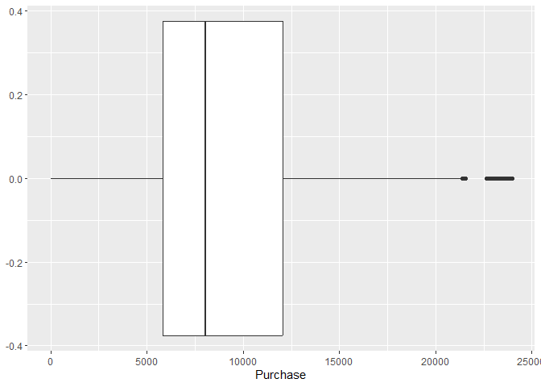<!-- -->

``` r
#Histogram of the target variable
ggplot(data = black_friday, aes(x = Purchase)) +
  geom_histogram(color = "black", fill = "white", 
                 alpha = 0.5,bins = 30) +
  labs(x = "Purchase", y = "Density", 
       title = "Distribution of Purchase Amounts")
```

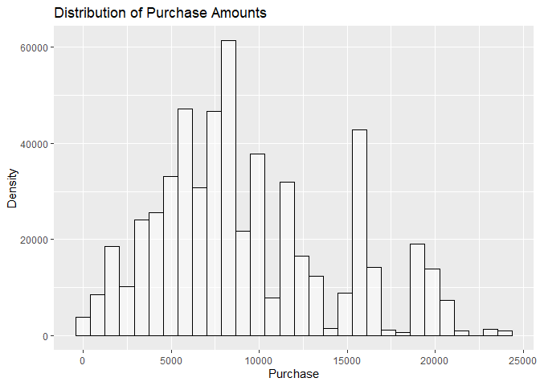<!-- -->

``` r
#Summary statistices of the Purchase
summary(black_friday$Purchase) 
```

    ##    Min. 1st Qu.  Median    Mean 3rd Qu.    Max. 
    ##      12    5823    8047    9264   12054   23961

The distribution of the purchase isn’t normal and skewed to the right
because there are many outliers in the right tail. I will detect the
outliers and analyze them to define which variables caused them and to
find the best solution to deal with them.

``` r
# Calculate quartiles for the "Purchase" column
q1 <- quantile(black_friday$Purchase, 0.25)
q3 <- quantile(black_friday$Purchase, 0.75)

#interquartile range (IQR)
iqr <- IQR(black_friday$Purchase)

# Define the range of acceptable values as 1.5 times the IQR
range_min <- q1 - (1.5 * iqr)
range_max <- q3 + (1.5 * iqr)

#The thresholds for the outliers in the two sides
print(range_min)
```

    ##     25% 
    ## -3523.5

``` r
print(range_max)
```

    ##     75% 
    ## 21400.5

We can observe that any transaction below -\$3,523.50 will be considered
an outlier. We know that the minimum value for placing an order should
be positive and greater than zero. However, this lower threshold is a
result of the distribution of purchases, which are significantly below
the mean purchase by approximately three standard deviations. The
maximum threshold is \$21400.50, any order cost above this value should
be an outlier.

``` r
# Identify the outliers
outliers <- black_friday$Purchase < range_min | black_friday$Purchase > range_max

# Select the outliers from the original data frame
outlier_data <- black_friday[outliers, ]

#Size of the outliers orders
dim(outlier_data)
```

    ## [1] 2677   12

We can see that outliers are a very small number of the data 0.4% of the
data. So we can remove them or exclude them from the parametric models
to don’t violate the model’s assumptions.

``` r
# Calculate summary statistics for the outliers
summary(outlier_data)
```

    ##     User_ID         Product_ID   Gender      Age        Occupation  
    ##  1001191:  10   P00052842: 493   F: 589   0-17 : 70   0      : 328  
    ##  1003635:  10   P00116142: 330   M:2088   18-25:326   4      : 268  
    ##  1000549:   8   P00085342: 316            26-35:926   7      : 258  
    ##  1001926:   8   P00117642: 197            36-45:604   1      : 252  
    ##  1004021:   8   P00086242: 174            46-50:259   20     : 207  
    ##  1000307:   7   P00119342: 151            51-55:310   17     : 188  
    ##  (Other):2626   (Other)  :1016            55+  :182   (Other):1176  
    ##  City_Category Stay_In_Current_City_Years Marital_Status Product_Category_1
    ##  A: 684        0 :362                     0:1489         10     :2275      
    ##  B:1059        1 :976                     1:1188         15     : 327      
    ##  C: 934        2 :454                                    9      :  75      
    ##                3 :481                                    1      :   0      
    ##                4+:404                                    11     :   0      
    ##                                                          12     :   0      
    ##                                                          (Other):   0      
    ##  Product_Category_2 Product_Category_3    Purchase    
    ##  13     :1082       16     :1905       Min.   :21401  
    ##  15     : 716       17     : 772       1st Qu.:23154  
    ##  16     : 506       10     :   0       Median :23418  
    ##  17     : 266       11     :   0       Mean   :23238  
    ##  14     : 107       12     :   0       3rd Qu.:23684  
    ##  10     :   0       13     :   0       Max.   :23961  
    ##  (Other):   0       (Other):   0

We can see that product category `10` caused these orders to be outliers
approximately 85% of the outliers are orders of products from category
10. So now we can remove all these points from the original data.

``` r
# Remove rows identified as outliers from the original data frame 
black_friday <- black_friday[!outliers, ]
```

``` r
# Create a box plot for Purchase without outliers
ggplot(data = black_friday, aes(x = Purchase)) +
  geom_boxplot()
```

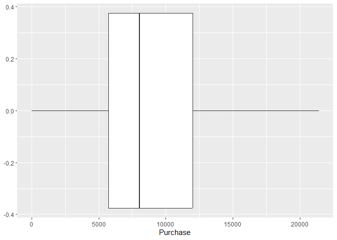<!-- -->

``` r
# Create a histogram for Purchase without outliers
ggplot(data = black_friday, aes(x = Purchase)) +
  geom_histogram(color = "black", fill = "white", 
                 alpha = 0.5,bins = 30) +
  labs(x = "Purchase", y = "Density", 
       title = "Distribution of Purchase Amounts")
```

<!-- -->

``` r
# Create a Q-Q plot of the Purchase
qqnorm(black_friday$Purchase)
qqline(black_friday$Purchase)
```

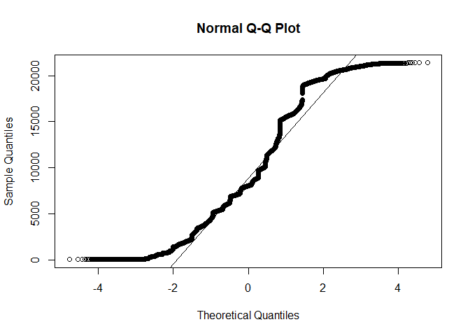<!-- -->

The distribution of the purchase now approximately normal.

# Distributions analysis

We want to understand more which variable is highly correlated with the
purchase. So, I will examine using distributions of the purchases
between each variable groups.

## Gender by Purchase

``` r
ggplot(data = black_friday, aes(x = Gender , y = Purchase)) +
  geom_boxplot()
```

<!-- -->

``` r
ggplot(data = black_friday, aes(x = Purchase, fill = Gender)) +
  geom_density(alpha = 0.5) +
  labs(x = "Purchase", y = "Density", fill = "Gender")
```

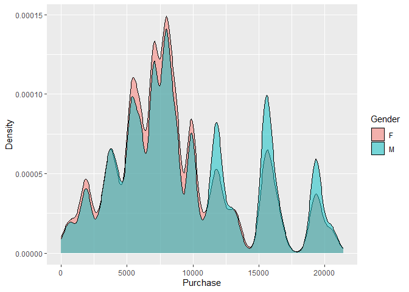<!-- -->

The purchase distribution of the male is very close to the purchase
distribution of the female except it has a higher tail, and there isn’t
any correlation between the Gender and the purchase. There are some
outliers in female purchases.

## Marital Status by Purchase

``` r
ggplot(data = black_friday, aes(x = Marital_Status , y = Purchase)) +
  geom_boxplot()
```

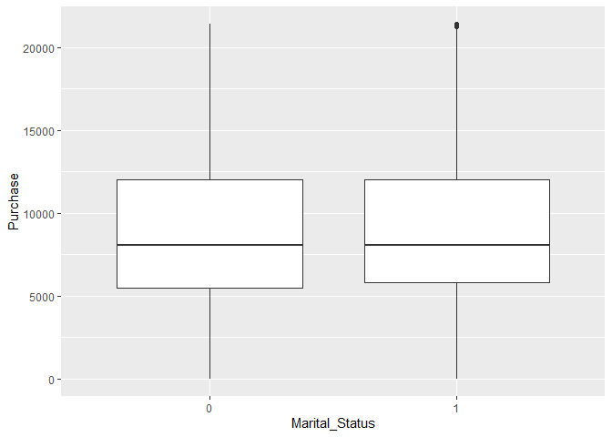<!-- -->

``` r
ggplot(data = black_friday, aes(x = Purchase, fill = Marital_Status)) +
  geom_density(alpha = 0.5) +
  labs(x = "Purchase", y = "Density", fill = "Marital_Status")
```

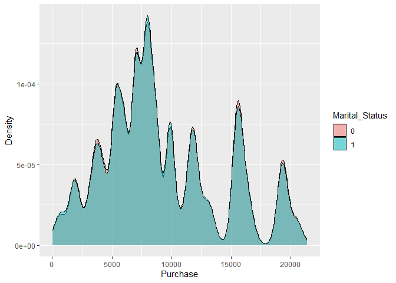<!-- -->

The purchase distribution of single customers is very close to the
purchase distribution of the married, and there isn’t a correlation
between marital status and the purchase. There are some outliers in the
single group.

## City Category by Purchase

``` r
ggplot(data = black_friday,aes(x = City_Category , y = Purchase)) +
  geom_boxplot()
```

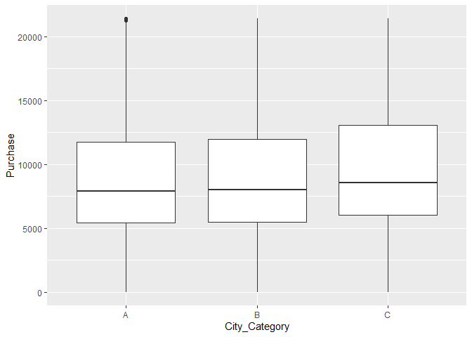<!-- -->

``` r
ggplot(data = black_friday, aes(x = Purchase, fill = City_Category)) +
  geom_density(alpha = 0.3) +
  labs(x = "Purchase", y = "Density", fill = "City_Category")
```

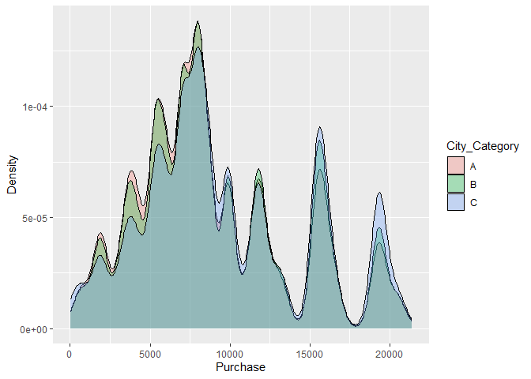<!-- -->

The purchase distribution for each city is very close to the others, and
there isn’t correlation between the city type and the purchase. There
are some outliers in city A.

## Occupation by Purchase

``` r
ggplot(data = black_friday, aes(x = Occupation , y = Purchase)) +
  geom_boxplot()
```

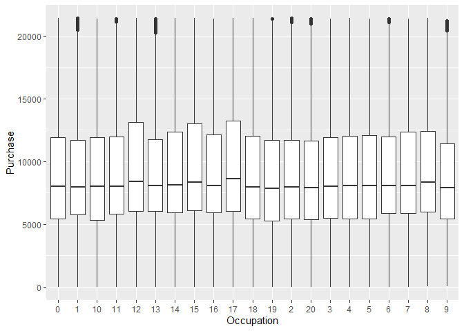<!-- -->

The occupations’ purchase distributions are very close to each other,
and there isn’t a correlation between the occupation and the purchase.
Some occupations have outliers.

## Product Category 1 by Purchase

``` r
ggplot(data = black_friday, aes(x = Product_Category_1 , y = Purchase)) +
  geom_boxplot()
```

<!-- -->

The product category 1 purchase distributions are very different from
each other, and there is a noticeable correlation between them and the
purchase. There are also some outliers in some categories.

## Product Category 2 by Purchase

``` r
ggplot(data = black_friday, aes(x = Product_Category_2 , y = Purchase)) +
  geom_boxplot()
```

<!-- -->

The product category 2 purchase distributions are different, and there
is noticeable correlation between them and the purchase. There are also
some outliers in some categories.

## Product Category 3 by Purchase

``` r
ggplot(data = black_friday, aes(x = Product_Category_3 , y = Purchase)) +
  geom_boxplot()
```

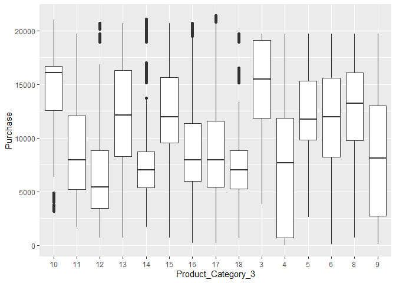<!-- -->

The product category 3 purchase distributions are different, and there
is noticeable correlation between them and the purchase. There are also
some outliers in some categories.

## Age by Purchase

``` r
ggplot(data = black_friday, aes(x = Age , y = Purchase)) +
  geom_boxplot()
```

<!-- -->

The Age groups distributions are very close to each other, and there
isn’t correlation between them and the purchase.

## Stay In Current City Years by Purchase

``` r
ggplot(data = black_friday, aes(x = Stay_In_Current_City_Years , y = Purchase)) +
  geom_boxplot()
```

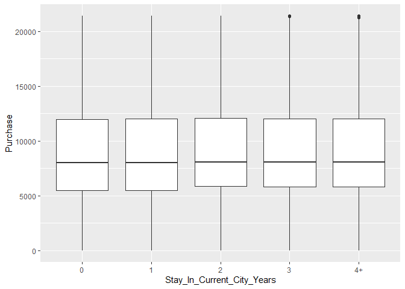<!-- -->

The stay_in_current_city_years distributions are very close to each
other, and there isn’t correlation between them and the purchase.

**From this analysis, we can say that most important predictors for
estimating the purchaser:**

1.  **product category 1**

2.  **product category 2**

3.  **product category 3**

# Correlation

We can test the correlation between them and the target variable using a
analysis of variance (ANOVA) test and a Tukey’s Honestly Significant
Difference (HSD) test to compare the mean purchase values across
different levels of each predictor.

``` r
# Perform ANOVA test
test <- aov(black_friday$Purchase ~ black_friday$Product_Category_1)

summary(test)
```

    ##                                     Df    Sum Sq   Mean Sq F value Pr(>F)    
    ## black_friday$Product_Category_1     19 8.389e+12 4.415e+11   48687 <2e-16 ***
    ## Residuals                       547371 4.964e+12 9.068e+06                   
    ## ---
    ## Signif. codes:  0 '***' 0.001 '**' 0.01 '*' 0.05 '.' 0.1 ' ' 1

``` r
# Perform Tukey's HSD test
tukey <- TukeyHSD(test)

# Identify pairwise comparisons that are not significantly different
not_diff <- which(tukey$`black_friday$Product_Category_1`[,4] > 0.05)

not_diff
```

    ##   9-1  7-10  9-15  3-17 20-19 
    ##    19    35   112   129   147

- The ANOVA test reveals that there is a significant difference in the
  mean purchase values across the different levels of
  `Product_Category_1`, as evidenced by the very small p-value (\<2e-16)
  and the large F-value (48687). This means that at least one of the
  levels of `Product_Category_1` has significantly different mean
  purchase values compared to the other levels.

- The Tukey’s HSD test is then performed to identify which pairs of
  groups have significantly different means. The `not_diff` object lists
  the pairwise comparisons where the adjusted p-value is greater than
  0.05, indicating that the difference between the means is not
  significant.

- The results suggest that the majority of pairwise comparisons have
  significant differences in mean purchase values, with only five pairs
  of groups having non-significant differences. These pairs are `9-1`,
  `7-10`, `9-15`, `3-17`, and `20-19`.

So we confident now that this variable is very important to estimate the
purchase.

``` r
# Perform ANOVA test
test <- aov(black_friday$Purchase ~ black_friday$Product_Category_2)

summary(test)
```

    ##                                     Df    Sum Sq   Mean Sq F value Pr(>F)    
    ## black_friday$Product_Category_2     16 2.344e+12 1.465e+11    7284 <2e-16 ***
    ## Residuals                       547374 1.101e+13 2.011e+07                   
    ## ---
    ## Signif. codes:  0 '***' 0.001 '**' 0.01 '*' 0.05 '.' 0.1 ' ' 1

``` r
# Perform Tukey's HSD test
tukey <- TukeyHSD(test)

# Identify pairwise comparisons that are not significantly different
not_diff <- which(tukey$`black_friday$Product_Category_2`[,4] > 0.05)

not_diff
```

    ## 14-11  7-11  7-14  5-15  4-16  8-18   6-3 
    ##    19    29    68    77    86   107   118

- The ANOVA test indicates that there is a significant difference in the
  mean purchase values across the different levels of
  `Product_Category_2`, as evidenced by the very small p-value (\<2e-16)
  and the large F-value (7300). This suggests that at least one of the
  levels of `Product_Category_2` has significantly different mean
  purchase values compared to the other levels.

- The Tukey’s HSD test is then performed to identify which pairs of
  groups have significantly different means. The results suggest that
  the majority of pairwise comparisons have significant differences in
  mean purchase values, with only eight pairs of groups having
  non-significant differences. These pairs are `15-10`, `5-11`, `4-12`,
  `18-16`, `8-16`, `9-17`, `8-18`, and `6-3`.

So we confident now that this variable is also important to estimate the
purchase.

``` r
# Perform ANOVA test
test <- aov(black_friday$Purchase ~ black_friday$Product_Category_3)

summary(test)
```

    ##                                     Df    Sum Sq   Mean Sq F value Pr(>F)    
    ## black_friday$Product_Category_3     14 2.158e+12 1.541e+11    7536 <2e-16 ***
    ## Residuals                       547376 1.119e+13 2.045e+07                   
    ## ---
    ## Signif. codes:  0 '***' 0.001 '**' 0.01 '*' 0.05 '.' 0.1 ' ' 1

``` r
# Perform Tukey's HSD test
tukey <- TukeyHSD(test)

# Identify pairwise comparisons that are not significantly different
not_diff <- which(tukey$`black_friday$Product_Category_3`[,4] > 0.05)

not_diff
```

    ## 16-11 17-11 15-13  6-13  6-15   6-5 
    ##    19    20    41    48    67   100

- The ANOVA test indicates that there is a significant difference in the
  mean purchase values across the different levels of
  `Product_Category_3`, as evidenced by the very small p-value (\<2e-16)
  and the large F-value (6352). This suggests that at least one of the
  levels of `Product_Category_3` has significantly different mean
  purchase values compared to the other levels.

- The Tukey’s HSD test is then performed to identify which pairs of
  groups have significantly different means. The results suggest that
  the majority of pairwise comparisons have significant differences in
  mean purchase values, with only four pairs of groups having
  non-significant differences. These pairs are `17-11`, `18-11`, `5-15`,
  and `8-6`. The results of the Tukey’s HSD test can be used to identify
  which levels of `Product_Category_3` have similar mean purchase values
  and which ones are significantly different from each other.

So we confident now that this variable is important to estimate the
purchase. Although we cannot test the significance of each individual
product ID as there are thousands of products, we can be confident that
most of them are different, especially if they belong to different
categories

# Regression Models

## Split the data

First we need to split the data for train the model and for test it.

``` r
library(tidymodels)
set.seed(1234)

data_sampling <- initial_split(black_friday,
                               prop = 0.9)
Train <- training(data_sampling)
Test <- testing(data_sampling)
```

``` r
Train <- Train %>%
  select(Purchase , Product_Category_1,Product_Category_2,Product_Category_3,Product_ID)

Test <- Test %>%
  select(Purchase , Product_Category_1,Product_Category_2,Product_Category_3,Product_ID)

head(Train)
```

    ##   Purchase Product_Category_1 Product_Category_2 Product_Category_3 Product_ID
    ## 1     5157                  5                  8                 14  P00303842
    ## 2     3108                 11                 15                 16  P00255042
    ## 3    16402                  7                 12                 14  P00347742
    ## 4    21309                 15                 17                 17  P00071442
    ## 5    20574                  6                  8                 16  P00256042
    ## 6     1784                  5                 12                 14  P00195642

## Normalization

``` r
# Normalize the Purchase variable in the train data
# by dividing each value of Purchase by the maximum value of Purchase

# This will rescale the Purchase variable to have values between 0 and 1
Purchase_max <- max(Train$Purchase)

Train$Purchase <- (Train$Purchase) / Purchase_max
Test$Purchase <- (Test$Purchase) / Purchase_max
```

I scaled the purchase in the train and the test data using a max scaler
to be between \[0,1\] to get lower scale of the error.

## Linear regression

I will select only Product_Category_1 to predict the Purchase using
linear regression because the other features are redundant relative to
Product_Category_1.

``` r
lm <- linear_reg() %>% 
  set_engine('lm')

fitting <- lm %>%  fit(Purchase ~ Product_Category_1, data = Train)

fitting
```

    ## parsnip model object
    ## 
    ## 
    ## Call:
    ## stats::lm(formula = Purchase ~ Product_Category_1, data = data)
    ## 
    ## Coefficients:
    ##          (Intercept)  Product_Category_110  Product_Category_111  
    ##             0.635510              0.142931             -0.416394  
    ## Product_Category_112  Product_Category_113  Product_Category_114  
    ##            -0.572451             -0.601712             -0.020000  
    ## Product_Category_115  Product_Category_116  Product_Category_117  
    ##             0.036548              0.055217             -0.159619  
    ## Product_Category_118  Product_Category_119   Product_Category_12  
    ##            -0.496786             -0.633778             -0.109529  
    ## Product_Category_120   Product_Category_13   Product_Category_14  
    ##            -0.618271             -0.163780             -0.526490  
    ##  Product_Category_15   Product_Category_16   Product_Category_17  
    ##            -0.343825              0.105033              0.126657  
    ##  Product_Category_18   Product_Category_19  
    ##            -0.285238              0.008984

We can see that the `Product_Category_10` coefficient has the highest
importance score at level one, followed by `Product_Category_17`. This
finding is consistent with our analysis of outliers, which showed that
`Category 10` is the main contributor to outliers. Additionally, our
imputation analysis revealed that `Category 17` is highly correlated
with other categories, making it an important predictor variable.

``` r
test_results <- fitting %>% 
  predict(new_data = Test) %>% 
  mutate(truth = Test$Purchase)

train_results <- fitting %>%
  predict(new_data = Train) %>%
  mutate(truth = Train$Purchase)

rmse(train_results, truth = truth,
     estimate = .pred)
```

    ## # A tibble: 1 × 3
    ##   .metric .estimator .estimate
    ##   <chr>   <chr>          <dbl>
    ## 1 rmse    standard       0.141

``` r
rmse(test_results, truth = truth,
     estimate = .pred)
```

    ## # A tibble: 1 × 3
    ##   .metric .estimator .estimate
    ##   <chr>   <chr>          <dbl>
    ## 1 rmse    standard       0.140

``` r
rsq(train_results, truth = truth,
    estimate = .pred)
```

    ## # A tibble: 1 × 3
    ##   .metric .estimator .estimate
    ##   <chr>   <chr>          <dbl>
    ## 1 rsq     standard       0.628

``` r
rsq(test_results, truth = truth,
    estimate = .pred)
```

    ## # A tibble: 1 × 3
    ##   .metric .estimator .estimate
    ##   <chr>   <chr>          <dbl>
    ## 1 rsq     standard       0.632

**The model performs 63.1% on the test and 62.7% on the train data. This
suggests that a baseline model doesn’t over-fit the train data but there
is a problem in sampling the test data so i will estimate the model
accuracy on 10 fold-CV.**

``` r
library(rsample)
library(yardstick)

# Create 10-fold cross-validation folds
folds <- vfold_cv(Train, v = 10)

# Define the model
lm <- linear_reg() %>% 
  set_engine('lm')

# Define the metrics to be computed
metrics <- metric_set(rmse, rsq)

# Fit the model and calculate performance metrics for each fold
fit_resamples_obj <- fit_resamples(
  lm,
  Purchase ~ Product_Category_1,
  resamples = folds,
  metrics = metrics
)

collect_metrics(fit_resamples_obj)
```

    ## # A tibble: 2 × 6
    ##   .metric .estimator  mean     n  std_err .config        
    ##   <chr>   <chr>      <dbl> <int>    <dbl> <chr>          
    ## 1 rmse    standard   0.141    10 0.000171 pre0_mod0_post0
    ## 2 rsq     standard   0.628    10 0.00105  pre0_mod0_post0

- The model achieved an average RMSE of 0.1408, with a standard error of
  0.00017, across the 10 folds of the cross-validation.

- The model achieved an average R-squared value of 0.6278, with a
  standard error of 0.0011, across the 10 folds of the cross-validation.
  This indicates that the model explains about 62.78% of the variance in
  the target variable.

- It’s worth noting that the standard errors for both metrics are quite
  small, which suggests that the estimates are relatively precise and
  stable across the folds of the cross-validation.

## Decision Tree

The goals of using the decision tree with our data:

- We can use the data with the outliers in the categories without
  removing them.

- We can use all the important features and let the decision tree
  perform features selection using the Entropy.

- No assumptions on the data and the model

- We rely in our situation on categorical variables to predict the
  response which will not perform very well using the least square
  model.

``` r
tree <- decision_tree(mode = "regression")
tree_fitting <- tree %>%  fit(Purchase ~  ., data = Train)
```

``` r
test_results <- tree_fitting %>% 
  predict(new_data = Test) %>% 
  mutate(truth = Test$Purchase)

train_results <- tree_fitting %>%
  predict(new_data = Train) %>%
  mutate(truth = Train$Purchase)

rmse(train_results, truth = truth,
     estimate = .pred)
```

    ## # A tibble: 1 × 3
    ##   .metric .estimator .estimate
    ##   <chr>   <chr>          <dbl>
    ## 1 rmse    standard       0.131

``` r
rmse(test_results, truth = truth,
     estimate = .pred)
```

    ## # A tibble: 1 × 3
    ##   .metric .estimator .estimate
    ##   <chr>   <chr>          <dbl>
    ## 1 rmse    standard       0.132

``` r
rsq(train_results, truth = truth,
    estimate = .pred)
```

    ## # A tibble: 1 × 3
    ##   .metric .estimator .estimate
    ##   <chr>   <chr>          <dbl>
    ## 1 rsq     standard       0.675

``` r
rsq(test_results, truth = truth,
    estimate = .pred)
```

    ## # A tibble: 1 × 3
    ##   .metric .estimator .estimate
    ##   <chr>   <chr>          <dbl>
    ## 1 rsq     standard       0.673

The model performs very well than the least square model. It have
`67.5%` R-square value on the train and `67.28%` on the test data.

``` r
# Fit the model and calculate performance metrics for each fold
fit_resamples_obj <- fit_resamples(
  tree,
  Purchase ~ . ,
  resamples = folds,
  metrics = metrics
)

collect_metrics(fit_resamples_obj)
```

    ## # A tibble: 2 × 6
    ##   .metric .estimator  mean     n  std_err .config        
    ##   <chr>   <chr>      <dbl> <int>    <dbl> <chr>          
    ## 1 rmse    standard   0.132    10 0.000206 pre0_mod0_post0
    ## 2 rsq     standard   0.671    10 0.00118  pre0_mod0_post0

- The decision tree model achieved an average RMSE of 0.1323, with a
  standard error of 0.0002, across the 10 folds of the cross-validation.

- The decision tree model achieved an average R-squared value of 0.6707,
  with a standard error of 0.0012, across the 10 folds of the
  cross-validation. This indicates that the decision tree model explains
  about 67.07% of the variance in the target variable, which may or may
  not be considered good depending on the context of the problem.

- The standard errors for both metrics are quite small, which suggests
  that the estimates are relatively precise and stable across the folds
  of the cross-validation.

## Random Forest

We can improve our last model by using random forest with a lot of
different trees. This will introduce a variation in the tress which
provides a good estimate of the relationship between the predictors and
the response.

``` r
# Define the random forest regression model
rf_model <- rand_forest(
  mode = "regression",
  mtry = 4,
  trees = 100
) %>% 
set_engine("ranger", importance = "permutation") 

# Fit the model on the full training set
final_rf_model <- rf_model %>%  fit(Purchase ~  ., data = Train)

test_results <- final_rf_model %>% 
  predict(new_data = Test) %>% 
  mutate(truth = Test$Purchase)

train_results <- final_rf_model %>%
  predict(new_data = Train) %>%
  mutate(truth = Train$Purchase)

rmse(train_results, truth = truth,
     estimate = .pred)
```

    ## # A tibble: 1 × 3
    ##   .metric .estimator .estimate
    ##   <chr>   <chr>          <dbl>
    ## 1 rmse    standard       0.116

``` r
rmse(test_results, truth = truth,
     estimate = .pred)
```

    ## # A tibble: 1 × 3
    ##   .metric .estimator .estimate
    ##   <chr>   <chr>          <dbl>
    ## 1 rmse    standard       0.117

``` r
rsq(train_results, truth = truth,
    estimate = .pred)
```

    ## # A tibble: 1 × 3
    ##   .metric .estimator .estimate
    ##   <chr>   <chr>          <dbl>
    ## 1 rsq     standard       0.749

``` r
rsq(test_results, truth = truth,
    estimate = .pred)
```

    ## # A tibble: 1 × 3
    ##   .metric .estimator .estimate
    ##   <chr>   <chr>          <dbl>
    ## 1 rsq     standard       0.746

The RMSE of `0.115` for the `train` set and `0.116` for the `test` set
suggest that the model’s predictions are, on average, about 0`.115` to
`0.116` units away from the true values. The R-squared of `0.748` for
the `train` set and `0.745` for the `test` set indicate that the model
explains about `74.8% to 74.5%` of the variance in the target variable,
respectively.

``` r
# load the vip package
library(vip)

# get the feature importances
importances <- vip(final_rf_model)

# print the feature importances
print(importances)
```

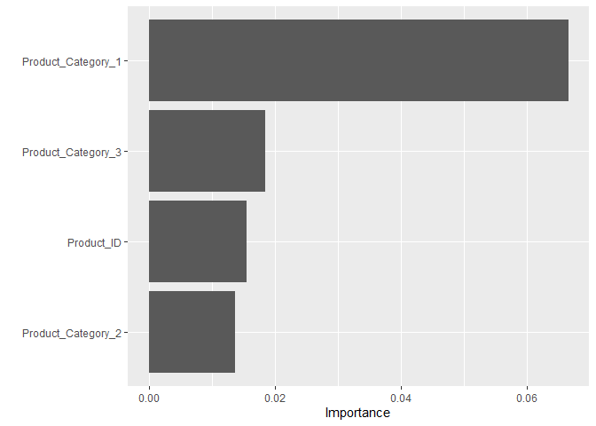<!-- -->

We can see that the `main category` of the brand is the most important
factor to define it’s price then the `brand` itself.

# Save the models

``` r
# Save model objects to files
saveRDS(final_rf_model, "C:/Users/MSI/OneDrive/Desktop/Black Friday/models/rf_model.rds")
saveRDS(tree_fitting, "C:/Users/MSI/OneDrive/Desktop/Black Friday/models/tree_model.rds")
saveRDS(fitting, "C:/Users/MSI/OneDrive/Desktop/Black Friday/models/lr_model.rds")
```
