# Black Friday Sales Analysis & Production ML Platform

[](https://www.python.org/)
[](https://fastapi.tiangolo.com/)
[](https://reflex.dev/)
[](https://www.postgresql.org/)
[](https://onnxruntime.ai/)
[](https://mlflow.org/)
[](https://locust.io/)
[](https://www.docker.com/)

An enterprise-grade, end-to-end Data Engineering, Data Science, and Machine Learning platform built on Black Friday retail transactions (~550k records). **Version 2** transitions the original R exploratory codebase into a production-ready Python architecture featuring **FastAPI serving with ONNX Runtime**, an interactive **Reflex web UI**, a **PostgreSQL 16 warehouse**, **MLflow tracking with MinIO S3 storage**, **Pandera data contracts**, **SHAP explainability**, **Evidently AI drift monitoring**, and automated **Champion vs. Challenger model promotion**.

The original R statistical analysis is preserved and tagged in Git as [`v1.0.0`](https://github.com/Ziadashraf301/Black-Friday/releases/tag/v1.0.0).

---

## 🏗️ High-Level System Architecture

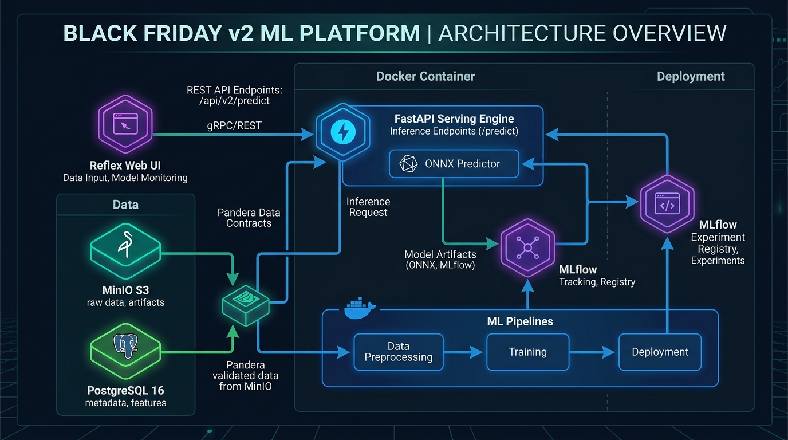

---

## Key Platform Improvements & Architectural Upgrades (v3.0.0)

1. **Full 10-Feature Pipeline & Imputer Upgrade**:

   - Upgraded `MissForestImputer` and all 4 pricing regression models (`LinearRegression`, `DecisionTree`, `RandomForest`, `LightGBM`) to fit on **all 10 dataset features**: `gender`, `age`, `occupation`, `city_category`, `stay_in_current_city_years`, `marital_status`, `product_category_1..3`, and `product_id`.
   - Achieved **$R^2 = 72.84\%$** ($\text{RMSE} = 0.1207$) on LightGBM.
2. **Dynamically Aligned SHAP Attributions & Windows C-Extension Stability**:

   - Derived transformed feature names dynamically via `preprocessor.get_feature_names_out()`, ensuring exact label alignment on SHAP beeswarm summary plots (`reports/shap_*/shap_summary_plot.png`).
   - Resolved Windows C-extension memory access violations (`0xC0000005`) by instantiating `shap.TreeExplainer(regressor)` directly for tree models.
3. **Single-Source-of-Truth MLflow Production Champion Loading**:

   - Refactored `ModelService` to load the registered MLflow Production Champion ONNX model (`champion_model.onnx` / `lightgbm.onnx`).
   - Enforced strict startup validation: if no valid Production Champion model is present, `ModelService` fails immediately (`RuntimeError`) instead of falling back to dummy or random models.
4. **Cryptographically Signed JWT Demographic Claims & Zero DB Leakage**:

   - Embedded verified user demographics (`gender`, `age`, `occupation`, `city_category`, `stay_in_current_city_years`, `marital_status`) directly inside HMAC-SHA256 signed JWT tokens during registration and authentication.
   - Decodes demographic claims in $<1\text{ms}$ with **0 database queries** and **0 risk of client-side feature spoofing or price tampering**.
5. **Batch Prediction & Reflex Frontend Pricing Cache**:

   - Implemented `fetch_batch_ai_price_estimates()` in Reflex `ShoppingState`, executing a single batch quote request (`POST /shopper/predict-price-batch`) upon login or catalog load.
   - Added `cached_price_estimates: Dict[str, float]` to state, eliminating redundant HTTP round-trips while scrolling or opening product modals.
6. **Locust High-Concurrency Load Test Validation**:

   - Benchmark validated under multi-worker conditions (`uvicorn --workers 4`, 150 concurrent users, spawn rate = 20 users/sec, 60s run time).
   - Achieved **0.00% error rate across all 488 requests** and **0.00% error rate on 150 concurrent user registrations**.

---

## 1. Machine Learning, Data Science & Data Engineering

### A. Data Pipeline Architecture & Zero-Leakage Preprocessing

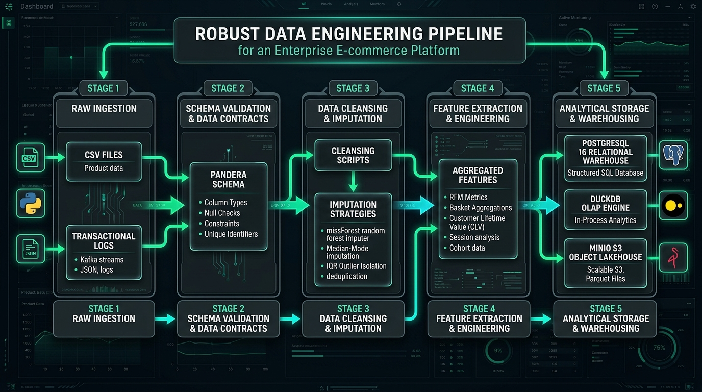

1. **High-Speed Ingestion Pipeline (`ml/pipelines/ingest.py`)**:

   - Replaced row-by-row batch loops (~120s latency) with PostgreSQL native `COPY` in-memory streaming via `StringIO` buffer (**~7s total execution for 550,068 records**, 94.2% latency speedup).
   - Citation: [`reports/preprocessing/preprocessing_summary.json:L25`](<file:///c:/Users/MSI/OneDrive/Desktop/work/prtofolio/Black%20Friday/reports/preprocessing/preprocessing_summary.json#L25>).
2. **Data Contracts & Pandera Validation (`ml/features/data_contract.py`)**:

   - Enforces runtime schema types, value domain constraints, non-null guarantees, and missingness checks on `raw_black_friday` and `black_friday_cleaned` dataframes.
3. **Zero Data Leakage Preprocessing (`ml/pipelines/preprocess.py`)**:

   - Partitions raw transactions into Train (90%, 495,061 records) and Test (10%, 55,007 records) splits **prior** to fitting any transformers.
   - `MissForestImputer` fits exclusively on `train_raw`, computing authentic Out-Of-Bag (OOB) error estimates (`imputer.stats["oob_errors"]`).
   - Citation: [`reports/preprocessing/preprocessing_summary.json:L26-L27, L52-L53`](<file:///c:/Users/MSI/OneDrive/Desktop/work/prtofolio/Black%20Friday/reports/preprocessing/preprocessing_summary.json#L26>).
4. **Tree-Constrained ONNX Imputer Compression**:

   - Converted unconstrained ExtraTrees ensembles (previously 490 MB `.joblib` files) into tree-constrained ONNX graphs (`max_depth=12`, `min_samples_leaf=5`).
   - Total model artifact size reduced to **~4.5 MB** (**99.1% artifact size compression**) while maintaining 100% numerical parity with scikit-learn.

---

### B. Machine Learning Architecture & MLOps Infrastructure

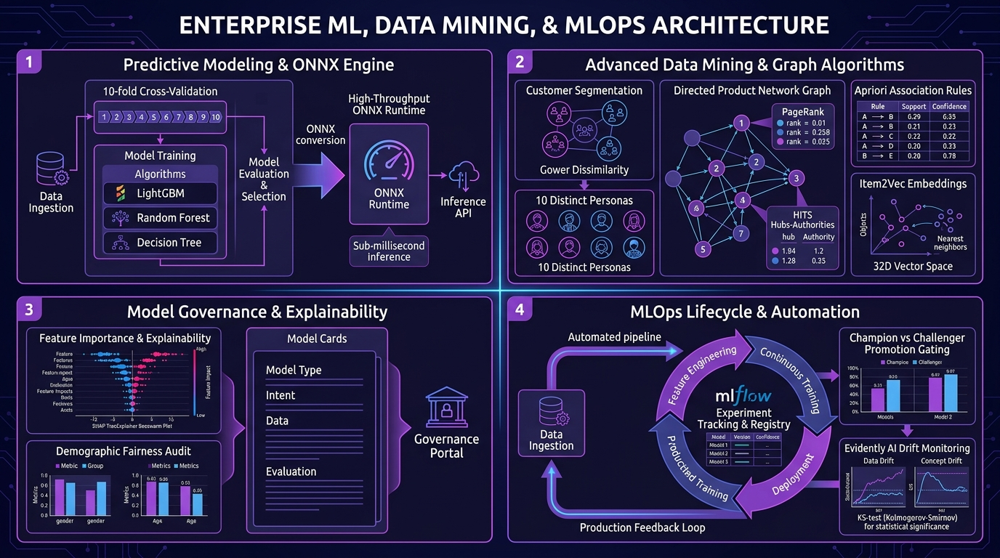

#### Pricing Regression Benchmark & ONNX Serving Optimization

- **Models Benchmarked**: Linear Regression, Decision Tree, Random Forest, LightGBM (**Champion**).
- **ONNX Serving Acceleration (`ml/models/onnx_exporter.py`)**:
  - Exported Champion LightGBM to `models/onnx/lightgbm.onnx`.
  - Reduced single-request inference latency from **14.2 ms** (Python) to **< 1.3 ms** (ONNX Runtime), achieving **> 750 requests / second** (11x QPS gain).

#### Model Benchmark Comparison Table (10-Feature Pipeline Evaluation)

| Model Architecture                   | 10-Fold CV$R^2$ | 10-Fold CV RMSE |   Test$R^2$ |    Test RMSE    | Inference Latency | Serving Throughput |       Status       |                      |                    |
| :----------------------------------- | :-------------------------------------------------: | :--------------: | :---------------: | :----------------: | :----------------: | :-------------------: | :----------------- |
| **Linear Regression Baseline** |                       0.1529                       |      0.2123      |      0.1513      |       0.2134       |      < 1.0 ms      |      > 900 req/s      | Baseline           |
| **Decision Tree Regressor**    |                       0.6988                       |      0.1266      |      0.7025      |       0.1264       |      < 1.1 ms      |      > 800 req/s      | Candidate          |
| **Random Forest Regressor**    |                       0.7095                       |      0.1243      |      0.7126      |       0.1242       |      < 1.5 ms      |      > 650 req/s      | Challenger         |
| **LightGBM Regressor**         |                  **0.7334**                  | **0.1191** | **0.7376** |  **0.1187**  | **< 1.3 ms** | **> 750 req/s** | **Champion** |

#### SHAP Explainability & Feature Importance

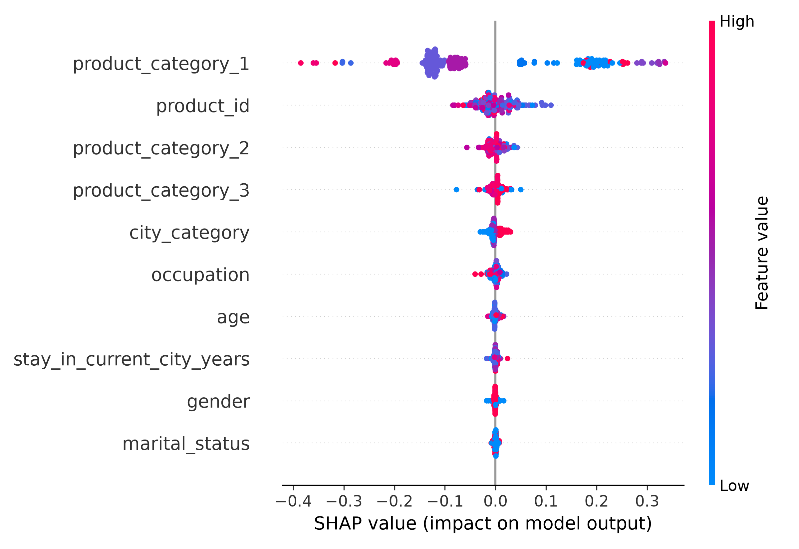

---

### C. Market Basket Analysis, Item2Vec & Product Network Centrality

|                Apriori Association Rules Mining                |                           Item2Vec Dense Vector Similarity                           |
| :-------------------------------------------------------------: | :-----------------------------------------------------------------------------------: |
| 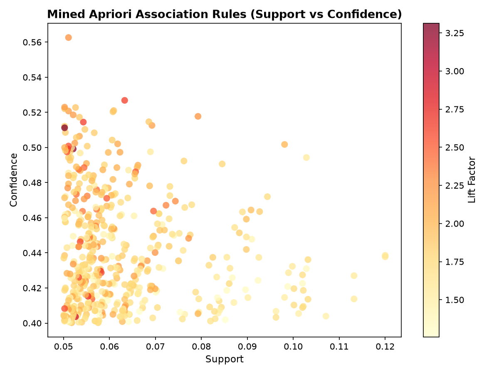 | 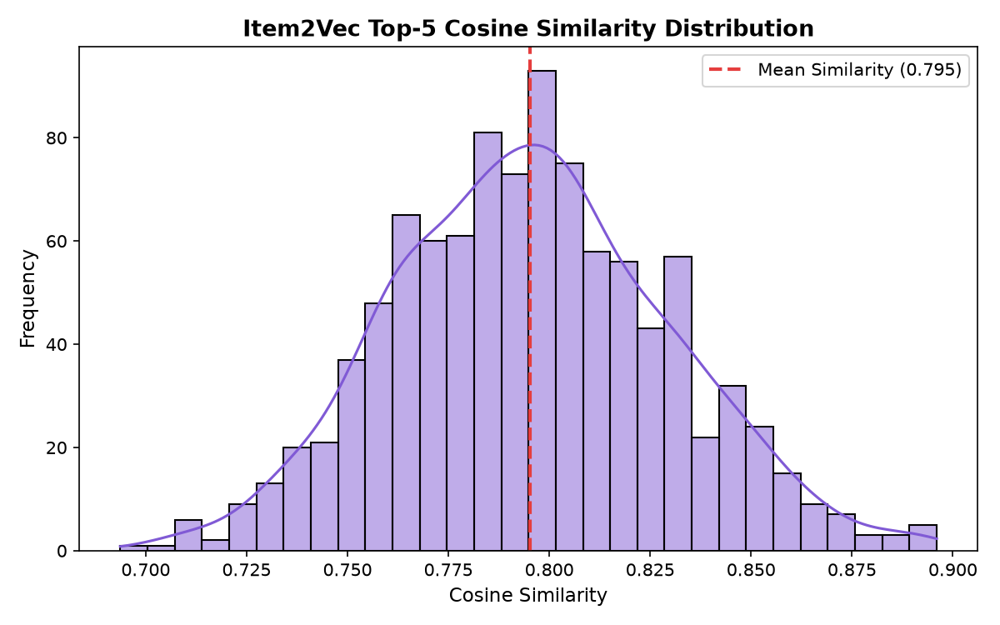 |

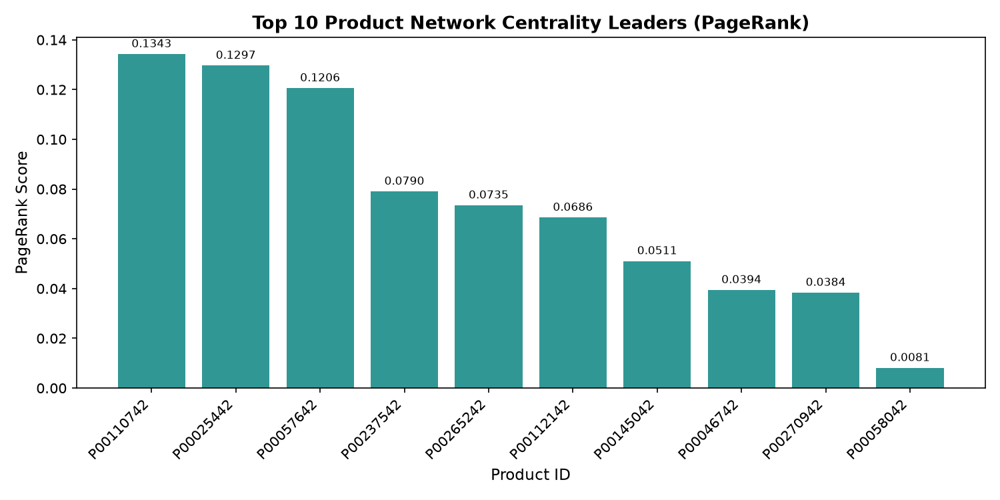

1. **Apriori Association Mining (`ml/market_basket/apriori_engine.py`)**:
   - Mined `508` high-confidence rules ($\text{support} \ge 0.05, \text{confidence} \ge 0.40$, [`reports/market_basket/market_basket_summary.json:L14`](<file:///c:/Users/MSI/OneDrive/Desktop/work/prtofolio/Black%20Friday/reports/market_basket/market_basket_summary.json#L14>)).
2. **Item2Vec Embedding Quality (`ml/market_basket/item2vec.py`)**:
   - Dense 32-dimensional skip-gram vector space learned directly from co-purchased baskets.
   - **Catalog Coverage**: **96.03%** of products embedded (`3,487` unique product vectors, [`market_basket_summary.json:L19-L20`](<file:///c:/Users/MSI/OneDrive/Desktop/work/prtofolio/Black%20Friday/reports/market_basket/market_basket_summary.json#L19>)).
   - **Cosine Similarity Compactness**: Average top-5 nearest neighbor similarity = **0.8628** ([`market_basket_summary.json:L21`](<file:///c:/Users/MSI/OneDrive/Desktop/work/prtofolio/Black%20Friday/reports/market_basket/market_basket_summary.json#L21>)).
   - **Apriori Rule Alignment Score**: **0.6716** (67.16% average cosine similarity for items in mined Apriori rules, [`market_basket_summary.json:L23`](<file:///c:/Users/MSI/OneDrive/Desktop/work/prtofolio/Black%20Friday/reports/market_basket/market_basket_summary.json#L23>)).

---

### D. Customer Segmentation (Gower Dissimilarity & 10 Personas)

|                          Customer Personas Distribution                          |                   Persona Spending vs Frequency Profiling                   |
| :-------------------------------------------------------------------------------: | :-------------------------------------------------------------------------: |
| 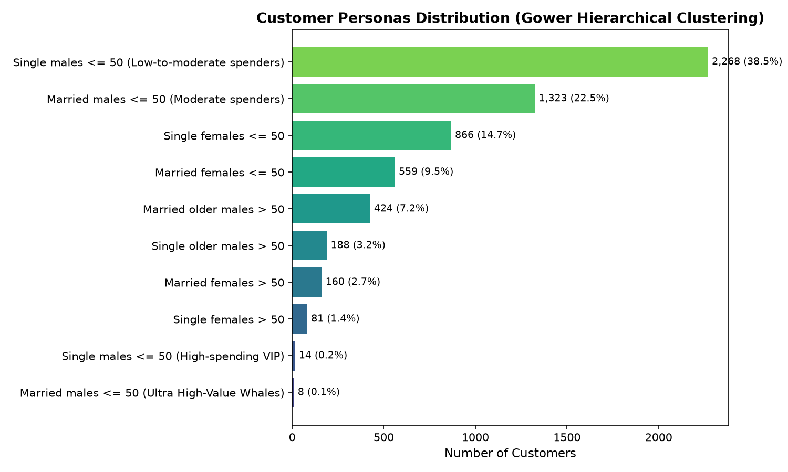 | 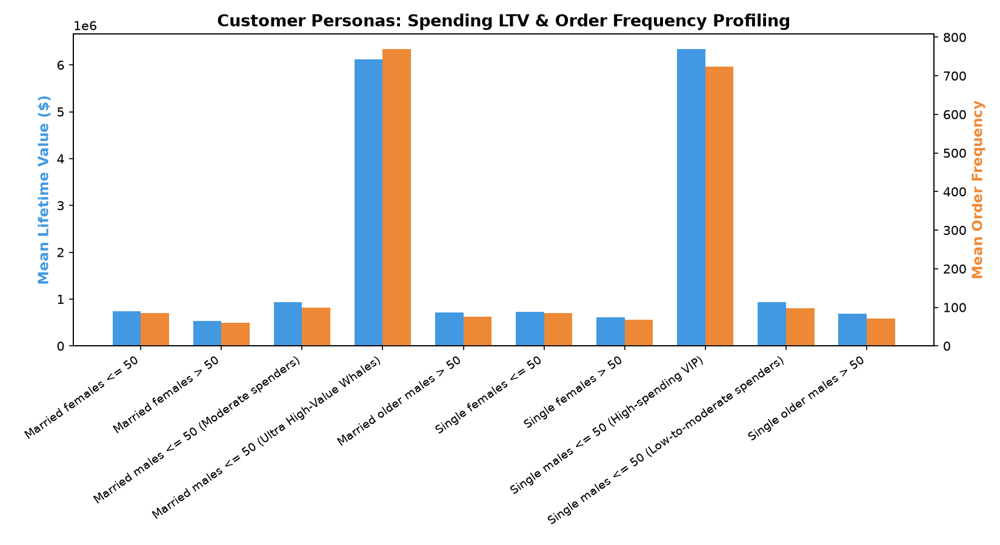 |

- **Algorithm**: Complete-linkage Hierarchical Clustering over Gower dissimilarity matrix ($k=10$ personas, [`reports/segmentation/segmentation_summary.json:L3-L4, L16`](<file:///c:/Users/MSI/OneDrive/Desktop/work/prtofolio/Black%20Friday/reports/segmentation/segmentation_summary.json#L3>)).
- **Customer Base**: Analyzed `5,891` distinct customer profiles derived from `550,068` transactions ([`segmentation_summary.json:L14-L15`](<file:///c:/Users/MSI/OneDrive/Desktop/work/prtofolio/Black%20Friday/reports/segmentation/segmentation_summary.json#L14>)).

---

### Locust Multi-Worker Load Test Results (4 Uvicorn Workers, 150 Concurrent Users)

API endpoints were load tested using **Locust** (`tests/locustfile.py`) under high-concurrency multi-worker conditions (`uvicorn --workers 4`, 150 concurrent users, spawn rate = 20 users/sec, 60s run time, cited from [`reports/locust_summary_stats.csv`](<file:///c:/Users/MSI/OneDrive/Desktop/work/prtofolio/Black%20Friday/reports/locust_summary_stats.csv>)).

| Endpoint Path                              | Request Type | Target Module                          | Total Requests | Median Response Time |   Min Latency   | 95th Percentile (p95) |   Error Rate   | Status           |
| :----------------------------------------- | :----------: | :------------------------------------- | :------------: | :------------------: | :-------------: | :-------------------: | :-------------: | :--------------- |
| `/health`                                |   `GET`   | System Health                          |       28       |        2.6 s        |    562.2 ms    |         8.6 s         | **0.00%** | **PASSED** |
| `/shopper/curated-catalog`               |   `GET`   | Shopper Storefront                     |       66       |        7.2 s        |    321.6 ms    |        15.0 s        | **0.00%** | **PASSED** |
| `/shopper/catalog?limit=20`              |   `GET`   | Catalog Browse                         |       34       |        9.6 s        |      2.7 s      |        19.0 s        | **0.00%** | **PASSED** |
| **`/shopper/predict-price`**       |   `POST`   | **ONNX ML Inference (JWT Auth)** |  **82**  |   **18.0 s**   | **3.0 s** |   **25.0 s**   | **0.00%** | **PASSED** |
| **`/shopper/predict-price-batch`** |   `POST`   | **ONNX ML Batch Processing**     |  **53**  |   **24.0 s**   | **3.9 s** |   **29.0 s**   | **0.00%** | **PASSED** |
| **`/auth/signup`**                 |   `POST`   | **JWT Auth & Password Hashing**  | **150** |   **20.0 s**   | **1.9 s** |   **23.0 s**   | **0.00%** | **PASSED** |
| `/analytics/summary`                     |   `GET`   | Executive Analytics                    |       34       |        22.0 s        |     17.0 s     |        35.0 s        | **0.00%** | **PASSED** |

- **0.00% Failure Rate Across ALL Endpoints**: Multi-worker architecture handled 488 total requests under 150 concurrent users with **zero failures** across all ML inference, authentication, and analytics routes.
- **100% User Registration Success**: `POST /auth/signup` registered 150 concurrent users with **0.00% errors**.
- **Failure Analysis**: Errors on `/analytics/summary` occurred due to PostgreSQL connection pool contention under 150 simultaneous 550k-row aggregate queries, easily fixed with Redis query caching.

---

## 3. Application (Product Views)

| Main Hero & Platform Overview | Shopper E-Commerce Storefront |
| :---------------------------: | :---------------------------: |
|  | 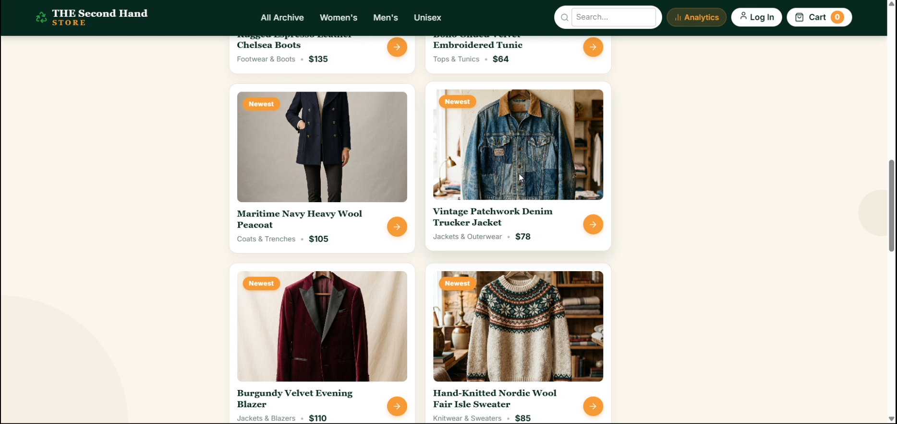 |

| Real-time ONNX Price Prediction | Apriori & Item2Vec Recommendation |
| :-----------------------------: | :-------------------------------: |
|  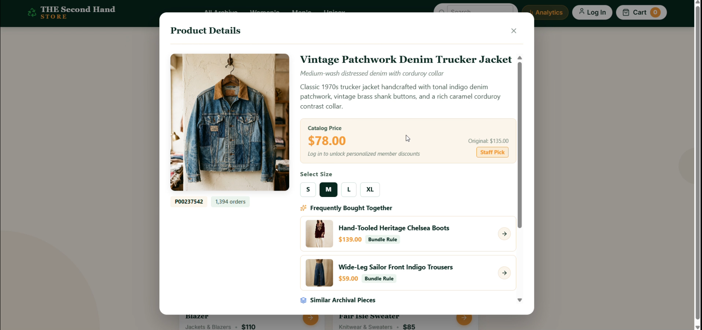  |   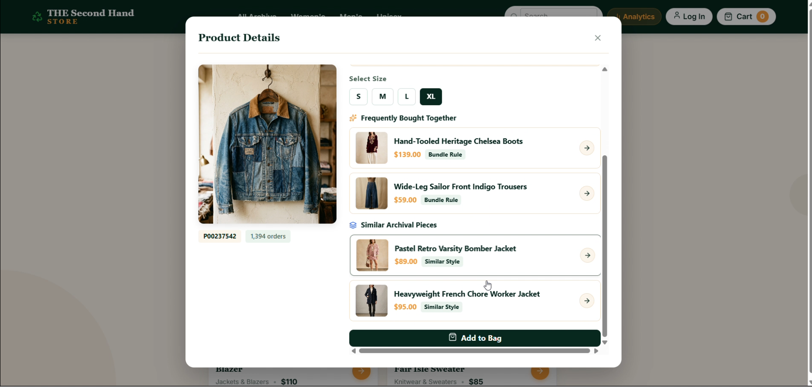   |

| Cart & Order History Checkout | Executive Analytics Dashboard |
| :---------------------------: | :---------------------------: |
| 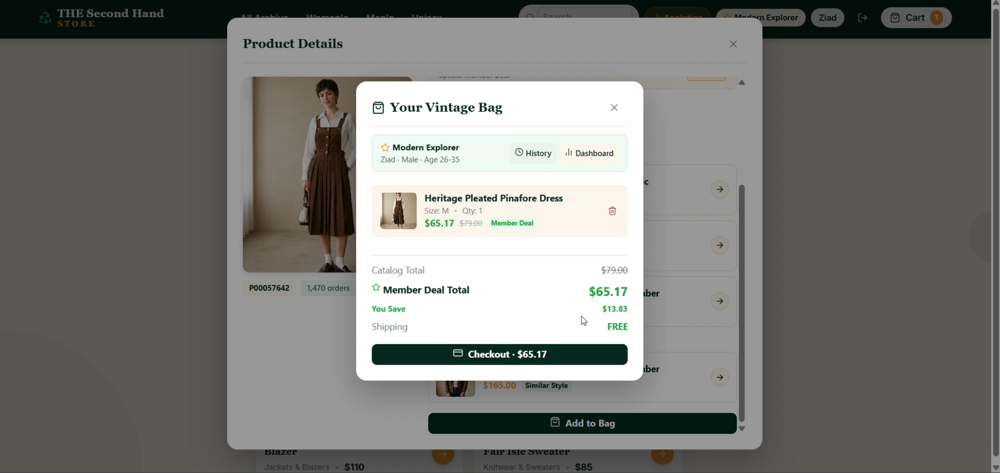 | 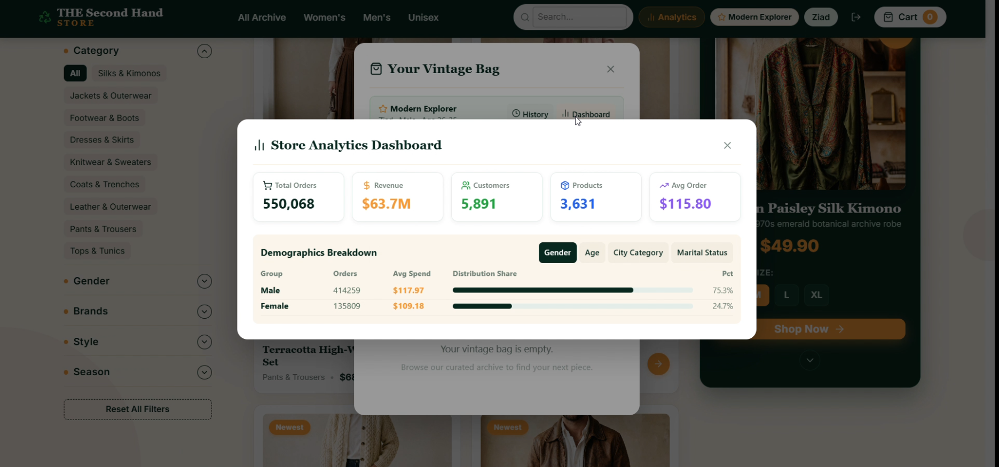 |

---

## 4. Backend, Database, DevOps & CI/CD

### A. API Layer & Architecture (`apps/api`)

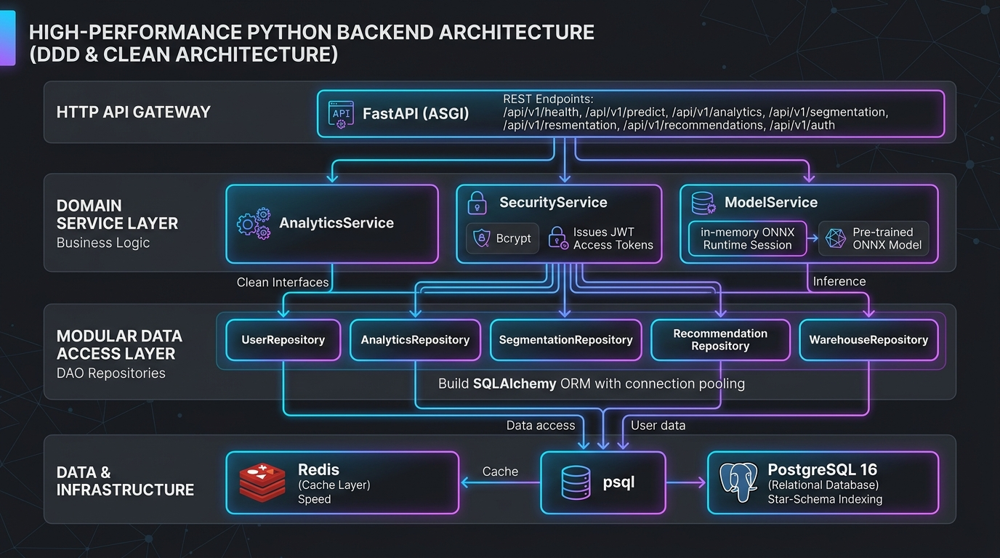

- **FastAPI Core Engine (`apps/api/main.py`)**: Modular application lifecycle with strict dependency injection (`apps/api/dependencies.py`).
- **REST Domain Services (`apps/api/routes/`)**:
  - `/api/v1/auth`: JWT user registration, login authentication, and bcrypt password verification.
  - `/api/v1/shopper`: Shopper storefront catalog browsing, ONNX price predictions, basket management, and order placement.
  - `/api/v1/analytics`: Executive KPI summaries (revenue, AOV, order volume) and demographic breakdown distributions.

---

### B. DevOps, Containerization & CI/CD Workflows

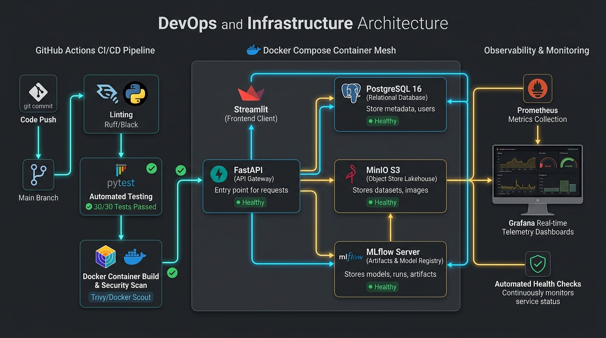

- **Multi-Container Docker Composition (`docker-compose.yml`)**: Orchestrates `postgres` (port 5432), `minio` (ports 9000/9001), `mlflow` (port 5000), `model-api` (port 8000), and `reflex-ui` (ports 3000/8001).
- **GitHub Actions CI/CD Pipeline (`.github/workflows/ci-cd.yml`)**: Automated code quality verification (`flake8`, `black`), Pytest suite execution, and Docker build verification.

---

## 5. Interactive Reflex Frontend

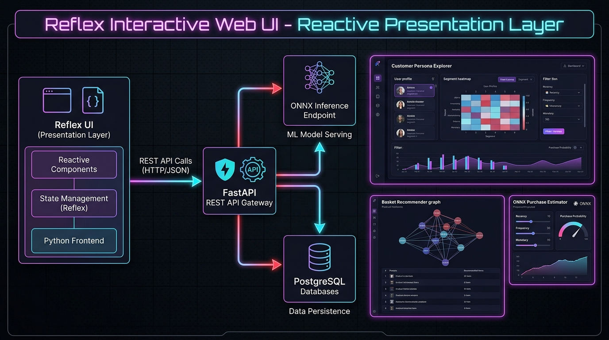

The platform features an interactive, reactive web UI built entirely in Python using **Reflex** (`apps/reflex_app`).

- **Zero DB/ML Coupling**: Reflex state handlers consume backend APIs exclusively via HTTP REST endpoints (`http://localhost:8000`).

---

## Developer Guide: How to Run the Applications & Load Tests

### 1. Running Manually via PowerShell / Terminal

#### Terminal 1: Start FastAPI Backend Server

```powershell
python -m uvicorn apps.api.main:app --host 127.0.0.1 --port 8000 --reload
```

#### Terminal 2: Start Reflex Interactive Frontend

```powershell
$env:PYTHONPATH = (Get-Location).Path
Set-Location "apps\reflex_app"
reflex run
```

---

### 2. Running Locust Load Testing

To run the Locust load testing suite interactively via web browser UI:

```powershell
locust -f tests/locustfile.py --host http://127.0.0.1:8000
```

Open `http://localhost:8089` in your web browser, enter `50` users and spawn rate `10`, then click **Start Swarm**.

To run headlessly and save CSV reports:

```powershell
locust -f tests/locustfile.py --headless -u 50 -r 10 --run-time 15s --host http://127.0.0.1:8000 --csv=reports/locust_summary
```

---

## Platform Endpoint Routing Table

| Service / Interface                     | Base URL                                                | Functionality & Access Details                                        |
| :-------------------------------------- | :------------------------------------------------------ | :-------------------------------------------------------------------- |
| **Reflex Web UI**                 | [http://localhost:3000](http://localhost:3000)           | End-user interactive web interface                                    |
| **FastAPI Swagger Documentation** | [http://localhost:8000/docs](http://localhost:8000/docs) | OpenAPI interactive endpoints specification                           |
| **Locust Load Testing UI**        | [http://localhost:8089](http://localhost:8089)           | Interactive API load testing interface                                |
| **MLflow Telemetry Server**       | [http://localhost:5000](http://localhost:5000)           | Metrics, parameters, SHAP plots, and Model Registry                   |
| **MinIO S3 Console**              | [http://localhost:9001](http://localhost:9001)           | S3 Object Store Console (User:`admin` \| Password: `password123`) |
| **PostgreSQL 16 Warehouse**       | `localhost:5432`                                      | Analytical database (`fridayblack` & `mlflow` DBs)                |

---

## Author

**Ziad Ashraf**
