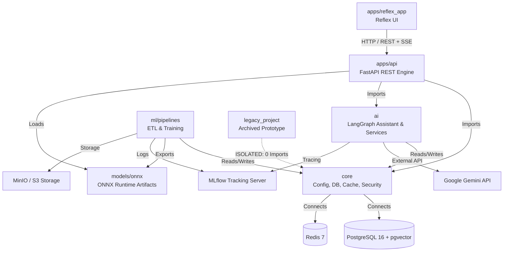

# Code Review Handoff: Black Friday v2 Architecture & Implementation

> **Audience**: External Code Reviewer with zero prior repository context.  
> **Repository Root**: `Black Friday/`  
> **Document Purpose**: Complete, reality-grounded review guide covering architecture, domain breakdowns, correctness risks, DRY/SOLID violations, tech debt, and discrepancies between documentation and actual code.  
> **Security Notice**: Zero secrets, passwords, or `.env` values are recorded in this document; only variable names are documented.

---

## 0. Reviewer Instructions (READ FIRST)

1. **Findings in this document are PRELIMINARY.** They were written by the executor agent from its memory of the project, not from a fresh line-by-line audit. For every finding that touches your session's scope, **CONFIRM or REJECT it with evidence from the actual code** (file:line). Do not accept any claim at face value.
2. **Line numbers are hints, not facts.** Files may have changed since this document was written. Always open the real file and verify the location before reporting.
3. **Review one session only** (see Section 8). Do not wander into other domains; instead, list cross-domain dependencies at the end of your report so they can be checked in the right session.
4. **Do NOT modify any source files.** Your only output is a findings report saved as `REVIEW_<domain>.md` (e.g. `REVIEW_core.md`, `REVIEW_ml.md`). Never edit `REVIEW_HANDOFF.md` or another session's report.
5. **Ignore** `legacy_project/`, `logs/`, `reports/`, `.pytest_cache/`, `models/` binaries, `data/` CSVs, and the `*.xlsx` / phase planning documents. Never read or quote `.env`.
6. **Report format** for each finding: `file:line` | severity (High/Med/Low) | status (CONFIRMED / REJECTED / NEW) | the problem | concrete fix with a short code example.
7. **Overlapping files** (e.g. `apps/api/routes/bot.py` appears in Sessions 3 and 4): review them only from the angle of your own session's focus, and note anything for the other session.

---

## 1. Project Overview

### 1.1 Purpose
Black Friday v2 is an enterprise retail intelligence platform that converts the classic Kaggle Black Friday dataset (~550,000 transactions across demographic segments and product categories) into a production-grade system comprising:
1. **Analytical Data Warehouse**: Automated ingestion, MissForest missingness imputation, Gower customer segmentation, and Apriori association rule mining.
2. **Predictive Serving Engine**: Regression models (LightGBM, Random Forest, Decision Tree) served via ONNX Runtime for sub-millisecond customer purchase estimation.
3. **Continuous MLOps Pipeline**: Evidently AI drift detection on incoming batches, automated PSI/feature drift monitoring, and a champion-challenger retraining loop tracked in MLflow.
4. **Multi-Agent Conversational Shopping Assistant**: LangGraph-orchestrated shopping bot powered by Google Gemini, featuring a dual-model (JEV + Lexical) intent classifier, progressive search relaxation, 2-tier caching (hard L1 + semantic L2), dynamic bundle generation, strike-based security guardrails, and full-duplex text and voice interaction.
5. **Interactive UI**: A full-stack Python frontend built with Reflex (Python-to-React/Next.js) consuming the FastAPI backend.

### 1.2 Tech Stack & Runtime Environment
- **Python Version**: `3.12.3` (active development environment; CI workflow and Dockerfiles target `3.11-slim`).
- **Web Backend**: FastAPI (`>=0.110.0`), Uvicorn (`>=0.28.0`), Pydantic v2 (`>=2.6.4`), Pydantic-Settings (`>=2.2.1`), Python-Jose (JWT), BCrypt.
- **Frontend**: Reflex (`>=0.7.0`), HTTPX (`>=0.27.0`), Requests.
- **Databases & Cache**: PostgreSQL 16 with pgvector extension (`pgvector/pgvector:pg16`), SQLAlchemy 2.0 (`>=2.0.27`), Asyncpg (`>=0.29.0`), Psycopg2-binary (`>=2.9.9`), Redis 7 (`redis>=5.0.0`).
- **Object Storage & Tracking**: MinIO (S3-compatible via `boto3>=1.34.0`), MLflow (`>=2.11.0`).
- **Machine Learning & Analytics**: Scikit-Learn (`>=1.4.0`), LightGBM (`>=4.3.0`), ONNX (`>=1.15.0`), ONNX Runtime (`>=1.17.0`), Skl2onnx, Evidently AI (`>=0.4.19`), SHAP (`>=0.45.0`), Mlxtend (`>=0.23.1`), NetworkX (`>=3.2.1`), Gower (`>=0.1.2`), Gensim (`>=4.3.2`), Pandera (`>=0.18.3`).
- **AI & Multi-Agent Assistant**: Google Generative AI SDK (`google-generativeai>=0.8.0`), LangGraph (UNVERIFIED in requirements, see Section 7), LangChain-Core (UNVERIFIED in requirements), MLflow Tracing.
- **Testing & Tooling**: Pytest (`>=8.1.0`), Pytest-Asyncio, Pytest-Cov, Flake8, Black, Isort, Locust.

### 1.3 How to Run the Platform

#### Local Development
```bash
# 1. Start core backing services (Postgres, Redis, MinIO, MLflow)
docker-compose up -d postgres redis minio mlflow

# 2. Run database migration & seeding
python -m ml.pipelines.ingest
python -m ml.pipelines.seed_curated

# 3. Launch FastAPI backend
uvicorn apps.api.main:app --host 0.0.0.0 --port 8000 --reload

# 4. Launch Reflex frontend (in a separate terminal)
cd apps/reflex_app
reflex run
```

#### Docker Compose Orchestration
```bash
# Start all containers
make up       # executes: docker-compose up -d --build
make logs     # stream logs
make ps       # container status
make down     # teardown
```
*(Note: See Section 7 for Docker volume mount discrepancies).*

#### Data & ML Pipelines
```bash
make ingest        # Ingest raw train.csv into PostgreSQL
make preprocess    # Execute MissForest imputation and outlier tagging
make segmentation  # Run Gower clustering and 10-persona profiling
make basket        # Mine Apriori rules and compute PageRank/HITS
make train         # Train regression models and export ONNX artifacts
make monitor       # Run Evidently AI drift check on new batch
make retrain       # Champion vs Challenger continuous retraining loop
```

### 1.4 How to Run Tests
```bash
# Run full pytest suite with verbose output
pytest tests/ -v

# Run via Makefile
make test

# Run isolated Phase 4 test suite
pytest tests/test_phase4_caching_and_fanout.py tests/test_phase4_security_strikes.py -v
```

---

## 2. Architecture Map

### 2.1 Repository Folder Tree (Key Directories)
```text
Black Friday/
├── ai/                     # Multi-agent LangGraph shopping assistant subsystem
│   ├── classifier/         # JEV dual-model intent classifier (Lexical + Gemini fallback)
│   ├── extractor/          # Entity extraction (slots, price ranges, product attributes)
│   ├── guardrails/         # Adversarial jailbreak filter & 3-strikes IP/user lockout
│   ├── memory/             # Redis-backed checkpointing & conversation history
│   ├── nodes/              # LangGraph execution nodes (search, bundle, cart, support, synthesis)
│   ├── observability/      # MLflow span tracing & token usage accounting
│   ├── prompts/            # Templated system prompts for LLM agents
│   ├── router/             # Multi-intent fanout routing logic
│   ├── schemas/            # AgentState definitions & Pydantic message contracts
│   ├── services/           # 2-Tier caching (hard L1 + semantic L2), search relaxation, TTS
│   ├── tools/              # Tool bridges (product search, cart mutation, policy retrieval)
│   └── workflow/           # LangGraph DAG compilation, edge conditions, and state transitions
├── apps/                   # Application frontends and API servers
│   ├── api/                # FastAPI application: REST routes, ONNX serving, middlewares
│   │   ├── core/           # Rate limiting sliding-window engine (nested inside api/)
│   │   ├── middleware/     # Security ban lockout gateway middleware
│   │   ├── routes/         # Endpoints: /analytics, /auth, /bot, /shopper
│   │   ├── services/       # Pass-through wrappers (RateLimiterService)
│   │   └── serving/        # Runtime ONNX inference sessions & imputer transformer
│   └── reflex_app/         # Reflex full-stack Python web dashboard and chat drawer UI
│       ├── reflex_app/     # Reflex UI components, global State, auth modals, product cards
│       └── rxconfig.py     # Reflex configuration
├── core/                   # Shared foundational utilities
│   ├── cache/              # Redis connection manager & serialization helpers
│   ├── db/                 # SQLAlchemy sessions, models, and domain repositories
│   │   ├── migrations/     # Raw SQL DDL schema initialization scripts
│   │   ├── models/         # Declarative ORM models (warehouse, user, purchase)
│   │   └── repositories/   # Domain repos: warehouse, analytics, segmentation, recommendations, user
│   ├── config.py           # Pydantic BaseSettings application configuration
│   ├── logging.py          # Centralized logging configuration
│   └── security.py         # Passlib/bcrypt password hashing & JWT encoding/decoding
├── data/                   # Data assets, CSVs, golden test sets, store policies
├── docker/                 # Container Dockerfiles (api, ui, mlflow) & Postgres init SQL
├── docs/                   # Engineering design specs, Phase implementation plans, architecture guides
├── legacy_project/         # DEPRECATED: Standalone legacy Flask/Streamlit code (0 incoming imports)
├── ml/                     # ML pipelines, feature engineering, models, and governance
│   ├── features/           # MissForest imputation, customer feature engineering, data contracts
│   ├── market_basket/      # Apriori rule mining, PageRank/HITS network analysis
│   ├── models/             # Benchmark trainers (LGBM, RF, DT), ONNX exporter, registry
│   ├── pipelines/          # CLI scripts for batch ETL, training, drift monitoring, cron scheduler
│   ├── segmentation/       # Gower distance clustering & customer persona generator
│   └── tracking/           # MLflow tracking client integration
├── models/                 # Serialized ONNX artifacts, imputer weights, and metadata JSONs
├── tests/                  # Pytest test suite (Phase 1-4, ML pipelines, API, load testing)
└── .github/                # GitHub Actions CI workflow definition
```

### 2.2 Module Dependency Diagram



### 2.3 System Entry Points
1. **REST API**: `apps/api/main.py` -> Uvicorn server (`http://0.0.0.0:8000`).
2. **Reflex Web Dashboard**: `apps/reflex_app/reflex_app/reflex_app.py` -> Reflex compiler/server (`http://localhost:3000`).
3. **SSE Bot Streaming**: `POST /bot/stream` in `apps/api/routes/bot.py`.
4. **Data Pipelines**:
   - `python -m ml.pipelines.ingest`
   - `python -m ml.pipelines.preprocess`
   - `python -m ml.pipelines.segmentation`
   - `python -m ml.pipelines.market_basket`
   - `python -m ml.pipelines.train --model lgbm`
   - `python -m ml.pipelines.monitor --batch <path>`
   - `python -m ml.pipelines.retrain --new-data <path>`
   - `python -m ml.pipelines.cron_scheduler`
5. **Testing Suite**: `pytest tests/`

### 2.4 End-to-End Request and Data Flow
```text
[Raw Ingestion]
  data/train.csv 
    → ml.pipelines.ingest 
    → PostgreSQL (warehouse_transactions)

[ML Training & Imputation]
  warehouse_transactions 
    → ml.pipelines.preprocess (MissForest ExtraTrees)
    → ml.pipelines.train (LightGBM / RF)
    → skl2onnx conversion 
    → models/onnx/*.onnx

[Real-time Shopper Pricing API]
  Client Request 
    → POST /shopper/predict-price 
    → apps.api.routes.shopper 
    → apps.api.serving.onnx_session 
    → Response JSON

[Conversational AI Assistant (Phase 4)]
  User Message in UI Drawer (apps/reflex_app)
    → POST /bot/stream (SSE)
    → apps.api.middleware.security_ban_middleware (Check 3-strike lockout)
    → apps.api.routes.bot.sse_response_generator
    → Tier-0 Exact Cache Check (Redis SHA-256 hash, 6-hr TTL)
      [Hit] → Fast token yield + Done event
      [Miss] → JEV Intent Classifier & Slot Extractor
             → Tier-1 Semantic Cache Check (Cosine similarity >= 0.92)
               [Hit] → Yield semantic hit
               [Miss] → LangGraph StateGraph Execution (Fanout Router)
                      ├─ Search Node (Progressive Relaxation on PostgreSQL)
                      ├─ Bundle Node (Apriori rules & PageRank)
                      ├─ Cart Node (Redis durable cart operations)
                      └─ Support Node (Store policy retrieval)
             → Synthesis Node (Gemini 2.0 Flash + Grounding Citations + TTS)
             → Store response in Tier-0 & Tier-1 Caches
             → Stream SSE tokens, UI cards, and grounding links to Reflex UI
```

---

## 3. Domain-by-Domain Breakdown

### 3.1 AI Subsystem
- **Relative Path**: `ai/`
- **Key Files & Responsibilities**:
  - `ai/classifier/labels.py`: Enum definitions for all system intents (`IntentType`) and product categories (`CategoryType`).
  - `ai/classifier/lexical_router.py`: High-speed regex pattern matcher for deterministic, zero-latency intent detection.
  - `ai/classifier/dual_model_classifier.py`: JEV dual-model engine coupling lexical patterns with Gemini LLM fallback.
  - `ai/extractor/entity_extractor.py`: Structured entity extractor parsing category, price bounds, demographics, and query keywords.
  - `ai/guardrails/strike_tracker.py`: Security tracker maintaining sliding strike counts and 24-hour lockouts in Redis.
  - `ai/guardrails/input_filter.py`: Prompt injection and adversarial jailbreak regex detector.
  - `ai/memory/redis_checkpointer.py`: LangGraph checkpointer persisting agent checkpoint states in Redis.
  - `ai/nodes/search_node.py`: Executes multi-tier product queries using the search relaxation service.
  - `ai/nodes/bundle_node.py`: Fetches complementary products via Apriori association rules and PageRank scores.
  - `ai/nodes/cart_node.py`: Mutates shopper shopping carts (add, remove, view, clear) in Redis with DB transaction fallback.
  - `ai/nodes/support_node.py`: Answers customer questions regarding warranty, returns, and shipping from store policy JSON.
  - `ai/nodes/synthesis_node.py`: Orchestrates Gemini generation, grounding links, UI card payloads, and voice audio payloads.
  - `ai/observability/mlflow_tracer.py`: Wraps agent and node executions with MLflow trace spans for full observability.
  - `ai/observability/token_tracker.py`: Calculates prompt, completion, and total token usage costs.
  - `ai/router/hybrid_router.py`: Evaluates classification outputs to trigger single-node or parallel fanout execution.
  - `ai/services/two_tier_cache_service.py`: L1 exact hash cache (6-hr TTL) and L2 semantic vector similarity cache.
  - `ai/services/search_relaxation_service.py`: 3-tier progressive relaxation fallback for catalog search queries.
  - `ai/services/synthesis_service.py`: Core Gemini LLM wrapper, output parser, and text-to-speech audio synthesizer.
  - `ai/workflow/graph.py`: LangGraph StateGraph compilation wiring nodes, fanouts, and conditional edges.
- **Public Interfaces**:
  - `shopping_graph.invoke(AgentState)` or `.stream(AgentState)`: Main entry point for conversational agent execution.
  - `two_tier_cache_service.get_exact_llm_response(query)`: High-speed fast-path cache interface.
  - `strike_tracker.is_banned(identifier)`: Gateway security check.
- **External Dependencies**: `google-generativeai`, `langgraph`, `langchain-core`, `redis`, `pgvector`, `mlflow`, `loguru` (unlisted).
- **Test Coverage**: High coverage across `tests/test_phase2_jev_router.py`, `tests/test_phase3_langgraph_agent.py`, `tests/test_phase4_bundles.py`, `tests/test_phase4_caching_and_fanout.py`, `tests/test_phase4_cart_durability.py`, `tests/test_phase4_e2e_production.py`, `tests/test_phase4_search_relaxation.py`, `tests/test_phase4_security_strikes.py`, `tests/test_phase4_tracing.py`.
- **Review Priority**: **HIGH**  
  *Reason*: High business complexity, multi-threading fanout nodes, LLM cost sensitivity, and critical security strike logic.

---

### 3.2 Machine Learning (ML) Domain
- **Relative Path**: `ml/` and `models/`
- **Key Files & Responsibilities**:
  - `ml/features/imputation.py`: MissForest iterative imputer replicating R's missingness imputation using ExtraTrees.
  - `ml/features/data_contract.py`: Pandera data contracts enforcing schema validation and demographic ranges.
  - `ml/features/customer_features.py`: Feature engineering pipeline (aggregating user purchase history, frequency, spending).
  - `ml/market_basket/apriori.py`: Apriori association rule mining algorithm extracting frequent itemsets and rules.
  - `ml/market_basket/graph_analytics.py`: PageRank and HITS centrality algorithm on product co-occurrence bipartite graphs.
  - `ml/models/regression.py`: LightGBM, Random Forest, Decision Tree, and CatBoost regressor wrappers.
  - `ml/models/onnx_exporter.py`: Skl2onnx and onnxmltools converter producing optimized ONNX computation graphs.
  - `ml/models/champion_challenger.py`: Automated model promotion comparing candidate R² and RMSE against current champion.
  - `ml/pipelines/monitor.py`: Evidently AI drift monitor measuring feature drift and target PSI.
  - `ml/pipelines/retrain.py`: Automated end-to-end retraining pipeline triggered by detected data drift.
  - `ml/pipelines/cron_scheduler.py`: Background scheduler executing periodic drift checks and retraining tasks.
  - `ml/segmentation/clustering.py`: Gower distance matrix computation and agglomerative / K-Means clustering.
  - `ml/segmentation/profiling.py`: Generates demographic profiles and persona naming for customer clusters.
- **Public Interfaces**:
  - `MissForestImputer.fit_transform(df)` / `.transform(df)`
  - `ChampionChallengerComparator.compare_and_promote(candidate, current_champion)`
  - `EvidentlyDriftDetector.calculate_drift(reference_df, current_df)`
- **External Dependencies**: `scikit-learn`, `lightgbm`, `onnxruntime`, `skl2onnx`, `evidently`, `mlxtend`, `networkx`, `gower`.
- **Test Coverage**: Covered in `tests/test_features.py`, `tests/test_models.py`, `tests/test_segmentation.py`, `tests/test_drift_retrain.py`.
- **Review Priority**: **HIGH**  
  *Reason*: Target leakage risk identified in `ml/features/imputation.py` (see Section 5), training/serving feature alignment, and automated model promotion criteria.

---

### 3.3 Data Domain
- **Relative Path**: `data/` and `core/db/`
- **Key Files & Responsibilities**:
  - `data/train.csv`: Raw historical Black Friday training dataset (~550,000 rows, 25.5 MB).
  - `data/test.csv`: Raw test dataset (~233,000 rows, 9.6 MB).
  - `data/curated_products.json`: Curated product catalog metadata for the retail store.
  - `data/store_policies.json`: Knowledge base of return, warranty, and shipping policies.
  - `data/golden_benchmark_dataset.json`: Labeled benchmark intent queries for classifier testing.
  - `data/extraction_benchmark_dataset.json`: Labeled entity extraction validation benchmark.
  - `core/db/models/warehouse.py`: SQLAlchemy ORM models for `warehouse_transactions`, `cleaned_transactions`, and analytical views.
  - `core/db/models/user.py`: User account and authentication ORM model.
  - `core/db/models/purchase.py`: Shopper checkout purchase order ORM model.
  - `core/db/repositories/warehouse_repo.py`: Raw/cleaned transactions bulk loader, paginator, and catalog search.
  - `core/db/repositories/analytics_repo.py`: Pre-computed demographic analytics and summary statistics.
  - `core/db/repositories/recommendation_repo.py`: Queries for association rules and graph centrality metrics.
  - `core/db/repositories/segmentation_repo.py`: Cluster definitions and customer persona retrieval.
  - `core/db/repositories/user_repo.py`: User registration, credential lookup, and purchase history recording.
- **Public Interfaces**:
  - `BlackFridayRepository`: Consolidated database access facade.
  - `get_db()`: FastAPI dependency injecting SQLAlchemy sessions.
- **External Dependencies**: `psycopg2-binary`, `asyncpg`, `sqlalchemy`, `pgvector`.
- **Test Coverage**: Tested in `tests/test_phase1_infra_frontend.py` and `tests/test_api.py`.
- **Review Priority**: **MEDIUM**  
  *Reason*: Multi-inheritance God Object repository structure in `core/db/repository.py` and absence of migration tooling (Alembic).

---

### 3.4 Backend (API) Domain
- **Relative Path**: `apps/api/`
- **Key Files & Responsibilities**:
  - `apps/api/main.py`: FastAPI application setup, CORS middleware, global exception handlers, and route mounting.
  - `apps/api/auth.py`: JWT token validation dependencies (`get_current_user`, `get_optional_user`).
  - `apps/api/schemas.py`: Pydantic request/response models for all endpoints.
  - `apps/api/core/rate_limiter.py`: Sliding-window rate limiter backed by Redis ZSET.
  - `apps/api/middleware/security_ban_middleware.py`: Starlette gateway middleware enforcing HTTP 403 on banned callers.
  - `apps/api/routes/auth.py`: User registration, login, and `/me` profile endpoints.
  - `apps/api/routes/shopper.py`: Catalog browsing, ONNX price prediction, cart mutations, and checkout.
  - `apps/api/routes/analytics.py`: Pre-computed warehouse summaries and demographic distribution charts.
  - `apps/api/routes/bot.py`: Server-Sent Events (SSE) `/bot/stream` and full-duplex voice `/bot/voice-query` endpoints.
  - `apps/api/serving/onnx_session.py`: Thread-safe ONNX Runtime inference runner for pricing models.
  - `apps/api/serving/imputer.py`: Serving-time MissForest ONNX imputer applying feature transformation.
  - `apps/api/services/rate_limiter_service.py`: Redundant pass-through service wrapper around `RedisRateLimiter`.
- **Public Interfaces**:
  - REST Endpoints: `/auth/*`, `/shopper/*`, `/analytics/*`, `/bot/*`.
- **External Dependencies**: `fastapi`, `uvicorn`, `onnxruntime`, `pydantic`, `redis`.
- **Test Coverage**: Covered in `tests/test_api.py` and `tests/test_phase4_e2e_production.py`.
- **Review Priority**: **HIGH**  
  *Reason*: High throughput, rate limiting encapsulation breach, SSE streaming lifecycle, and ONNX runtime threading.

---

### 3.5 Frontend Domain
- **Relative Path**: `apps/reflex_app/`
- **Key Files & Responsibilities**:
  - `apps/reflex_app/rxconfig.py`: Reflex project configuration.
  - `apps/reflex_app/reflex_app/reflex_app.py`: Main Reflex page entry point, layout definition, and route registration.
  - `apps/reflex_app/reflex_app/state.py`: Global application state managing user session, catalog, cart, and streaming chat drawer.
  - `apps/reflex_app/reflex_app/components/bot_drawer.py`: Floating conversational shopping drawer rendering markdown tokens, product carousels, bundle cards, policy accordions, and audio player.
  - `apps/reflex_app/reflex_app/components/auth_modal.py`: Sign in and sign up modal dialogs with client validation.
  - `apps/reflex_app/reflex_app/components/product_card.py`: Product catalog display card with ONNX dynamic price badge.
  - `apps/reflex_app/reflex_app/components/quick_view_modal.py`: Modal showing product specifications, ONNX price prediction, and add-to-cart action.
  - `apps/reflex_app/reflex_app/components/cart_drawer.py`: Slide-out shopping cart drawer with checkout flow.
  - `apps/reflex_app/reflex_app/components/dashboard_modal.py`: Administrative dashboard displaying warehouse charts.
- **Public Interfaces**: Web browser UI on port 3000.
- **External Dependencies**: `reflex`, `httpx`.
- **Test Coverage**: Tested via `tests/test_api_client.py` and `tests/test_phase1_infra_frontend.py`.
- **Review Priority**: **MEDIUM**  
  *Reason*: State decoupling from backend completed, but `API_BASE_URL` is hardcoded to localhost in `state.py:13`, breaking Docker networking.

---

### 3.6 DevOps & CI/CD Domain
- **Relative Path**: `docker/`, `.github/`, `Makefile`, `docker-compose.yml`
- **Key Files & Responsibilities**:
  - `docker-compose.yml`: Multi-service orchestration (Postgres, MinIO, MLflow, Redis, FastAPI, Reflex UI).
  - `docker/Dockerfile.api`: Python 3.11-slim container for FastAPI backend.
  - `docker/Dockerfile.ui`: Python 3.11-slim container with Node.js/npm for Reflex frontend.
  - `docker/mlflow/Dockerfile`: Custom MLflow tracking server container with psycopg2 and boto3.
  - `docker/postgres/init-multiple-dbs.sh`: Shell script creating separate `fridayblack` and `mlflow` databases.
  - `docker/postgres/init_schema.sql`: Raw DDL initializing tables, indexes, and pgvector extension.
  - `.github/workflows/ci-cd.yml`: GitHub Actions pipeline running `pytest tests/` on Python 3.11.
  - `Makefile`: Developer command suite for container lifecycle, pipelines, testing, and linting.
- **External Dependencies**: Docker engine, GitHub Actions runners.
- **Test Coverage**: Verified in CI workflow executions.
- **Review Priority**: **HIGH**  
  *Reason*: Multiple build and runtime discrepancies detected in `docker-compose.yml` and `docker/Dockerfile.api` (see Section 7).

---

### 3.7 Core & Shared Domain
- **Relative Path**: `core/`
- **Key Files & Responsibilities**:
  - `core/config.py`: Centralized Pydantic BaseSettings loading environment configuration.
  - `core/logging.py`: Structured logger factory wrapping standard library `logging`.
  - `core/security.py`: Password hashing utilities and JWT token generator/decoder.
  - `core/cache/redis_client.py`: Thread-safe Redis cache connection manager.
  - `core/db/session.py`: Synchronous and asynchronous SQLAlchemy engine and session factories.
  - `core/db/repository.py`: Aggregated `BlackFridayRepository` combining all domain repositories.
- **Public Interfaces**: Consumed by every other domain across the application.
- **External Dependencies**: `pydantic-settings`, `redis`, `sqlalchemy`, `bcrypt`, `python-jose`.
- **Test Coverage**: Core modules are exercised in `tests/test_phase1_infra_frontend.py` and across all integration suites.
- **Review Priority**: **MEDIUM**  
  *Reason*: Foundation layer; clean configuration structure, but repository multiple inheritance requires refactoring.

---

## 4. Shared Code and Configuration

| Concern | Defined In | Consuming Modules / Call Sites | How Handled |
| :--- | :--- | :--- | :--- |
| **Settings & Config** | `core/config.py` (`Settings`) | Used in ~35 files across `apps/api/`, `ml/pipelines/`, `ai/services/`, `core/db/` | Singleton `settings` instance loaded from `.env` via `pydantic-settings`. |
| **Logging** | `core/logging.py` (`get_logger`) | Used in ~40 files across `core/`, `ml/`, `apps/api/` | Standard library `logging` wrapper formatting timestamps and module names. *(Exception: `ai/nodes/` uses `loguru`, see Section 5)*. |
| **Database Access** | `core/db/session.py` & `core/db/repository.py` | `apps/api/dependencies.py`, `apps/api/routes/*`, `ml/pipelines/*` | SQLAlchemy sync session (`SessionLocal`) and async session (`AsyncSessionLocal`); consolidated repository facade. |
| **Redis Cache** | `core/cache/redis_client.py` (`cache_manager`) | `ai/services/two_tier_cache_service.py`, `apps/api/core/rate_limiter.py`, `ai/guardrails/strike_tracker.py` | Connection pooling with auto-reconnect and JSON serialization helpers. |
| **Security & Auth** | `core/security.py` | `apps/api/auth.py`, `apps/api/routes/auth.py` | `Passlib` CryptContext with bcrypt; `python-jose` for JWT HS256 encoding/decoding. |
| **Error Handling** | `apps/api/main.py` | Entire HTTP boundary | Custom FastAPI handlers for `HTTPException`, `RequestValidationError`, and generic 500 exceptions. |
| **Enums & Constants** | `ai/classifier/labels.py`, `core/config.py` | `ai/classifier/*`, `ai/router/*`, `apps/api/routes/bot.py` | Python standard `Enum` (`IntentType`, `CategoryType`) and immutable constants. |

---

## 5. Suspected Problem Areas

### 5.1 DRY (Don't Repeat Yourself) Violations

1. **Redundant Service Layer Indirection in Rate Limiter**
   - **Location**: `apps/api/services/rate_limiter_service.py` (lines 8–24) vs `apps/api/core/rate_limiter.py` (lines 23–165).
   - **Issue**: `RateLimiterService` is a 15-line class that does nothing except pass identical arguments to `RedisRateLimiter`.
   - **Why It Matters**: Pointless boilerplate indirection that adds an unnecessary layer of maintenance without providing abstraction or policy enforcement.

2. **Dual Logging Framework Fragmentation**
   - **Location**: `ai/nodes/cart_node.py` (line 7), `ai/nodes/bundle_node.py` (line 6), `ai/nodes/support_node.py` (line 7) vs `core/logging.py`.
   - **Issue**: These three AI node files import `from loguru import logger`, whereas all other files throughout `core/`, `apps/`, and `ml/` use `from core.logging import get_logger; logger = get_logger(__name__)`.
   - **Why It Matters**: Violates code consistency, bifurcates log formatting/destinations, and introduces an undeclared runtime dependency that breaks clean container installs (see Section 5.4).

3. **Duplicated Security Lockout Checks Across Gateway and Route**
   - **Location**: `apps/api/middleware/security_ban_middleware.py` (lines 28–37) and `apps/api/routes/bot.py` (lines 53–61).
   - **Issue**: Banned user/IP status is verified twice on every bot request: first in the Starlette gateway middleware, and then re-verified inside the route handler.
   - **Why It Matters**: Redundant Redis lookups on every incoming request. Strike enforcement should be handled strictly at the gateway middleware boundary.

4. **Schema Duplication Between SQL Models and Validation Contracts**
   - **Location**: `core/db/models/warehouse.py` (lines 15–70) vs `ml/features/data_contract.py` (lines 18–65).
   - **Issue**: Demographic valid ranges (`Gender` in M/F, `Age` brackets, `City_Category` in A/B/C) are defined independently as SQLAlchemy column constraints and again as Pandera schema checks.
   - **Why It Matters**: Any schema migration or category addition requires manual synchronization across two independent files; failure to sync will cause silent ingestion failures.

---

### 5.2 SOLID Principle Violations

1. **God Object Anti-Pattern via Multiple Inheritance (SRP & ISP)**
   - **Location**: `core/db/repository.py` (lines 12–30).
   - **Issue**:
     ```python
     class BlackFridayRepository(
         WarehouseRepository,
         AnalyticsRepository,
         SegmentationRepository,
         RecommendationRepository,
         UserRepository
     ):
     ```
   - **Why It Matters**:
     - **SRP Violation**: A single class is responsible for raw transactional data ingestion, pre-computed dashboard statistics, Gower segmentation clustering, PageRank recommendation metrics, and user password management.
     - **ISP Violation**: Consumers needing only user authentication (`UserRepository`) are injected with a massive class exposing analytical warehouse queries and segmentation matrices.
     - **Recommendation**: Refactor to composition; inject individual domain repositories where needed.

2. **Encapsulation Breach & Concrete Dependency Coupling (DIP)**
   - **Location**: `apps/api/core/rate_limiter.py` (lines 40–45).
   - **Issue**:
     ```python
     @property
     def client(self) -> Optional[redis.Redis]:
         if self._custom_client:
             return self._custom_client
         if cache_manager.is_available:
             return cache_manager._client  # Accesses private member
     ```
   - **Why It Matters**: Accesses the private `_client` attribute of `RedisCacheManager`. If `RedisCacheManager` changes its internal driver or connection pool implementation, the rate limiter breaks. Rate limiting should consume an abstract cache interface or public client accessor.

3. **Bloated Monolithic Service Class (SRP)**
   - **Location**: `ai/services/synthesis_service.py` (lines 35–210).
   - **Issue**: `SynthesisService` is responsible for: (1) invoking Google Gemini LLM API, (2) streaming text tokens, (3) parsing markdown into structured UI product cards, (4) constructing bundle recommendation payloads, (5) extracting website URL grounding citations, and (6) generating text-to-speech audio bytes.
   - **Why It Matters**: Six distinct responsibilities in one class. Unit testing citation extraction requires mocking LLM API calls and audio codecs. Should be split into `ResponseGenerator`, `GroundingService`, and `VoiceSynthesisService`.

4. **Hardcoded Control Flow Branching (OCP)**
   - **Location**: `ai/router/hybrid_router.py` (lines 45–125).
   - **Issue**: Extensive `if/elif/else` branching blocks dispatching requests to specific nodes based on intent enums.
   - **Why It Matters**: Violates the Open/Closed Principle. Adding a new shopping assistant intent (e.g., `ORDER_MODIFICATION`, `LOYALTY_REWARDS`) requires modifying the router's internal branching code rather than registering a new intent strategy handler.

---

### 5.3 Redundant Patterns & Over-Engineering

1. **Dead Legacy Project in Working Tree**
   - **Location**: `legacy_project/` (90 files, including `Black Friday Analysis.pptx`, `Black Friday.zip`, `Data.zip`, and old Streamlit prototypes).
   - **Issue**: Completely isolated legacy code. **Verified: ZERO files in the modern v2 codebase import from or reference `legacy_project/`**.
   - **Why It Matters**: Adds ~25 MB of clutter, bloats workspace indexing, and confuses new developers reviewing the repository. It should be archived in git history and purged from the working tree.

2. **Nested Package Namespace Confusion**
   - **Location**: `apps/api/core/` (contains `rate_limiter.py`).
   - **Issue**: The project has a top-level `core/` package and a nested `apps/api/core/` package.
   - **Why It Matters**: Causes naming confusion and accidental circular import risks when developers write `from core import ...` versus `from apps.api.core import ...`. `rate_limiter.py` should be moved directly under `apps/api/` or `core/cache/`.

---

### 5.4 Logic Risks & Correctness Bugs

1. **CRITICAL: Target Leakage and Train/Serving Skew in MissForest Imputer**
   - **Location**: `ml/features/imputation.py` (lines 24–36) vs `apps/api/serving/imputer.py` (lines 43–56).
   - **Issue**:
     - In `ml/features/imputation.py`, the target column `purchase` is included in `FEATURE_COLS` (line 35) to fit the ExtraTrees regressors that impute missing `product_category_2` and `product_category_3`.
     - At real-time serving time (`apps/api/serving/imputer.py`), the shopper's `purchase` amount is unknown (it is the prediction target!). Lines 47–50 detect that `purchase` is missing and fill it with the training mean (`self.initial_stats[j]`).
   - **Why It Matters**:
     - **Target Leakage**: During training, category imputation learned patterns using the true target value.
     - **Train/Serving Skew**: In production, the model is fed a constant mean dummy value for `purchase`, degrading imputation accuracy and distorting downstream regression features.
   - **Remediation**: Exclude `purchase` from `MissForestImputer.FEATURE_COLS` so that imputation relies strictly on demographic and product features available at inference time.

2. **CRITICAL: Missing Core Dependencies in `requirements.txt`**
   - **Location**: `requirements.txt` vs multiple production source files.
   - **Missing Packages**:
     1. `langgraph`: Directly imported in `ai/workflow/graph.py` (line 7), `ai/workflow/state.py` (line 8), `ai/workflow/edges.py` (line 22), and `ai/memory/redis_checkpointer.py` (line 9).
     2. `langchain-core`: Directly imported in `ai/services/synthesis_service.py` (line 7), `apps/api/routes/bot.py` (line 16), `ai/workflow/state.py` (line 9), and `ai/nodes/router_node.py` (line 7).
     3. `loguru`: Directly imported in `ai/nodes/cart_node.py` (line 7), `ai/nodes/bundle_node.py` (line 6), and `ai/nodes/support_node.py` (line 7).
   - **Why It Matters**: Running `pip install -r requirements.txt` in a fresh environment or building the Docker container will immediately fail with `ModuleNotFoundError` when the API boots or when running tests.

3. **CRITICAL: Docker Mount & PYTHONPATH Misconfiguration**
   - **Location**: `docker-compose.yml` (lines 151–154) and `docker/Dockerfile.api` (lines 19–23).
   - **Issue**:
     - `docker-compose.yml` specifies:
       ```yaml
       PYTHONPATH: /app/src
       volumes:
         - ./src:/app/src
       ```
       **There is no `src/` folder in the entire repository!** This mounts an empty directory and sets an invalid `PYTHONPATH`.
     - `docker/Dockerfile.api` specifies:
       ```dockerfile
       COPY config/ /app/config/
       ```
       **There is no `config/` folder in the repository** (configuration lives in `core/config.py`).
     - `docker/Dockerfile.api` **omits copying `ai/`** (`COPY ai/ /app/ai/` is missing).
   - **Why It Matters**: Running `docker-compose up` will fail to boot the API container because packages cannot be resolved and `ai` modules are missing.

4. **HIGH: Hardcoded Localhost in Frontend State**
   - **Location**: `apps/reflex_app/reflex_app/state.py` (line 13).
   - **Issue**: `API_BASE_URL = "http://127.0.0.1:8000"` is hardcoded as a static string rather than reading `os.getenv("API_BASE_URL", "http://127.0.0.1:8000")`.
   - **Why It Matters**: In `docker-compose.yml`, the UI container is assigned `API_BASE_URL: http://model-api:8000`. Because `state.py` hardcodes `127.0.0.1:8000`, the Reflex frontend container fails to communicate with the API container in containerized deployments.

5. **MEDIUM: Silent Exception Swallowing in Search Relaxation**
   - **Location**: `ai/services/search_relaxation_service.py` (lines 85–115).
   - **Issue**: Fallback query tiers catch general `Exception` and return empty lists `[]` without logging stack traces or propagating database connection errors.
   - **Why It Matters**: If PostgreSQL crashes or table schemas mismatch, the service quietly returns "no products found" instead of raising an alerting exception.

---

## 6. Known Tech Debt and Incomplete Work

1. **Absence of Alembic Database Migrations**
   - Database tables are initialized via raw SQL scripts in `docker/postgres/init_schema.sql` and manual DDL scripts in `core/db/migrations/`.
   - Schema modifications require manual database altering rather than version-controlled migration rollbacks.

2. **In-Memory Fallback Threading in Drift Scheduler**
   - `ml/pipelines/cron_scheduler.py` uses a simple Python `threading.Thread` loop for periodic drift checks.
   - For high availability and multi-worker setups, this should be transitioned to a distributed task queue (e.g., Celery or Redis Queue) to avoid duplicate job executions across multiple instances.

3. **Cart Expiration Sliding TTL Handling**
   - Cart entries in Redis (`ai/nodes/cart_node.py`) are saved with a fixed TTL. Adding a new item to the cart does not refresh or slide the TTL window, risking premature cart expiration during active shopping sessions.

4. **Static Store Policies**
   - `data/store_policies.json` is a static JSON file read into memory at startup. Store policy updates require application restarts rather than dynamic database retrieval.

---

## 7. Doc vs Code Discrepancies

| Document / Claim | What the Documentation States | What the Real Code Actually Does |
| :--- | :--- | :--- |
| **`docker-compose.yml` & `Dockerfile.api`** | Expects source files in a `./src` folder and configs in a `./config` folder. | The repository is organized as a flat root structure (`ai/`, `apps/`, `core/`, `ml/`). There is NO `src/` and NO `config/`. |
| **`Dockerfile.api` Copy Directives** | Assumes copying `core/`, `apps/`, `ml/`, `models/` is sufficient. | Omitts `COPY ai/ /app/ai/`. The bot route fails on startup inside Docker. |
| **`requirements.txt` Dependencies** | Documents complete dependencies for the platform. | Missing `langgraph`, `langchain-core`, and `loguru`, which are imported in production code. |
| **`apps/reflex_app/reflex_app/state.py`** | `docker-compose.yml` specifies `API_BASE_URL` env var for container discovery. | `state.py` hardcodes `API_BASE_URL = "http://127.0.0.1:8000"`, ignoring environment overrides. |
| **`Makefile` Lint Target** | `make lint` claims to check code standards across all modules. | Line 77: `flake8 apps/ ml/ core/ tests/` omits `ai/` entirely. |
| **`Makefile` Clean Target** | `make clean` claims cross-platform cache cleanup. | Uses Unix `find . -type d ...` and `rm -rf`, which fails on native Windows cmd/PowerShell. |
| **`legacy_project/`** | Repository root contains `legacy_project/` directory. | Zero files import or use `legacy_project/`. It is completely dead code. |
| **MissForest Preprocessing Doc** | States MissForest uses demographic and product features. | Code in `ml/features/imputation.py` includes the target column `purchase` in the feature matrix during training. |

---

## 8. Suggested Review Order

To review the codebase efficiently without context overload, follow this structured 6-session sequence:

### Session 1: Core Foundation & Configuration (Estimated: 27 files, ~1,800 LOC)
- **Focus**: Configuration parsing, database sessions, ORM models, Redis connection management, security.
- **Files**:
  - `core/config.py`
  - `core/logging.py`
  - `core/security.py`
  - `core/cache/redis_client.py`
  - `core/db/session.py`
  - `core/db/models/*.py`
  - `core/db/repositories/*.py`
  - `core/db/repository.py`

### Session 2: ML Pipeline & Feature Engineering (Estimated: 44 files, ~3,500 LOC)
- **Focus**: Feature contracts, MissForest imputer (target leakage check), benchmark training, ONNX export, Evidently drift detection.
- **Files**:
  - `ml/features/imputation.py`
  - `ml/features/data_contract.py`
  - `ml/features/customer_features.py`
  - `ml/models/regression.py`
  - `ml/models/onnx_exporter.py`
  - `ml/models/champion_challenger.py`
  - `ml/pipelines/train.py`
  - `ml/pipelines/monitor.py`
  - `ml/pipelines/retrain.py`
  - `ml/market_basket/apriori.py`
  - `ml/market_basket/graph_analytics.py`
  - `ml/pipelines/ingest.py`
  - `ml/pipelines/preprocess.py`
  - `ml/pipelines/cron_scheduler.py`
  - `ml/segmentation/*.py` (Gower distance clustering, persona generator)
  - `ml/tracking/*.py` (MLflow tracking client integration)
  - *(Added after the original handoff: the first draft omitted the five items above. If this session is too large, split it into 2a = features/models/train/monitor/retrain and 2b = ingest/preprocess/segmentation/market_basket/tracking/cron_scheduler.)*

### Session 3: Backend REST API & Serving (Estimated: 20 files, ~1,600 LOC)
- **Focus**: FastAPI routing, sliding-window rate limiter, ONNX runtime serving sessions, security ban middleware.
- **Files**:
  - `apps/api/main.py`
  - `apps/api/auth.py`
  - `apps/api/schemas.py`
  - `apps/api/core/rate_limiter.py`
  - `apps/api/middleware/security_ban_middleware.py`
  - `apps/api/serving/onnx_session.py`
  - `apps/api/serving/imputer.py`
  - `apps/api/routes/shopper.py`
  - `apps/api/routes/analytics.py`
  - `apps/api/routes/auth.py`
  - `apps/api/services/*.py` (RateLimiterService pass-through wrappers)
  - `apps/api/routes/bot.py` *(OVERLAP with Session 4: here review only its HTTP/SSE layer, the duplicated ban check, and error handling; leave the agent/graph logic to Session 4)*

### Session 4: AI & Multi-Agent Shopping Subsystem (Estimated: 45 files, ~4,200 LOC)
- **Focus**: Dual-model intent classifier, slot extractor, 2-tier caching, LangGraph DAG execution, fanout routing, synthesis service.
- **Files**:
  - `ai/classifier/labels.py`
  - `ai/classifier/lexical_router.py`
  - `ai/classifier/dual_model_classifier.py`
  - `ai/extractor/entity_extractor.py`
  - `ai/guardrails/strike_tracker.py`
  - `ai/services/two_tier_cache_service.py`
  - `ai/services/search_relaxation_service.py`
  - `ai/services/synthesis_service.py`
  - `ai/workflow/state.py`
  - `ai/workflow/graph.py`
  - `ai/nodes/*.py`
  - `apps/api/routes/bot.py`

### Session 5: Frontend UI & Client Integration (Estimated: 25 files, ~2,200 LOC)
- **Focus**: Reflex reactive state management, SSE streaming consumption, auth modal handling, dynamic pricing cards, chat drawer.
- **Files**:
  - `apps/reflex_app/reflex_app/state.py`
  - `apps/reflex_app/reflex_app/reflex_app.py`
  - `apps/reflex_app/reflex_app/components/bot_drawer.py`
  - `apps/reflex_app/reflex_app/components/product_card.py`
  - `apps/reflex_app/reflex_app/components/quick_view_modal.py`
  - `apps/reflex_app/reflex_app/components/cart_drawer.py`

### Session 6: Tests, Docker & CI/CD (Estimated: 19 files, ~2,500 LOC)
- **Focus**: Integration coverage, phase-specific agent tests, Dockerfile correctness, GitHub Actions workflows.
- **Files**:
  - `tests/test_api.py`
  - `tests/test_features.py`
  - `tests/test_models.py`
  - `tests/test_phase2_jev_router.py`
  - `tests/test_phase3_langgraph_agent.py`
  - `tests/test_phase4_*.py`
  - `docker/Dockerfile.api`
  - `docker/Dockerfile.ui`
  - `docker-compose.yml`
  - `.github/workflows/ci-cd.yml`

---

## 9. Questions for the Owner

1. **MissForest Imputation Target Inclusion**:
   - In `ml/features/imputation.py:35`, `purchase` is included in the imputer feature set, but at serving time `purchase` is unavailable and filled with the global mean. Was this deliberate to match an external R script benchmark, or should `purchase` be removed to prevent target leakage and train/serving skew?
2. **Missing Dependencies**:
   - Are `langgraph`, `langchain-core`, and `loguru` pinned to specific versions in your deployment environment, and may we add them directly to `requirements.txt`?
3. **Docker Mounts vs Flat Layout**:
   - `docker-compose.yml` references `./src:/app/src`. Is there a plan to restructure the repository into a `src/` layout, or should `docker-compose.yml` and `Dockerfile.api` be updated to reflect the current top-level `ai/`, `apps/`, `core/`, and `ml/` packages?
4. **`legacy_project/` Lifecycle**:
   - Can `legacy_project/` (90 files, ~25 MB) be permanently removed or moved to an `archive` branch to reduce repository footprint?
5. **Frontend API URL Override**:
   - In `apps/reflex_app/reflex_app/state.py:13`, should `API_BASE_URL` read `os.getenv("API_BASE_URL", "http://127.0.0.1:8000")` to allow seamless deployment in Docker?
6. **Alembic Migration Support**:
   - Should an Alembic migration environment be established to replace the raw SQL scripts in `core/db/migrations/` and `docker/postgres/init_schema.sql`?
