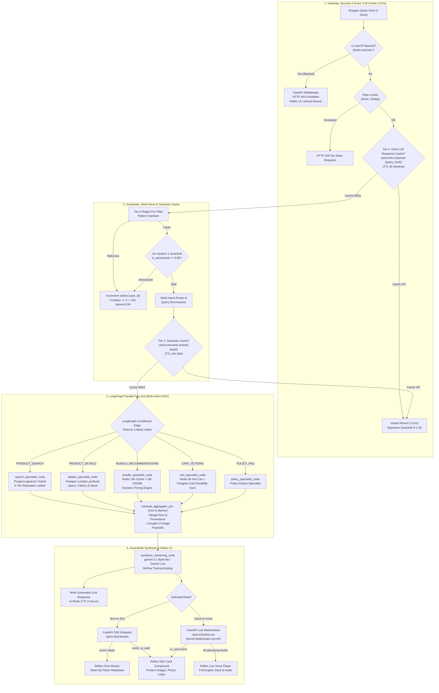

Phase 4 Production Implementation Plan: Full-Stack Integration, Multi-Intent DAG, Caching & Hardening

**Project**: Black Friday Conversational AI Assistant
**Document**: Phase 4 Production Architectural Specification & Implementation Roadmap
**Status**: Ready for Implementation
**Companion Artifact**: [`Phase4_Implementation_Plan.xlsx`](<file:///c:/Users/MSI/OneDrive/Desktop/work/prtofolio/Black%20Friday/Phase4_Implementation_Plan.xlsx>)

---

## 1. Executive Summary & Strategic Objectives

Phase 4 transitions the Black Friday Conversational AI platform from a verified multi-specialist graph (Phase 3) into an enterprise-grade, high-throughput, real-time production system.

Building upon the zero-backward-compatibility refactor completed across the AI layer, Phase 4 incorporates:

1. **6-Hour Hard LLM Response Message Cache & Two-Tier Caching**:
   - **Tier 0 (Hard LLM Response Cache)**: Key `cache:llm:response:{sha256(raw_query)}` with TTL 6 hours (21,600s). Directly returns the cached LLM response message and UI cards if an identical query was asked within the 6-hour window, bypassing guardrails, routing, and model calls in <1ms.
   - **Tier 1 (Semantic Intent Cache)**: Key `cache:semantic:{intent}:{hash(normalized_constraints)}` with TTL 24h to 30 days. Intercepts canonical policy, FAQ, and frequent product inquiries post-classification in <3ms.
2. **LangGraph Multi-Intent Parallel Fan-Out Execution**:
   - The classifier returns `target_intents: List[IntentType]` and decomposed entity scopes.
   - LangGraph conditional edge returns `List[str]` of specialist node names (e.g., `["details_agent_node", "search_agent_node"]`).
   - LangGraph executes these specialist nodes concurrently in parallel.
   - All specialists converge at `retrieval_aggregator_join` (fan-in barrier), merging context before synthesis.
3. **MLflow GenAI Tracing & Observability**:
   - Native integration with MLflow 3.16.1 via `mlflow.langchain.autolog()` for automatic LangGraph span capture.
   - Custom `@mlflow.trace` spans tracking exact cache lookups, Tier-0 regex sanitizer, search relaxation ladder, and bundle pricing.
4. **Dual-Mode Multimodal Interaction (Real-Time Live Voice WebSockets & Text SSE)**:
   - Interactive UI mode toggle in Reflex: `[ 📝 Text Mode ]` vs `[ 🎙️ Voice Mode ]`.
   - **Voice-to-Voice Mode**: Full-duplex continuous live voice conversation stream over WebSockets (`/api/v1/bot/live-ws`) powered by the **Gemini Multimodal Live API**, featuring sub-500ms voice latency, real-time interruption handling, and synchronized UI product card pushes.
   - **Text-to-Text Mode**: Token streaming over Server-Sent Events (`/api/v1/bot/stream`) with concurrent UI card emission.
5. **Progressive Search Relaxation Ladder**:
   - Eliminates zero-data dropouts via an intelligent 4-tier PostgreSQL ladder (`Strict -> Relax Size -> Relax Budget -> Zero-Data Deals`).
6. **Live Database & Redis Bundle Engine**:
   - Direct PostgreSQL JSONB queries (`apriori_bundles`, `item2vec_similars`) backed by 24h Redis caching and dynamic live pricing.
7. **Cold-Tier Cart Durability & Stock Validation**:
   - Redis 6-hour sliding session cart paired with persistent PostgreSQL `user_carts` cold storage and real-time inventory validation.
8. **Automated Adversarial Strike Tracker & Gateway Defense**:
   - Strike accumulator in Redis (`strikes:{user_id}`, TTL 1h), 3-strike 24h ban (`banned:{user_id}`), sub-1ms FastAPI gateway rejection (HTTP 403), and Reflex UI lockout banner.

---

## 2. End-to-End User & System Architecture Flow

The end-to-end lifecycle combines sub-millisecond gateway filtering, exact LLM response caching, multi-intent graph orchestration, parallel retrieval specialists, fan-in aggregation, and dual-mode live voice/text streaming.



---

## 3. Core Architectural Subsystems

### Subsystem A: Two-Tier Caching Architecture (Exact 6h LLM Response + Semantic)

```
[ Incoming Query ]
       │
       ▼
┌─────────────────────────────────────────────────────────────┐
│ 1. Tier 0: Hard LLM Response Message Cache                  │
│    - Key: cache:llm:response:{sha256(raw_query.lower())}   │
│    - Storage: Redis 7 In-Memory                             │
│    - TTL: 6 Hours (21,600s sliding/fixed window)            │
│    - Speed: < 1ms                                           │
└──────────────────────────────┬──────────────────────────────┘
                               │
            ┌──────────────────┴──────────────────┐
            │ Cache HIT (Within 6h)               │ Cache MISS
            ▼                                     ▼
┌───────────────────────┐             ┌────────────────────────┐
│ Return Stored LLM     │             │ Run Tier-0 Regex       │
│ Response Message & UI │             │ & Jev System-1 Safety  │
│ (Zero LLM/DB Cost)    │             └───────────┬────────────┘
└───────────────────────┘                         │
                                                  ▼
                                      ┌────────────────────────┐
                                      │ Multi-Intent & Entity  │
                                      │ Classifier / Extractor │
                                      └───────────┬────────────┘
                                                  │
                                                  ▼
┌─────────────────────────────────────────────────────────────┐
│ 2. Tier 1: Semantic Intent Cache                            │
│    - Key: cache:semantic:{intent}:{hash(constraints)}       │
│    - Storage: Redis 7 In-Memory                             │
│    - TTL: 24 Hours to 30 Days (Policies)                   │
│    - Speed: < 3ms                                           │
└──────────────────────────────┬──────────────────────────────┘
                               │
            ┌──────────────────┴──────────────────┐
            │ Cache HIT                           │ Cache MISS
            ▼                                     ▼
┌───────────────────────┐             ┌────────────────────────┐
│ Return Verified Pre-  │             │ Execute LangGraph      │
│ Grounded Answer & UI  │             │ Multi-Intent Parallel  │
│ (Bypasses LLM Call)   │             │ Specialist Fan-Out     │
└───────────────────────┘             └───────────┬────────────┘
                                                  │
                                                  ▼
                                      ┌────────────────────────┐
                                      │ LLM Synthesis & Write  │
                                      │ to 6h Hard Cache       │
                                      └────────────────────────┘
```

---

### Subsystem B: Multi-Intent LangGraph Parallel Fan-Out

#### How LangGraph Executes Multi-Intent in Parallel:

In LangGraph, conditional routing functions can return either a single node name (`str`) or **a list of node names (`List[str]`)**. When a conditional edge returns a list of node names, LangGraph triggers a concurrent **fan-out** dispatch, running all specified specialist nodes simultaneously.

#### 1. Router & Classifier Output Contract:

```python
class MultiIntentRoutingDecision(BaseModel):
    is_safe: bool = True
    target_intents: List[IntentType] = Field(..., description="List of 1 to N detected intents")
    decomposed_entities: Dict[IntentType, ExtractedEntities] = Field(
        default_factory=dict, 
        description="Partitioned entity constraints mapped per intent"
    )
    confidence_scores: Dict[IntentType, float] = Field(default_factory=dict)
```

#### 2. LangGraph Conditional Edge Fan-Out:

```python
def route_multi_specialists(state: AgentState) -> List[str]:
    """Conditional edge returning multiple specialist nodes for concurrent execution."""
    intents = state.get("target_intents", [])
    if not intents:
        return ["search_agent_node"]
  
    node_map = {
        IntentType.PRODUCT_SEARCH: "search_agent_node",
        IntentType.PRODUCT_DETAILS: "details_agent_node",
        IntentType.DEALS_PROMOTIONS: "deals_agent_node",
        IntentType.BUNDLE_RECOMMENDATIONS: "bundle_agent_node",
        IntentType.CART_ACTIONS: "cart_agent_node",
        IntentType.ORDER_SUPPORT: "support_agent_node",
    }
  
    target_nodes = []
    for intent in intents:
        node_name = node_map.get(intent)
        if node_name and node_name not in target_nodes:
            target_nodes.append(node_name)
          
    return target_nodes or ["search_agent_node"]
```

#### 3. Fan-In Barrier (`retrieval_aggregator_join`):

Every specialist node transitions to `retrieval_aggregator_join`. LangGraph waits for all parallel branches to complete before executing the join node:

- Merges partitioned documents into a unified, deduplicated prompt context.
- Compiles distinct product cards with valid `image_url` paths.
- Forwards consolidated state to `synthesis_streaming_node`.

---

### Subsystem C: MLflow GenAI Tracing Architecture

MLflow 3.16.1 provides native GenAI tracing. Tracing is enabled globally:

```python
import mlflow

# Enable automatic tracing for LangChain / LangGraph
mlflow.set_tracking_uri(settings.MLFLOW_TRACKING_URI)
mlflow.set_experiment("black-friday-ai-assistant")
mlflow.langchain.autolog()
```

#### Custom Spans for Micro-Services:

```python
from mlflow.entities import SpanType

@mlflow.trace(span_type=SpanType.TOOL, name="ExactLLMResponseCacheCheck")
def check_exact_llm_response_cache(raw_query: str) -> Optional[dict]:
    query_hash = hashlib.sha256(raw_query.strip().lower().encode()).hexdigest()
    return redis_client.get(f"cache:llm:response:{query_hash}")

@mlflow.trace(span_type=SpanType.RETRIEVER, name="ProgressiveSearchRelaxation")
def execute_progressive_search(query_vec, filters, ladder_tier: int):
    # Traces each tier of the relaxation ladder in MLflow
    ...
```

* **Logged Telemetry**: Time to First Token (TTFT), total latency per node, prompt inputs/outputs, model parameters (`gemini-3.1-flash-lite`), token counts, and user session IDs.

---

### Subsystem D: Real-Time Gemini Multimodal Live WebSockets & Dual-Mode UI

Shoppers can interact interchangeably in **Text-to-Text** or **Voice-to-Voice** mode via an interactive UI toggle button.

#### 1. Reflex UI Mode Selector:

- `[ 📝 Text Mode ]`: Keyboard input -> SSE token streaming (`/api/v1/bot/stream`) -> Interactive chat markdown + rich cards.
- `[ 🎙️ Voice Mode ]`: Web Audio WebSocket (`/api/v1/bot/live-ws`) -> Real-time bidirectional streaming with Gemini Multimodal Live API.

#### 2. Real-Time Gemini Multimodal Live WebSockets Architecture:

- **Full-Duplex Stream**: Bi-directional PCM audio frames streamed over WebSockets.
- **Sub-500ms Latency**: Native speech-to-speech comprehension and generation without cascading STT -> LLM -> TTS pipelines.
- **Natural Interruption Handling**: The shopper can interrupt the assistant naturally mid-speech.
- **Synchronous UI Cards**: Product cards with real images (`/products/P00025442.jpg`) are pushed as JSON event frames over the same WebSocket, appearing instantly in the Reflex UI while the assistant speaks.

---

### Subsystem E: 4-Tier Progressive Search Relaxation Ladder

```
[ Tier 1: Strict Hybrid ]
  ├── Hard SQL Filter: WHERE category = :cat AND price <= :max_p AND sizes @> :sz AND brand = :b
  └── Hybrid RRF Fusion with pgvector (768-dim) and tsvector GIN
       │
       ├── Matches found (count > 0) ──> Return Results (relaxation_level = "STRICT")
       └── Zero matches (count == 0)
            │
            ▼
[ Tier 2: Size Relaxation ]
  ├── Drop size constraint: WHERE category = :cat AND price <= :max_p AND brand = :b
  └── Re-query PostgreSQL Hybrid
       │
       ├── Matches found (count > 0) ──> Return Results + Advisory: "Product in stock in S, M, XL"
       └── Zero matches (count == 0)
            │
            ▼
[ Tier 3: Budget & Brand Leeway ]
  ├── Expand price ceiling by +20%: WHERE category = :cat AND price <= :max_p * 1.20
  └── Broaden brand filter to same category
       │
       ├── Matches found (count > 0) ──> Return Results + Price Advisory: "Showing options within +20% budget"
       └── Zero matches (count == 0)
            │
            ▼
[ Tier 4: Zero-Data Curated Fallback ]
  ├── Query top Black Friday bestsellers:
  │   SELECT * FROM curated_products ORDER BY pagerank_score DESC LIMIT 4;
  └── Return Curated Trending Deals + Conversational Transparency Message:
      "We couldn't find exact matches for your filters, but here are our top trending Black Friday deals."
```

---

## 4. Phase 4 Sequential Milestones & Deliverables

| Task ID         | Seq | Module / Area              | Task Title                                    | Key Deliverable & Scope                                                                                                                                         | Target Files                                                                                                                                                                                                                                                                                                                                                                                                                                                                                             | SLA / Criteria                                                                        |
| :-------------- | :-: | :------------------------- | :-------------------------------------------- | :-------------------------------------------------------------------------------------------------------------------------------------------------------------- | :------------------------------------------------------------------------------------------------------------------------------------------------------------------------------------------------------------------------------------------------------------------------------------------------------------------------------------------------------------------------------------------------------------------------------------------------------------------------------------------------------- | :------------------------------------------------------------------------------------ |
| **P4-01** |  1  | Multi-Intent Orchestration | Multi-Intent Router & Parallel Fan-Out        | Update Router and Classifier to return`List[IntentType]`; LangGraph conditional edge returns `List[str]`; add `retrieval_aggregator_join`.                | [`ai/router/router.py`](<file:///c:/Users/MSI/OneDrive/Desktop/work/prtofolio/Black%20Friday/ai/router/router.py>)[`ai/classifier/classifier.py`](<file:///c:/Users/MSI/OneDrive/Desktop/work/prtofolio/Black%20Friday/ai/classifier/classifier.py>)[`ai/agent/state.py`](<file:///c:/Users/MSI/OneDrive/Desktop/work/prtofolio/Black%20Friday/ai/agent/state.py>)[`ai/nodes/aggregator_node.py`](<file:///c:/Users/MSI/OneDrive/Desktop/work/prtofolio/Black%20Friday/ai/nodes/aggregator_node.py>) | Latency < 10ms; parallel execution of 1 to N specialists without constraint bleed.    |
| **P4-02** |  2  | Two-Tier Caching           | LLM Response Hard Cache (6h) & Semantic Cache | Redis exact query cache (`cache:llm:response:{hash}`, TTL 6h) before routing (<1ms); Semantic cache (`cache:semantic:{intent}:{hash}`) post-routing (<3ms). | [`ai/services/cache_service.py`](<file:///c:/Users/MSI/OneDrive/Desktop/work/prtofolio/Black%20Friday/ai/services/cache_service.py>)[`core/db/redis_cache.py`](<file:///c:/Users/MSI/OneDrive/Desktop/work/prtofolio/Black%20Friday/core/db/redis_cache.py>)[`apps/api/routers/bot_stream.py`](<file:///c:/Users/MSI/OneDrive/Desktop/work/prtofolio/Black%20Friday/apps/api/routers/bot_stream.py>)                                                                                                  | Exact hit < 1ms; Semantic hit < 3ms; 100% token/DB savings on repeat questions.       |
| **P4-03** |  3  | Observability              | MLflow GenAI Tracing & Telemetry              | Instrument`mlflow.langchain.autolog()` for LangGraph; custom `@mlflow.trace` spans for caches, guardrails, and search relaxation ladder.                    | [`ai/agent/tracing.py`](<file:///c:/Users/MSI/OneDrive/Desktop/work/prtofolio/Black%20Friday/ai/agent/tracing.py>)[`ai/nodes/router_node.py`](<file:///c:/Users/MSI/OneDrive/Desktop/work/prtofolio/Black%20Friday/ai/nodes/router_node.py>)[`core/config.py`](<file:///c:/Users/MSI/OneDrive/Desktop/work/prtofolio/Black%20Friday/core/config.py>)                                                                                                                                                  | Overhead < 2ms; full trace capture with tokens and node spans in MLflow UI.           |
| **P4-04** |  4  | Search & Retrieval         | Progressive Search Relaxation Ladder          | Build 4-tier relaxation ladder (Strict -> Relax Size -> Relax Budget -> Zero Data Fallback) in PostgreSQL hybrid search.                                        | [`core/db/repository.py`](<file:///c:/Users/MSI/OneDrive/Desktop/work/prtofolio/Black%20Friday/core/db/repository.py>)[`ai/nodes/search_node.py`](<file:///c:/Users/MSI/OneDrive/Desktop/work/prtofolio/Black%20Friday/ai/nodes/search_node.py>)[`ai/tools/search_tools.py`](<file:///c:/Users/MSI/OneDrive/Desktop/work/prtofolio/Black%20Friday/ai/tools/search_tools.py>)                                                                                                                          | Ladder traversal < 45ms; zero silent empty drops.                                     |
| **P4-05** |  5  | Bundle & Pricing           | Live Database & Redis Bundle Subsystem        | Ground bundle recommendations in`curated_products` JSONB; cache in Redis (24h); dynamic combo pricing.                                                        | [`ai/tools/bundle_tools.py`](<file:///c:/Users/MSI/OneDrive/Desktop/work/prtofolio/Black%20Friday/ai/tools/bundle_tools.py>)[`ai/nodes/bundle_node.py`](<file:///c:/Users/MSI/OneDrive/Desktop/work/prtofolio/Black%20Friday/ai/nodes/bundle_node.py>)[`core/db/redis_cache.py`](<file:///c:/Users/MSI/OneDrive/Desktop/work/prtofolio/Black%20Friday/core/db/redis_cache.py>)                                                                                                                        | Cache hit < 2ms; accurate live pricing reflection.                                    |
| **P4-06** |  6  | Cart Engine                | Cold-Tier Cart Durability & Validation        | Two-tier cart persistence: Redis 6h sliding session + PostgreSQL`user_carts` cold storage + stock check.                                                      | [`core/db/cart_durability.py`](<file:///c:/Users/MSI/OneDrive/Desktop/work/prtofolio/Black%20Friday/core/db/cart_durability.py>)[`ai/tools/cart_tools.py`](<file:///c:/Users/MSI/OneDrive/Desktop/work/prtofolio/Black%20Friday/ai/tools/cart_tools.py>)[`core/db/models.py`](<file:///c:/Users/MSI/OneDrive/Desktop/work/prtofolio/Black%20Friday/core/db/models.py>)                                                                                                                                | Redis mutation < 5ms; zero cart data loss on session reset.                           |
| **P4-07** |  7  | Gateway Defense            | Adversarial Strike Tracker & Ban Gateway      | Redis strike counter (`strikes:{id}`); 3-strike 24h ban; FastAPI middleware 403; Reflex lockout banner.                                                       | [`ai/guardrails/safety_engine.py`](<file:///c:/Users/MSI/OneDrive/Desktop/work/prtofolio/Black%20Friday/ai/guardrails/safety_engine.py>)[`apps/api/middleware/security_ban_middleware.py`](<file:///c:/Users/MSI/OneDrive/Desktop/work/prtofolio/Black%20Friday/apps/api/middleware/security_ban_middleware.py>)                                                                                                                                                                                       | Ban check < 1ms; 100% gateway isolation of banned actors.                             |
| **P4-08** |  8  | Real-Time Voice WebSockets | Real-Time Gemini Multimodal Live WebSockets   | Full-duplex continuous live voice conversation stream over WebSockets (`/api/v1/bot/live-ws`); Reflex UI dual-mode selector.                                  | [`apps/api/routers/bot_live_ws.py`](<file:///c:/Users/MSI/OneDrive/Desktop/work/prtofolio/Black%20Friday/apps/api/routers/bot_live_ws.py>)[`ai/services/multimodal_live_service.py`](<file:///c:/Users/MSI/OneDrive/Desktop/work/prtofolio/Black%20Friday/ai/services/multimodal_live_service.py>)[`apps/reflex_ui/components/bot_drawer.py`](<file:///c:/Users/MSI/OneDrive/Desktop/work/prtofolio/Black%20Friday/apps/reflex_ui/components/bot_drawer.py>)                                          | Voice latency < 450ms; real-time interruption handling; synchronous rich card pushes. |
| **P4-09** |  9  | Real-Time Streaming        | FastAPI SSE & Synchronous Reflex UI Cards     | SSE endpoint`/api/v1/bot/stream` for Text Mode; token streaming; synchronous UI card events with real image paths.                                            | [`apps/api/routers/bot_stream.py`](<file:///c:/Users/MSI/OneDrive/Desktop/work/prtofolio/Black%20Friday/apps/api/routers/bot_stream.py>)[`apps/reflex_ui/components/bot_drawer.py`](<file:///c:/Users/MSI/OneDrive/Desktop/work/prtofolio/Black%20Friday/apps/reflex_ui/components/bot_drawer.py>)                                                                                                                                                                                                     | TTFT < 350ms; >40 tokens/sec; synchronous image rendering.                            |
| **P4-10** | 10 | Verification & Scale       | Production Load Testing & CI/CD Pipeline      | Locust 50 RPS load test suite; end-to-end golden benchmark evaluation suite; GitHub Actions CI/CD.                                                              | [`tests/locustfile.py`](<file:///c:/Users/MSI/OneDrive/Desktop/work/prtofolio/Black%20Friday/tests/locustfile.py>)[`tests/test_phase4_e2e_production.py`](<file:///c:/Users/MSI/OneDrive/Desktop/work/prtofolio/Black%20Friday/tests/test_phase4_e2e_production.py>)                                                                                                                                                                                                                                   | P95 latency < 1.5s at 50 RPS; 100% golden benchmark pass rate.                        |

---

## 5. Verification Matrix & Quality Gates

1. **Unit & Graph Regression Tests**:
   - `pytest tests/test_phase1_infra_frontend.py tests/test_phase2_jev_router.py tests/test_phase3_langgraph_agent.py -v` (100% green pass rate maintained).
2. **Phase 4 End-to-End Suite**:
   - `pytest tests/test_phase4_e2e_production.py -v` validating exact LLM response cache hits, semantic cache hits, multi-intent parallel dispatch, relaxation ladder traversal, bundle live pricing, live WebSocket voice streaming, and ban middleware.
3. **MLflow Tracing Validation**:
   - Verify traces and spans recorded in MLflow UI via `mlflow.search_traces()`.
4. **Locust 50 RPS Load Verification**:
   - `locust -f tests/locustfile.py --headless -u 50 -r 10 -t 60s --host http://localhost:8000`.
